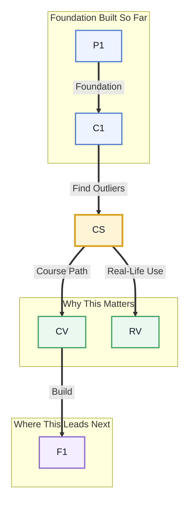

# Pre-read: Anomaly Detection

## Context of This Session in the Course

Imagine you are monitoring a data pipeline that processes millions of credit card transactions every hour. Most transactions follow ordinary patterns — purchases at grocery stores, subscription renewals, recurring bills. But every so often, a transaction stands out: an unusually large purchase from a rarely visited country at 3 AM. Your job is to spot that needle in the haystack before the fraud escalates.

The challenge is that you rarely have a labelled dataset of "fraud" and "not fraud" to train a classifier upfront. Fraudsters change tactics constantly, so yesterday's fraud pattern may not match today's. Traditional supervised learning approaches break down here — you need methods that can detect the unexpected without being told what to look for in advance.

That is where **Anomaly Detection** becomes essential.

What if you could build a system that automatically flags suspicious network traffic, defective products on a factory line, or unusual vital signs in a hospital ICU — all without needing a pre-labelled dataset? You would need to distinguish normal variation from genuine outliers, understand different types of anomalies, and evaluate your detections when ground truth is scarce. This session gives you the exact toolkit to do that.

**Anomaly detection** is the task of identifying data points, events, or observations that deviate significantly from the majority of data. These deviations can take three forms: **point anomalies** (a single data point that is far from the rest), **contextual anomalies** (a value that is unusual in a specific context, like a 30°C reading in December), and **collective anomalies** (a sequence of points that is anomalous as a group, even if individual points seem normal). Think of it like a quality control inspector on a production line — most items pass through without issue, but the inspector's trained eye catches the one defective unit. The methods you will explore fall into two broad camps. **Isolation Forest** works by randomly partitioning the data; anomalies are isolated with fewer splits because they are few and different, making them easy to separate. **One-Class SVM** learns a boundary around the "normal" data and flags anything outside it as a novelty. Complementing these, you will revisit **Z-score** and **IQR** — statistical heuristics you may have encountered in EDA — now deployed as principled anomaly detectors that work well on univariate data.

In the **previous session**, you explored dimensionality reduction with PCA and t-SNE, learning how to compress high-dimensional data into a lower-dimensional space while preserving its essential structure. That ability to model what is "normal" in your data — the dominant patterns and correlations — is the perfect foundation for anomaly detection. Where PCA identifies the signal, anomaly detection hunts for what does not fit the signal. The scatter plots and explained-variance ratios you worked with now become tools for spotting outliers that break the pattern.

In this pre-read, you will discover:

- How to **recognise** the three types of anomalies — point, contextual, and collective — with real-world examples.
- How to **apply** Isolation Forest and One-Class SVM to detect outliers without labelled training data.
- How to **interpret** Z-score and IQR thresholds for flagging simple anomalies in numeric data.
- How to **evaluate** anomaly detection performance using precision-recall curves when clean labels are unavailable.

---

## Why Not All Anomalies Look the Same

A temperature sensor in a data centre reads 85°C — that is a point anomaly, a single value far outside the normal range. But what if the reading is 35°C in July but 35°C in January? That is a contextual anomaly: the same value is normal in one context and suspicious in another. Now imagine a server's CPU usage slowly climbing from 30% to 95% over three minutes — each individual reading might be within normal bounds, but the entire sequence signals a problem. That is a collective anomaly. Understanding which type you are dealing with determines which detection method to use. Statistical thresholds like Z-score work well for point anomalies, but contextual and collective anomalies demand models that account for time, sequence, or location — precisely where Isolation Forest and One-Class SVM prove their value.

## How Isolation Forest Turns Randomness Into Detection

Most anomaly detectors build a profile of "normal" data and flag deviations. The Isolation Forest turns this logic on its head — it directly isolates anomalies. The algorithm randomly selects a feature and a split value, then partitions the data. Anomalies, being few and different, get isolated (separated into their own branch) after just a few random cuts. Normal points, which cluster together, require many more cuts to separate. This gives every data point an **anomaly score** based on how quickly it becomes isolated. The beauty of this approach is its efficiency: it scales to high-dimensional data, works without any labelled examples, and naturally handles mixed-type anomalies. In scikit-learn, you can call `IsolationForest().fit_predict(X)` and immediately get a flag for each point — no labels required.

## Where Anomaly Detection Appears in Real Life

In banking and finance, anomaly detection is the first line of defence against credit card fraud. Every transaction is scored in real time — an unusually large purchase from a foreign country is flagged as a point anomaly, while a sudden burst of small transactions might signal a collective pattern of fraud testing. Cybersecurity teams use the same ideas to detect network intrusions: a server that starts sending data to an unknown IP address at 2 AM is a contextual anomaly that demands investigation. In manufacturing, sensors on an assembly line feed continuous readings into anomaly detection models that catch defective units before they reach customers — a vibration spike or temperature drift triggers an alert instantly. Healthcare applies anomaly detection to patient monitoring: an unusual heart-rate pattern in an ICU can be detected as a collective anomaly long before a critical event occurs. Even cloud infrastructure relies on these methods to detect service degradation — a gradual increase in API latency signals an impending outage, allowing engineers to intervene before users are affected.

## What's Next

After this session, you will be able to:

- Distinguish between point, contextual, and collective anomalies in any given dataset.
- Apply Isolation Forest using scikit-learn to detect outliers in unlabelled data.
- Configure a One-Class SVM to identify novel observations outside the training distribution.
- Compute Z-scores and IQR boundaries to flag simple univariate anomalies.
- Tune detection thresholds and evaluate performance using precision-recall curves.

You do not need to memorise every parameter or formula right now. The goal is to see anomaly detection not as a niche technique but as a fundamental lens for finding what does not fit — and that skill will serve you across every data science domain.

## Interesting Questions for the Live Session

- If an Isolation Forest isolates anomalies quickly by random partitioning, what happens when anomalies are so rare that the random splits rarely hit them?
- One-Class SVM draws a boundary around normal data — but how do you decide what "normal" means when your training set itself might contain undetected outliers?
- Z-score and IQR thresholds are simple and interpretable — so why would you ever choose a complex model like Isolation Forest over them?
- When evaluating anomaly detection without clean labels, any threshold choice is arbitrary. How would you justify a specific threshold to a business stakeholder?

By the end of this session, anomaly detection should feel less like a set of clever algorithms and more like a practical mindset for guarding against the unexpected: **always look for what does not fit.**
