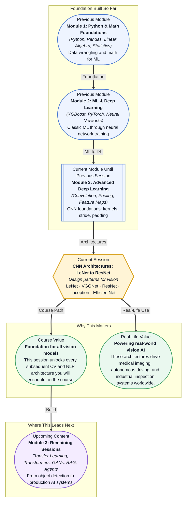

# Pre-read: CNN Architectures: LeNet to ResNet

## Context of This Session in the Course

You are tasked with building a system that can distinguish between handwritten digits — 0 through 9 — from nothing more than pixel intensities. Your training data is clean, your labels are accurate, and yet the first model you throw at it barely beats random guessing. You add more layers, the model grows deeper, and suddenly training stalls — accuracy flatlines, gradients vanish into noise, and adding more capacity makes things worse. The problem is not your data, and not your determination. The problem is that you are trying to build a high-rise with a blueprint designed for a single-storey shed.

The intuitive approach to building a vision model — stack more layers, increase parameters, let the network figure it out — runs into a hard wall. Deep networks become harder to train, not more accurate, as they grow. Vanishing gradients ensure that early layers learn nothing, and the sheer number of parameters invites overfitting without delivering proportional gains. What the field needed was not just more compute, but smarter blueprints: architectural innovations that let depth work *for* the network rather than against it. That is where **CNN architectures — from LeNet to EfficientNet** — become essential.

These architectures are not arbitrary tweaks. Each one represents a breakthrough in thinking about how to organise computation, how to propagate signal through depth, and how to balance accuracy with efficiency. They are the reason modern systems can detect tumours in CT scans, segment road scenes in real time, and describe images in natural language.

What if you were asked to design a vision system for a self-driving car that must recognise pedestrians, traffic signs, lane markings, and cyclists simultaneously — all within milliseconds, on limited onboard hardware? You cannot afford to stack layers blindly. You need to know when to go deeper, when to go wider, when to introduce parallel branches, and how to scale your model without blowing past your memory budget. The architectures you will study in this session — LeNet-5, VGGNet, ResNet, Inception, and EfficientNet — are precisely the tools that make that kind of engineering decision possible. Each one teaches you a different lesson about trading off depth, width, resolution, and computational cost.

A **CNN architecture** is the overall blueprint that organises convolutional layers, pooling layers, and fully connected layers into a complete vision system. Think of it like a building floor plan: the same basic materials (concrete, steel, glass) can produce very different structures depending on how you arrange them. **LeNet-5** was the first successful blueprint — a modest seven-layer network that could recognise handwritten digits. **VGGNet** showed that stacking many small **3×3 kernels** in sequence could simulate larger receptive fields while using fewer parameters per layer — a principle of depth over individual layer size. **ResNet** introduced **residual connections**, shortcut paths that let gradients flow directly through dozens or even hundreds of layers, solving the vanishing gradient problem that had made deep networks impractical. **Inception** (GoogLeNet) took a different approach, running multiple kernel sizes in parallel within the same layer so the network could learn features at multiple scales simultaneously. **EfficientNet** asked whether you could systematically scale *all* dimensions — depth, width, and input resolution — together using a compound coefficient, achieving state-of-the-art accuracy with far fewer parameters. You will explore all five, understanding not just what each one does but what problem each one was designed to solve.

In the **previous session**, you covered the fundamental operations of convolutional neural networks — how a kernel slides across an input to produce a feature map, how padding and stride control the spatial dimensions of those maps, and how pooling layers reduce resolution while preserving the most salient activations. You learned the basic building blocks of CNNs: convolution, activation, pooling, flatten, and fully connected layers. That knowledge gave you the vocabulary; this session gives you the grammar. Where you previously learned how a single convolutional layer works, you will now learn how to compose dozens or even hundreds of such layers into architectures that have proven themselves in practice. The convolution operation itself does not change — but the way you arrange it, the connections you add, and the scaling strategy you adopt make the difference between a demo and a production-grade system.

In this pre-read, you will discover:

- How to **understand** the architectural evolution from LeNet-5 through VGGNet to ResNet — and why each step mattered.
- How to **explain** how residual connections in ResNet solve the vanishing gradient problem that limited earlier networks.
- How to **compare** the design philosophies of VGGNet, Inception, and EfficientNet.
- How to **connect** these architectural patterns to real-world constraints like accuracy, speed, and model size.

---

## Why Deeper Networks Were So Hard to Train

In theory, a deeper network should be more expressive. Each additional layer can learn a more abstract representation, building on the features detected by the layer before. In practice, for years, deeper networks performed *worse* than shallower ones — not because of capacity, but because of optimisation. When you stack more than a handful of layers, the gradients that flow backward during training get multiplied by the weights of each layer through the chain rule. If those weights are small (as they often are after initialisation), the gradient shrinks exponentially as it travels backward, and early layers receive a training signal so weak they never learn anything useful. This is the **vanishing gradient problem**, and it was the single largest obstacle to building deep networks.

ResNet solved this with a remarkably simple idea: add a shortcut connection that skips one or more layers. Instead of forcing a layer to learn a complete mapping H(x), the layer only needs to learn the *residual* F(x) = H(x) − x. The shortcut connection adds x directly to the output, so the effective mapping becomes H(x) = F(x) + x. Backpropagation now has a direct highway — the gradient can flow through the shortcut connection unimpeded, even if the intermediate layers have very small weights. This single innovation made it possible to train networks with 50, 101, or even 152 layers reliably. The insight is profound: sometimes the most important connection in a neural network is the one that *bypasses* computation entirely.

## The Design Philosophy of Modern CNN Families

VGGNet, Inception, and EfficientNet each represent a different answer to the same question: given a fixed computational budget, how should you allocate your parameters? VGGNet's answer was uniformity — use only 3×3 kernels, stack them deep, and keep the architecture clean and predictable. The insight was that two consecutive 3×3 convolutions have the same effective receptive field as a single 5×5 convolution but with fewer parameters, and three 3×3 convolutions match a 7×7 convolution. By using only one kernel size, VGGNet simplified the design space and showed that depth alone — when made trainable — delivers substantial gains.

Inception took the opposite approach: instead of committing to one kernel size, run several in parallel on the same input and let the network learn which scale matters. An Inception module applies 1×1, 3×3, and 5×5 convolutions side by side, along with a pooling operation, and concatenates all outputs. This multi-branch design lets the layer capture both fine-grained and coarse patterns simultaneously. The 1×1 convolutions also serve a second purpose — dimensionality reduction — by projecting the input into a lower-channel space before the more expensive 3×3 and 5×5 branches, keeping total computation manageable.

EfficientNet asked a more systematic question: if you increase a network's depth *and* width *and* input resolution independently, is there an optimal relationship between them? Traditional scaling picked one dimension and scaled it arbitrarily. EfficientNet discovered through neural architecture search that scaling all three dimensions together by a fixed ratio — compound scaling — produced networks that were both more accurate and more efficient. A wider network can capture more fine-grained features, a deeper network can learn more abstract ones, and a higher resolution input preserves spatial detail. The compound coefficient specifies how much to scale each, and the result was a family of models that outperformed previous architectures at every size, from mobile-friendly EfficientNet-B0 to high-accuracy B7.

## Where CNN Architectures Appear in Real Life

The architectures you are studying are not museum pieces — they are deployed in production systems across dozens of industries. In **healthcare**, variations of ResNet and Inception power systems that detect diabetic retinopathy from retinal scans, classify lung nodules in CT imagery, and segment tumours in MRI volumes. The residual connections that make ResNet trainable also make it reliable enough for clinical decision support. In **autonomous vehicles**, VGGNet-derived backbones were the foundation of early perception stacks for lane detection and traffic sign recognition, while EfficientNet's compound scaling has been adopted in embedded systems where a few milliseconds of latency or a few megabytes of memory can determine whether a deployment is viable. In **manufacturing**, CNNs inspect assembly-line products for defects — a task where leaf species classification networks (trained on architectures like Inception) are repurposed for crack detection on turbine blades or surface defects in circuit boards. In **agriculture**, efficient architectures like EfficientNet run on drones to classify crop health from aerial imagery, processing thousands of hectares per flight with limited onboard compute. In **retail and e-commerce**, CNN backbones power visual search — you upload a photo of a handbag and the system retrieves visually similar products from a catalogue of millions. Every one of these systems depends on the architectural decisions you are about to study: how deep to go, how wide to branch, and how to scale without breaking the bank on compute.

## What's Next

After this session, you will be able to:

- Describe the architecture of LeNet-5 and explain how it established the conv-pool-fc pattern used in nearly all subsequent CNN designs.
- Explain how VGGNet's use of stacked 3×3 kernels achieves the same receptive field as larger kernels with fewer parameters.
- Trace the forward and backward pass through a ResNet block and articulate why the skip connection prevents gradients from vanishing.
- Compare the design rationale behind Inception modules versus EfficientNet's compound scaling coefficient.
- Choose an appropriate architecture family for a given deployment constraint — accuracy target, latency budget, or model size limit.

You do not need to memorise every layer count or parameter table right now. The goal is to see each architecture as a thoughtful answer to a specific problem: **every great architecture is a solution in search of a constraint.**

## Interesting Questions for the Live Session

- If residual connections make deeper networks trainable, why not just keep adding layers indefinitely — what practical constraints eventually stop you?
- Inception modules use parallel convolutions of different kernel sizes; is this always beneficial, or could a single kernel size outperform the multi-branch design for some tasks?
- EfficientNet scales depth, width, and resolution together — but if you had to deploy on a mobile device with severe memory limits, which dimension would you sacrifice first and why?
- VGGNet proved that three stacked 3×3 kernels can replace a single 7×7 kernel — does this idea generalise, or are there patterns a large kernel captures that small stacked kernels miss?

By the end of this session, CNN architectures should feel less like a collection of historical models and more like a design space you can reason about: **each architecture is a deliberate answer to a specific engineering constraint.**
