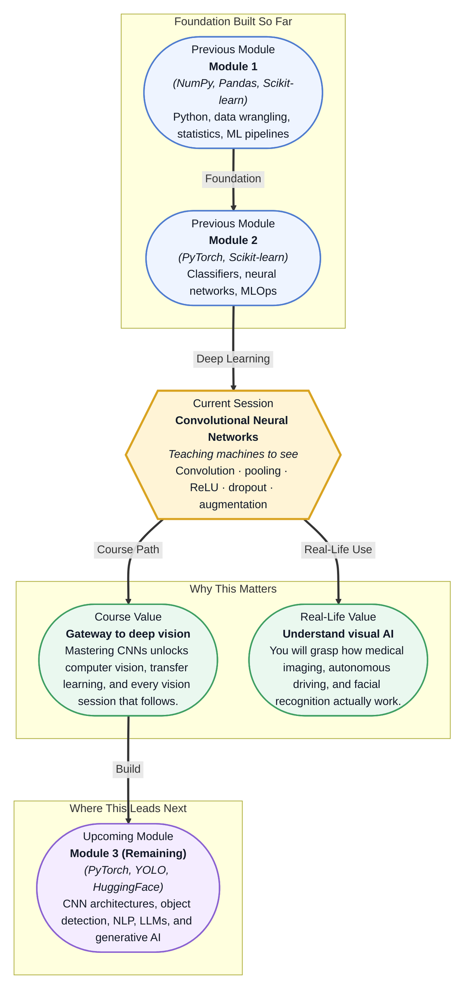

# Pre-read: Convolutional Neural Networks

## Context of This Session in the Course

You upload a photo of your dog to a website, and within seconds it returns the label: "Beagle, 94% confidence." How did a machine — which sees nothing but numbers — recognise a floppy-eared dog from a single image? It is a question that puzzles most people the first time they encounter it. The image is just a grid of pixel values, and yet the machine sees a breed, a pose, even a personality.

If you tried to write explicit rules for this — check for brown spots, check ear shape, check tail length — you would fail. Lighting changes, angles, dog breeds, backgrounds; the variations are infinite. Rule-based vision broke down decades ago, and that is why classical machine learning struggled with raw images. Flattening a 224×224 image into a 150,000-dimensional vector and feeding it into a fully connected network ignores the most important signal: spatial structure.

Instead of hard-coded rules, you need a system that learns its own visual features from data. A system that begins by detecting simple edges and corners, then combines them into shapes, and finally into entire objects. That is where **Convolutional Neural Networks** become essential.

---

What if you could build an application that looks at chest X-rays and flags early signs of pneumonia, or a tool that counts vehicles at an intersection from a traffic camera, or a quality-inspection system that spots microscopic defects on a production line faster than any human? All of these rely on the same building block — the ability to let a machine learn visual features automatically, layer by layer, from raw pixels to high-level concepts. This session gives you the mental model for that ability.

---

At its core, a **convolutional neural network** is a specialised neural network designed to process data with a grid-like structure — most commonly, images. Unlike the fully connected layers you saw in Module 2, which treat every pixel as an independent input, a CNN exploits spatial structure: adjacent pixels matter more than distant ones. The key mechanism is the **convolution operation**, where a small matrix called a **kernel** slides across the image, producing a **feature map** that highlights patterns like edges, textures, or colours.

Think of it like a spotlight with a patterned glass: as you sweep it across a dark room, certain objects glow when the pattern aligns with their shape. The kernel is that patterned glass, and the feature map is the glowing response. By stacking many such kernels, the network learns to recognise increasingly complex patterns — from horizontal edges in early layers to dog faces in deeper ones.

You will explore the full CNN pipeline: convolution → **ReLU** (adding non-linearity) → **pooling** (shrinking the representation) → **flatten** (preparing for classification) → **fully connected layers**. You will also discover how to combat **overfitting** — a constant risk with vision models — using **dropout** and **data augmentation**.

---

In the **previous session**, you explored **Deployment & MLOps Foundations** — structuring ML projects, versioning datasets with DVC, automating tests with GitHub Actions, and staging models through dev, staging, and production. That session gave you the infrastructure to ship models reliably. Now you add the ability to build the models worth shipping — models that see, detect, and classify images. The same pipeline mindset — clean stages, automated verification, reproducible steps — applies directly: a CNN pipeline is itself a sequence of well-defined stages, each with a specific job, from convolution down to classification.

---

In this pre-read, you will discover:

- How to **understand** the convolution operation and its role in extracting visual features from images
- How to **connect** the CNN pipeline — convolution, ReLU, pooling, flatten, fully connected layers — into a coherent architecture
- How to **interpret** feature maps to see what patterns a network actually learns at each layer
- How to **recognise** strategies like dropout and data augmentation that prevent overfitting in vision models

---

## How a Kernel Sees the World

The **convolution operation** is surprisingly simple: take a small matrix — say 3×3 — called a **kernel**, place it over a patch of the input image, multiply corresponding values, sum them, and write the result into a single cell of the **feature map**. Then slide the kernel one **stride** to the right and repeat. This process produces a new image where bright spots indicate where the kernel's pattern appeared in the original.

What makes this powerful is that the kernel's values are **learned** during training, not hand-coded. One kernel might learn to detect vertical edges; another might learn to detect red blobs. Stack dozens or hundreds of kernels in a single **convolutional layer**, and the network extracts a rich set of features simultaneously. Two parameters control the output size: **padding** (adding border pixels to preserve dimensions) and **stride** (how many pixels the kernel jumps between positions). Without padding, feature maps shrink at every layer; with stride greater than one, you downsample aggressively.

The elegance of this design lies in **weight sharing** — the same kernel applies across the entire image. This makes CNNs dramatically more efficient than fully connected networks for image data. A 224×224 RGB image has over 150,000 input values; a fully connected first layer would require billions of parameters, but a convolutional layer with a dozen 3×3 kernels uses only a few hundred. You are not learning a separate weight for every pixel — you are learning a reusable pattern detector.

## Why Pooling Shrinks Without Breaking

After a convolution layer, you typically apply a **pooling layer**. Its job is brutally simple: downsample the feature map while preserving the most important information. **Max pooling** takes a small window — usually 2×2 — and keeps only the maximum value from each window. **Average pooling** keeps the mean instead.

Why remove pixels at all? Three reasons. First, it reduces the number of parameters flowing into the next layer, which speeds up training and reduces overfitting. Second, it provides **translation invariance** — if a cat ear shifts by a pixel or two, the same pooling window still captures it. Third, it forces the network to become more abstract: after pooling, the precise pixel location is forgotten, and only the presence of a feature matters. This abstraction is exactly what makes deeper layers capable of recognising objects rather than just edges.

Pooling also connects naturally to the rest of the CNN pipeline. After several rounds of convolution and pooling, the spatial dimensions are small enough that you can **flatten** the feature maps into a single vector and pass them through standard **fully connected layers** for classification. The convolution and pooling stages learn to extract and compress visual information; the fully connected layers learn to make decisions based on that compressed representation.

## Where CNNs Appear in Real Life

Convolutional neural networks are no longer confined to research papers — they power production systems across industries. In **healthcare**, CNNs analyse mammograms and CT scans to detect tumours earlier than radiologists can, and they classify retinal scans to screen for diabetic retinopathy. In **autonomous vehicles**, a CNN processes camera feeds in real time to identify pedestrians, lane markings, traffic signs, and other vehicles — the perception stack of every self-driving car is built on convolutional layers.

In **retail and e-commerce**, CNNs power visual search — upload a photo of a sofa, and the system finds similar products in inventory. They also automate quality inspection on assembly lines, detecting scratches, dents, or misalignments in manufactured parts. In **agriculture**, drones capture field images, and CNNs identify diseased crops, estimate yield, or map weed density for precision spraying. Even in **social media and security**, CNNs enable face detection for photo tagging and surveillance systems that recognise suspicious behaviour in crowded spaces. Every one of these applications starts with the same operation you will learn in this session: sliding a kernel across an image and building understanding from the patterns that emerge.

---

## What's Next

After this session, you will be able to:

- Explain how a convolutional kernel slides across an image to produce a feature map
- Describe the purpose of padding, stride, max pooling, and average pooling
- Trace the full CNN pipeline: convolution, activation, pooling, flatten, and fully connected layers
- Interpret feature maps from intermediate layers to understand what a network has learned
- Apply dropout and data augmentation strategies to reduce overfitting in vision models

You do not need to implement a CNN from scratch in code right now. The goal is to see images the way a CNN does — as layered patterns, not just pixels.

---

## Interesting Questions for the Live Session

- If you remove all pooling layers from a CNN and only use strided convolutions, does the network still work, and what tradeoffs emerge?
- Dropout randomly zeros neurons during training but is turned off at inference — why would the same technique not work during deployment?
- A feature map from the first convolutional layer looks like edge detectors, while a deeper one responds to faces — where in the network does this transition happen, and what causes it?
- What happens if you train a CNN on a dataset where every image has the object perfectly centred — will it fail on real-world photos where the object is off-centre?

By the end of this session, CNNs should feel less like a black box that processes images and more like a layered pattern matcher you can inspect and trust: **you are not telling the machine what to look for — you are teaching it how to look.**
