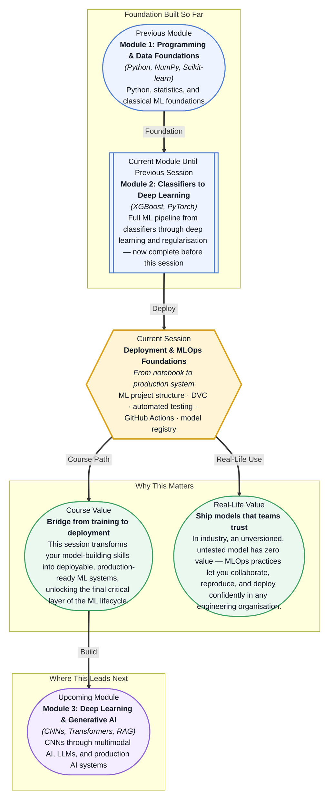

# Pre-read: Deployment & MLOps Foundations

## Context of This Session in the Course

You have just trained a model that achieves 94% accuracy on your validation set — your best result yet. You export it, share a notebook with your teammate, and drop the `.pkl` file into a Slack thread. Three days later, they cannot reproduce your numbers: a different Python version, a missing dependency, a random seed they did not set, and the preprocessed dataset you used is nowhere to be found. The conversation devolves into "it worked on my machine," and the trust in that result evaporates.

The frustration is not the model — it is everything around it. Without a standard project structure, your teammate has to hunt for files across folders and naming conventions. Without versioned data, you cannot tell which CSV produced that 94% figure. Without automated tests, there is no safety net to catch broken pipelines before they silently corrupt production results. The hardest part of machine learning in the real world is rarely the algorithm — it is the discipline of shipping and maintaining it reliably, at scale, alongside other engineers who need to build on your work.

That is where **Deployment & MLOps Foundations** becomes essential.

What if you could push a model update and know, within five minutes, whether anything broke — from missing columns in the input data to a drop in precision below the acceptable threshold? What if a colleague could clone your repository, run a single command, and have the exact dataset, environment, and pipeline that produced the last evaluated model? This session equips you with the tools — project structure conventions, data versioning, automated testing, CI/CD, and model registry workflows — to make that level of engineering rigour your default way of working.

Every ML project starts as exploration, but it must end as engineering. **MLOps** (Machine Learning Operations) is the practice of applying DevOps principles — version control, automation, monitoring — to machine learning systems. The first and most visible shift is **project structure**: instead of a single monolithic notebook, a reliable project separates source code (`src/`), experimental notebooks (`notebooks/`), immutable datasets (`data/`), and serialised models (`models/`) into distinct directories. Think of it as the difference between a cluttered workbench and a well-organised toolbox: when every tool has a home, you and everyone on your team can find what you need instantly.

But organising files is only the beginning. Data changes over time — new records arrive, features are re-engineered, old sources are deprecated. **Data Version Control (DVC)** extends Git's tracking ability to large files: it stores lightweight pointers in Git while the actual data lives in cloud or network storage. This means you can check out any past version of your dataset with a single command, the same way you switch branches in Git. The mental model is simple: treat your dataset as code. Finally, a reliable ML pipeline demands automated validation at every gate — **data validation** catches schema changes and distribution drift, **model performance gates** enforce minimum metric thresholds, and **GitHub Actions** orchestrates these checks automatically on every push, turning testing from a manual chore into an enforced team habit. The **model registry** then tracks each candidate through a staged workflow — dev → staging → production — so you always know which version is live, which is under review, and which is still experimental.

In the **previous session**, you explored regularisation techniques for deep neural networks — Dropout, Batch Normalisation, and Weight decay — all designed to make your models generalise better during training. Those techniques help you build a model that performs well on unseen data, but they say nothing about how to package that model, share it with a team, or keep it running reliably over time. What the regularisation session gave you in model quality, this session gives you in **engineering discipline**: the practices that turn an impressive Jupyter notebook into a repeatable, auditable, production-ready asset. Without MLOps, even the best model is just a file on your laptop.

In this pre-read, you will discover:
- How to **structure** an ML project with standardised directories for source code, notebooks, data, and models
- How to **track** datasets and model artifacts using DVC, so every experiment is reproducible from a single Git commit
- How to **build** automated test gates for data validation and model performance that run on every push via GitHub Actions
- How to **connect** a model registry workflow that moves candidates through dev, staging, and production with clear promotion criteria

---

## Why Your ML Project Needs a Skeleton Before It Ships

Imagine walking into a kitchen where ingredients are stacked in random piles, recipes are scribbled on loose paper, and the only measuring tool is "a pinch." That is what a machine learning project looks like without a deliberate structure. A standardised project skeleton — with directories named `src/`, `notebooks/`, `data/`, `models/`, and `tests/` — sounds trivial, yet it is the single highest-leverage decision you can make for team velocity. It eliminates guesswork about where to place a new script, how to import a utility function, or which dataset a notebook was referencing.

The structure also enforces a healthy separation of concerns. **Source code** (Python modules, training scripts, prediction pipelines) lives in `src/` and is subject to version control, testing, and code review. **Notebooks** live in a separate directory precisely because they are ephemeral — they are perfect for exploration, but they should never be the production artifact. **Data** is treated as read-only and tracked externally (via DVC), which prevents accidental modifications and makes every experiment traceable to a specific snapshot. **Models** — serialised weight files, pickled estimators — are also versioned and linked to the exact code and data that produced them. This four-way split mirrors the structure used at companies like Netflix, Uber, and Shopify, and it will be the scaffolding for every team project and capstone you build from here forward.

## Treating Data Like Code with Version Control

Git is brilliant at tracking text files — source code, configuration, documentation — but it breaks down with large binary assets. A 2 GB CSV or a 500 MB model checkpoint will bloat a repository, slow down every clone, and often push past hosting limits. This is where **Data Version Control (DVC)** enters the picture. DVC stores a lightweight pointer file (typically a few hundred bytes) in your Git repository, while the actual data resides in remote storage — S3, GCS, an NAS drive, or even a local shared folder. When you run `dvc checkout`, it pulls the exact byte-level snapshot referenced by that pointer.

The power of this approach is **reproducibility**. Every Git commit that changes a dataset or a model generates a new DVC pointer, so you can travel back in time to any experiment state with `git checkout <hash> && dvc checkout`. This matters enormously when you need to debug why a model's performance suddenly dropped — you can replay the exact training run that created it, using the same data, the same code, and the same environment. DVC also tracks pipeline stages (`dvc repro`) so you never accidentally skip a preprocessing step or run training on stale features. In practice, DVC shifts data from being a passive file you hope is still on disk to an active, versioned artifact you can reference with the same confidence as a tagged release.

## Where MLOps Foundations Appear in Real Life

**Automated testing for ML** and the **staged model registry** are where MLOps moves from theory to daily reality. In a healthcare AI team building a diagnostic model, a GitHub Actions pipeline runs data validation every time someone opens a pull request: it checks that no new columns have appeared, that categorical values match an expected vocabulary, and that the distribution of key features has not drifted beyond a predefined threshold. If any check fails, the PR cannot merge — stopping a potentially silent data bug before it ever reaches a training script. The same pipeline then trains a candidate model, evaluates it against a performance gate (e.g., AUC > 0.92 on a held-out test set), and if it passes, automatically registers the model in a staging registry for manual review by a clinical lead.

**Financial services** teams use the same pattern for fraud detection models: the dev environment lets data scientists iterate quickly on feature ideas, staging runs shadow deployments on recent transaction traffic (without blocking decisions), and production serves the final model with full monitoring. The model registry logs each transition — who approved it, what metrics it achieved at each stage, which training data version it used — creating an audit trail that satisfies both internal risk compliance and external regulators. **E-commerce** recommendation systems push a new model candidate to staging, run an A/B test against the current production champion, and only promote it if lift exceeds a statistically significant threshold. In **autonomous vehicle** teams, the stakes are even higher: a model registry gates every update through simulation passes (staging) before it reaches real-world road tests. Across every industry, the pattern is identical: structure enables collaboration, versioning guarantees reproducibility, automated tests enforce quality, and a staged workflow ensures that nothing reaches production without being proven safe. These are not academic best practices — they are the baseline expectation for any ML engineer working on a team that ships models users depend on.

## What's Next

After this session, you will be able to:

- Structure an ML project using a standardised layout with `src/`, `notebooks/`, `data/`, and `models/` directories
- Track datasets and model artifacts with DVC, linking every experiment to a reproducible data snapshot
- Write automated validation tests that catch schema drift, missing values, and performance regressions
- Configure a GitHub Actions workflow that runs those tests automatically on every push and pull request
- Navigate a model registry workflow that promotes candidates from development through staging to production with clear gates at each stage

You do not need to memorise every DVC command or YAML syntax today — the live session will walk through each tool hands-on. The goal is to see MLOps not as an extra layer of bureaucracy, but as the bridge that makes your hard-earned modelling skills useful to the world: **a model that cannot be shipped is just a curiosity; a model that can be shipped is a product.**

## Interesting Questions for the Live Session

- What happens to a model in production when the data distribution shifts but your validation tests still pass — and how would you catch that gap in your CI pipeline?
- If DVC tracks data like Git tracks code, how should a team handle a merge conflict when two data scientists independently modify the same raw dataset?
- When should a model performance gate block a deployment, and when might it be safer to let a slightly degraded model through because the alternative — the old model — is worse?
- How do you decide what belongs in the `notebooks/` folder versus the `src/` folder, and what risks come from getting that boundary wrong on a six-month project?

By the end of this session, MLOps should feel less like overhead and more like your unfair advantage as an engineer: **the difference between someone who can train a model and someone who can make it matter.**
