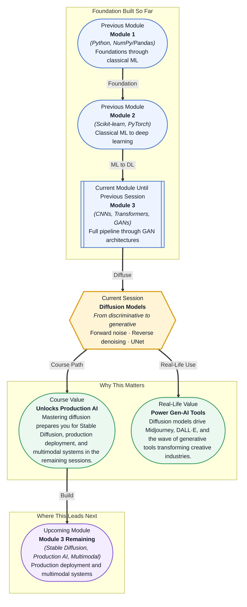

# Pre-read: Diffusion Models

## Context of This Session in the Course

You are working as a machine learning engineer at a design startup. A client asks your team to generate photorealistic product images from text descriptions — furniture, packaging, clothing — at hundreds of variations per minute. Your manager suggests fine-tuning a GAN, but you remember the last time you tried that: mode collapse, training instability, hours of tuning that still produced blurry, unconvincing outputs.

The naive approach — tweaking GAN hyperparameters or stacking more layers — fights a fundamental limitation: GANs learn by pitting two networks against each other, creating an adversarial dynamic that can oscillate, collapse, or never converge. The images might look plausible at first glance, but up close they lack texture, detail, and consistency. Your team needs a different paradigm — one where generation feels more like sculpting than wrestling.

That is where **diffusion models** become essential.

What if you could start with pure random noise and, step by step, transform it into a coherent, high-resolution image that matches any text prompt — no adversarial training, no mode collapse? What if the same framework that generates images could also power video generation, 3D asset creation, and molecular design? This session gives you the conceptual engine behind that capability.

A **diffusion model** works by learning to reverse a gradual destruction process. Imagine a photograph that slowly fades into static — pixel by pixel, the image becomes unrecognisable. That forward process is fixed: you take a real image and add small amounts of Gaussian noise over many steps until nothing remains but pure noise. The model's job is to learn the reverse — starting from noise and predicting how to remove it step by step to recover a clean image. This is the **forward noise addition** and **reverse denoising** process that defines diffusion.

Think of it like restoring a badly damaged photograph. You do not try to guess the final image in one go. Instead, you make small, incremental corrections — removing a scratch here, filling a missing patch there — until the original picture emerges. Each step is modest, but over hundreds of steps the cumulative result is astonishingly detailed. The specific tool for this job is a **UNet**, a neural network architecture originally designed for medical image segmentation that turns out to be exceptionally good at predicting noise patterns at multiple resolutions. It compresses the image to capture large-scale structure, then expands it back to full resolution while preserving fine-grained detail through skip connections.

In this session, you will explore how the forward diffusion process is mathematically defined, how the reverse denoising process is learned as a simple mean-squared error prediction task, and how the **UNet** functions as the core denoising network that makes modern diffusion models possible.

In the **previous session**, you explored GANs — the Generative Adversarial Network framework where a generator and discriminator compete in a minimax game to produce realistic images. You saw how GANs can generate compelling outputs but also learned about their fragility: mode collapse, training instability, and sensitivity to hyperparameters. The GAN framework gave you a generative lens, but its adversarial nature introduced fundamental tension that made reliable training difficult. Diffusion models resolve this tension by replacing the adversarial game with a simple, stable denoising objective — no competition, just iterative refinement.

In this pre-read, you will discover:
- How to **understand** the forward diffusion process that systematically transforms clean images into pure noise
- How to **recognise** the reverse denoising process as a noise-prediction task that is trained with a simple mean-squared error loss
- How to **connect** the UNet architecture's encoder-decoder structure and skip connections to the denoising challenge
- How to **interpret** the shift from GANs to diffusion as a leap in training stability and output quality

---

## How Does Adding Noise Teach a Model to Generate Images?

At first glance, the idea seems backwards. Why would you take a perfectly good image and corrupt it? The insight is that learning to reverse corruption is equivalent to learning the underlying data distribution. If a model can predict how to remove noise at any step, it implicitly understands what a realistic image looks like — because it must know what the clean version should be.

The forward process is simple: at each timestep t, a small amount of Gaussian noise is added to the image. After enough steps, the image is indistinguishable from random noise. The model — typically a **UNet** — is trained to predict the noise that was added, not the image itself. This makes training remarkably stable: the loss function is just mean squared error between predicted noise and actual noise. There is no adversarial dynamic, no balancing act between two networks — the training objective is as straightforward as a regression problem.

Once trained, generating a new image means starting from pure noise and running the reverse process: the UNet predicts the noise component, you subtract it, and repeat for hundreds of steps. Each step is a small correction, and the accumulation of these corrections produces a coherent image. The price is speed — diffusion models are slower than GANs at generation time — but the reward is significantly higher quality and diversity across outputs.

## Why UNet? The Architecture Behind the Magic

The **UNet** was originally designed for biomedical image segmentation, but it has a property that makes it ideal for diffusion: it preserves spatial information across multiple scales. A UNet consists of a contracting path (encoder) that compresses the input into a compact representation, followed by an expanding path (decoder) that reconstructs the original resolution. The key innovation is **skip connections** — direct links that pass fine-grained details from the encoder directly to the corresponding decoder layer.

For denoising, this multi-scale design is critical. Large-scale structures — the overall shape of a face, the layout of a room — are captured in the compressed bottleneck. Fine-scale details — skin texture, fabric patterns, sharp edges — are preserved through the skip connections. The UNet can simultaneously reason about both the global composition and the local texture of the image it is trying to recover, exactly what you need when reversing a noise process that has corrupted information at every scale.

In modern diffusion systems like Stable Diffusion, the UNet is conditioned on additional information such as text embeddings from a CLIP model or class labels, allowing the model to generate images that match a specific description. The architecture adapts naturally from a pure denoiser to a conditional generator — one of the reasons it has become the backbone of the generative AI boom.

## Where Diffusion Models Appear in Real Life

Diffusion models have rapidly become the dominant technology in generative AI across multiple industries. In **creative design and advertising**, tools like Midjourney, DALL·E 3, and Adobe Firefly use diffusion models to generate marketing visuals, product mockups, and brand assets from text prompts — reducing weeks of design work to minutes. The **film and gaming industry** leverages diffusion for concept art generation, texture synthesis, and even video frame interpolation, with models like Stable Video Diffusion extending the paradigm to temporal data. In **healthcare and life sciences**, diffusion models are being explored for medical image synthesis — generating high-resolution MRI or CT scans for data augmentation, or designing novel protein structures by treating molecular conformations as a diffusion process over 3D coordinates. The **e-commerce sector** uses them for virtual try-ons, personalised product imagery, and background replacement at scale, while **architecture and interior design** firms now use diffusion-based tools to rapidly iterate on visual concepts from rough sketches or text descriptions. What started as a niche research idea in 2015 has become the default engine for visual generation in production.

## What's Next

After this session, you will be able to:
- Explain the forward diffusion process and how noise is added systematically to training images
- Describe the reverse denoising objective and why predicting noise works as a stable training goal
- Identify the UNet architecture components — encoder, decoder, and skip connections — and their role in denoising
- Contrast the training stability of diffusion models with the adversarial dynamics of GANs
- Recognise where diffusion models are already deployed in production creative tools
- Connect this session to upcoming topics of Stable Diffusion and multimodal generation

You do not need to memorise every mathematical derivation right now. The goal is to see generative AI not as a black box but as a structured process of progressive refinement: **start with noise, end with meaning.**

## Interesting Questions for the Live Session

- Why does learning to reverse a corruption process produce better results than the adversarial game played in GANs?
- If the forward process destroys information at every step, how can the reverse process recover it — is the model doing something closer to memory or reconstruction?
- Diffusion models require hundreds of forward passes to generate a single image. What design changes could make this faster while preserving quality?
- The UNet was designed for segmentation, not generation. What architectural properties make a segmentation network also work for denoising?

By the end of this session, diffusion models should feel less like a mysterious generative technique and more like a practical, principled framework: **corruption is easy, un-corruption is the hard part — and that is exactly what we train a network to do.**
