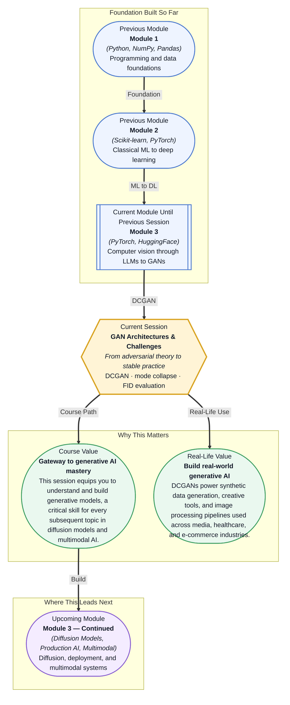

# Pre-read: GAN Architectures & Challenges

## Context of This Session in the Course

Imagine you are a machine learning engineer tasked with generating high-quality product images for an e-commerce platform that has only a few hundred real photographs. Your manager expects thousands of realistic, diverse images — different angles, lighting conditions, and backgrounds — in under a week. Hiring a design team would take months, and rule-based image generation produces repetitive, artificial-looking results.

Standard neural networks can classify images with impressive accuracy, but they cannot create new ones. If you train a classifier to distinguish cats from dogs, all it learns is a decision boundary — it has no concept of what a cat actually looks like well enough to draw one. The challenge runs deeper: even if you could reverse the process, the generated outputs are often blurry, repetitive, or collapse into producing the same image over and over again.

The field of generative modelling was transformed when researchers proposed a clever adversarial setup — pitting two networks against each other in a competitive game. As they compete, both improve, and the generator learns to produce outputs indistinguishable from real data. That is where **GAN Architectures & Challenges** becomes essential.

What if you could build a system that generates photorealistic images of products, people, or scenes from scratch — outputs indistinguishable from genuine photographs? What if that same framework could enhance medical imaging datasets, create artwork in the style of any painter, or generate synthetic training data for autonomous vehicles? These are the capabilities that Generative Adversarial Networks unlock, and this session gives you the architectural understanding and practical knowledge to build them yourself without falling into the common pitfalls that make GAN training notoriously difficult.

A **Generative Adversarial Network (GAN)** consists of two neural networks — a **generator** and a **discriminator** — trained simultaneously in a competitive dynamic. Think of it as a forger trying to create convincing counterfeit paintings and an art detective trying to catch them. As they compete, both improve: the forger learns to create increasingly realistic fakes, and the detective sharpens its ability to spot subtle flaws. The result is a generator capable of producing outputs that are statistically indistinguishable from real data. This adversarial training is powerful but notoriously unstable — the generator may find a single trick that fools the discriminator and stop exploring, a phenomenon called **mode collapse** where outputs become repetitive and lack diversity. Mitigating mode collapse is one of the central engineering challenges you will explore, alongside architectural innovations like the **DCGAN (Deep Convolutional GAN)** — which brought stability to GAN training through specific design rules — and the **Fréchet Inception Distance (FID)**, a metric that evaluates generative model quality by comparing the statistical distributions of real and generated images in feature space.

In the **previous session**, you were introduced to the foundational GAN framework — the two-player game between generator and discriminator, the minimax loss objective, and how adversarial training works conceptually. You understood that a generator maps random noise to data while a discriminator learns to distinguish real from generated samples. That session gave you the what and why of GANs. This session builds directly on that foundation by addressing the how. You will move from the abstract minimax game to concrete, trainable architectures like **DCGAN**, study the failure modes (mode collapse) that the original GAN paper did not solve, and learn how practitioners evaluate generative models quantitatively using the **FID score** — a metric that compares feature-level statistics rather than pixel-level differences.

In this pre-read, you will discover:
- How to **build** a Deep Convolutional GAN (DCGAN) for stable image generation
- How to **recognise** mode collapse during training and apply practical mitigation techniques
- How to **interpret** the Fréchet Inception Distance (FID) score for evaluating generative model quality
- How to **connect** GAN architectures to the broader generative AI landscape including diffusion models

---

## Why DCGAN's Design Rules Made GANs Trainable

The original GAN proposed a powerful idea — adversarial training — but offered little guidance on how to make it work in practice. Generators would diverge, discriminators would overpower them, and training would oscillate without convergence. The breakthrough came with the **Deep Convolutional GAN (DCGAN)**, which introduced a set of architectural constraints that turned GAN training from a fragile art into a reproducible process. The core insight was that convolutional layers, already proven effective for image classification in CNNs, could be repurposed for generation — but only if certain design rules were followed.

DCGAN specified that the generator should use transposed convolutions for upsampling, replace fully connected layers with convolutional layers, apply batch normalisation after every layer except the output, and use ReLU activations in the generator (with Tanh at the output) and Leaky ReLU in the discriminator. Each choice addresses a specific instability: batch normalisation prevents internal covariate shift and helps gradient flow; avoiding fully connected layers reduces the parameter count and forces the network to learn spatial hierarchies; Leaky ReLU prevents the discriminator from killing gradients when it is too confident. These rules may seem arbitrary, but they emerged from systematic experimentation and became the default template for virtually every GAN architecture that followed. Understanding why each rule matters — and when you can safely break them — is the difference between blindly copying code and designing generative models with intent.

## What Happens When Your Generator Gets Stuck

Imagine training a GAN to generate handwritten digits, and after hours of computation, you inspect the outputs to find the same digit — say, a single variant of the number three — repeated in every sample. The generator has discovered that producing one plausible-looking digit consistently fools the discriminator, so it has no incentive to learn the other nine digits. This is **mode collapse**, and it is the single most common failure mode in GAN training. Mode collapse occurs when the generator finds a narrow region of the data distribution that the discriminator cannot distinguish from real data and exploits it relentlessly, sacrificing diversity for short-term adversarial success.

Mitigating mode collapse requires techniques that force the generator to explore the full data distribution rather than settling on a single mode. **Minibatch discrimination** lets the discriminator compare samples within a batch, making it harder for the generator to fool it with repetitive outputs. **Feature matching** replaces the discriminator's objective of distinguishing real from fake with a requirement that the generator's intermediate features match those of real data. **Historical averaging** penalises the generator if its parameters drift too far from their recent trajectory, and **unrolled GANs** allow the generator to see several steps of the discriminator's optimisation before updating, preventing the generator from chasing a moving target. Each approach tackles a different facet of the instability — and recognising which one to apply in your specific training run is a skill that separates experienced practitioners from novices.

## Where Generative Models Power Real-World Applications

The architectures and evaluation techniques you will study in this session are not academic exercises — they underpin production systems across multiple industries today. In **media and entertainment**, GANs generate photorealistic faces for video game characters, upscale low-resolution images, and colourise black-and-white footage; the same DCGAN architecture you will implement powers tools that artists use to explore creative variations at scale. In **healthcare**, GANs generate synthetic medical images — X-rays, MRI slices, retinal scans — to augment small or imbalanced datasets, enabling radiologists to train diagnostic models on data that preserves privacy because it was never a real patient. **E-commerce** platforms deploy GANs for virtual try-on, product image generation, and background removal, reducing the cost of photoshoots from thousands of dollars to a single forward pass. In **autonomous vehicles**, GANs create synthetic driving scenes with varied weather, lighting, and pedestrian configurations, covering edge cases that would be dangerous or impossible to capture in the real world. The **FID score**, meanwhile, has become the standard evaluation metric across all of these domains — when a research paper claims a new generative model produces "better" images, it is almost certainly using FID to make that claim, which makes understanding its strengths and limitations essential for anyone working in generative AI.

## What's Next

After this session, you will be able to:

- Implement a DCGAN with convolutional layers, batch normalisation, and proper activation functions for stable image generation
- Diagnose mode collapse by monitoring generated sample diversity and discriminator loss behaviour during training
- Compute the FID score between real and generated image distributions using pre-trained feature extractors
- Apply mitigation strategies such as minibatch discrimination and feature matching to stabilise GAN training
- Compare generative model outputs using quantitative metrics alongside visual inspection
- Design an adversarial training loop with balanced generator and discriminator update schedules

You do not need to train a production-ready GAN on a multi-GPU cluster right now. The goal is to build a mental model of adversarial training that makes every generative AI technique — from GANs to diffusion — feel like variations on a single powerful idea: **learning to create by learning to critique**.

## Interesting Questions for the Live Session

- If mode collapse is a Nash equilibrium of the adversarial game, what does that tell us about the fundamental stability of GAN training compared to standard supervised learning?
- DCGAN's architectural rules removed fully connected layers and added batch normalisation everywhere — which of these constraints still hold for modern GANs, and which have been superseded by techniques like spectral normalisation?
- The FID score uses features from an Inception network trained on ImageNet — what assumptions does this introduce, and when might FID give misleading or contradictory results for a generative model?
- Why does the generator in a GAN tend to win the adversarial game over time, and what does this imbalance imply for designing training loops that keep both networks competitive?

By the end of this session, GANs should feel less like a fragile black-box trick and more like a principled framework you can analyse, debug, and extend: **adversarial training is the art of turning competition into creativity**.
