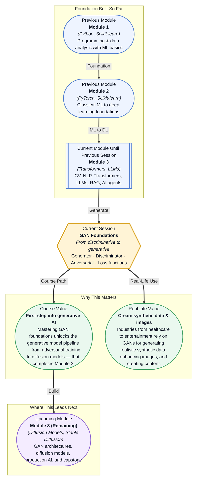

# Pre-read: GAN Foundations

## Context of This Session in the Course

You are building a house, and the walls are strong, the roof is tight, and the plumbing works. You have installed windows that let you see the world outside — classifying images, understanding text, answering questions. One day, a client walks in and says, "That is beautiful. Now build me a second house exactly like it, but I do not have the blueprints anymore." You realise you have only learned to recognise houses, not to create them. You can tell a Georgian from a Victorian, but you cannot draft a single floor plan from scratch.

That is the moment you hit the wall between discriminative and generative modelling. Every model you have trained so far — logistic regression, random forest, CNN, BERT — has been a classifier. Give it an input, it tells you what it is. But the world does not just need machines that label. It needs machines that create: images that have never existed, text that reads like a human wrote it, data that preserves patterns without exposing private information. Your toolkit has no answer for that. Yet.

That is where **GAN Foundations** becomes essential. Generative Adversarial Networks turn creation into a game — the first credible framework that taught machines to generate realistic images, audio, and synthetic data. This session introduces the core mechanism: two networks locked in a contest that drives both to get better, until one can fool the other completely.

What if you could walk into a product meeting and say, "We do not have enough chest X-rays to train our diagnostic model, so I will generate a thousand synthetic ones that are indistinguishable from real patients — without any privacy risk"? What if your fashion e-commerce platform could let shoppers describe an outfit they imagine and have a photorealistic image generated on the spot, no photoshoot needed? What if your autonomous vehicle team could generate millions of hours of night-driving footage from a handful of real clips? These are not hypotheticals. Companies like NVIDIA, Pfizer, and Adobe are doing exactly this with GANs. But none of it works unless you deeply understand the adversarial dynamic that makes a generator improve — which is precisely what this session builds.

At its core, a **Generative Adversarial Network (GAN)** consists of two neural networks: a **generator** that creates fake data and a **discriminator** that tries to tell real from fake. Think of the generator as a forger painting counterfeit banknotes, and the discriminator as a detective examining every bill for flaws. The forger gets better the more the detective catches mistakes, and the detective gets sharper the more convincing the forgeries become. Over time, both improve until the forger produces notes the detective cannot distinguish from real ones. This adversarial dynamic is the engine behind every GAN application you will encounter, from synthetic medical images to AI-generated art.

What makes this interplay powerful is the formal framework of **loss functions** that govern it. The generator's loss measures how well it fooled the discriminator, while the discriminator's loss measures its ability to separate real from fake. Because both networks are optimised simultaneously but in opposite directions, training a GAN is fundamentally different from training a standard classifier — it requires balancing two competing objectives without letting either one dominate. This session explores the **minimax game formulation** that mathematically captures this balance, the role of binary cross-entropy as the loss function for both networks, and the practical tricks (learning rate tuning, label smoothing, gradient clipping) that keep training stable.

In the **previous session**, you explored Agent Memory Fundamentals — how AI agents store, retrieve, and use conversational context to plan multi-step tasks and collaborate. That session completed a long arc through Module 3 that began with computer vision, moved through NLP, Transformers, LLMs, RAG, and finally into agents that act on information. You have learned to build systems that perceive, understand, retrieve, and act. What has been missing is the ability to create — to generate new data rather than process existing data.

GAN Foundations is the bridge from discriminative systems (which classify what they see) to generative systems (which produce what does not yet exist). The loss functions and optimisation concepts you first encountered in Module 2 — backpropagation, gradient descent, cross-entropy — are the same tools that power adversarial training, now applied in a radically different way. Where you once minimised a single loss to make a classifier more accurate, you will now balance two competing losses to make a generator more creative.

In this pre-read, you will discover:
- How to understand the adversarial interplay between a generator and a discriminator
- How to interpret the loss functions that drive both networks toward equilibrium
- How to connect GANs as the first generative model in your course journey
- How to recognise where adversarial training principles apply beyond image generation

---

## Why Two Networks Play a Cat-and-Mouse Game

Every model you have built so far has one optimiser and one loss function. A GAN has two of each, and they work against each other. This is not a bug — it is the core insight. The **generator** starts by producing random noise shaped into something that resembles data (say, a 32×32 image). The **discriminator** receives a mix of real images from the training set and fakes from the generator, and it learns to output a probability — how likely each input is real. The generator's goal is to maximise the discriminator's error rate; the discriminator's goal is to minimise it.

This creates a **minimax game**, formally expressed as: the generator tries to minimise the probability that the discriminator correctly identifies its fakes, while the discriminator tries to maximise its classification accuracy. If you plot the discriminator's loss during training, a healthy GAN shows neither network dominating — the discriminator hovers around 50% accuracy on the generator's outputs, indicating genuine uncertainty. If the discriminator hits 100% accuracy on fakes, the generator is too weak and needs a better architecture or a different learning schedule. If the discriminator drops to 0%, the generator has started producing garbage that the discriminator has given up on entirely. Reading these signals is the first skill this session builds.

Analogies help, but the mathematics behind the minimax formulation is what makes GANs rigorous. The value function V(D, G) that governs the game uses binary cross-entropy — the same loss you used for logistic regression — but applied in a competitive rather than cooperative setting. The discriminator maximises log D(x) for real data and log(1 − D(G(z))) for fakes, while the generator minimises log(1 − D(G(z))). In practice, the generator often uses a variant — maximising log D(G(z)) instead — to avoid vanishing gradients early in training when the discriminator can easily reject fakes. This seemingly small tweak has major consequences for training stability and is one of the first practical lessons in GAN training dynamics.

## What Loss Functions Reveal About the Battle

Loss functions in a GAN are not just numbers to minimise — they are diagnostic windows into the state of the adversarial game. The **discriminator loss** tells you how well the detector is performing. A low discriminator loss means the discriminator can easily separate real from fake, which sounds good but actually signals a problem: if the discriminator is too strong, the generator receives almost no gradient signal to improve. This is the **vanishing gradient problem** in GANs, and it is one of the most common training failures. A well-tuned GAN keeps the discriminator good enough to provide useful feedback but not so good that it crushes the generator.

The **generator loss** is more nuanced. When plotted across training iterations, a decreasing generator loss does not necessarily mean better images — it might mean the generator has found a narrow set of outputs that fool the discriminator without capturing the full diversity of real data. This is **mode collapse**, where the generator produces only a few varieties of outputs (think a forger who can only paint one perfect landscape and keeps reproducing it). Detecting mode collapse requires looking at the generator loss _in context_ of actual sample quality, not in isolation. The session introduces techniques like tracking the discriminator accuracy on fakes over time, monitoring the ratio of generator to discriminator loss magnitudes, and understanding why certain loss formulations (like Wasserstein loss in WGANs) were invented specifically to address these stability issues.

Both loss functions are computed per batch and backpropagated independently — the generator never directly sees real data, and the discriminator never generates anything. This separation is what makes GAN training conceptually elegant and practically brittle. The loss functions are the only communication channel between the two networks, so choosing the right formulation and hyperparameters (learning rates, optimiser choice, label smoothing) determines whether your GAN converges to sharp, diverse images or collapses into noise.

## Where GANs Appear in Real Life

GANs have moved from research curiosity to production tool across several industries, and understanding their foundations lets you evaluate where they fit — and where they do not. In **healthcare**, GANs generate synthetic medical images (chest X-rays, retinal scans, MRI slices) to augment small datasets for rare diseases, letting radiologists train diagnostic models without compromising patient privacy. Pharmaceutical companies use GANs to generate molecular structures with desired properties, accelerating drug discovery by proposing candidates that satisfy chemical constraints learned from existing compounds. In **entertainment and media**, game studios use GANs for texture synthesis and environment upscaling — generating high-resolution assets from low-resolution sources without manual artist effort. Adobe's Photoshop uses GAN-based features for content-aware fill, where missing parts of an image are plausibly regenerated from surrounding context.

The **automotive industry** leverages GANs for domain adaptation: a model trained on sunny daytime driving footage can be adapted to rain, snow, or night conditions by applying a GAN that transforms the visual style while preserving the semantic content — no expensive data collection needed. In **finance**, GANs generate synthetic transaction histories that preserve statistical properties (fraud patterns, spending distributions) without exposing real customer data, enabling compliance with regulations like GDPR while still allowing model development. These use cases share a common thread: the ability to create realistic, diverse, and controlled synthetic data. The GAN framework you learn in this session is the foundation for understanding why these systems work, when they fail, and how newer approaches like diffusion models build upon — or depart from — the adversarial paradigm.

## What's Next

After this session, you will be able to:

- Explain the minimax game formulation that governs the interplay between generator and discriminator
- Describe how the loss functions for each network create opposing optimisation objectives
- Identify signs of training instability — vanishing gradients, mode collapse, non-convergence — from loss curves alone
- Connect the GAN framework to downstream generative architectures like DCGAN and conditional GANs
- Recognise real-world scenarios where adversarial training is the right tool and where it is not

You do not need to implement a full GAN from scratch right now — the goal is to internalise the adversarial dynamic and the loss landscape that makes it work. The goal is to see generative models not as magic but as a structured game with clear rules and tradeoffs.

## Interesting Questions for the Live Session

- What happens if the discriminator becomes too accurate too quickly — and how would you detect and fix this imbalance from the loss curves alone?
- If the generator loss keeps decreasing but the generated images look blurry or repetitive, what does that tell you about the state of the adversarial equilibrium?
- Could the minimax framework apply to domains like tabular data generation for privacy-preserving ML, or does the loss formulation assume continuous data like images?
- How is the adversarial dynamic in GANs fundamentally different from the adversarial examples used to fool classifiers, even though both involve a minimax-like objective?

By the end of this session, GANs should feel less like an abstract game between two networks and more like a practical framework you can reason about and apply: **Adversarial training turns competition into creation.**
