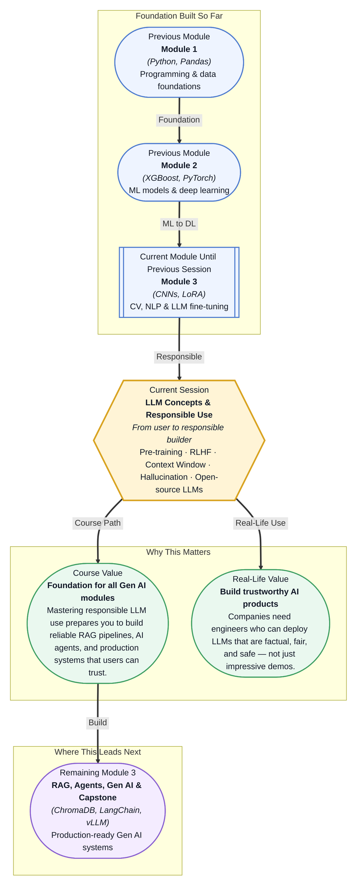

# Pre-read: LLM Concepts & Responsible Use

## Context of This Session in the Course

You deploy a customer-support chatbot powered by a large language model. In the first hour, it gives a refund amount that is completely wrong — but the response sounds so confident that the customer does not question it. By the time the error is caught, the wrong amount has been processed, and your manager wants to know why the model was not tested before going live.

This is not a hypothetical scenario. LLMs generate text that reads like it was written by an expert, which makes their mistakes especially dangerous. The naive approach — just picking the most capable model and pointing it at your data — fails because LLMs do not know what they do not know. They predict tokens, not truth. They reflect the biases of their training data, not a balanced view of the world. And when they hallucinate, they do so with total confidence.

That is where **LLM Concepts & Responsible Use** becomes essential. This session is not about making models bigger or more powerful. It is about understanding how they actually work under the hood so you can deploy them safely, detect when they are going wrong, and build systems that earn user trust.

What if you were tasked with building an LLM-powered medical triage assistant for a hospital network — one that must never recommend a dangerous treatment, must treat every patient fairly regardless of demographic background, and must clearly indicate when it does not have enough information? Every mistake carries real consequences: a hallucinated symptom could delay care, a biased response could deny someone a referral, and an overconfident answer could undermine clinical judgment. The models you will work with in this session — pre-trained on billions of internet documents, instruction-tuned to follow directions, and aligned through RLHF — are the ones hospitals, banks, and governments are already evaluating. This session gives you the conceptual framework to decide whether and how to trust them.

Every large language model you have encountered — from GPT to Llama to Mistral — begins its life through **pre-training**, where the model learns to predict the next token across an enormous corpus of text scraped from the internet. Think of this as giving the model a vast, uneven library without a librarian. It knows language but does not know what you want from it. That is where **instruction tuning** comes in: fine-tuning the pre-trained model on thousands of curated question-answer pairs to teach it how to follow directions. But instruction-tuned models can still produce offensive, biased, or dishonest outputs, which is why **RLHF** (Reinforcement Learning from Human Feedback) adds a final alignment layer — human raters rank model outputs, and the model learns to prefer responses that people find helpful and harmless. This three-stage recipe — pre-training, instruction tuning, RLHF — is the backbone of every frontier model today.

A useful analogy is training a new hire. Pre-training is like giving them access to every file in the company, vast but unfiltered. Instruction tuning is like a manager explaining the team's workflows and how to respond to common requests. RLHF is the performance-review cycle where the employee learns which behaviours earn praise and which get flagged. Without any of these stages, you end up with an employee who knows everything but cannot be trusted to do the right thing.

In this session, you will also explore how the **context window** limits the amount of information a model can consider at once, why **hallucination** happens and how to detect it, and what makes **open-source LLMs** like Llama, Mistral, and Gemma different from closed models. These concepts are not theoretical footnotes — they directly determine whether your LLM-powered application works in practice.

In the **previous session**, you learned how to fine-tune an LLM efficiently using LoRA — adapting a pre-trained model to a specific task by training a small set of low-rank parameters. That session gave you the practical skill of customising a model for your own data. This session extends that knowledge by asking the deeper question: now that you can fine-tune a model, how do you know it is ready to be used? The LoRA adapter you trained is only as good as the base model's pre-training, the instruction-tuning data it was aligned on, and your ability to detect when it goes wrong. Understanding the full training pipeline — from pre-training through RLHF — turns you from someone who can tweak a model into someone who can responsibly deploy one.

In this pre-read, you will discover:
- How to **understand** the three-stage training pipeline that produces every modern LLM
- How to **recognise** the limitations of context windows and why they matter for real applications
- How to **interpret** the causes of hallucination and techniques to detect and mitigate them
- How to **connect** open-source LLMs like Llama, Mistral, and Gemma to the broader landscape of responsible AI

---

## How Do LLMs Actually Learn?

Most people interact with an LLM through a chat interface and assume it works like a smarter search engine. But the model you type into today did not start as a chatbot. It began as a raw neural network trained on the simple but staggeringly ambitious task of predicting the next word. During **pre-training**, the model processes hundreds of billions of tokens — entire Wikipedia dumps, millions of books, crawled web pages — and learns statistical patterns of language: grammar, facts, reasoning chains, and even some degree of world knowledge. The output of this stage is a base model that can generate fluent text but cannot follow instructions, answer questions directly, or avoid harmful outputs.

**Instruction tuning** is the first step toward making that raw model useful. Curators assemble thousands of examples showing the model how to respond to prompts: summarise this article, explain quantum computing to a child, translate this sentence. The model is fine-tuned on these examples, learning to generalise the pattern of instruction-following. This is surprisingly effective — a relatively small set of high-quality examples can teach a model to handle millions of unseen instructions.

**RLHF** (Reinforcement Learning from Human Feedback) is the final and most sophisticated stage. Instead of training on pre-written examples, the model generates multiple responses to the same prompt, and human raters rank them from best to worst. A separate reward model learns to predict those human preferences, and the LLM is then optimised to maximise the reward — essentially learning to produce responses that people find helpful, honest, and harmless. This is why ChatGPT's answers feel polite and structured while a raw pre-trained model might ramble or produce offensive text. Understanding this three-stage pipeline is critical because each stage introduces different failure modes: pre-training can encode bias, instruction tuning can overfit to narrow formats, and RLHF can make the model sycophantic, telling you what you want to hear instead of the truth.

## Why Context Windows Matter More Than You Think

The **context window** is the maximum number of tokens that an LLM can consider at once when generating a response. For early models like GPT-2, this was 1024 tokens — about a page of text. Modern models range from 4096 tokens to over 128,000, and some specialised models claim up to 1 million tokens. But bigger is not always better — and the tradeoffs matter deeply for how you design your application.

The core limitation is computational. Self-attention, the mechanism at the heart of the Transformer architecture, scales quadratically with sequence length. Doubling the context window roughly quadruples the compute and memory required. This means longer context windows are slower and more expensive, and the model's attention can become diluted across too many tokens. When you feed a 50-page document into a model with a 128K context, the model may lose focus on the most relevant part and produce a worse answer than if you fed it a carefully retrieved 2-page summary.

This is why the context window is not just a spec-sheet number. It determines your entire architecture: how you chunk documents for retrieval, how long a conversation history you can maintain, and whether your model can reason over the full set of instructions you give it. Responsible LLM use means understanding the context window's limits so you design your system around them — using retrieval to inject the most relevant content rather than assuming the model can attend to everything equally.

## Where LLM Concepts Appear in Real Life

The concepts in this session shape how AI products are built and regulated across every major industry. In **healthcare**, LLMs are being evaluated for clinical decision support and patient communication, but hallucination is a life-safety risk. A model that fabricates a drug interaction or misreads a lab result cannot simply be fixed with a better prompt — it requires systematic detection through groundedness checks, retrieval-augmented generation, and domain-specific fine-tuning with verified medical data. Hospitals that deploy LLMs without understanding pre-training biases risk amplifying health disparities for underrepresented populations.

In **finance**, regulatory requirements demand explainability and fairness. A credit-scoring LLM must not exhibit bias based on protected characteristics, and its reasoning must be auditable. This directly connects to RLHF alignment — a model trained on internet data inherits the associations present in that data, including correlations between names and creditworthiness that are not causally valid. Financial institutions deploying LLMs for customer-facing chatbots must test for toxicity and factuality, because a model quoting wrong interest rates or regulatory deadlines can lead to compliance violations and reputational damage.

In **legal technology**, LLMs are used to review contracts, summarise case law, and draft filings. The cost of hallucination is especially high here — a model that invents a precedent or misquotes a statute can cause real legal harm. This is why legal AI products typically use smaller, specialised models with chain-of-thought verification and strict grounding in retrieved documents. The open-source models you will explore in this session — Llama, Mistral, and Gemma — are particularly attractive in legal contexts because they can be deployed on-premises, keeping sensitive client data off third-party APIs.

In **education** and **content creation**, the challenge shifts to bias and toxicity. LLMs used in classrooms must present balanced viewpoints and avoid harmful stereotypes. Content moderation pipelines rely on understanding where an LLM's training data introduced political, cultural, or demographic biases. These applications force engineers to move beyond accuracy metrics and engage with the harder question of what a good response looks like — a question that has no purely technical answer, but one that every responsible AI practitioner must learn to navigate.

## What's Next

After this session, you will be able to:

- Explain the three-stage LLM training pipeline — pre-training, instruction tuning, and RLHF — and identify the failure modes specific to each stage
- Recognise how context window size affects model behaviour and choose appropriate chunking and retrieval strategies for your application
- Detect hallucination patterns in LLM outputs and apply grounding, prompting, and verification techniques to mitigate them
- Evaluate open-source LLMs like Llama, Mistral, and Gemma against commercial alternatives based on your specific requirements for privacy, cost, and control
- Identify bias and toxicity risks in model outputs and apply basic fairness checks before deploying an LLM-powered system

You do not need to master every detail of the RLHF reward model or memorise each open-source model's context window size right now. The goal is to develop a mental model of how these systems are built and where they fail, so that every decision you make — from model selection to prompt design to deployment strategy — is grounded in genuine understanding rather than blind trust in the output.

## Interesting Questions for the Live Session

- If a model's RLHF training makes it prefer helpful responses, how do you prevent it from becoming sycophantic — telling the user what they want to hear instead of the truth?
- A model with a 128K token context window can ingest an entire novel, but its accuracy on questions about that novel often degrades compared to a retrieval-based approach. When would you still choose the long-context approach, and why?
- Open-source models like Llama and Mistral can be fine-tuned and deployed privately, but they typically lag behind GPT-4 on benchmark tasks. How do you quantify the tradeoff between performance and control when choosing an open-source model for a regulated industry?
- If you detect that your LLM application is exhibiting gender bias in its outputs, at which stage of the pipeline — pre-training data, instruction tuning data, RLHF reward model, or deployment prompt — would you prioritise intervention, and why?

By the end of this session, LLM internals should feel less like a black box and more like a set of known components with known failure modes — each one something you can inspect, test, and design around: **the goal is not to build a perfect model, but to deploy a trustworthy one.**
