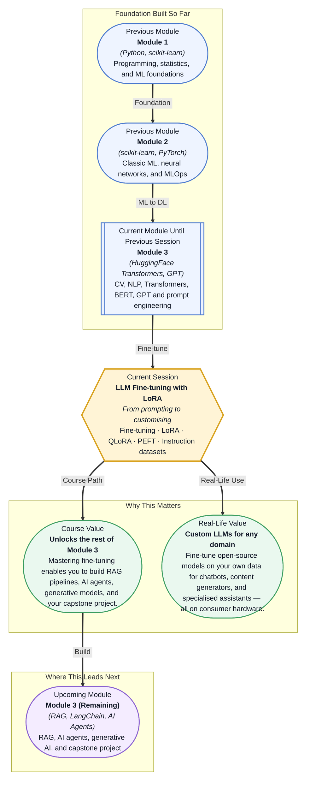

# Pre-read: LLM Fine-tuning with LoRA

## Context of This Session in the Course

Your team has spent weeks crafting careful few-shot prompts, chaining them with LangChain, and tweaking system messages until the GPT responses finally feel right for your customer support bot. The demo goes well. Then the client asks for a version that speaks in their brand voice, handles product-specific refund policies the model has never seen, and never hallucinates internal pricing tiers. No amount of prompting fixes this. You realise you do not need a better prompter — you need a model that has actually learned your domain.

The naive answer is full fine-tuning: take a 7-billion-parameter open-source LLM and retrain all its weights on your data. That requires hundreds of gigabytes of GPU memory, multiple days of training, and more infrastructure than your entire team has access to. Most teams give up at this point and either accept the limitations of prompting or burn their budget on massive cloud instances. The problem is that full fine-tuning is not designed for your situation — it was designed for large research labs with deep pockets.

That is where **parameter-efficient fine-tuning** becomes essential. Instead of updating every weight, you can insert small, trainable adaptation matrices while keeping the original model frozen. This approach — led by **LoRA (Low-Rank Adaptation)** — cuts memory requirements from hundreds of gigabytes to a few gigabytes, slashes training time from days to hours, and makes fine-tuning possible on a single consumer GPU. This session gives you the key to customise any open-source LLM without needing a data centre.

What if you could take a 7-billion-parameter model like Llama 3, download it to your laptop, and teach it to answer questions from your company's internal knowledge base — all in a single afternoon? What if that fine-tuned model ran on a single RTX 4090, cost pennies per inference, and never sent your proprietary data to a third-party API? That is the capability this session unlocks. You will walk away knowing exactly how to adapt any open-source LLM to your domain, your data, and your constraints.

At its core, fine-tuning a large language model is about shifting what the model "knows" without making it forget what it already learned during pre-training. A base LLM like Llama or Mistral has seen billions of tokens of general text — it knows grammar, facts, and reasoning patterns. But it does not know your product catalogue, your legal disclaimers, or your customer's most common complaints. **Fine-tuning** adjusts the model's weights so it can answer those domain-specific questions accurately. The problem is that a full fine-tuning pass on a 7-billion-parameter model updates 7 billion weights, which means storing gradients and optimiser states for every single one — that is where the massive memory cost comes from.

LoRA solves this with a clever mathematical insight derived from **low-rank matrix decomposition**. Instead of updating the full weight matrix *W*, LoRA assumes the update *ΔW* has a low "intrinsic rank" — meaning it can be factorised into two smaller matrices *A* and *B* whose product approximates the full update. If *W* has 4096 × 4096 dimensions, *A* might be 4096 × 8 and *B* 8 × 4096 — that is a reduction from 16 million trainable parameters to just 65,000. You train only the tiny *A* and *B* matrices and leave every original weight frozen. **QLoRA** takes this further by quantising the frozen base model to 4-bit precision, reducing memory by another 4× so that fine-tuning a 7-billion-parameter model fits comfortably on a 24 GB GPU. The HuggingFace **PEFT library** wraps this entire workflow: you define a `LoraConfig` with parameters like rank, alpha, and target modules, then call `get_peft_model` to convert your base model into a LoRA-trainable version in three lines of code.

In the **previous session**, you explored **GPT & Prompt Engineering** — how to coax the best responses from a pre-trained model using careful instruction design, few-shot examples, and output formatting. You learned that prompting is a powerful way to steer a model without changing its weights, but also that it has hard limits: the model cannot learn new facts, cannot adopt a new format it has never seen, and cannot reliably follow instructions outside its training distribution. Prompt engineering is like giving a world-class chef a detailed recipe for a dish they have never tasted. LoRA fine-tuning is the equivalent of letting that chef cook your dish a hundred times until they internalise it. The prompting skills you already have are the starting line — they let you evaluate what the base model can do. Fine-tuning gives you the next gear: you can now permanently embed domain knowledge, enforce output formats, and build models that truly belong to your use case.

In this pre-read, you will discover:
- How to **recognise** when fine-tuning is necessary and prompt engineering is insufficient
- How to **apply** LoRA's low-rank decomposition to make fine-tuning parameter-efficient
- How to **use** QLoRA to fine-tune large models on consumer-grade hardware
- How to **build** instruction-response datasets for supervised fine-tuning with HuggingFace PEFT

---

## Why Fine-Tune When Prompting Works So Well?

Prompting a large language model feels magical — you write a system message, add a few examples, and the model produces reasonable output. For many tasks, that is enough. But there is a ceiling. Consider a legal assistant that must answer questions about the Indian Contract Act of 1872. You can prompt GPT-4 with the full text of the Act and ask it to reason about Section 10, but the context window is finite, the model may conflate similar clauses, and the output format drifts across conversations. More fundamentally, the model has not *learned* the Act — it is reading it fresh every time, like a paralegal flipping through a law book they have never studied. Prompting gives you access to the book; fine-tuning makes the book part of the model's knowledge.

The key distinction is between **in-context learning** and **weight-based learning**. In-context learning (prompting) works by conditioning the model on examples placed in the input window. It is zero-cost in terms of training but bounded by context size and prone to inconsistency. Weight-based learning (fine-tuning) modifies the actual parameters of the model so the new knowledge is baked in, always available, and never displaced by a longer prompt. This matters when you need reliability: a fine-tuned model does not forget your custom format halfway through a conversation because another instruction pushed it out of the context window.

From a course perspective, this session is the inflection point where you stop being a *user* of pre-trained models and start being a *customiser* of them. Everything you learned about transformers, self-attention, BERT, and GPT was building toward this moment — understanding how these models work internally so you can modify them intelligently.

## How LoRA Decomposes the Fine-Tuning Bottleneck

The central obstacle to fine-tuning large language models is memory. A single 7-billion-parameter model stored in 16-bit precision consumes 14 GB of VRAM just to hold the weights. During full fine-tuning, you also need memory for gradients, optimiser states (Adam stores two additional values per parameter), and activations — easily pushing past 80 GB for a modest batch size. That does not fit on any consumer GPU. LoRA sidesteps this by making the training process itself smaller instead of trying to shrink the model.

LoRA rests on a finding from ICLR 2021: pre-trained language models have a low "intrinsic dimension," meaning the weight updates needed for fine-tuning can be represented in a much smaller subspace. Concretely, for any weight matrix *W* in the model, LoRA learns a delta *ΔW* = *AB*, where *A* is a *d × r* matrix, *B* is an *r × k* matrix, and *r* (the rank) is typically 8 or 16 — orders of magnitude smaller than *d* and *k*. The original *W* is frozen, so no gradients are computed through it. Only the small *A* and *B* matrices receive gradients and updates. This is the difference between repainting an entire skyscraper versus replacing a few tiles on the ground floor — the visual effect can be similar for a fraction of the cost.

**QLoRA** adds a second innovation: it quantises the frozen base model to 4-bit NormalFloat precision using a technique that preserves model quality far better than naive 4-bit quantisation. Combined with LoRA's low-rank adapters, QLoRA makes it possible to fine-tune a 7-billion-parameter model on a single 24 GB GPU — the same GPU many developers already use for gaming or rendering. The HuggingFace PEFT library (`peft`) provides a `LoraConfig` where you specify `r` (rank), `lora_alpha` (scaling factor), and `target_modules` (which weight matrices — typically query and value projections — receive LoRA adapters). A single call to `get_peft_model(model, config)` wraps your base model so that `model` now trains only the LoRA parameters. The result: training time drops from days to hours, and the output is a tiny adapter file (a few megabytes) that can be swapped in and out of the base model without copying the full 14 GB.

## Where LLM Fine-Tuning Appears in Real Life

The ability to fine-tune a large language model on a consumer GPU has transformed what kinds of teams can build custom AI. In **healthcare**, hospitals fine-tune open-source models on medical textbooks and clinical notes to produce assistants that answer diagnostic questions without hallucinating drug interactions — these models never leave the hospital's private infrastructure, satisfying regulatory requirements like HIPAA. In **legal technology**, firms train models on decades of case law and contract templates; a fine-tuned model can review a 500-page licensing agreement in seconds, flag clauses that deviate from precedent, and generate redline suggestions, all while quoting specific statutes because the model has learned them rather than reading them fresh each time.

The **financial services** industry fine-tunes LLMs on internal compliance documentation, regulatory filings (like SEBI or SEC requirements), and historical fraud patterns. A fine-tuned model can answer a compliance officer's question in natural language about whether a specific transaction pattern triggers reporting obligations — something a prompted general model cannot do reliably because the regulatory details are too niche and too precise. In **customer service**, companies fine-tune models on thousands of past support tickets to create bots that understand their exact product taxonomy, pricing tiers, and return policies; the fine-tuned model consistently uses the correct brand voice because those patterns are embedded in its weights, not left to the whims of a system prompt.

**Education** platforms fine-tune models on curriculum materials to create subject-matter tutors. A chemistry tutor fine-tuned on a semester's worth of lecture notes, problem sets, and grading rubrics can explain stoichiometry in the same language the professor uses, produce practice problems at the right difficulty level, and even detect common mistakes specific to that course. Across every one of these scenarios, the pattern is the same: a general-purpose model learns general patterns, and LoRA fine-tuning gives it the specialised knowledge it needs without requiring a supercomputer.

## What's Next

After this session, you will be able to:

- Choose between prompt engineering, fine-tuning, and LoRA-based tuning for a given task based on data size and performance requirements
- Configure a `LoraConfig` with appropriate rank, alpha, and target module settings for a given model architecture
- Apply `get_peft_model` to wrap a base HuggingFace model for LoRA training
- Prepare a dataset in the instruction-response format suitable for supervised fine-tuning
- Fine-tune a quantised LLM using QLoRA on a consumer-grade GPU
- Save, load, and merge LoRA adapters for inference

You do not need to write a full training script from scratch by the end of this session. The goal is to see fine-tuning not as a remote service only big companies can afford, but as a practical technique you can run on your own machine: **custom models are no longer reserved for the few — LoRA makes them available to anyone who can write a training loop.**

## Interesting Questions for the Live Session

- What happens to model quality if you set the LoRA rank to 1, and what if you set it to 256 — at what point do you lose the benefits of parameter efficiency?
- If you fine-tune a model on a new task without including any general data, how does the model behave on its original capabilities, and can you measure that degradation?
- How does the choice of target modules — query projections, value projections, all linear layers — affect what the LoRA adapter actually learns during fine-tuning?
- If you fine-tune two separate LoRA adapters on two different domains, can you merge them into a single adapter, and what happens to the combined output?

By the end of this session, LLM fine-tuning should feel less like a black-box process owned by large AI labs and more like a practical tool you control: **LoRA gives you the power of custom models without the cost of training from scratch.**
