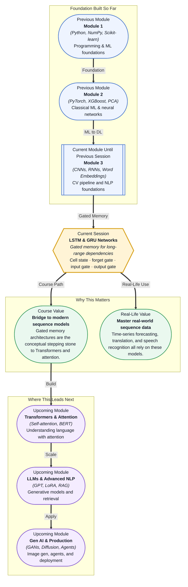

# Pre-read: LSTM & GRU Networks

## Context of This Session in the Course

You are building a chatbot for customer support that needs to follow a conversation across ten exchanges. The first few replies are spot-on, but by message seven the bot starts contradicting itself — it cannot remember that the customer already provided their order number. The model flatlines because every new input overwrites the previous state, washing out information from just a few turns ago.

The problem runs deeper than a bad architecture choice. Standard recurrent neural networks pass a single hidden state through time, applying a transformation and a nonlinearity at every step. As the sequence lengthens, gradients that carry the learning signal from the prediction back to earlier time steps either explode to infinity or — more often — decay to near zero. A model that cannot propagate error signals across more than twenty steps cannot learn dependencies that span paragraphs or months of data. This is the vanishing gradient problem, and it is the fundamental limitation that makes plain RNNs impractical for most real-world sequence tasks.

That is where **LSTM & GRU Networks** become essential.

What if you could build a model that reads a year of sensor data from an industrial turbine and flags a failure pattern it first saw ten months ago? Or a speech-to-text system that accurately transcribes a five-minute monologue without losing the thread of the opening sentence? These are not hypotheticals — they are production problems that gated recurrent architectures solve every day. By the end of this session, you will understand the gating mechanism that makes long-range memory possible, turning a model that forgets after three steps into one that can remember across hundreds.

At the heart of every recurrent network is a loop: a hidden state that carries information from one time step to the next. In a plain RNN, every step multiplies and transforms this state, causing distant signals to fade. An LSTM replaces that simple loop with a **cell state** — a conveyor belt that runs straight through the network with only minor linear interactions. Three **gates** control what enters, leaves, and flows along that belt. The **forget gate** decides which information to discard from the previous cell state. The **input gate** selects which new information to store. The **output gate** determines what the hidden state should expose to the next layer or time step.

Think of it like a librarian managing a growing archive. The forget gate decides which old books to discard, the input gate selects which new acquisitions to catalogue, the output gate chooses which books to display on the shelf. The archive itself — the cell state — remains stable, only modified by deliberate additions and removals. This controlled information flow is what lets LSTMs preserve gradients over hundreds of steps, solving the vanishing gradient problem that cripples plain RNNs. You will explore the **GRU** as a streamlined alternative that merges the forget and input gates into a single **update gate** and adds a **reset gate** for short-term memory. You will learn when to choose LSTM over GRU for tasks like **sequence classification** and **language modelling**, and how **stacked** and **bidirectional** variants extend these architectures to capture hierarchical patterns and context from both past and future.

In the **previous session**, you worked with word embeddings — dense vector representations that capture semantic relationships between words, such as king − man + woman = queen. Those vectors give you a way to map discrete tokens into a continuous space where meaning is preserved. But embeddings by themselves have no sense of order or sequence. To process a sentence or a time series, you need an architecture that ingests one token at a time and maintains an internal representation of what came before. The **Recurrent Neural Network** (introduced in session 23.2) provides that sequential machinery through its hidden state, yet it suffers from vanishing gradients over longer sequences. This session closes that gap: you will learn how gated architectures take the sequential foundation of RNNs and the rich input representations of word embeddings, then add the memory control needed to handle real-world sequences of arbitrary length.

In this pre-read, you will discover:

- How to **understand** the LSTM architecture and its three-gate memory system
- How to **recognise** why the vanishing gradient problem arises in RNNs and how gating solves it
- How to **learn** the GRU as a leaner alternative with a simplified gating mechanism
- How to **apply** stacked and bidirectional recurrent architectures to sequence classification and language modelling

---

## How Three Gates Solve the Memory Problem

The plain RNN's weakness is its single hidden state, which gets multiplied by a weight matrix and pushed through a tanh activation at every time step. Mathematically, this repeated multiplication causes the gradient of the loss with respect to early time steps to contain a term like the weight matrix raised to the power of the sequence length. If the largest eigenvalue of that matrix is less than one, this term vanishes exponentially; if greater than one, it explodes. Either way, the model cannot learn long-range dependencies.

The LSTM breaks this cycle by introducing a **cell state** that runs through the network with only element-wise multiplication and addition — no weight multiplication at every step. The three gates control the flow of information. The **forget gate** reads the previous hidden state and the current input and outputs a number between 0 and 1 for each element in the cell state: 1 means "keep this completely" and 0 means "forget this entirely." The **input gate** decides which values to update, and a tanh layer creates candidate values that could be added. The **output gate** filters the cell state to produce the hidden state that is passed to the next time step and the next layer.

Because the cell state interacts through addition instead of multiplication, gradients can flow backward through time without vanishing — they simply pass through the forget gate's activation, which the network learns to keep close to 1.0 for important long-range signals. This gradient highway is the architectural innovation that makes LSTMs effective on sequences hundreds or even thousands of steps long.

## GRU: When Simpler Is Better

The GRU, introduced by Cho et al. in 2014, simplifies the LSTM by merging the forget and input gates into a single **update gate** and combining the cell state with the hidden state. It has only two gates: the **reset gate**, which determines how much of the past information to forget, and the **update gate**, which decides how much of the new information to use. With fewer parameters than an LSTM, the GRU trains faster and requires less data to generalise well.

The tradeoff is expressiveness. LSTMs can independently control what to forget, what to add, and what to expose, giving them more capacity on complex tasks with very long sequences. GRUs perform comparably on many benchmarks — especially for smaller datasets and shorter sequences — and their simpler structure makes them less prone to overfitting when data is limited. As a rule of thumb, start with a GRU for prototyping and switch to an LSTM when you need the extra representational power or when your sequences exceed several hundred time steps.

## Where LSTM and GRU Networks Appear in Real Life

Gated recurrent networks found their way into nearly every industry that deals with ordered data before Transformers took over NLP. In **finance**, LSTMs are used to model stock prices, detect fraudulent transactions across a sequence of purchases, and forecast volatility from historical market data — a fraud detection system might analyse the last fifty transactions on a credit card and flag a pattern that no single transaction would reveal. In **healthcare**, patient monitors feed continuous vital signs — heart rate, blood pressure, oxygen saturation — into a GRU that predicts deterioration hours before a critical event, giving clinicians time to intervene. **Natural language processing** applications were the original proving ground: machine translation systems used encoder-decoder LSTMs to read a sentence in one language and generate its translation in another, while sentiment analysers used bidirectional LSTMs to consider both the words before and after a target phrase. In **speech recognition**, LSTMs model the acoustic signal across time frames to convert audio waveforms into phonemes and words, a task where the relevant context spans hundreds of milliseconds. Even **autonomous vehicles** use LSTMs to predict the future trajectory of nearby cars and pedestrians by reasoning over a sequence of past positions, enabling safer path planning. Across all these domains, the common thread is the same: a problem where what matters is not just a single data point, but the pattern that unfolds over time.

## What's Next

After this session, you will be able to:

- Implement an LSTM cell using PyTorch's nn.LSTM module and understand how each gate contributes to the forward pass
- Build a sequence classifier using LSTMs for sentiment analysis on text data
- Choose between LSTM and GRU based on dataset size, sequence length, and task complexity
- Stack multiple LSTM layers to capture hierarchical temporal patterns in sequential data
- Use bidirectional LSTMs to leverage context from both past and future time steps
- Diagnose and mitigate vanishing gradient problems in recurrent architectures

You do not need to memorise every gate equation on the first pass. The goal is to internalise one powerful idea: **gating is how neural networks learn what to remember and what to forget.**

## Interesting Questions for the Live Session

- If LSTMs effectively solve vanishing gradients, why did Transformers largely replace them in NLP, and what specific limitation do self-attention layers overcome that gated recurrence cannot?
- When would you choose a GRU over an LSTM even though LSTMs have more parameters and are theoretically more expressive — is the tradeoff always about dataset size?
- In a bidirectional LSTM, does information from future tokens leak into the prediction for the current time step during training, and if not, how is the forward and backward pass orchestrated?
- Stacked LSTMs add depth, but what practical problem emerges when you stack too many recurrent layers, and how would you mitigate this without switching architectures?

By the end of this session, gated recurrent networks should feel less like an opaque black box and more like a learnable memory system: **knowing what to forget is just as important as knowing what to remember.**
