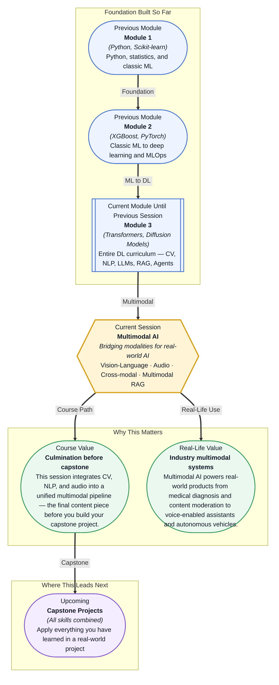

# Pre-read: Multimodal AI

## Context of This Session in the Course

You open a customer support ticket: a user uploaded a screenshot of a confusing error message, along with a voice note saying "I can't figure out what this means." The text says one thing, the image shows another, and the audio tone reveals frustration. A standard text-only support bot would miss half the signal — and a human agent would need to juggle three separate tools to piece together what is happening.

The obvious approach — handling each modality independently, then trying to stitch conclusions together afterward — breaks down fast. Text describes what the user *thinks* is wrong; the screenshot shows what *actually* happened; the voice tone reveals *how urgently* it matters. No single model today processes all three at once the way a human would. The gap is not about having separate models for each type of data — it is about creating a shared understanding across formats that feel fundamentally different. That is where **Multimodal AI** becomes essential.

What if you could build a system that reads a medical X-ray, listens to a doctor's dictated notes, and retrieves the most relevant research papers — all in a single query? That is the promise of multimodal AI. After this session, you will understand how architectures like LLaVA, Whisper, and cross-modal embeddings make this not science fiction, but a practical pipeline you can assemble yourself.

**Multimodal AI** refers to models that process and reason across multiple types of data — text, images, audio, video — within a single framework. These models do not simply pipe outputs from one specialist model into another; they learn aligned representations where a picture of a dog and the word "dog" occupy nearby regions in the same **embedding space**. Think of each modality as a different language describing the same reality. A vision-language model like **LLaVA** learns to "translate" between the language of pixels and the language of words, while **Whisper** translates audio waveforms into text. The key insight is that once everything lives in a shared embedding space, you can search across modalities — find an image by describing it, or find a text passage by humming a tune. You will explore how LLaVA and GPT-4V handle vision-language understanding, how Whisper transcribes speech with near-human accuracy, how multimodal embeddings enable cross-modal retrieval, and how to combine text and images in a RAG pipeline.

In the **previous session**, you learned how to serve ML models in production — REST APIs, vLLM for efficient LLM serving, drift detection, and monitoring dashboards. That infrastructure gives you a reliable deployment pipeline for models that process a single modality. But in the real world, users do not submit neatly tokenised text — they upload screenshots, record audio, and expect answers that draw on information from all of these sources. The serving and monitoring patterns you already know now become the foundation for something more ambitious: multimodal pipelines that fuse vision, audio, and text at inference time.

In this pre-read, you will discover:
- How to **understand** vision-language model architectures like LLaVA and GPT-4V
- How to **apply** Whisper for speech transcription
- How to **build** cross-modal retrieval systems using multimodal embeddings
- How to **connect** text and image in a RAG pipeline

---

## How Vision-Language Models Bridge Image and Text

Vision-language models solve a deceptively hard problem: how do you make a neural network understand that a photograph of a sunset and the sentence "the sun setting over the ocean" refer to the same thing? The naive approach — train a CNN for the image and an LLM for the text, then concatenate their outputs — fails because the two representations live in completely different geometric spaces. A vision-language model like **LLaVA** (Large Language and Vision Assistant) sidesteps this by using a **projection layer** that maps image features from a pre-trained vision encoder into the same embedding space as the language model's tokens. Once the image is "translated" into something the LLM can read, the model can reason about the image using all of its language understanding — answering questions, describing scenes, even following instructions that reference visual elements.

**GPT-4V** takes a similar approach but at massive scale, training on vast amounts of image-text pairs and using a sophisticated vision encoder aligned with GPT-4's decoder. The result is a model that can interpret charts, read handwritten notes, identify objects in cluttered scenes, and reason about spatial relationships. The practical takeaway is that you do not need to train a vision-language model from scratch. Pre-trained encoders (CLIP, SigLIP) and open-source projects like LLaVA give you the building blocks to add vision capabilities to any LLM pipeline with surprisingly little code.

## Why Cross-Modal Retrieval Requires Shared Embeddings

Once you have aligned image and text representations, a new superpower emerges: you can search across modalities. A **multimodal embedding** is a fixed-length vector that encodes the semantic content of any input — whether that input is a sentence, a photograph, a audio clip, or a video frame. The core idea is that conceptually similar things, regardless of their original format, should map to nearby points in this embedding space. You can then build a **cross-modal retrieval** system using the same vector database infrastructure you already explored with ChromaDB and FAISS. The difference is that your query can be an image, and the results can be text passages — or vice versa.

This has immediate practical consequences. A product search that used to require manually tagged keywords can now work by uploading a photo of a couch you saw at a friend's house and finding visually similar products from a catalogue. A medical system can take a radiology image, embed it, and retrieve relevant case studies and research papers without requiring any textual description of the image. The same embedding-based architecture that powered your text-only RAG system in a previous session now extends naturally to include images and audio — you simply add more encoder models that all project into the same vector space.

## Where Multimodal AI Appears in Real Life

**Healthcare** is one of the most impactful frontiers. Radiologists routinely examine medical images (X-rays, MRIs, CT scans) alongside clinical notes and lab reports. Multimodal models can ingest both the image and the text report, flag anomalies, and retrieve similar cases from a hospital's archive — all in one pass. Startups and research labs are already building systems that listen to a doctor's spoken observations during an examination and correlate them in real time with the imaging feed.

**Content moderation** platforms process billions of posts daily, combining text, images, and sometimes video in a single moderation decision. A hateful meme is not just a problematic image or a problematic caption — it is the combination that crosses the line. Multimodal classifiers that jointly embed the visual and textual components catch violations that separate text-only or image-only filters would miss. **E-commerce** companies use multimodal search to let customers search by image, by voice, or by a mix of both, dramatically improving conversion rates. **Autonomous vehicles** fuse camera feeds, LIDAR point clouds, and transcribed audio commands into a single situational-awareness pipeline. **Education technology** platforms are beginning to build tutors that can see a student's handwritten math work, hear their reasoning aloud, and provide targeted feedback — combining vision, speech recognition, and language generation in one feedback loop.

## What's Next

After this session, you will be able to:

- Process images alongside text using vision-language model pipelines such as LLaVA
- Transcribe and analyse speech audio with Whisper
- Build cross-modal retrieval systems using multimodal embeddings in a vector database
- Extend a RAG pipeline to accept and index image and audio inputs
- Evaluate which multimodal architecture best fits a given industry application
- Position multimodal AI as the capstone integration layer for your final project

You do not need to master every modality overnight. The goal is to see that once you understand embeddings and attention, adding a new modality is a matter of aligning representations — **not reinventing the wheel, but teaching it to speak new languages**.

## Interesting Questions for the Live Session

- When a vision-language model looks at an image and reads a caption, is it truly "understanding" or performing sophisticated pattern matching — and does the distinction matter in a production system?
- If Whisper transcribes a noisy recording at 95% accuracy and a human achieves 98%, is the remaining gap worth optimising for a customer-facing product, or is "good enough" the right bar?
- Cross-modal retrieval lets you search images using text and vice versa — what happens when a query like "apple" is ambiguous between the fruit and the company, and how should the system handle that ambiguity?
- In a multimodal RAG pipeline, how do you decide whether a retrieved image or a retrieved text passage is more relevant to the user's question, and what evaluation metrics would you use to measure success?

By the end of this session, multimodal AI should feel less like a collection of separate model types and more like a single, integrated design pattern: **align representations, then reason across them**.
