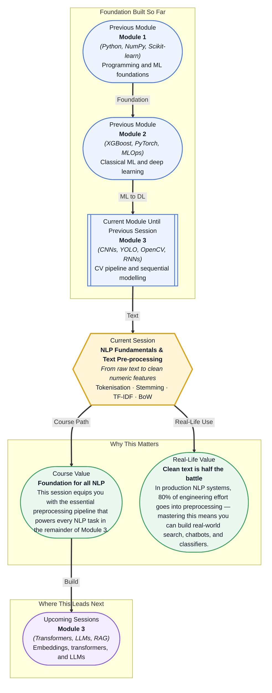

# Pre-read: NLP Fundamentals & Text Pre-processing

## Context of This Session in the Course

You receive a CSV file of 50,000 customer reviews — some in ALL CAPS, others littered with emojis, typos like "gud" and "awesooooome", and HTML tags from a broken scraper. Your job is to determine whether each review is positive, negative, or neutral. You fire up a Jupyter notebook, read the data, and within minutes you realise a brutal truth: your model sees "LOVE!!!" and "love." and "loved" as completely different words, even though a human knows they all express the same sentiment.

That is the hidden iceberg of NLP. The intuitive approach — just feed the model whatever text you have — collapses under the sheer variety of human language. Capitalisation creates false distinctions. Punctuation multiplies your vocabulary. Inflectional forms like "run", "runs", "running", and "ran" each get their own slot, diluting the signal you actually care about. Without preprocessing, your model is not learning meaning — it is drowning in surface-level noise.

That is where **NLP Fundamentals & Text Pre-processing** becomes essential. This session gives you a systematic toolkit to strip away irrelevant variation, normalise text into a consistent format, and transform messy strings into structured numeric features that machine learning models can actually learn from.

---

What if you could build a search engine that understands "running shoes" and "trainers" mean the same thing, or a chatbot that correctly interprets "lmk" and "let me know" as identical intents? What if you could take a thousand pages of legal contracts and instantly surface every clause mentioning "force majeure" — even when some say "Force Majeure" or "FM" — with perfect recall? The preprocessing techniques in this session — tokenisation, stemming, lemmatisation, and vectorisation — are the foundation every text-based system relies on. After this session, you will know exactly how to bridge the gap between raw human language and structured machine input.

---

At its core, **Natural Language Processing (NLP)** is about teaching machines to read, interpret, and generate human language. Before any model can do that, the text must be cleaned, broken into meaningful units, and converted into numbers. Think of text preprocessing as a kitchen prep station: you wash the vegetables (remove noise), chop them into bite-sized pieces (tokenisation), trim the inedible parts (stop words, stemming), and plate them in a consistent format (vectorisation). Without this prep, no recipe — no matter how sophisticated — will work.

In this session, you will explore the complete preprocessing pipeline. You will start with the **NLP task taxonomy** — understanding how classification, named entity recognition, summarisation, and translation each demand slightly different preprocessing choices. You will clean text using lowercasing, punctuation removal, and **regular expressions**. You will tokenise text at the word level and discover why modern systems prefer subword tokenisation with **Byte Pair Encoding (BPE)**. You will remove **stop words** and apply **stemming** and **lemmatisation** to collapse related word forms. Finally, you will convert cleaned text into numerical representations using **Bag of Words** and **TF-IDF**, the two foundational vectorisation techniques that power countless production NLP systems.

---

In the **previous session**, you explored **Recurrent Neural Networks (RNNs)** — why CNNs fail on sequential data, how RNNs maintain a hidden state through unrolled computation, and the vanishing gradient problem that limits their reach. You also saw that RNNs remain relevant for time series and audio processing. That session gave you the architectural lens for handling sequences. This session flips the lens: before any sequence model can process text, the raw string must be transformed into a clean, numerical representation. The preprocessing pipeline you will learn here — tokenisation, normalisation, and vectorisation — is precisely what feeds into an RNN or any NLP model. Without these steps, even the most powerful architecture has nothing meaningful to process.

---

In this pre-read, you will discover:
- How to **recognise** the NLP task taxonomy and identify the preprocessing required for each type of task
- How to **apply** text cleaning techniques such as lowercasing, punctuation removal, and regex-based normalisation
- How to **understand** the difference between word-level and subword tokenisation and why BPE has become the industry standard
- How to **build** Bag of Words and TF-IDF feature vectors from a raw text corpus using scikit-learn

---

## Why Raw Text Is Rubbish — and How Regex Cleans It Up

Consider this sentence: "I LOVED the movie!! it was AHH-MAZING 😍🔥". A human parses it instantly. A machine sees tokens that include "LOVED", "movie!!", "AHH-MAZING", and two emoji characters — each adding a unique entry to the vocabulary. If you have 50,000 such reviews, your vocabulary explodes with near-duplicates, and your model wastes capacity learning surface noise instead of actual sentiment.

This is where text cleaning enters the pipeline. **Lowercasing** collapses "LOVED" and "loved" into the same token — a trivial operation that can cut vocabulary size by 20–40% on real-world datasets. **Punctuation removal** strips exclamation marks, commas, and quotes that add no semantic value for most tasks. But the real workhorse is **regular expressions (regex)**: a pattern-matching language that lets you surgically remove URLs (`r'http\S+'`), HTML tags (`r'<[^>]+>'`), email addresses, phone numbers, and other structured noise. Regex is not just a cleaning tool — it is a precision instrument that lets you define exactly what "clean" means for your specific dataset and task. A spam classifier might keep exclamation marks (more ! → more urgent), while a news article summariser would discard them entirely.

## From Words to Numbers: Tokenisation, Stemming, and Vectorisation

Once your text is clean, you need to decide what counts as a "unit of meaning." **Tokenisation** splits text into tokens — usually words or subwords. Word-level tokenisation splits on whitespace and punctuation, producing tokens like "running", "ran", "runs" as distinct entries. **Subword tokenisation**, powered by **Byte Pair Encoding (BPE)**, starts with individual characters and iteratively merges the most frequent adjacent pairs. BPE can represent "unhappiness" as "un" + "happiness" or "un" + "happi" + "ness", allowing the model to handle rare and unseen words gracefully — which is why BPE is used in virtually every modern transformer model from BERT to GPT-4.

After tokenisation, you reduce inflectional variants using **stemming** (aggressive chopping: "running" → "run", "studies" → "studi") or **lemmatisation** (dictionary-aware: "better" → "good", "ran" → "run"). You also remove **stop words** — high-frequency tokens like "the", "is", "at" that carry little meaning — to focus the model on content-bearing terms. The final step is **vectorisation**: converting tokens into numbers. **Bag of Words (BoW)** simply counts each token's frequency per document, producing a sparse matrix where each row is a document and each column is a token. **TF-IDF (Term Frequency-Inverse Document Frequency)** improves on this by downweighting words that appear across many documents and highlighting words distinctive to specific documents. The result is a numeric matrix where every cell encodes how important a word is to a document within your corpus — ready for any machine learning model.

## Where Text Pre-processing Appears in Real Life

The preprocessing skills you build in this session power text systems across the entire technology landscape. In **search and information retrieval**, search engines like Elasticsearch preprocess queries and documents identically — lowercasing, stemming, stop word removal — so that a search for "running shoes" matches a page about "runner's footwear". In **customer support automation**, companies like Zendesk and Intercom preprocess ticket text before routing it: tokenisation and TF-IDF transform free-form complaints into feature vectors for a classifier that predicts urgency, category, and priority. In **healthcare**, clinical NLP systems preprocess electronic health records to extract medication names and diagnoses from unstructured physician notes — demanding careful lemmatisation for terms like "prescribed" and "prescribing" and regex for structured fields such as dates and dosages. In **finance**, algorithmic traders preprocess earnings call transcripts and news headlines, applying TF-IDF to surface mentions of specific companies before the market moves. And in **legal technology**, e-discovery platforms preprocess millions of litigation documents — deduplicating, normalising, and vectorising text so a search for "non-disclosure agreement" returns every relevant clause regardless of phrasing. Across every industry, the lesson is the same: the quality of your preprocessing directly determines the quality of your downstream result.

---

## What's Next

After this session, you will be able to:
- Classify an NLP task into its appropriate category and identify the preprocessing steps it requires
- Clean and normalise raw text using lowercasing, punctuation removal, and regular expressions
- Tokenise text at the word and subword level and explain the intuition behind Byte Pair Encoding
- Remove stop words and apply stemming or lemmatisation to reduce vocabulary dimensionality
- Transform a corpus into Bag of Words and TF-IDF feature matrices using scikit-learn
- Interpret the tradeoffs between different text representation techniques for downstream classification or search tasks

You do not need to memorise every NLP model right now. The goal is to see raw text not as noise, but as a signal waiting to be extracted — and you now have the tools to extract it.

---

## Interesting Questions for the Live Session

- If you lowercase everything, what information do you lose, and when might that loss matter for a task like named entity recognition?
- Why would you choose subword tokenisation over word-level tokenisation when building a translation system between English and Finnish, where words can be extremely long and compositional?
- If you remove stop words from a sentiment analysis pipeline, could you accidentally remove signal that helps detect sarcasm or emphasis?
- TF-IDF downweights words that appear in many documents — but what if "common" is domain-dependent, such as "cell" in medical journals versus "follow" on Twitter, and how would you adapt?

By the end of this session, NLP should feel less like a black box and more like a structured pipeline where you control every step: **from messy text to meaningful numbers in your hands.**