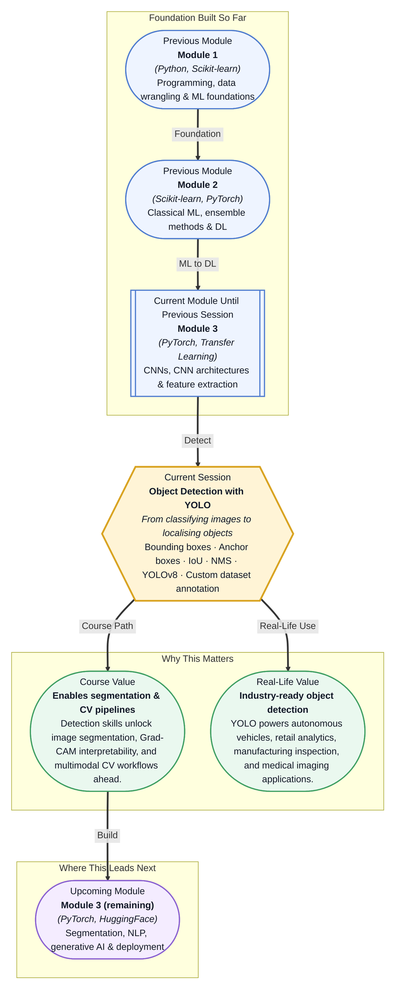

# Pre-read: Object Detection with YOLO

## Context of This Session in the Course

You are building an automated quality inspection system for a circuit board assembly line. Your camera captures thousands of boards per hour, and your model must flag any board with a missing capacitor, a misaligned resistor, or a cracked surface. The obvious first attempt is to train a classifier — pass each board image through a neural network and let it output *defective* or *pass*. But here is the problem: a classifier tells you that something is wrong, but it does not tell you *where*. On a board with two hundred components, knowing that a defect exists somewhere is far less useful than knowing that the third capacitor from the left is missing.

The deeper issue is that real-world visual tasks rarely fit the single-label-per-image mould. A self-driving car does not need to know only that a pedestrian is present — it needs to know exactly where that pedestrian is, how large they are, and how their position changes from one frame to the next. A medical imaging system does not just need a positive or negative reading for malignancy; it needs the precise coordinates of a suspicious lesion. Classification treats an image as a single data point. Detection treats it as a scene containing multiple objects, each with its own position and identity. That is where object detection — and specifically the YOLO (You Only Look Once) family of models — becomes essential.

What if you were asked to build a visual search engine for an e-commerce platform — a system where a user uploads a photo of a sofa they like, and your model detects every piece of furniture in the frame, identifies the specific sofa, and finds visually similar products from a catalogue of ten million items? The detection step is the critical enabler: without precisely locating each object in the query image, any downstream search or recommendation will fail. This session gives you the core skill — localising and identifying objects in images — that makes such a pipeline possible.

At its heart, object detection asks a question that classification does not: *where* is the object, and *what* is it? Classification takes an entire image and assigns a single label. Detection divides the image into regions, assigns each region a label, and draws a **bounding box** around every object of interest. That seemingly small shift — from one answer per image to many answers per image — introduces an entirely new set of concepts. Think of it like searching for books in a library. Classification tells you whether there is at least one book about machine learning in the building. Detection tells you that there are three such books, exactly which shelf each one sits on, and how large each book is. The "which shelf" is the bounding box; the "machine learning" is the **class label**. Now imagine doing this search simultaneously for every possible topic — that is what a detection model does every time it processes an image.

In this session, you will explore how YOLO achieves this in a single forward pass by dividing the image into a **grid of cells**, each responsible for predicting bounding boxes with associated **confidence scores**. You will learn how pre-defined **anchor boxes** give the model a head start on guessing object shapes, how **Intersection over Union (IoU)** measures the accuracy of a predicted box, and how **Non-Maximum Suppression (NMS)** eliminates duplicate detections. You will work with **YOLOv8** using the **Ultralytics** library — from annotating a custom dataset with bounding boxes to running training, validation, and inference.

In the **previous session**, you explored transfer learning — the practice of taking a neural network pre-trained on a massive dataset like ImageNet and adapting it to your own classification task. You learned how to freeze feature-extraction layers, replace the classification head, and fine-tune with a low learning rate. That workflow is powerful, but it assumes you only need one answer per image. Object detection extends the same transfer-learning principle to a much harder problem. Instead of extracting a single feature vector from the entire image, a detection model like YOLO preserves spatial information so it can answer the *where* question at every region of the image. The PyTorch skills and data-loading patterns you built over the past several sessions remain directly relevant — they simply plug into a more complex architecture. The mental model shifts from *what is this image?* to *what objects are here, and where exactly are they?*

In this pre-read, you will discover:

- How to **distinguish** classification from detection — recognising when a single label is not enough and you need bounding boxes and class labels
- How to **interpret** YOLO's grid-based architecture — connecting grid cells, anchor boxes, and confidence scores into a coherent detection pipeline
- How to **apply** IoU and Non-Maximum Suppression — the metrics and algorithms that quantify detection quality and clean up overlapping predictions
- How to **train** YOLOv8 on your own data — from annotating images with bounding boxes to running training, validation, and inference with Ultralytics

---

## Why Classification Alone Is Not Enough

A standard image classifier takes a picture and outputs a single label — dog, cat, airplane, or defective. That is useful when your image contains exactly one object of interest. But open a photograph from any busy street scene: there are pedestrians, cars, traffic lights, signs, cyclists, and buildings. A classifier trained on this image would have to pick one label and discard all other information. This limitation is not just academic. In medical imaging, a radiologist does not ask "is this scan abnormal?" — they ask "where is the abnormality and how large is it?" In autonomous driving, a vehicle must localise every pedestrian and vehicle simultaneously, not just classify the scene as "urban street."

Object detection solves this by producing a **bounding box** (x, y, width, height) and a **class label** for every object in the image, along with a **confidence score** that quantifies how sure the model is. YOLO reframes detection as a single regression problem. Instead of scanning the image with sliding windows or proposing regions and then classifying them (as earlier models like R-CNN did), YOLO looks at the image once and predicts all bounding boxes and class probabilities in a single forward pass. This "one-shot" design is what enables real-time detection at 30 frames per second or more.

## How YOLO Thinks in Grids and Anchors

To detect objects anywhere in an image, YOLO divides the input into an S×S **grid** — coarse grids in early versions, denser ones in modern YOLOv8. Each grid cell is responsible for detecting objects whose centre falls inside that cell. Because a single cell might contain multiple objects, each cell predicts several **bounding boxes**, each paired with a confidence score. That score reflects both the probability that an object exists and the accuracy of the predicted box.

Here a clever design choice comes in. Objects come in vastly different shapes — a person is tall and narrow, a car is wide and short, a traffic light is small and vertical. Instead of learning every possible shape from scratch, YOLO uses **anchor boxes** — a set of pre-defined bounding box shapes (tall rectangle, wide rectangle, square, and so on) that serve as starting templates. The model predicts offsets from these anchors rather than absolute coordinates, which makes learning faster and more stable. Each grid cell produces predictions, so a single image can generate thousands of candidate bounding boxes, many of them overlapping and predicting the same object from slightly different positions. That is where **Non-Maximum Suppression (NMS)** comes in. NMS sorts boxes by confidence, picks the highest-scoring one, and discards any other box that overlaps with it beyond a threshold set by **Intersection over Union (IoU)** — the ratio of the overlap area to the union area of two boxes. The result is a clean set of non-redundant detections.

## Where Object Detection Appears in Real Life

Object detection is not a classroom exercise — it is deployed at scale across industries today. In **autonomous vehicles**, YOLO and similar models detect pedestrians, vehicles, cyclists, and road signs in real time, often running at 30 frames per second on embedded hardware with strict latency requirements. In **manufacturing**, quality inspection systems use object detection to locate scratches, missing components, or misalignments on assembly lines, flagging defects that human inspectors might miss after hours of repetitive work. In **healthcare**, detection models localise tumours, organs, and anatomical structures in medical scans, assisting radiologists in identifying early-stage cancers that are easy to overlook.

**Retail analytics** platforms use object detection to monitor shelf stock levels, track customer movement patterns, and even detect shoplifting behaviour in real time. In **agriculture**, drones equipped with detection models scan fields to identify weeds, pests, or diseased crops, enabling targeted pesticide application instead of blanket spraying across the entire field. Each of these applications requires the same core pipeline: annotate a dataset with bounding boxes, train a detection model, evaluate its precision and recall, and deploy it to process new images. That is exactly the workflow you will practice in this session.

## What's Next

After this session, you will be able to:

- Distinguish between image classification and object detection and choose the right approach for a given visual problem
- Explain how YOLO divides an image into a grid, assigns anchor boxes, and predicts bounding boxes with confidence scores
- Evaluate detection quality using Intersection over Union (IoU) and apply Non-Maximum Suppression (NMS) to remove duplicate predictions
- Train a YOLOv8 model on a custom dataset using the Ultralytics library and interpret training metrics like mAP
- Run inference on images and videos with a trained YOLOv8 model and visualise bounding box predictions
- Annotate a custom dataset with bounding boxes and prepare it for a detection training pipeline

You do not need to memorise every architectural detail of YOLO right now. The goal is to see that object detection is not a black-box trick but a systematic process of dividing, predicting, evaluating, and refining — **you are not just teaching a model what an object looks like, but exactly where to find it.**

## Interesting Questions for the Live Session

- If two objects overlap significantly in an image, how does YOLO decide which bounding box to keep, and what happens to the discarded one during NMS?
- Anchor boxes are chosen before training based on your dataset — what would go wrong if your dataset's objects have aspect ratios that none of your pre-defined anchors come close to matching?
- YOLO divides the image into an S×S grid where each cell predicts B bounding boxes. What happens when a large object spans many grid cells — which cell takes responsibility, and is the model penalised for predictions in neighbouring cells?
- A pre-trained image classifier can be adapted to new categories through transfer learning. Can the same approach work for detection — can you fine-tune a pre-trained YOLO model to detect entirely new object categories it has never seen during training?

By the end of this session, object detection should feel less like a black-box computer vision trick and more like a systematic pipeline you can build and debug: **you are not just teaching a model what an object looks like — you are teaching it exactly where to find it.**
