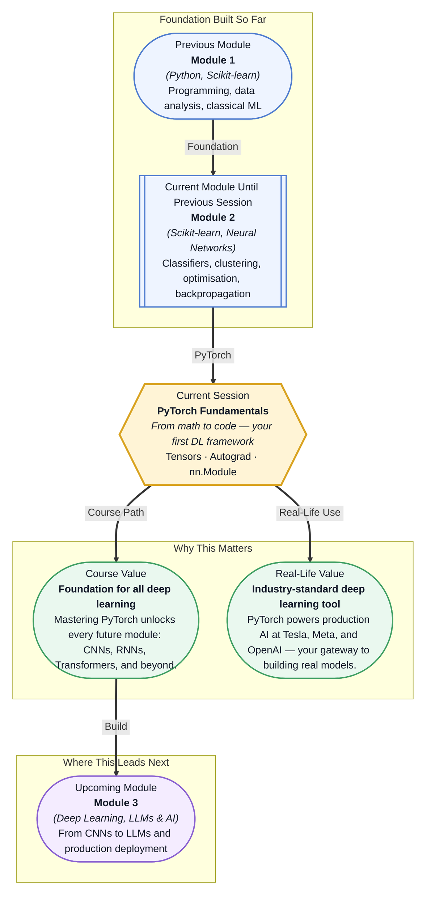

# Pre-read: PyTorch Fundamentals

## Context of This Session in the Course

You have spent weeks designing a neural network on paper — deciding how many layers, what activation functions, and how gradients will flow from the output back to the first weight. But when you sit down to code it, every line feels disconnected from the math you worked so hard to understand. The forward pass seems manageable, but the backward pass — where learning actually happens — feels like a fog of derivatives and chain rules.

The naive approach is to implement backpropagation manually, writing out each partial derivative by hand. One typo in a gradient calculation and your model silently learns nothing. Before long, the code becomes a debugging nightmare, and the real problem — building a model that actually works — gets buried under the mechanics of differentiation. You start wondering whether there is a better way to translate mathematical intuition into working code.

That is where **PyTorch** becomes essential. It is a deep learning framework purpose-built to let you focus on architecture, not calculus. Tensors replace NumPy arrays with GPU acceleration, Autograd automates every gradient computation, and nn.Module gives you a clean, reusable blueprint for building any neural network. The math you already know stays the same — PyTorch just handles the mechanics.

What if you could describe a neural network in a few lines of Python and have the framework automatically handle GPU acceleration, automatic differentiation, and weight initialisation? What if moving from an idea on paper to a working model took minutes instead of days, and you could iterate on architecture decisions as fast as you could type them? That is the shift PyTorch brings. This session is where you cross the threshold from understanding how neural networks work in theory to building them in practice — and it changes everything about how you approach deep learning.

At its core, PyTorch is built on three pillars: **tensors**, **Autograd**, and **nn.Module**. A tensor is the fundamental data structure — think of it as a NumPy array reimagined for deep learning. Tensors live on GPUs, support automatic differentiation, and are optimised for the matrix operations that power every neural network. If you already know how to slice a NumPy array or broadcast a vector, you already know most of the tensor syntax. The difference is that tensors track their own history. If tensors are the data, Autograd is the tape recorder. It watches every operation you perform on a tensor and builds a **computation graph** — a map of how every value was derived. When you call `.backward()`, PyTorch walks this graph in reverse, applying the chain rule automatically to compute gradients. This is the exact backpropagation algorithm you studied in the previous session, now handled by the framework. The third pillar, **nn.Module**, is the blueprint for building models. You declare your layers in `__init__()` — think of this as listing the components your model needs — and define the forward pass logic in `forward()`. This separation keeps your code clean, reusable, and easy to debug. Together, these three tools give you everything you need to design, train, and deploy neural networks, and you will explore each one in this session: creating and moving tensors to GPU, configuring Autograd to compute gradients automatically, and structuring models with nn.Module.

In the **previous session**, you explored backpropagation and weight initialisation — the mathematical engine that makes neural networks learn. You traced gradients through the chain rule, understood Xavier and He initialisation, and saw how small changes in weights cascade through a network to produce an error signal. That theoretical foundation now meets its practical counterpart. Autograd is the chain rule automated, executing in microseconds what would take you minutes to derive and debug. nn.Module is where you define the very layers whose weights you studied how to initialise. Every concept you mastered in that session — forward pass, backward pass, gradient flow — becomes a single, expressive line of PyTorch code today. The theory stays the same; the tooling is what changes.

In this pre-read, you will discover:
- How to **build** and manipulate PyTorch tensors, and move computations seamlessly to a GPU
- How to **learn** Autograd's approach to tracking operations and computing gradients with `.backward()`
- How to **apply** nn.Module to define neural network layers cleanly in `__init__` and `forward`
- How to **connect** the mathematical theory of backpropagation to practical, working PyTorch code

---

## Why Tensors Are Not Just NumPy on a GPU

Everything in PyTorch starts with a tensor. If you know NumPy, you already know most of the syntax — `torch.zeros()`, `torch.ones()`, `torch.randn()`, slicing, reshaping, and broadcasting all work the same way you would expect. But tensors introduce three capabilities that make NumPy arrays unsuitable for deep learning. First, **GPU acceleration**: moving a tensor to a GPU is a single `.to('cuda')` call. Once there, every operation runs in parallel across thousands of cores, turning matrix multiplications that take minutes on CPU into milliseconds. Second, tensors are the foundation of **Autograd** — every tensor can be configured with `requires_grad=True` to track its operations, building the computation graph that makes automatic differentiation possible. Third, PyTorch tensors support **dynamic computation graphs**, meaning the graph structure can change with every forward pass. This is critical for architectures where the control flow depends on the data itself, such as recurrent networks and Transformers.

This shift from static arrays to dynamic, differentiable tensors is not a minor upgrade — it is a paradigm change. With NumPy, you computed static values on a single device. With PyTorch tensors, you build live computational pipelines that accelerate on GPU, track their own derivative history, and adapt their structure as your model runs. Every line you write becomes part of a graph that PyTorch can differentiate automatically, which means you can focus on what your model should compute rather than how to compute its gradients.

## How Autograd Turns the Chain Rule into an Automated Pipeline

You have seen the chain rule in action — layer by layer, derivative by derivative, propagating an error signal from the output back to the first weight. It is elegant mathematics, but implementing it by hand is fragile and error-prone. One misplaced bracket and your gradients diverge, or worse, silently converge to the wrong value. **Autograd** is PyTorch's solution to this exact problem. When you set `requires_grad=True` on a tensor, PyTorch begins recording every operation involving that tensor in a **directed acyclic graph (DAG)**. The nodes are tensors, and the edges are the operations that produced them. When you call `.backward()` on a scalar loss, PyTorch traverses this graph backward from the loss to every leaf tensor that required a gradient, applying the chain rule at each step and accumulating the result in the `.grad` attribute.

The practical implication is profound: you never write a derivative again. You define the forward pass — what you want the model to compute — and Autograd handles the backward pass automatically. This means you can experiment freely. Try a new activation function, chain operations in a novel way, or build a branching architecture with multiple loss terms. The gradient computation adapts to whatever you define. For deep learning practitioners, this is the difference between spending your time debugging calculus and spending it designing better models.

## Where PyTorch Appears in Real Life

PyTorch is not an academic curiosity — it is the engine behind some of the most widely used AI systems in production today. **Tesla** uses PyTorch to power the computer vision models in its Autopilot and Full Self-Driving systems, processing real-time camera feeds to detect lanes, pedestrians, and obstacles with sub-second latency. **Meta** deploys PyTorch across its recommendation systems, content moderation pipelines, and the AI that personalises feeds for billions of users on Facebook and Instagram. In **healthcare**, PyTorch models analyse medical images — X-rays, CT scans, and MRIs — to detect tumours, fractures, and anomalies with accuracy that matches or exceeds experienced radiologists. **Financial institutions** use PyTorch for fraud detection, algorithmic trading, and risk modelling, where the ability to train custom architectures on proprietary data provides a measurable competitive advantage. In **natural language processing**, almost every major language model — from OpenAI's GPT series to Meta's LLaMA and Google's Gemma — either runs on PyTorch or supports it through the HuggingFace ecosystem, which is built entirely on top of this framework.

Learning PyTorch in this session opens the door to every one of these domains. The same `Tensor`, `Autograd`, and `nn.Module` patterns you will practice today are what engineers at the world's leading technology companies use to build, train, and deploy production AI systems.

## What's Next

After this session, you will be able to:
- Create PyTorch tensors of various shapes and data types, and move them between CPU and GPU
- Perform tensor operations including slicing, reshaping, and matrix multiplication
- Configure Autograd with `requires_grad` and compute gradients using `.backward()`
- Inspect gradient values through the `.grad` attribute and understand when they accumulate
- Define a custom neural network module by subclassing `nn.Module` and implementing `forward()`
- Structure a model with layers in `__init__()` and the forward pass logic in `forward()`

You do not need to memorise every tensor operation or Autograd detail right now. The goal is to see deep learning frameworks as what they are — programmable tools, not black boxes — and to believe that you can write the code that makes a network learn.

## Interesting Questions for the Live Session

- What happens to the computation graph when you call `.detach()` on a tensor — and when would this be essential in a real training loop?
- If you accidentally define a trainable parameter inside `forward()` instead of `__init__()`, will Autograd still track it, and what practical problems would this cause?
- How does PyTorch's define-by-run approach differ from TensorFlow's static graph, and what does this mean for debugging complex architectures like Transformers?
- When you call `.to('cuda')` on a model, which tensors actually move to the GPU, and which ones stay on CPU — potentially creating an invisible performance bottleneck?

By the end of this session, PyTorch should feel less like a black-box framework and more like a programmable engine for gradient-based learning: **Your model is just code — and code you can write.**
