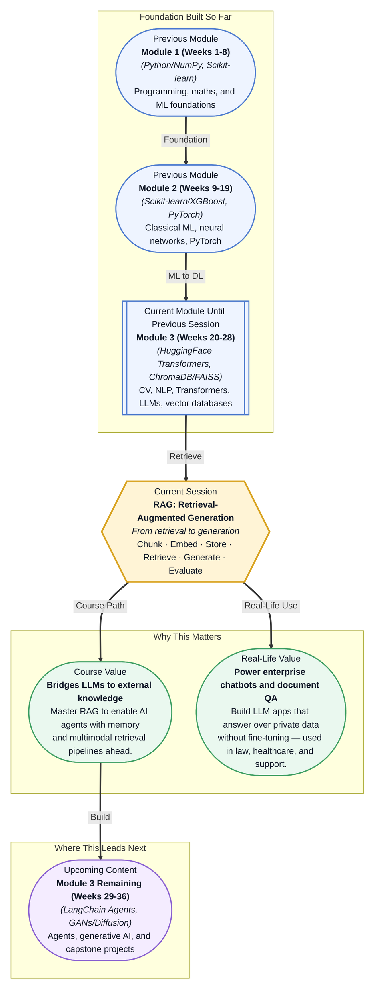

# Pre-read: RAG: Retrieval-Augmented Generation

## Context of This Session in the Course

You have just been handed a 500-page technical manual and told to build a chatbot that answers customer questions from it — instantly, accurately, and with citations you can verify. No pressure. The manual covers everything from installation to troubleshooting obscure error codes, and customers ask questions in a dozen languages, using their own words, not the manual's table of contents. Your first instinct might be to dump the whole manual into a prompt and ask an LLM to answer from memory. But you already know that context windows have hard limits, and even the longest context model will lose track of details buried on page 473.

The deeper problem is more subtle. An LLM trained six months ago has no knowledge of the latest product update described in chapter 12. Fine-tuning the model on the manual would be expensive, slow, and need to be redone every time the manual changes. Even if you could fit everything into context, the model would struggle to locate the precise paragraph needed for each query, and it would have no mechanism to tell you which source it used. The naive approach — stuff everything into a prompt and hope — fails because it confuses memorisation with retrieval, treating the LLM as both a storage system and an answer engine. What you need is a system that keeps the LLM as a reasoning engine but offloads the storage and retrieval of facts to an external knowledge base that it consults on demand.

That is where **Retrieval-Augmented Generation (RAG)** becomes essential.

---

**What if** you could deploy an AI assistant that answers questions from your company's entire knowledge base — thousands of internal documents, support tickets, engineering specs, and product manuals — without ever retraining or fine-tuning a model? What if that assistant could cite its sources, stay up to date the moment a document is added, and gracefully admit when it does not have the answer? Organisations from legal firms to healthcare providers are building exactly this capability: a support agent that searches past tickets before responding, a research tool that reads recent papers before answering a clinical question, or an onboarding assistant that pulls from the latest HR policies. RAG is the architecture that makes this possible, and this session gives you the practical blueprint to build it yourself.

RAG works by splitting documents into manageable pieces, converting each piece into a vector embedding, storing those embeddings in a vector database, retrieving the most relevant pieces for a given question, and feeding only those pieces to an LLM as context for generation. Each step — **chunking**, **embedding**, **storing**, **retrieving**, and **generating** — introduces design decisions that directly impact the quality of the final answer. The **chunking strategy** determines whether the retrieved context is coherent or fragmented; the **embedding model** determines whether semantically relevant passages are captured; the **retriever** determines whether the right chunks reach the LLM; and the **generation step** determines whether the output is faithful to the retrieved information. Think of it as building a research assistant who does not just read everything in the library but decides which three books to pull off the shelf every time you ask a question, reads only the relevant chapters, and writes you a concise answer with page numbers attached. The assistant is only as good as its ability to choose the right books.

The specific tools and techniques you will explore in this session follow this same logic. You will compare **fixed-size chunking** (slicing documents into equal-length pieces) against the **recursive character splitter** (splitting at natural boundaries like paragraph breaks and sentence ends), each with different tradeoffs for retrieval quality. You will use **LangChain** — the leading framework for building LLM-powered applications — and its abstractions for **Documents**, **TextSplitters**, **Retrievers**, and **Chains** that wire retrieval and generation together. You will also learn how to **evaluate RAG** outputs using metrics like **faithfulness** (does the answer stay true to the retrieved context?) and **answer relevance** (does the answer actually address the question?), and you will diagnose **common RAG failure modes** — such as retrieving irrelevant chunks, missing the right chunk entirely, or generating a hallucination despite having correct context — along with practical strategies to fix each one.

---

In the **previous session**, you built vector databases and performed semantic search using embedding models, cosine similarity, ChromaDB, and FAISS. You learned to convert text into dense vector embeddings, store them in a searchable collection, and retrieve the most semantically similar documents for any query. That capability is the retrieval engine at the heart of every RAG pipeline. Without it, RAG is impossible — you have no way to find the right information. With it, you have everything you need except the final step: connecting retrieved documents to an LLM so that it generates grounded, contextual answers. This session completes that connection, turning semantic search from a standalone retrieval tool into the first stage of a combined retrieval-and-generation system. The vector database work from session 28.1 becomes the retrieval component inside the LangChain pipeline you will build here.

---

In this pre-read, you will discover:

- How to **build** a complete RAG pipeline from document chunking through generation
- How to **apply** different chunking strategies and understand their impact on retrieval quality
- How to **connect** vector databases and LLMs using LangChain's Retriever and Chain abstractions
- How to **evaluate** RAG outputs for faithfulness and answer relevance

---

## Why Your Chunking Strategy Shapes Everything

The first decision in any RAG pipeline is how to cut your documents into pieces. It seems mundane, but chunking is the most impactful design choice you will make because it determines what the retriever can find. **Fixed-size chunking** slices every document into chunks of exactly N characters, often with a small overlap between consecutive chunks to preserve context across boundaries. It is simple, predictable, and easy to implement — but it has a serious weakness: it can split a sentence in half, separate a question from its answer, or sever a paragraph's opening claim from its supporting evidence. When the retriever returns a chunk that starts mid-sentence and ends mid-thought, the LLM receives fragmented context and is more likely to hallucinate or produce an incoherent answer. The **recursive character splitter** solves this by splitting at natural separators — first trying paragraph breaks (`\n\n`), then sentence boundaries (`.` or `!` or `?`), then word boundaries — before falling back to character-level splits only when necessary. This produces chunks that are semantically coherent, because they respect the document's own structure. The tradeoff is that chunk sizes become variable, and you lose the tidy predictability of fixed-length splits. Choosing between these strategies depends on your document type: dense legal contracts benefit from recursive splitting that keeps clauses intact, while highly structured log data may work fine with fixed-size chunks. Getting this decision right can mean the difference between a RAG system that sounds informed and one that sounds confused.

## How LangChain Wires Retrieval to Generation

Once your documents are chunked and their embeddings are stored in a vector database, you need a way to connect the retrieval step to the LLM generation step. This is where **LangChain** becomes indispensable. LangChain provides a set of abstractions that turn the RAG pipeline from ad-hoc glue code into a modular, composable architecture. A **Document** in LangChain is simply a piece of text with associated metadata — the chunk content plus fields like source filename, page number, or section heading that later appear as citations. A **TextSplitter** implements the chunking logic; LangChain's `RecursiveCharacterTextSplitter` and `CharacterTextSplitter` are ready-to-use implementations of the strategies described above. A **Retriever** wraps a vector database and exposes a simple `get_relevant_documents(query)` method that hides the details of embedding the query, searching the index, and returning the top-K results. And a **Chain** composes these pieces together: it takes a user question, passes it to the retriever, formats the retrieved documents into a prompt, sends that prompt to an LLM, and returns the generated answer. LangChain's `RetrievalQA` chain is the canonical implementation of this pattern. What makes this architecture powerful is that each piece is swappable — you can replace the chunking strategy, switch vector databases, or change the LLM without rewriting the surrounding pipeline. This modularity means you can iterate on each component independently, which is exactly what you need when you are debugging why a RAG system returns poor answers.

## Where RAG Appears in Real Life

RAG has rapidly become the default architecture for any application that needs an LLM to answer questions grounded in specific, up-to-date, or private data. **Customer support** teams deploy RAG-powered chatbots that search past tickets and knowledge base articles before responding, so answers reflect the latest product changes and known issues without requiring model retraining. A customer asking about a recently introduced bug gets an answer drawn from the engineering team's incident report, written hours ago, not from the model's training data from last year. **Legal and compliance** departments use RAG to analyse contract repositories and regulatory documents — a lawyer can ask "What are our indemnification obligations under the new supplier agreement?" and receive an answer synthesised from the relevant clauses across dozens of contracts, each one cited by document name and page number. In **healthcare**, RAG systems help clinicians surface relevant research by querying across PubMed, clinical trial databases, and internal hospital records, grounding answers in peer-reviewed evidence. **Enterprise knowledge management** has seen the fastest adoption: internal wikis, HR policy documents, product documentation, and engineering runbooks are all being wired into RAG pipelines so that employees can ask natural-language questions and get answers with source citations instead of hunting through folder hierarchies. Even **code documentation assistants** use RAG — a developer asking "How do I implement rate limiting in our FastAPI service?" retrieves relevant code snippets from internal repositories, official docs, and Stack Overflow, then synthesises a response tailored to the project's existing patterns. Across every use case, the common thread is the same: RAG lets you keep your LLM fixed while your knowledge base evolves, which is the closest thing to a free lunch in production AI.

## What's Next

After this session, you will be able to:

- Chunk documents using fixed-size and recursive character splitting strategies, and explain how chunk size affects retrieval quality
- Use LangChain's Document, TextSplitter, Retriever, and Chain abstractions to compose a modular RAG pipeline
- Connect a ChromaDB or FAISS vector store to an LLM through a retrieval chain that cites its sources
- Evaluate RAG outputs for faithfulness to the retrieved context and relevance to the original question
- Diagnose and fix common RAG failure modes including missing context, irrelevant retrieval, and hallucination

You do not need to memorise every LangChain API or vector database parameter right now. The goal is to understand RAG as a mental model — a modular architecture you can debug, tune, and trust: **retrieve what matters, generate what is needed.**

---

## Interesting Questions for the Live Session

- When should you prefer recursive character splitting over fixed-size chunking, and what tradeoff are you making between chunk coherence and retrieval precision?
- If a RAG system retrieves irrelevant context but still generates a plausible-sounding answer, is the failure in retrieval or generation — and how would you isolate which component to fix?
- How would you evaluate a RAG pipeline when there is no ground-truth answer for the user's query, and what proxy signals could you use to measure quality?
- Can RAG completely eliminate hallucination, or does it just shift the risk from the LLM to the retriever — and how do you defend against both failure modes?

By the end of this session, RAG should feel less like a black-box pipeline and more like a modular architecture you can debug, tune, and trust: **retrieve what matters, generate what is needed.**
