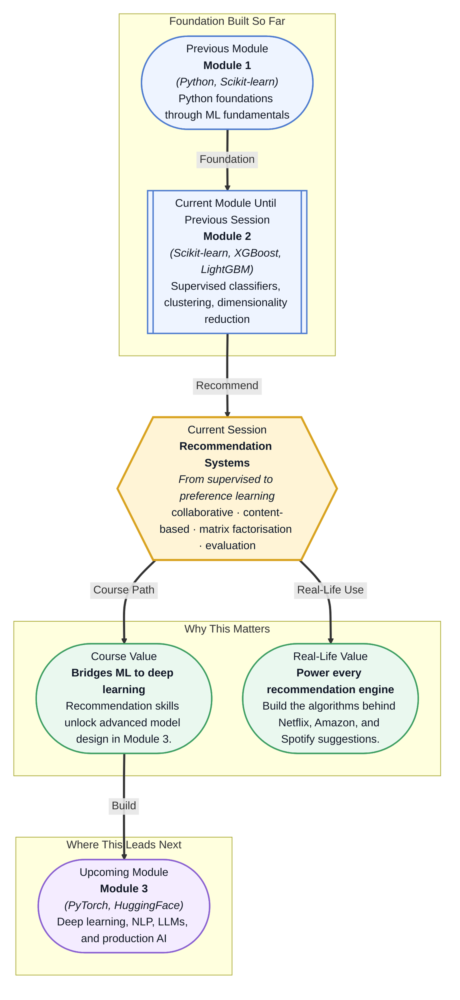

# Pre-read: Recommendation Systems

## Context of This Session in the Course

You open Netflix on a Friday evening, and the homepage already knows: a row of sci-fi thrillers, a documentary you did not know you wanted, and that anime series your friend mentioned. You have not typed a single search query. The platform guessed — and it guessed well. Behind that seemingly effortless experience is a mathematical engine that has learned what you like from the faintest of signals: a pause, a scroll, a click.

Now imagine building that engine from scratch. The obvious approach — show every user the same popular titles — ignores what makes each person's taste unique. But the moment you attempt personalisation, you run into a brutal data problem: most users have rated, watched, or bought only a tiny fraction of the available catalogue. Your data matrix is almost entirely empty. How do you infer preferences for the 99.9% of items a user has never touched? That gap between what you observe and what you need to predict is the core challenge that **Recommendation Systems** are designed to resolve. By the end of this session, you will see how algorithms can read meaning from sparse data, discover hidden patterns of taste, and turn a near-empty grid into a personalised experience.

What if you were asked to design the recommendation engine for a new e-commerce platform launching next quarter? You have historical purchase data, product categories, and click logs — but no explicit ratings, no "likes," no thumbs up. You need to surface personalised product suggestions that increase conversion, handle millions of users and products, and deliver results in milliseconds during a browsing session. The platform's success depends on whether customers feel understood. This session gives you the toolkit to turn that raw data into intelligent, scalable recommendations.

At its core, a recommendation system is a structured answer to a single question: given what we know about a user and what we know about available items, which items are most likely to matter to this person right now? The answer takes three classic forms. **Collaborative filtering** relies on the behaviour of other users — if people like you enjoyed these items, you probably will too. **Content-based filtering** ignores other users entirely and instead matches items against a user's own historical preferences based on item attributes — recommending action movies because you have watched action movies before. **Hybrid methods** combine both, borrowing the strengths of each to cover the other's blind spots. Think of this as the difference between asking friends for recommendations (collaborative) versus reading book blurbs in a genre you already love (content-based). Over the course of this session, you will explore the **user-item matrix** and the **sparsity problem** that makes most entries unknown, **market basket analysis** for discovering item associations from transaction data, **matrix factorisation** via **SVD** and **ALS** that uncovers latent features beneath sparse ratings, the tradeoff between **item-based and user-based collaborative filtering**, and the **evaluation metrics** — **precision@k**, **recall@k**, and **NDCG** — that tell you whether your recommendations are actually useful.

In the **previous session**, you explored **anomaly detection** — spotting Isolation Forest outliers, statistical Z-score anomalies, and data points that break the pattern. That was a detection mindset: find what does not belong. Recommendation Systems flip the framing entirely. Instead of searching for what is unusual, you now search for what is personally relevant. Where anomaly detection asks "is this point different from the norm?", a recommendation system asks "is this item aligned with this user's unique preferences?" The mathematical rigour you developed around distance metrics, neighbourhoods, and evaluation under uncertainty carries directly into collaborative filtering and matrix factorisation, but the goal shifts from exception-finding to preference prediction.

In this pre-read, you will discover:
- How to **understand** the three main types of recommendation systems — collaborative filtering, content-based, and hybrid approaches.
- How to **build** a user-item matrix and recognise the sparsity problem that makes recommendations challenging.
- How to **apply** matrix factorisation techniques like SVD and ALS to uncover latent user and item features.
- How to **evaluate** recommendation quality using precision@k, recall@k, and NDCG.

---

## Why the User-Item Matrix Is Never Full

The raw material of every recommendation system is the **user-item matrix** — a giant grid where rows are users, columns are items, and each cell holds an interaction signal: a rating, a click, a purchase, or a watch. In any realistic system, the overwhelming majority of these cells are empty. A Netflix user has watched perhaps a few hundred titles out of tens of thousands; an Amazon customer has bought dozens of products out of millions. This is the **sparsity problem**, and it is not a minor implementation detail — it is the defining structural challenge of the field. If the matrix were dense, you could simply look up what a user liked and recommend the same category. But because it is sparse, you must infer preferences from indirect evidence.

**Market basket analysis** offers one elegant workaround. Instead of looking at user-item ratings, you analyse which items tend to appear together in transactions. If customers who buy pasta almost always buy tomato sauce, the system can recommend sauce to anyone who adds pasta to their cart — even if that user has never rated either product. This is association-rule mining, and it works well for e-commerce baskets but breaks down when items are rarely purchased together or when user preferences are more nuanced than simple co-occurrence. For those deeper signals, you need a method that learns latent structure across the entire matrix.

**Matrix factorisation** — using techniques like **SVD** (Singular Value Decomposition) and **ALS** (Alternating Least Squares) — addresses sparsity by compressing the giant user-item matrix into two smaller, denser matrices: one representing users in a low-dimensional "taste space" and one representing items in that same space. If the original matrix has a million users and a hundred thousand items, factorisation might reduce it to a million users by 20 features and a hundred thousand items by 20 features. Each user and each item is now a 20-number vector. Multiplying a user vector by an item vector gives a predicted rating — effectively filling the empty cells with educated guesses. The beauty is that the 20 features are not hand-designed; the algorithm discovers them from the data. They might correspond to "how action-oriented" or "how artistic" a movie is, but they emerge purely from rating patterns.

## Collaborative Filtering: Wisdom of the Crowd, One Neighbourhood at a Time

**Collaborative filtering** is the most intuitive and widely deployed recommendation paradigm. The core idea is simple: find users whose tastes resemble yours, look at what they liked that you have not seen, and recommend those items. The challenge is defining "resemble." **User-based collaborative filtering** computes similarity between users — typically using cosine similarity or Pearson correlation on their shared rated items — then aggregates recommendations from the K most similar neighbours. **Item-based collaborative filtering** flips the geometry: instead of finding similar users, it finds items that are similar to the ones a user already liked, based on how other users have rated them. If most users who loved *Inception* also loved *Interstellar*, then the system learns that those two movies are neighbours, and it can recommend *Interstellar* to anyone who just watched *Inception*.

The item-based approach tends to be more practical at scale. User-user similarity must be recomputed as new ratings arrive, and the neighbourhood of any given user changes constantly. Item-item similarity, by contrast, is relatively stable — the relationship between two movies shifts only when a significant number of new users rate both. This means item-item similarities can be precomputed offline and served instantly, making it the algorithm of choice for Amazon and other large retailers. But both approaches share a fundamental limitation: they rely on the overlap in the data. If two users have never rated any of the same items, their similarity cannot be measured, and the recommendation fails — a problem known as the **cold start**. That is where hybrid systems and matrix factorisation step in, using content features or latent factors to bridge the gap when behavioural data is thin.

## Where Recommendation Systems Appear in Real Life

Recommendation systems are not a niche academic topic — they are the invisible layer that drives engagement across the most widely used digital products on the planet. Every major industry that connects people to a large catalogue of choices now depends on some form of recommendation algorithm. Streaming platforms like Netflix and Spotify use collaborative filtering and matrix factorisation to surface movies, shows, and songs that match a user's taste profile, continuously learning from play history, skips, and saves to refine suggestions. E-commerce giants such as Amazon deploy item-based collaborative filtering at colossal scale — every "Customers who bought this also bought" row is powered by precomputed item similarities drawn from millions of purchase patterns. Social media platforms like TikTok and Instagram rely on a hybrid of collaborative signals (what users with similar engagement patterns liked) and content-based features (video metadata, caption keywords) to populate personalised feeds that keep users scrolling. In financial services, recommendation engines suggest relevant investment products or credit offers based on spending behaviour and demographic similarity, while news aggregators and content platforms use them to decide which articles appear on your homepage. Even healthcare is beginning to adopt recommendation logic — suggesting clinical trials to patients or research papers to clinicians based on profile similarity and content matching. Across all these domains, the underlying mathematics remains the same: a sparse matrix, a similarity measure or factorisation technique, and an evaluation framework that ensures the recommendations are not just accurate but truly useful.

## What's Next

After this session, you will be able to:

- Distinguish between collaborative filtering, content-based, and hybrid recommendation approaches and select the right one for a given scenario.
- Construct and analyse a user-item matrix, identifying sparsity levels and their impact on recommendation quality.
- Apply matrix factorisation using SVD and ALS to uncover latent user and item features from sparse interaction data.
- Implement item-based and user-based collaborative filtering and explain the tradeoffs between neighbourhood size and recommendation diversity.
- Evaluate recommendation lists using precision@k, recall@k, and NDCG to measure relevance and ranking quality.
- Interpret association rules from market basket analysis to surface item co-occurrence patterns in transactional data.

You do not need to implement a production-grade recommendation engine from scratch right now. The goal is to see recommendations as a preference prediction problem — not a search problem, not a popularity contest, but a structured inference task: **given sparse signals, find what a user will value most.**

## Interesting Questions for the Live Session

- When the user-item matrix is 99% empty, how does matrix factorisation still manage to produce meaningful recommendations without overfitting to the few known ratings?
- If you had to build a recommendation system for a news website where user preferences shift daily, would you choose user-based or item-based collaborative filtering — and why?
- Why is NDCG considered a more informative metric than precision@k for ranking tasks, and what does it capture that precision alone misses?
- Market basket analysis sometimes reveals unexpected associations — like the famous "diapers and beer" correlation — but what does that tell us about the difference between correlation and causation in recommendation outputs?

By the end of this session, recommendations should feel less like a black box and more like a structured preference prediction problem: **given sparse signals, find what a user will value most.**
