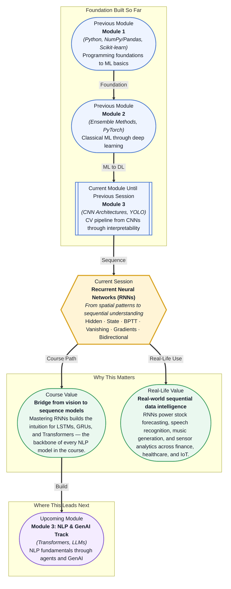

# Pre-read: Recurrent Neural Networks (RNNs)

## Context of This Session in the Course

You feed the last 60 days of stock prices into a neural network, hoping it will predict tomorrow's opening value. The model performs respectably on individual days but keeps missing the broader downtrend — because it treats each day's price as an independent snapshot, never connecting the sequence. This is the blind spot of architectures designed for spatial data: they see isolated frames, not the story unfolding between them.

The real world does not deliver information in neatly independent packages. Language unfolds word by word, music note by note, sensor readings tick by tick. When you lose the connection between consecutive inputs, you lose the meaning of the sequence itself. A CNN that excels at classifying cats versus dogs will flounder when asked to predict the next word in a sentence — convolution assumes local spatial structure, not temporal dependency. The naive fix of stacking more layers does not help, because the fundamental assumption — that input elements are independent — is baked into the architecture.

Recurrent Neural Networks were built to solve exactly this problem: architectures that maintain an internal memory of what they have seen so far, update it at every step, and use that accumulated context to drive better predictions. That is where **Recurrent Neural Networks (RNNs)** become essential.

What if you could build a model that reads a sentence and detects the sentiment before reaching the last word, by tracking how each word shifts the emotional context? What if that same architecture could forecast electricity demand for the next week by learning from years of hourly meter readings, or transcribe a lecture by following how each phoneme flows into the next? These are not separate problems requiring different toolkits — they are all sequence modelling tasks, and the RNN provides a unified mental framework for tackling them. By the end of this session, the machinery of hidden states and unrolled computation will be the lens through which you see any ordered data.

At its core, a **Recurrent Neural Network** is distinguished from a feedforward network by one critical addition: the **hidden state**. Think of the hidden state as a running notebook that the network carries from one time step to the next. At each step, the network reads a new input, consults its notebook, updates it with fresh information, and passes it forward. Unlike a CNN where every image is processed independently from scratch, an RNN builds an evolving internal representation of the sequence it has seen so far.

To visualise this, consider the **unrolled computation** of an RNN. If your input is a sentence of ten words, the network "unrolls" into ten copies of itself — one per word — each sharing the same weights but receiving its own input and passing a hidden state to the next copy. This parameter sharing is what makes RNNs efficient: the same transformation is applied at every position, learning patterns that generalise across a sequence of any length. The **forward pass** is simply this loop — input in, hidden state updated, output produced — repeated for as many steps as the sequence requires.

This elegance comes with a catch. During training, gradients must flow backward through every time step in a process called **backpropagation through time (BPTT)**. For long sequences, these gradients can shrink exponentially as they travel back, making it nearly impossible for the network to learn dependencies that span many steps. This is the **vanishing gradient problem**, the primary reason vanilla RNNs struggle with long-range patterns. **Bidirectional RNNs** offer a partial remedy by reading the sequence both forward and backward, giving the network access to past and future context at every step — particularly useful for tasks like named entity recognition where a word's meaning depends on what comes after it.

In the **previous session**, you built heatmaps with Grad-CAM to see exactly which regions of an image a CNN focuses on when making a classification decision — a technique for interpreting spatial feature importance in convolutional architectures. You learned to ask _where_ a vision model is looking, and whether that makes sense.

Now you are taking a step orthogonal to that: from space into time. Where a CNN slides a kernel across a two-dimensional grid, an RNN steps through a one-dimensional sequence, maintaining a hidden state that acts as an accumulating memory. The interpretability habit you practised with Grad-CAM — always question what your model actually knows — carries forward, but the question changes. Instead of "where is it looking?" you will ask "what does it remember, and how far back does that memory reach?" The tools shift from filters and feature maps to hidden states and unrolled graphs, but the deeper discipline remains the same.

In this pre-read, you will discover:

- How to **understand** why CNNs fail on sequential data and why sequences demand a different architectural approach
- How to **discover** how RNNs unroll through time with a hidden state that carries memory forward across steps
- How to **recognise** the vanishing gradient problem and why it makes training deep RNNs fundamentally challenging
- How to **apply** bidirectional RNNs and identify where RNNs remain the tool of choice in production today

---

## Why CNNs Cannot Handle Sequences Alone

Convolutional networks are built on a powerful assumption: local spatial patterns matter, and their position within the input is roughly fixed. A cat's ear is defined by the pixels around it, and that ear pattern works whether the ear is in the top-left or bottom-right of the image, because the convolution kernel slides everywhere. But language and time series violate this assumption in two ways. First, the "features" in a sequence are not locally independent — the meaning of a word depends on the entire preceding sentence, not just the adjacent words. Second, sequences have variable lengths, and a CNN's fixed receptive field cannot adapt when the relationship between distant elements matters more than nearby ones.

A naive attempt to apply a CNN to text would involve treating each word as a one-hot vector, arranging them into a 2D grid, and sliding kernels across them. This works for short, fixed-length phrases but collapses on real sentences where a crucial referent like "it" may appear twenty words after its antecedent. The convolution kernel simply does not stretch that far without stacking dozens of layers, and even then the signal attenuates. This is not a shortcoming of CNNs per se — it is a mismatch between the architecture's spatial inductive bias and the fundamentally temporal nature of sequences. The insight you should carry forward is that every architecture encodes assumptions about the structure of its input, and choosing the right architecture means choosing the right assumptions.

## The Hidden State: How RNNs Remember Across Time

An RNN solves the sequence problem by adding a recurrent connection: at every time step, the network takes the current input and combines it with a **hidden state** vector that encapsulates everything it has seen so far. This hidden state is a learned, high-dimensional representation of the sequence history. If the sequence is "The cat sat on the," the hidden state after processing the word "sat" should encode not just the word "sat" but the context that the subject is "the cat." The same network weights are applied at every time step — this is the **parameter sharing** that distinguishes RNNs from feedforward networks and lets them generalise across sequences of any length.

The forward pass equation for a basic RNN is deceptively simple: \( h_t = \tanh(W_h \cdot h_{t-1} + W_x \cdot x_t + b) \). The new hidden state is a tanh-activated combination of the old hidden state and the new input. In practice, this means the network must learn to compress an ever-growing history into a fixed-size vector. For short sequences — say, fewer than twenty steps — this works remarkably well. For longer sequences, the compression becomes lossy, and the vanishing gradient problem during training makes it hard for the network to decide which past information to retain.

**Bidirectional RNNs** address one aspect of this limitation by processing the sequence twice: once left-to-right and once right-to-left. The hidden states from both directions are concatenated at each time step, so the representation of a word in a sentence includes both its left context and its right context. This is not a cure for vanishing gradients, but it is a practical workaround for tasks like part-of-speech tagging or question answering, where the full context — past and future relative to the current position — significantly improves accuracy. The key takeaway is that even a simple RNN introduces a powerful idea: a network with memory that persists across inputs, a concept you will see refined in LSTMs and GRUs in the very next session.

## Where RNNs Still Thrive in Practice

While Transformers have largely replaced RNNs for language modelling, RNNs remain the practical choice in several domains where the data is naturally sequential and the sequence lengths are moderate. **Time series forecasting** is the most prominent example: financial tick data, electricity load, weather measurements, and industrial sensor readings all arrive as continuous, fixed-frequency streams. RNNs and their gated variants (LSTMs, GRUs) are standard tools for this because they natively handle the temporal ordering without the quadratic attention cost of Transformers. A manufacturing plant monitoring vibration data from rotating machinery might deploy a lightweight RNN directly on edge hardware, where a Transformer would be too memory-intensive.

**Audio processing** is another stronghold. Raw audio waveforms, spectrograms, and mel-frequency cepstral coefficients are sequential by nature. Speech recognition systems — including early versions of Siri and Google Voice — relied on RNNs to map acoustic frames to phonemes before the hybrid Transformer models of the 2020s arrived. Even today, RNNs are used in music generation, real-time voice synthesis, and keyword spotting on low-power devices like smartphones and smart speakers. **Anomaly detection in logs and system metrics** also favours RNNs: server logs are sequences of events, and an RNN can learn normal operational patterns and flag deviations without the latency overhead of loading a large Transformer. In healthcare, RNNs process electrocardiogram (ECG) and electroencephalogram (EEG) signals to detect arrhythmias or seizure activity, where each millisecond matters and model size must fit within clinical hardware constraints. The lesson is that newer is not always better — RNNs remain deployed precisely where their simplicity, parameter efficiency, and temporal inductive bias give them an edge over more complex alternatives.

## What's Next

After this session, you will be able to:

- Explain why CNNs are fundamentally unsuited for sequential data and articulate the spatial-versus-temporal inductive bias tradeoff
- Trace the hidden state through unrolled time steps on a whiteboard, showing how input, hidden state, and output interact at each step
- Identify the vanishing gradient problem by examining gradient magnitudes during backpropagation through time
- Contrast unidirectional and bidirectional RNNs and choose the appropriate variant for a given sequence task
- Recognise real-world settings — time series, audio, sensor analytics — where RNNs still outperform Transformers in practice

You do not need to derive the backpropagation through time equations from memory right now — the notebooks will walk through every step during the session. The goal is to leave with a clear mental model: **sequences remember, but only as far as their gradients allow.**

## Interesting Questions for the Live Session

- If an RNN's hidden state is a fixed-size vector, how does the network decide what to keep and what to forget as the sequence grows longer?
- A bidirectional RNN concatenates forward and backward hidden states — does this mean the network is "cheating" by seeing the future, and under what circumstances is that acceptable?
- The vanishing gradient problem is often described as gradients shrinking exponentially — what would happen if they grew exponentially instead, and how would you detect that in training logs?
- Stock price prediction is a classic RNN demo, yet few trading firms actually deploy vanilla RNNs for this task — what properties of financial time series make them harder than the textbook examples suggest?

By the end of this session, RNNs should feel less like an exotic architecture and more like a natural response to a simple question — what if your network had a memory? — and a gateway to understanding why that idea alone was not enough: **sequences are everywhere once you learn to see the hidden state.**
