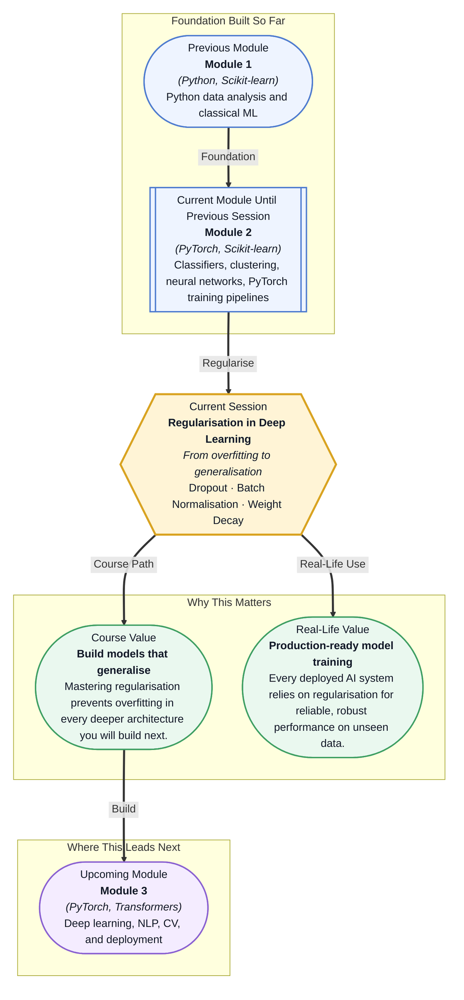

# Pre-read: Regularisation in Deep Learning

## Context of This Session in the Course

You have just trained a deep neural network that achieves 98% accuracy on your validation set. You deploy it to production and within hours the predictions start drifting — the model stumbles on examples that look nearly identical to its training data. Your network did not learn general patterns. It memorised the training set, quirks and all.

Every deep learning practitioner confronts this moment. Large neural networks with millions of parameters are powerful enough to memorise noise, outliers, and coincidences in the training data. The very strength that makes deep learning so expressive — huge parameter counts — is also its Achilles' heel when it comes to generalisation. The naive approach of simply training longer or adding more layers makes the problem worse, not better.

This is the problem that Regularisation in Deep Learning solves. Dropout, batch normalisation, and weight decay are not optional extras. They are the tools that turn a brittle, memorising network into a robust, generalising one. That is where **Regularisation in Deep Learning** becomes essential.

What if you could train a deep network with hundreds of layers on a modest dataset and still have it generalise to production data with confidence? What if you could accelerate training time by a significant margin while simultaneously making your model more resistant to overfitting? Regularisation techniques like dropout, batch normalisation, and weight decay turn this from a wish into a repeatable engineering practice. After this session, you will know exactly how to configure each one and when to use them together.

At its heart, regularisation is any technique that discourages a model from learning overly complex patterns that exist only in your training data. Think of it as the difference between a student who memorises answers to practice problems and one who understands the underlying principles. The memoriser passes the practice test and fails the real exam. The principled learner generalises. You have already encountered L1 and L2 regularisation in linear models during Module 1. In deep learning, these ideas expand into more powerful and specialised tools. **Dropout** randomly turns off a fraction of neurons during each forward pass, preventing any single neuron from becoming a crutch that others rely on. **Batch Normalisation** re-centres and re-scales the inputs to each layer, allowing you to use higher learning rates and train deeper networks without suffering from vanishing or exploding gradients. **Weight decay** — implemented as L2 regularisation inside optimisers like AdamW — gently penalises large weights, encouraging the network to spread its learning across all parameters. Together, these three techniques form the standard regularisation toolkit for modern deep learning, and you will encounter them in every PyTorch model you build from this point forward.

In the **previous session**, you built a complete training loop in PyTorch: defining a model with `nn.Module`, computing loss, calling `backward()`, and stepping with an optimiser. You mastered the `zero_grad → forward → loss → backward → step` cycle that drives learning. That training loop is the engine of deep learning, and regularisation is its steering wheel. Without it, the engine drives blindly — memorising training data instead of learning general patterns. The optimisers you configured, such as SGD with momentum and Adam, become even more powerful when you add weight decay, and the training loop you built is exactly where dropout and batch normalisation layers integrate: as modules in your network definition and as settings in your optimiser configuration. What you learned about learning rate schedulers and early stopping in the previous session complements regularisation perfectly — early stopping is itself a form of regularisation, and batch normalisation pairs naturally with higher learning rates.

In this pre-read, you will discover:
- How to implement dropout layers and understand why they prevent co-adaptation
- How to apply batch normalisation to accelerate and stabilise deep network training
- How to configure weight decay as L2 regularisation inside optimisers like AdamW
- How to diagnose overfitting and select the right regularisation strategy for your model

---

## Why Dropping Neurons Strengthens Your Network

Imagine a team where every member cross-checks their work with every other member before making a decision. The team becomes efficient, but individual members grow dependent on each other — if one person leaves, the whole process breaks down. That is co-adaptation in a neural network: neurons learn to rely on the outputs of specific other neurons, creating brittle, interdependent features. **Dropout** breaks this pattern by randomly setting a fraction of neuron outputs to zero during each training pass. On any given forward pass, each neuron has a probability `p` of being dropped. This forces every neuron to learn useful features independently, because it can never count on the same neighbours being present.

The elegance of dropout is that it effectively trains an exponentially large ensemble of subnetworks while only maintaining a single set of weights. At inference time, you keep all neurons active and scale their outputs by the keep probability `1-p`, which approximates averaging over all the ensemble members. This is why dropout models generalise so well: they have effectively learned to make predictions by consensus rather than by a single brittle pathway. In practice, you will use PyTorch's `nn.Dropout` layer with dropout rates between 0.2 and 0.5, typically placed after activation functions in fully connected layers and at lower rates in convolutional layers. The key insight is that dropout is a training-only technique — you must call `model.eval()` during inference to deactivate it, or your predictions will be randomly muted.

## How Batch Normalisation Both Normalises and Accelerates

As a network trains, the distribution of inputs to each layer shifts constantly because the previous layer's parameters keep updating. This phenomenon, called **internal covariate shift**, forces layers to continuously adapt to a moving target, slowing down convergence and making training unstable, especially in deep networks. Batch normalisation solves this by normalising each layer's inputs to have zero mean and unit variance across the current mini-batch, then applying a learned scale and shift through trainable parameters gamma and beta. The normalisation step constrains the layer inputs to a stable distribution, while the learned parameters allow the network to undo the normalisation if that is optimal for the task.

The practical impact is dramatic. Batch normalisation allows you to use much higher learning rates, which accelerates training by a factor of five to ten in many architectures. It also has a regularising effect: the noise introduced by using mini-batch statistics rather than global statistics acts similarly to dropout, reducing the need for other regularisation techniques. In PyTorch, you insert `nn.BatchNorm1d` or `nn.BatchNorm2d` between a linear or convolutional layer and its activation function. One critical detail is that batch norm behaves differently during training and evaluation — during training it uses batch statistics, and during evaluation it uses running averages accumulated during training. Failing to switch between `model.train()` and `model.eval()` is one of the most common sources of mysterious prediction errors in deployed models.

## Where Regularisation Appears in Real Life

Every production deep learning system depends on regularisation, and the three techniques in this session appear across fundamentally different industries. In **medical imaging**, dropout is standard in diagnostic CNNs that detect tumours or lesions from X-rays and MRIs — these models train on relatively small labelled datasets, making them especially prone to memorisation, and dropout rates as high as 0.5 are common in the fully connected layers that make the final classification. In **autonomous vehicles**, batch normalisation is non-negotiable in the deep perception networks that process camera and LiDAR data in real time, because it keeps training stable across the hundreds of convolutional layers needed to understand a driving scene, and its acceleration effect means models can be iterated faster in simulation. In **large-scale recommendation systems** at companies like YouTube and Netflix, weight decay in the AdamW optimiser is used to keep embedding vectors from growing too large, which directly controls overfitting on user interaction data that is inherently sparse and noisy. The same AdamW configuration powers fine-tuning of large language models — when you adapt a BERT or GPT model to a specific task, weight decay applied only to non-bias and non-norm parameters is the standard practice that prevents catastrophic forgetting while allowing the model to specialise. In **quantitative finance**, where models are trained on historical market data that never repeats exactly, practitioners combine all three techniques aggressively, knowing that any model that fits past price movements too closely is guaranteed to fail on future market regimes. Across every one of these domains, the mental model is the same: regularisation is the discipline that separates models that work in the lab from models that work in the world.

## What's Next

After this session, you will be able to:
- Add dropout layers to PyTorch models and tune the dropout probability to match your overfitting level
- Insert batch normalisation layers into any network and observe faster convergence during training
- Configure weight decay in AdamW and SGD optimisers to apply L2 regularisation with decoupled decay
- Diagnose overfitting by comparing training and validation loss curves and adjusting regularisation accordingly
- Combine multiple regularisation techniques to achieve the best generalisation for your architecture

You do not need to memorise every regularisation formula right now. The goal is to understand regularisation as a strategic choice: every technique trades a little training accuracy for a lot of generalisation power.

## Interesting Questions for the Live Session

- If dropout randomly kills neurons during training but not during inference, how does the network still make coherent predictions at test time without those neurons?
- Batch normalisation forces layer inputs to a fixed mean and variance — if a network can learn any distribution, why does this normalisation help rather than limit the model's expressiveness?
- Weight decay and L2 regularisation are mathematically equivalent in simple SGD, but how do they differ when applied through adaptive optimisers like AdamW?
- Is it possible to over-regularise a network, and what would that look like in terms of the gap between training and validation loss?

By the end of this session, regularisation should feel less like arbitrary training tricks and more like principled tools for controlling model capacity: **The best model is not the one that fits the data hardest, but the one that generalises most broadly.**
