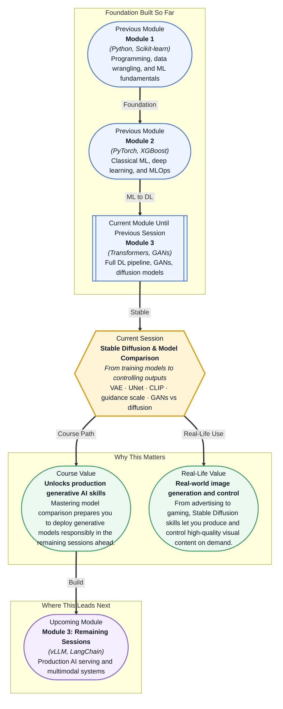

# Pre-read: Stable Diffusion & Model Comparison

## Context of This Session in the Course

Your team's marketing campaign is due in three days. The designer created one hero image — a sleek black smartwatch on a marble surface — and now needs it adapted for thirty different email variants: different backgrounds, different wristbands, different lighting moods. You have a generative model, but every time you tweak the prompt, you cross your fingers, hoping the watch does not turn into an abstract blob. The pressure is real: the campaign goes live whether the images are ready or not.

The GAN you have deployed is fast — one forward pass and you get an image. But controlling what it generates is like driving a car with no steering wheel. Mode collapse means the model cycles through the same three outputs regardless of what you type. There is no way to say "more blue" or "less reflection" without retraining. And when you do retrain, the training is notoriously unstable: the generator and discriminator fall out of balance, and you spend hours debugging loss curves instead of shipping images. The naive approach — train a GAN for every style you need — does not scale.

That is where **Stable Diffusion & Model Comparison** becomes essential. This session gives you a generative architecture built on three specialised components — a VAE, a UNet, and a CLIP text encoder — that together give you predictable, text-steerable image generation. And it arms you with a framework for comparing GANs and diffusion models so you can choose the right tool for every production scenario.

What if your team asked you to build an internal tool that lets non-technical stakeholders generate on-brand marketing visuals on demand, with no hand-holding from engineering? What if that system had to handle diverse prompts — from photorealistic product shots to illustrated banner ads — while guaranteeing brand-consistent outputs and avoiding inappropriate generations? This is not a hypothetical. Companies from Canva to Adobe have built exactly this, and the architecture beneath their tools is Stable Diffusion or one of its variants. This session gives you the mental model to understand how that pipeline works, how to control it, and how it compares to the GANs you studied previously.

At its core, **Stable Diffusion** is a text-to-image generative model that combines three specialised neural networks: a **VAE** (Variational Autoencoder) that compresses images into a compact latent space and reconstructs them back, a **UNet** that denoises a latent representation step by step, and a **CLIP text encoder** that translates your text prompt into a numerical conditioning signal the UNet can follow. The key insight is that the expensive denoising happens in the compressed latent space, not in pixel space — which is what makes Stable Diffusion dramatically faster than earlier diffusion models. Think of the VAE as a high-quality image compressor: it shrinks a 512x512 pixel image into a 64x64 latent grid, keeping only the essential visual information. The UNet then acts like a sculptor working on this compressed representation, guided by the CLIP embedding — the text description — to gradually remove noise and reveal a coherent image. The CLIP encoder is the translator: it converts your words into a vector that encodes semantic meaning, ensuring the UNet knows what "a red sofa in a bright room" looks like. In this session, you will explore the full Stable Diffusion architecture, understand how the **guidance scale** controls how closely the output follows your prompt, learn how **negative prompts** let you specify what to avoid, and develop a framework for **comparing GANs vs diffusion models** across three critical axes: image quality, training stability, and generation speed.

In the **previous session**, you explored **Diffusion Models**, learning how the forward process adds Gaussian noise to an image until it becomes pure noise, and how a UNet learns to reverse this process — denoising step by step to generate a new image from random noise. You understood the mechanics of the diffusion process and the role of the UNet as the denoising backbone. Stable Diffusion builds directly on this foundation. Where session 31.1 treated the UNet as a standalone denoising network operating in pixel space, this session introduces the VAE to move the diffusion into a latent space (making it efficient), and the CLIP text encoder to condition the denoising on text (making it controllable). The UNet you already know becomes one part of a three-component pipeline — your prior knowledge of how denoising works is exactly what you need to understand why the latent approach is so effective.

In this pre-read, you will discover:
- How the VAE, UNet, and CLIP text encoder collaborate in the Stable Diffusion architecture.
- How guidance scale and negative prompts give you fine-grained control over generated outputs.
- How to compare GANs and diffusion models across quality, stability, and speed.
- How to recognise which generative approach is best suited for a given real-world task.

---

## How VAE, UNet, and CLIP Work Together to Generate Images

The Stable Diffusion pipeline is a three-stage assembly line, and each stage has a distinct responsibility. The **VAE** encoder takes an image and compresses it into a smaller latent representation, discarding high-frequency pixel noise while preserving the semantic structure. This latent representation is roughly 48 times smaller than the original image, which means the subsequent denoising network has far fewer dimensions to process. After denoising, the **VAE decoder** reconstructs the latent back into a full-resolution image. Without the VAE, the UNet would have to operate directly on millions of pixels, making the process impractically slow.

The **UNet** is the heart of the denoising process. It takes a noisy latent and predicts the noise that needs to be subtracted, iteratively refining the latent over a schedule of timesteps. What makes it special is its architecture: a contracting path that captures high-level context, followed by an expanding path that restores spatial detail, connected by skip connections that preserve fine-grained information from earlier layers. The UNet in Stable Diffusion is also conditioned on the timestep and on the CLIP embedding — it knows not only what step of denoising it is on, but also what the final image should look like according to your text prompt.

The **CLIP text encoder** is what makes text-to-image generation possible. It maps your prompt — "a photograph of a golden retriever sitting on a red velvet chair, natural lighting" — into a high-dimensional vector that captures the semantic content of the description. This vector is injected into the UNet through cross-attention layers, where it influences which features are amplified or suppressed at each spatial location. The quality of this text conditioning is what separates Stable Diffusion from unconditional diffusion models: you are not just generating random images; you are generating images that match a description.

## Guidance Scale and Negative Prompts: Steering the Output

Once you have a text-conditioned diffusion model, you face a practical question: how strongly should the model follow the prompt? A prompt like "a cat" should produce a cat, but what if the model interprets it too loosely and generates a cat-like blob? This is where the **guidance scale** — also called classifier-free guidance (CFG) scale — comes in. During training, the model learns to denoise both with and without the text conditioning. At inference time, you can interpolate between the unconditional prediction (no prompt guidance) and the conditional prediction (full prompt guidance). The guidance scale controls how far you push the prediction toward the conditional direction. A scale of 1 means no guidance; a scale of 7–12 is typical for high-quality generation; a scale above 20 often leads to oversaturated, artificial-looking images because the model is being pushed too far from its learned distribution.

**Negative prompts** are the complementary control mechanism. You provide a second text prompt that describes what you do not want: "blurry, low quality, extra limbs, ugly, deformed." The model then denoises while simultaneously moving away from the negative prompt's embedding. In practice, this is implemented by computing the unconditional prediction using the negative prompt instead of an empty string, and then using the guidance scale formula to push the prediction away from the negative embedding and toward the positive one. The result is remarkably effective: a single negative prompt can eliminate common artifacts, improve composition, and steer the model away entire style categories.

The tradeoff between prompt adherence and output diversity is fundamental. A high guidance score produces images that match the prompt exactly but can feel repetitive and over-processed. A low guidance score yields more creative and diverse outputs but may miss key prompt details. Mastering this tradeoff — knowing when to turn the dial up for precision and when to turn it down for exploration — is one of the most practical skills you will develop in this session.

## Where Generative Models Appear in Real Life

Generative image models have moved from research papers to production systems faster than almost any other AI technology. In **advertising and marketing**, teams use Stable Diffusion to generate thousands of personalised product shots — the same sneaker in forty different colourways, each placed in a contextually appropriate scene — without a single photoshoot. In **game development and film**, concept artists use diffusion models to rapidly iterate on character designs, environments, and mood boards, compressing what used to be weeks of sketching into hours of prompt engineering. The **fashion and e-commerce** industry has embraced virtual try-ons and catalogue generation, where a single garment image can be transplanted onto models of different body types, poses, and backgrounds, all controlled through text prompts. In **medical imaging**, diffusion models are used for data augmentation — generating synthetic but realistic MRI or CT scans of rare conditions to balance training datasets where certain pathologies are underrepresented. And in **architecture and interior design**, professionals generate visualisations from rough text descriptions, allowing clients to see a "modern living room with floor-to-ceiling windows and warm wood accents" before a single line is drawn. Across all these domains, the same core skills apply: understanding the architecture, controlling the output through guidance scale and negative prompts, and knowing when a fast GAN or a high-quality diffusion model is the right tool for the job.

## What's Next

After this session, you will be able to:
- Explain how the VAE, UNet, and CLIP text encoder collaborate in the full Stable Diffusion pipeline.
- Adjust the guidance scale and craft negative prompts to control image generation outcomes.
- Compare GANs and diffusion models across image quality, training stability, and inference speed.
- Choose between GAN-based and diffusion-based approaches for a given production requirement.
- Trace the complete text-to-image generation process from prompt embedding to decoded output.
- Recognise when generative image models are being used in real-world products and how they are deployed.

You do not need to implement a diffusion model from scratch right now — the pre-trained pipeline is available through libraries like HuggingFace Diffusers. The goal is a clear mental model of how these components fit together so you can wield them with confidence and adapt as the technology evolves.

## Interesting Questions for the Live Session

- If the CLIP text encoder produces a text embedding, but the UNet expects conditioning at specific spatial resolutions, how does the architecture bridge that gap — and what information could be lost in translation?
- Guidance scale amplifies the difference between conditional and unconditional predictions. What happens to inter-sample diversity when you set the scale to 15 versus 4, and why?
- GANs generate images in a single forward pass, while diffusion requires many iterative steps. In what production scenario would you accept the training instability of a GAN to gain that speed advantage?
- A negative prompt like "blurry, low quality, cartoon" might suppress unwanted styles, but could it also suppress legitimate features your positive prompt requested? How would you detect and correct for this?

By the end of this session, the internal workings of Stable Diffusion should feel less like a black box and more like a controllable instrument: **you describe, the model renders, and you steer the result.**
