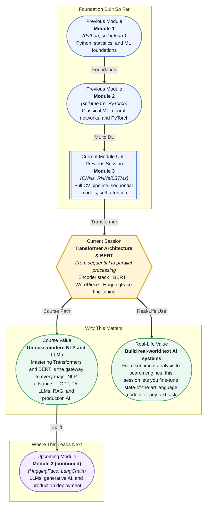

# Pre-read: Transformer Architecture & BERT

## Context of This Session in the Course

You are building a customer support chatbot for an e-commerce company. Your users write reviews like "The shoes are great but the size runs small — I would recommend ordering half a size up." A human reading this knows the review is positive overall with a specific caveat. But how does a machine learn to distinguish the sentiment about the product from the sentiment about the sizing, and understand that the second half is advice, not complaint? Now imagine doing this for ten thousand reviews per day across dozens of product categories, each with its own vocabulary and nuance.

Traditional approaches fall apart quickly. A bag-of-words model cannot tell you that "great" modifies "shoes" while "small" modifies "size" — it sees only a jumbled word count. An LSTM can track sequence, but it reads one word at a time, and by the time it reaches "size runs small," the signal from "great" at the start has faded. More fundamentally, these models treat each word as a lookup in an embedding table — they have no way to adjust a word's meaning based on the words around it. The word "run" in "size runs small" means something completely different from "run" in "run a query," yet a static embedding gives it the same representation.

The breakthrough came from asking a different question entirely: instead of compressing a sentence into a single fixed vector, what if a model could dynamically decide which words are relevant to which other words, and re-represent every word based on its context? That is where the **Transformer architecture** and **BERT** become essential.

What if you could take a pre-trained language model that already understands English grammar, semantics, and even some world knowledge — trained on billions of words — and adapt it to your specific task in under an hour, with just a few hundred labelled examples? What if the same model could switch between classifying news articles, extracting names from medical records, and answering customer questions, with only a few lines of code changed between tasks? That is the paradigm shift that **fine-tuning a Transformer model** unlocks, and this session is where you learn to do it.

The **Transformer** is a neural network architecture that processes entire sequences in parallel using a stack of encoder layers. Each layer contains two subcomponents: a **self-attention** mechanism (which you explored in the previous session) and a **feed-forward** network, wrapped with **layer normalisation** and residual connections. Stacking these layers creates a deep representation where each token's encoding is iteratively refined by attending to every other token across the entire sequence. **BERT** — Bidirectional Encoder Representations from Transformers — is a specific Transformer model pre-trained on a clever self-supervised task: it randomly masks 15% of the words in a sentence and learns to predict them from the surrounding context. This **masked language model** pre-training forces BERT to build deep, bidirectional representations that capture meaning far richer than traditional static word embeddings. To turn text into numbers BERT uses a **WordPiece** tokeniser that splits rare words into frequent subword units, and it marks up its input with special tokens: `[CLS]` at the start (whose final representation is used for classification) and `[SEP]` to separate sentences. In this session you will take a pre-trained BERT model from the **HuggingFace Model Hub**, fine-tune it on a text classification dataset using the **HuggingFace Trainer** API, and push your trained model back to the hub — a complete workflow that mirrors how NLP is done in production today.

In the **previous session**, you uncovered the self-attention mechanism — how Query, Key, and Value vectors let each token directly attend to every other token, how scaled dot-product attention and softmax convert those scores into relevance-weighted representations, and how multi-head attention and positional encoding give the model its expressive power. That mechanism is the engine inside every encoder layer. This session takes that single-layer intuition and shows you how it composes into a full, deep encoder stack — and then goes beyond the architecture to show you BERT, a concrete, pre-trained model you can download, fine-tune, and deploy.

In this pre-read, you will discover:
- How to **understand** the three components of the Transformer encoder stack: self-attention, feed-forward networks, and layer normalisation.
- How to **recognise** BERT's masked language model pre-training as a self-supervised learning objective that captures bidirectional context.
- How to **apply** the HuggingFace Trainer API to fine-tune BERT for text classification tasks.
- How to **connect** the HuggingFace Model Hub workflow — loading pre-trained models and pushing trained ones — to real-world NLP pipelines.

---

## How the Encoder Stack Builds Representations Layer by Layer

Each encoder layer in a Transformer follows the same recipe: apply multi-head self-attention, add the original input (a residual connection), run layer normalisation, then pass through a feed-forward network, and add and normalise again. Why this specific recipe? The self-attention sub-layer lets every token gather information from every other token — but it is a linear transformation followed by a weighted sum, which limits the complexity of what each token can express. The feed-forward network that follows applies a non-linear transformation independently to each position, allowing the model to project the attended information into a richer, higher-dimensional space. Without the feed-forward layers, stacking more attention layers would just keep mixing the same linear combinations. The **residual connections** (adding the input of each sub-layer to its output) solve a practical training problem: they give gradients a direct highway back to earlier layers, which is what lets Transformers stack dozens of layers without vanishing gradients. And **layer normalisation** stabilises training by re-centring and re-scaling the activations at each position independently. Together, these components form a single encoder layer. Stack them 12 times (as in BERT-base) or 24 times (BERT-large), and each layer refines the representation further — early layers learn surface patterns like part-of-speech and syntax, middle layers learn semantic roles, and deeper layers learn task-specific or discourse-level relationships.

## Why BERT's Masked Language Model Learns Deeper Than Word Embeddings

Before BERT, the dominant approach to getting good text representations was to use pre-trained word embeddings like Word2Vec or GloVe: you loaded a static vector for each word, froze them, and trained everything else on top. The limitation is fundamental — "bank" has the same embedding whether it appears in "river bank" or "savings bank," and the model has no mechanism to adjust it. BERT solves this through a pre-training strategy called **masked language modelling**: during pre-training on a massive corpus, 15% of tokens in each input sequence are randomly replaced with a `[MASK]` token, and the model is trained to predict the original token using the bidirectional context from both left and right. This is radically different from traditional language models, which read left-to-right and only have access to previous tokens. Because BERT sees the full context on both sides of the masked word, its representations become genuinely bidirectional — the representation of "bank" in "river bank" is influenced by "river" on its left, while in "savings bank" it is influenced by "savings." The masked language model objective is self-supervised, meaning no human-labelled data is required for pre-training; BERT was pre-trained on the entire English Wikipedia and the BooksCorpus (roughly 3.3 billion words) using nothing but the text itself. The resulting pre-trained model captures grammar, semantics, factual knowledge, and even some reasoning ability — all encoded into the weights you download from the HuggingFace Model Hub. When you then fine-tune on a smaller labelled dataset, you are not training from scratch; you are gently adjusting a model that already understands language to specialise in your specific task.

## Where Transformer Models and BERT Appear in Real Life

The encoder stack you will learn in this session is not an academic curiosity — it is deployed in production across nearly every industry that processes text at scale. Google Search has used BERT since 2019 to understand the intent behind one in ten queries, making search results dramatically more relevant for ambiguous or conversational questions. In healthcare, models like PubMedBERT and BioBERT — BERT variants fine-tuned on biomedical literature — are used to extract diagnoses, medications, and treatment outcomes from electronic health records, enabling clinical decision support systems that can read a patient's history and flag relevant patterns. Financial services firms fine-tune Transformer models on SEC filings, earnings call transcripts, and news articles to automate sentiment analysis for trading signals and to detect suspicious activity in transaction descriptions. In legal technology, companies use fine-tuned BERT models to review contracts at scale, identifying clauses related to indemnification, termination, or data privacy across thousands of pages — a task that would take a human lawyer weeks. And in customer experience, virtually every major chatbot and support ticketing system now uses a fine-tuned Transformer model to route tickets, classify intent, and generate responses. The common thread across all of these applications is the workflow you will practice in this session: load a pre-trained model, tokenise your text with the right tokeniser, fine-tune on your labelled data, and deploy. That reusable pattern is why mastering this session pays dividends no matter which direction your career takes.

## What's Next

After this session, you will be able to:
- Explain how the Transformer encoder stack — self-attention, feed-forward, layer norm, and residual connections — composes into a deep language understanding architecture.
- Describe BERT's masked language model pre-training objective and why bidirectional context produces richer representations than static embeddings.
- Tokenise input text using BERT's WordPiece tokeniser with `[CLS]` and `[SEP]` special tokens.
- Fine-tune a pre-trained BERT model for text classification using the HuggingFace Trainer API.
- Load a model from the HuggingFace Model Hub and push a fine-tuned model back to the hub.
- Recognise when to fine-tune a pre-trained encoder versus training a model from scratch for a downstream task.

You do not need to implement the Transformer encoder from scratch in this session — the HuggingFace library handles the heavy lifting. The goal is to develop a clear mental model of what happens inside those layers so that when you fine-tune BERT, you understand what you are adjusting and why it works.

## Interesting Questions for the Live Session

- The Transformer encoder processes all tokens in parallel, but self-attention still computes pairwise interactions — does this mean the encoder is truly "bidirectional" in the same sense as a bidirectional RNN, or is there a meaningful difference in how context flows?
- BERT randomly masks 15% of tokens during pre-training — what would change if you masked 50% of tokens instead, or if you never masked tokens at all and simply tried to reconstruct the input?
- WordPiece can split a word into subwords like ["un", "happi", "ness"] — how does the tokeniser decide the subword vocabulary in the first place, and what happens when it encounters a completely unseen Unicode character?
- When fine-tuning BERT for classification, the `[CLS]` token's final hidden state is passed through a small classification head — what assumptions does this pooling strategy make, and could you design a better one using attention pooling over all token representations?

By the end of this session, the Transformer should feel less like a black-box architecture and more like a modular system you can reason about: **Self-attention gathers information, feed-forward networks transform it, and stacking layers refines the representation — fine-tuning lets you redirect all of that toward your specific task.**
