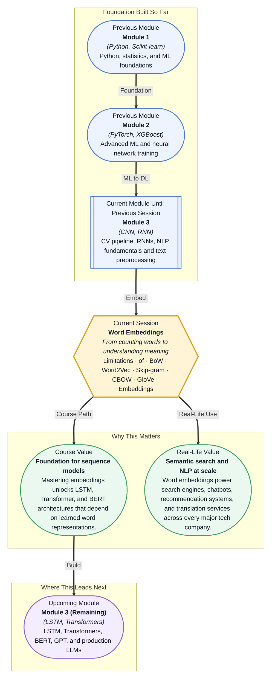

# Pre-read: Word Embeddings

## Context of This Session in the Course

You type "king" into a search engine, and it returns results for "monarch," "sovereign," and "royalty" — even though you never typed those words. How does a machine know that these words are related? It has never met a king, never read a history book, yet it connects words by meaning as if it understands language. This is not magic, and it is not hard-coded synonym lists. It is the result of one of the most elegant ideas in modern NLP: word embeddings.

If you tried to represent words using the **Bag of Words** approach you encountered in the previous session, every word is an isolated island. "King" is just a column in a sparse matrix, equally distant from "queen" and "carrot." The representation captures nothing about meaning, connotation, or relationships. Worse, the matrix grows with every new word in your vocabulary — a corpus with 50,000 unique words produces a 50,000-dimensional vector for each document, most of which are zeros. This sparsity is computationally wasteful and semantically barren. BoW can tell you which words appear in a document, but it cannot tell you what those words mean.

Dense **word embeddings** solve this problem by representing each word as a short, continuous vector — typically 50 to 300 dimensions — where distance in vector space corresponds to semantic similarity. Words that appear in similar contexts end up near each other: "king" and "queen" cluster together, while "king" and "carrot" sit far apart. More remarkably, these vectors capture analogies through simple arithmetic. That is where **Word Embeddings** becomes essential.

---

What if you could build a system that reads a product review and understands that "this phone is amazing" and "this phone is fantastic" convey the same sentiment, without being explicitly told that "amazing" and "fantastic" are synonyms? What if your model could infer that a user who liked "The Matrix" would also like "Inception," not because they share genre tags, but because the words "mind-bending," "simulation," and "reality" form a semantic neighbourhood that both movies inhabit? Every modern NLP application — search, translation, chatbots, recommendation systems — depends on this ability to map words into a meaning space. This session gives you the key to that space.

---

A **word embedding** is a dense, low-dimensional vector that encodes the meaning of a word. Unlike one-hot vectors — where "king" is represented as `[0, 0, 0, 1, 0, …]` with a single 1 and thousands of zeros — an embedding might look like `[0.32, −0.87, 1.54, 0.06, …]`, where every dimension captures some learned aspect of the word's usage. These dimensions do not have human-readable labels (Dimension 7 is not "royalty"), but their geometric arrangement encodes meaning with surprising precision.

Think of it like a map of a city. A one-hot encoding is like giving someone the name of a street without any coordinates — they know the street exists, but not where it is or what surrounds it. An embedding is like giving them GPS coordinates: you can measure distance, find nearby locations, and even navigate between them. The most famous example of this geometry is **Word2Vec**'s `king − man + woman = queen`, where subtracting "man-ness" from "king" and adding "woman-ness" yields "queen" — a vector operation that captures a genuine semantic relationship. You will explore how this works through two training paradigms: **Skip-gram**, where the model predicts surrounding words from a target word, and **CBOW** (Continuous Bag of Words), where the model predicts a target word from its surrounding context. You will also work with **pre-trained GloVe embeddings**, which are learned from global word-word co-occurrence statistics across massive corpora, and learn to load them for immediate use. Finally, you will see how **PyTorch's Embedding layer** lets you plug learned word representations directly into neural networks for downstream tasks like text classification.

---

In the **previous session**, you built a complete NLP preprocessing pipeline: cleaning text, tokenising sentences, removing stop words, applying stemming and lemmatisation, and converting documents into Bag of Words and TF-IDF vectors. You learned to turn raw text into numerical features that a machine can process. That pipeline gave you sparse, high-dimensional vectors where each dimension corresponds to a specific word in the vocabulary. Word embeddings transform those sparse, symbolic representations into dense, semantic ones. Instead of a 50,000-dimensional vector with one non-zero entry per word, you will work with a 300-dimensional vector where every entry carries information. The tokenisation and vocabulary-building skills from the previous session remain essential — you still need to map words to indices — but the representation itself shifts from counting to understanding.

In this pre-read, you will discover:

- How to **recognise** the limitations of Bag of Words and why sparse representations fail to capture meaning
- How to **understand** the Word2Vec intuition and the surprising algebra of word vectors
- How to **compare** Skip-gram and CBOW as two different learning objectives for training embeddings
- How to **apply** pre-trained GloVe embeddings and PyTorch's Embedding layer in downstream models

---

## Why King − Man + Woman = Queen: The Algebra of Meaning

When Word2Vec was published in 2013, it stunned the NLP community with a demonstration: take the vector for "king," subtract the vector for "man," add the vector for "woman," and the result is closer to "queen" than to any other word in the vocabulary. This was not a parlor trick — it revealed that word embeddings learn a structured coordinate system where semantic relationships correspond to vector offsets. The offset "man minus woman" captures the gender dimension; applying it to "king" shifts the vector along that same dimension to produce "queen." Similarly, "Paris minus France plus Italy" lands near "Rome," and "walking minus walk plus swam" lands near "swimming." The model learns these relationships without any explicit supervision about synonyms, analogies, or hierarchies. It learns them from one signal alone: which words tend to appear near each other in text.

The mechanism behind this is surprisingly simple. Word2Vec scans a large corpus with a sliding window — typically 5 to 10 words on each side of a target word. For each occurrence of "king," the words that appear nearby (crown, throne, monarch, palace) become its context. The model's job is to adjust the vector representations so that words sharing similar contexts end up close together in the embedding space. After processing billions of words, the vectors naturally organise into a semantic map where relationships emerge as consistent vector offsets. This is not symbolic AI with hand-crafted rules; it is meaning emerging from statistical patterns of co-occurrence.

## Skip-gram vs CBOW: Two Ways to Learn Word Vectors

Word2Vec offers two distinct training objectives, and choosing between them depends on your data and goals. **Skip-gram** treats each target word as a puzzle: given the target word "king," predict which words are likely to appear in its context. For each occurrence of "king" in the corpus, the model is shown the target word and asked to assign high probabilities to its actual context words (crown, throne) and low probabilities to randomly sampled negative examples (carrot, database). This approach excels when you have limited training data or when you care about rare words, because Skip-gram updates the embedding of the target word based on each individual context word, giving more exposure to infrequent vocabulary.

**CBOW** (Continuous Bag of Words) reverses the direction: given the context words (crown, throne, monarch, palace), predict the target word "king." It averages the context word vectors together and tries to guess the missing middle word. CBOW is faster to train and works well on large corpora with frequent words, because it uses multiple context words to make a single prediction, smoothing the learning signal. In practice, Skip-gram produces better quality embeddings for smaller datasets and rare words, while CBOW trains more quickly on massive corpora with common vocabulary. Both methods produce the same kind of output — a dense vector for every word in the vocabulary — but they arrive at it through complementary learning strategies. You will also encounter **GloVe** (Global Vectors), which takes a different approach: instead of scanning local context windows, it builds a global word co-occurrence matrix and factorises it to produce embeddings. GloVe vectors often perform better on analogy tasks because they incorporate corpus-wide statistics rather than only local context.

## Where Word Embeddings Appear in Real Life

Word embeddings are not a research curiosity — they are the foundation of virtually every modern NLP system deployed in production. In **search engines**, when you type "cheap flights to Paris," embeddings allow the system to match your query against documents containing "budget airfare to France" by recognising that "cheap" and "budget" are semantically close, as are "flights" and "airfare," and "Paris" and "France." Google, Bing, and Elasticsearch all use embedding-based retrieval as a core ranking signal. In **chatbots and virtual assistants**, embeddings enable intent classification: a customer who says "I want to cancel my order" triggers the same intent as "please refund my purchase" because the embeddings of these sentences cluster in the same region of the semantic space. In **recommendation systems**, platforms like Netflix and Spotify map movies or songs into an embedding space alongside user preferences, then recommend items whose embeddings are nearest to the user's embedding vector. In **healthcare NLP**, clinical text — doctor's notes, discharge summaries, radiology reports — is embedded to find similar patient cases, detect adverse drug events, or flag symptoms that co-occur across millions of records. Even in **finance**, embeddings are used to analyse earnings call transcripts, detect insider-trading patterns in communications, and match regulatory filings to relevant compliance rules. Across every industry that processes human language, the pipeline is the same: tokenise, embed, and then build downstream models on top of those dense representations.

---

## What's Next

After this session, you will be able to:

- Explain why Bag of Words representations lose semantic information and how dense embeddings solve this
- Perform vector arithmetic on word embeddings to uncover analogies like king − man + woman = queen
- Compare Skip-gram and CBOW training objectives and choose the right one for a given dataset
- Load pre-trained GloVe embeddings and measure semantic similarity between words
- Use a PyTorch Embedding layer to integrate learned word representations into a neural network

You do not need to train a Word2Vec model from scratch on a massive corpus right now. The goal is to see words not as discrete symbols but as points in a continuous meaning space — where arithmetic becomes analogy and geometry becomes understanding.

---

## Interesting Questions for the Live Session

- If word embeddings capture analogies through vector arithmetic, does this mean the embedding space has learned the same biases present in the training text — and if so, how would you detect and mitigate them?
- Skip-gram and CBOW both produce embeddings from local context windows, but GloVe uses global co-occurrence statistics — in what scenario would one consistently outperform the other, and why?
- A PyTorch Embedding layer is just a lookup table that maps an integer index to a dense vector — so what does it actually learn during training, and how is that different from loading pre-trained GloVe or Word2Vec vectors?
- Words like "bank" have multiple meanings (river bank, financial bank) — how does a single embedding vector handle polysemy, and what techniques exist to produce context-sensitive embeddings that solve this?

By the end of this session, word embeddings should feel less like an abstract vector-space concept and more like a practical tool you can load, inspect, and trust: **words are not symbols to be counted — they are points in a meaning space waiting to be mapped.**
