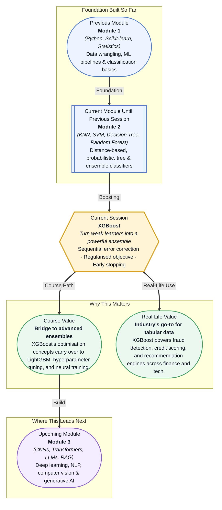

# Pre-read: XGBoost

## Context of This Session in the Course

Imagine a fraud detection team at a bank. They have spent months collecting transaction data and building a Random Forest model. It catches about 80% of fraudulent transactions, but the false positive rate is punishing — legitimate customers keep having their cards wrongly declined. The team tries adding more trees, more features, deeper forests, but the model has plateaued. What they need is not another bag of trees averaged together; they need a fundamentally different strategy, one that forces the model to focus on the cases it keeps getting wrong.

This is the exact limitation that bagging cannot overcome. When every tree in a forest votes with equal weight, the hard cases — the subtle fraud patterns, the rare edge cases — remain diluted by the majority vote. **Boosting** takes the opposite approach: instead of building trees in parallel, it builds them sequentially, with each new tree trained specifically on the mistakes of its predecessors. **XGBoost** — eXtreme Gradient Boosting — is the most refined and battle-tested implementation of this idea. It combines sequential error correction with a regularised objective that prevents overfitting, and it has become the default algorithm for any tabular-data problem where accuracy matters. That is where **XGBoost** becomes essential.

What if you were tasked with building a loan default prediction system for a fintech startup processing millions of applications a month? You would need a model that trains quickly, handles missing values gracefully, and gives you interpretable feature importance scores so you can explain to regulators why a particular applicant was rejected. Worse, you cannot afford to deploy a model that silently degrades in production as new data arrives. This session gives you the exact framework — early stopping to prevent overfitting, regularisation to keep trees simple, and a learning rate that controls how aggressively the ensemble learns — to build production-grade boosting models that industry practitioners trust for exactly these high-stakes scenarios.

At its heart, boosting is built on a disarmingly simple premise: if you build a model that is slightly better than random guessing — a **weak learner** — and then build another model focused on the mistakes of the first, and repeat this process hundreds of times, the combined ensemble will be remarkably accurate. Think of it like a team of specialists, each trained on the cases their predecessors found hardest. The first tree learns the broad patterns; subsequent trees zoom in on the boundary cases, the outliers, and the subtle interactions that a single model would miss. What makes XGBoost distinct is its **objective function**: it combines a **loss term** (how wrong the model is) with a **regularisation term** (how complex the model is). This dual objective actively penalises overly complex trees, producing a model that generalises better to unseen data. You will explore key parameters like **learning_rate**, which controls how much each new tree corrects the errors of the ensemble, **n_estimators** (the number of trees), and **max_depth** (how deep each tree can grow). The interplay between these parameters — together with **early stopping**, which halts training when validation performance stops improving — is where the art of gradient boosting lives.

In the **previous session**, you explored Random Forests, which combine many decision trees through bagging (bootstrap aggregation). Each tree in a Random Forest is trained independently on a random subset of data and features, and the final prediction is the average of all trees. This parallel approach reduces variance and produces a robust model, but it has a ceiling: every tree gets equal weight in the final vote, regardless of how well it handles the hardest cases. Boosting flips this logic. Instead of building trees independently, XGBoost builds them *dependently*, with each new tree optimised to correct the residual errors of all previous trees. The mental model you developed for decision tree mechanics — how splits are chosen, how depth is controlled, how feature importance is calculated — becomes the raw material that boosting reshapes into a more powerful sequential ensemble.

In this pre-read, you will discover:

- How to **understand** the sequential error-correction mechanism that distinguishes boosting from bagging.
- How to **recognise** the role of regularisation in XGBoost's objective function and why it prevents overfitting.
- How to **apply** the key parameters — learning_rate, n_estimators, max_depth — and interpret their tradeoffs.
- How to **interpret** feature importance in gradient boosting and use it to explain model predictions.

---

## Why Sequential Error Correction Beats Bagging

Bagging, the engine behind Random Forests, builds many trees in parallel and averages their outputs. This reduces variance — the model becomes stable and less sensitive to noise in the training data. But bagging has a fundamental ceiling: because each tree is built independently, the ensemble cannot learn from its own mistakes. If the first tree struggles with a particular kind of edge case, the remaining trees are no more likely to handle it well — they were trained on different bootstrap samples but with the same objective.

Boosting removes this ceiling by introducing *dependence* between trees. After the first tree makes its predictions, XGBoost computes the **residuals** — the difference between the actual target and the predicted value — and the next tree is trained specifically to predict these residuals. Each successive tree focuses on what the ensemble has not yet learned. Over hundreds of rounds, the model converges to a highly accurate predictor, not by averaging away errors but by systematically correcting them. This is why boosting often achieves state-of-the-art results on tabular data where bagging plateaus. The tradeoff is that the sequential nature makes boosting more sensitive to overfitting: without careful constraints on tree depth, learning rate, and the number of trees, the model can memorise noise in the training data rather than learning true patterns.

## The XGBoost Objective: Loss Meets Regularisation

Most machine learning models optimise a single quantity: how wrong their predictions are. Linear regression minimises mean squared error; logistic regression minimises cross-entropy loss. XGBoost goes a step further by optimising an objective function with two parts: a **loss term** that measures prediction error and a **regularisation term** that penalises model complexity. This regularisation is not an afterthought — it is baked into every tree-building decision. When XGBoost evaluates a potential split, it asks not just "does this split reduce error?" but "is the error reduction worth the added complexity?"

This dual objective is what gives XGBoost its legendary robustness. The regularisation term penalises large leaf weights and deep trees, favouring simpler, more generalisable structures. Combined with **shrinkage** (controlled by the learning_rate parameter), where each new tree's contribution is scaled down so the ensemble learns slowly and deliberately, XGBoost achieves high accuracy without the volatility that plagued earlier boosting algorithms. This is also where **early stopping** becomes a practical necessity: by holding out a validation set and monitoring performance after each boosting round, training halts automatically when additional trees stop improving the validation score. This single mechanism saves compute time and prevents overfitting in one stroke.

## Where Gradient Boosting Appears in Real Life

XGBoost and its close relatives (LightGBM, CatBoost) have become the default algorithms for any problem involving structured tabular data in production. In banking and finance, gradient boosting models score credit risk, detect fraudulent transactions, and forecast portfolio returns — tasks where interpretability and AUC performance matter more than raw inference speed. In insurance, they underwrite policies by predicting claim likelihood from hundreds of customer attributes. In e-commerce, they power product recommendation pipelines and dynamic pricing engines, often ranking thousands of products in milliseconds at prediction time. The healthcare industry uses gradient boosting for readmission risk prediction, where understanding which features drive the model's decision — patient age, prior admissions, medication count — is as important as the prediction itself. Across scientific domains — from genomics to particle physics — boosted trees remain the tool of choice for classification and regression on structured data, often outperforming deep learning when the data is tabular and well-understood. The reason is consistent: gradient boosting delivers high accuracy, handles mixed data types naturally, and provides built-in feature importance metrics that let practitioners explain and debug their models without additional tooling.

## What's Next

After this session, you will be able to:

- Describe how sequential error correction fundamentally differs from the parallel tree-building approach in Random Forests.
- Configure XGBoost's regularised objective and explain how the loss and regularisation terms trade off against each other.
- Tune the key parameters — learning_rate, n_estimators, max_depth — and use early stopping to find the optimal number of boosting rounds.
- Extract and interpret feature importance scores from a trained XGBoost model to identify the most influential predictors.
- Apply feature importance analysis to validate model behaviour against domain knowledge and detect potential data leakage.

You do not need to memorise every mathematical detail of the XGBoost objective right now. The goal is to see boosting as a mental model — one where each mistake becomes a lesson for the next round, and where the best predictor is not the most complex one, but the one that balances accuracy with simplicity.

## Interesting Questions for the Live Session

- If boosting sequentially corrects errors, what happens when you set the learning_rate too high? Does the model still converge, or does it oscillate?
- Regularisation penalises complexity, but how do you know whether a particular split's error reduction is "worth" the added complexity — what threshold does XGBoost use internally?
- Early stopping relies on a validation set, but if your dataset is small, holding out a validation set means less data for training. How would you adapt early stopping in such a scenario?
- Feature importance in gradient boosting can be computed in multiple ways (gain, coverage, frequency). When might different importance metrics lead you to different conclusions about which features matter?

By the end of this session, boosting should feel less like a black-box ensemble method and more like a systematic, self-correcting learning process: **each mistake teaches the next tree what to look for.**
