# Pre-read: A/B Testing & Correlation

## Context of This Session in the Course

```mermaid
%%{init: {"flowchart": {"nodeSpacing": 45, "rankSpacing": 65, "diagramPadding": 20}} }%%
flowchart TB
    subgraph Foundation["Foundation Built So Far"]
        P1(["Previous Module<br/><b>Programming &amp; Data Foundations</b><br/><i>Python, Data Structures</i><br/>Core Python → functions, APIs, data files"])
        P2(["Previous Module<br/><b>Data Analysis with NumPy &amp; Pandas</b><br/><i>NumPy, Pandas</i><br/>Aggregations, groupby, EDA, Seaborn plots"])
        P3(["Previous Module<br/><b>SQL for Data Science</b><br/><i>SQL, Python Integration</i><br/>Joins, window functions, CTEs, SQLAlchemy"])
        C1[["Current Module Until Previous Session<br/><b>Statistics &amp; Visualization</b><br/><i>Distributions, Hypothesis Testing</i><br/>Descriptive stats, probability, sampling, p-values"]]
    end

    CS{{"Current Session<br/><b>A/B Testing &amp; Correlation</b><br/><i>Experiment design + relationship measurement</i><br/>T-tests &nbsp;·&nbsp; Chi-square &nbsp;·&nbsp; Pearson Correlation &nbsp;·&nbsp; Statistical significance"}}

    subgraph Value["Why This Matters"]
        CV(["Course Value<br/><b>Trustworthy Data Decisions</b><br/>Validate ML assumptions and business experiments with rigour"])
        RV(["Real-Life Value<br/><b>Evidence-Based Product Choices</b><br/>Compare designs, measure impact, prove causality in business"])
    end

    subgraph Future["Where This Leads Next"]
        F1(["Upcoming Module<br/><b>Applied Machine Learning</b><br/><i>Scikit-learn, Regression/Classification</i><br/>Build models where statistical thinking drives evaluation"])
        F2(["Upcoming Module<br/><b>GenAI for Data Science</b><br/><i>LLMs, Embeddings</i><br/>Prompt engineering, RAG, semantic search"])
        F3(["Upcoming Module<br/><b>Capstone Project</b><br/><i>System Design, Deployment</i><br/>Apply end-to-end data science to a real-world problem"])
    end

    P1 ==>|&nbsp;Foundation&nbsp;| P2
    P2 ==>|&nbsp;Data layer&nbsp;| P3
    P3 ==>|&nbsp;Querying base&nbsp;| C1
    C1 ==>|&nbsp;Testing logic&nbsp;| CS
    CS ==>|&nbsp;Course Path&nbsp;| CV
    CS ==>|&nbsp;Real-Life Use&nbsp;| RV
    CV ==>|&nbsp;Build&nbsp;| F1
    F1 ==>|&nbsp;Scale&nbsp;| F2
    F2 ==>|&nbsp;Apply&nbsp;| F3

    classDef previous fill:#eef4ff,stroke:#4f7ccf,color:#111827,stroke-width:2px;
    classDef current fill:#fff4d6,stroke:#d9a321,color:#111827,stroke-width:3px;
    classDef value fill:#eaf8ef,stroke:#3f9f63,color:#111827,stroke-width:2px;
    classDef future fill:#f4ecff,stroke:#8a61d1,color:#111827,stroke-width:2px;

    class P1,P2,P3,C1 previous;
    class CS current;
    class CV,RV value;
    class F1,F2,F3 future;
    linkStyle default stroke-width:3px;
```

Imagine a product team at a popular food delivery app has a debate in their weekly meeting. One designer says, **"Let us change the checkout button from grey to green. I am sure it will increase order completions."** The product manager replies, **"That sounds reasonable, but how do we know the button colour is the reason? What if sales go up because of a weekend? Or a festive discount? Or because a competitor went offline?"**

This is one of the most common problems in data-driven organisations. Something changes. A number goes up or down. And everyone in the room claims a different reason. Without a proper framework for testing and measuring, any conclusion is just a guess dressed in a spreadsheet.

Now think of a hospital comparing two treatment protocols, a university testing two teaching formats, an e-commerce platform comparing two recommendation engines, or a bank evaluating two credit assessment criteria. In every one of these cases, a decision affects thousands of people. Guessing is not acceptable. Evidence is required.

That is where **A/B Testing and Correlation Analysis** become essential tools.

---

**What if** every feature your company ships could be measured before it goes fully live?

Teams often push a new feature to all users at once and then look at what happened. If things go well, the feature is celebrated. If things go badly, it is hard to trace the exact cause. Was it the feature? The timing? A bug? A change in user behaviour?

A better approach is to test the feature on a small group first, keep a control group that sees no change, and then measure the difference mathematically. This is the core idea of an **A/B test**: split your audience, introduce one change, and compare the outcomes with statistical rigour.

But a test alone is not enough. You also need to answer a different kind of question: **Are two things related?** Does studying more hours correlate with higher scores? Does spending more on marketing correlate with more sign-ups? Does screen time correlate with sleep quality? These questions need **correlation analysis**, which tells you not just whether a relationship exists, but how strong and in what direction.

Together, these two approaches — experimentation and correlation — give data professionals the ability to move from observation to insight and from insight to evidence-backed decisions.

---

**A/B Testing** is a controlled experiment. It is also called a split test. You take a population, divide it into two groups as randomly as possible, show group A the original version, show group B the new version, collect results, and then test whether the difference you observe is real or just noise.

The statistical tool most commonly used in this process is the **t-test**. A t-test compares the average outcomes of two groups and tells you whether the difference is statistically significant. If your checkout completion rate goes from 61 percent to 64 percent, a t-test helps you decide whether that 3-point difference is meaningful or just a random fluctuation.

When you are comparing categories rather than averages — for example, whether the proportion of users who clicked differs between Group A and Group B — you use a **Chi-square test**. It is particularly useful when your outcome variable is categorical, like clicked or did not click, purchased or did not purchase, enrolled or did not enrol.

**Correlation** is a different but related skill. Instead of testing a change, you are measuring whether two variables move together. The most common tool for this is **Pearson Correlation**, which gives you a number between -1 and +1. A value close to +1 means a strong positive relationship. A value close to -1 means a strong inverse relationship. A value near 0 means the variables do not appear to move together.

The critical idea connecting all of these is **statistical significance**. A result is statistically significant when you can say with confidence that it did not happen by chance. This is measured using a **p-value**. If your p-value is below a chosen threshold, usually 0.05, you reject the idea that the result is random and accept that something real is happening.

---

In the **previous session**, you worked with hypothesis testing. You learned the framework of null and alternative hypotheses, what p-values represent, and how Type I and Type II errors can lead a team astray. That session gave you the vocabulary and decision-making logic. This session puts that logic into action.

A/B testing is applied hypothesis testing. The null hypothesis is typically that there is no difference between the two groups. The alternative hypothesis is that a real difference exists. You collect data, compute your test statistic, check your p-value, and decide whether to reject the null or not.

Correlation analysis extends this thinking further. Instead of comparing group averages, you examine continuous relationships between variables. You move from the question **"Is Group B better than Group A?"** to **"Does more of X tend to come with more of Y?"**

Both skills depend on the sampling and estimation concepts you studied earlier: your sample must be large enough and random enough for your conclusions to be valid.

---

In this pre-read, you will discover:

- How to **understand** the structure of a controlled A/B experiment and why random splitting matters.
- How to **learn** when to use a t-test versus a Chi-square test depending on the type of outcome variable.
- How to **interpret** Pearson Correlation values and understand the difference between correlation and causation.
- How to **apply** p-values and significance thresholds to decide when a result deserves action.

---

## Why Observed Differences Can Be Misleading

One of the most dangerous situations in data work is when a number changes and everyone assumes they know why. The website gets 12 percent more sign-ups this week. The manager says it is because of the new landing page. The marketing team says it is because of the email campaign. The developer says a bug was fixed.

All of them may be partially right. Or none of them may be right. Without a controlled experiment, you cannot isolate the cause.

This is the problem of **confounding variables**. These are hidden factors that influence the result alongside the thing you are testing. If you change your landing page during a school holiday when students are browsing more, your sign-up rate might rise not because of the page but because of the timing.

A well-designed A/B test controls for this by exposing both groups to the same external conditions at the same time. The only difference between Group A and Group B is the specific change you introduced. Everything else is held constant. This isolation is what gives your statistical test its power.

Correlation faces an even older problem, captured in the phrase: **correlation does not imply causation**. Ice cream sales and drowning rates are historically correlated. Not because ice cream causes drowning, but because both rise during summer. This is a confounding variable in disguise. A good data professional always asks: is this relationship real, or is there a hidden third variable driving both?

---

## How A/B Testing and Correlation Work Together

In a typical data science workflow, you might use correlation first to discover which variables appear to move together, and then design an A/B experiment to test whether one variable actually causes the other to change.

For example, you notice that users who spend more than three minutes on the product page have a significantly higher purchase rate. That is a correlation. You now hypothesise that if you make the product page more engaging and keep users on it longer, purchases will increase. You design an A/B test: Group A sees the existing page, Group B sees an enriched version. After sufficient data is collected, you run a t-test to see whether the difference in purchase rates is statistically significant.

This is the natural flow: **correlation reveals candidates, experimentation tests causation.**

Understanding both tools makes you a more rigorous analyst. You stop drawing conclusions from coincidences, and you start building evidence through structured thinking.

---

## Where A/B Testing and Correlation Appear in Real Life

These are not theoretical techniques that live only in textbooks. They are used daily in some of the most consequential decisions across industries:

- **Product and technology teams** run A/B tests on interface changes, notification timing, content recommendations, pricing displays, and onboarding flows.
- **Healthcare researchers** use t-tests and correlation to compare treatment outcomes across patient groups and to understand which lifestyle factors are associated with disease risk.
- **Marketing teams** run split campaigns with different subject lines, offers, or creative formats, and use Chi-square tests to compare click-through and conversion rates.
- **Financial institutions** test risk scoring models on subsets of applicants and use correlation to identify which customer behaviours predict default or loyalty.
- **Educational platforms** compare two teaching sequences, two quiz formats, or two content delivery modes, using data to determine what actually helps learners retain more.

In all of these cases, the same question underlies the analysis: **Did our intervention work, and are these variables genuinely connected?** A/B testing and correlation provide the tools to answer that question with confidence rather than opinion.

---

## What's Next

After this session, you will be able to:

- Design a simple A/B experiment with a clear null hypothesis and a test group versus control group.
- Choose the right statistical test based on whether your outcome is continuous (t-test) or categorical (Chi-square).
- Compute and interpret a Pearson Correlation coefficient and understand what it does and does not tell you.
- Read a p-value and explain why a result does or does not cross the threshold of statistical significance.
- Distinguish between a correlation and a causal claim, and explain why that distinction matters in practice.

You do not need to memorise every formula right now. The goal is to build a rigorous mental model: **real decisions deserve real evidence, and evidence is only trustworthy when it is gathered and tested with the right methods.**

---

## Interesting Questions for the Live Session

- If a result is statistically significant, does that always mean it is practically important? When might a small but significant change not be worth acting on?
- What sample size is large enough for an A/B test? How does sample size affect your confidence in the result?
- If Pearson Correlation does not detect non-linear relationships, what might you miss by relying on it alone?
- In real experiments, users are not always randomly assigned — some groups are more tech-savvy, more affluent, or more active. How does this affect the validity of your conclusions?

By the end of this session, A/B testing should feel less like a statistics exercise and more like a professional discipline: **designing fair comparisons, measuring with the right tools, and making decisions that can withstand scrutiny.**
