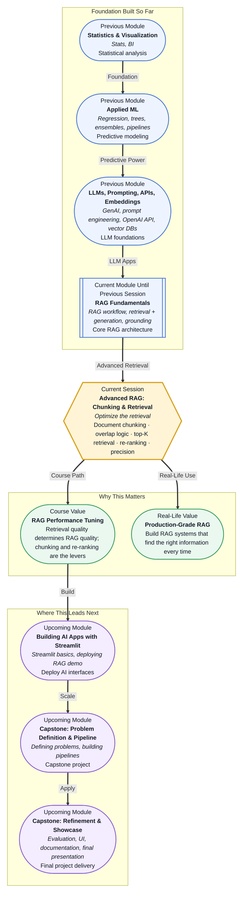

# Pre-read: Advanced RAG: Chunking & Retrieval

## Context of This Session in the Course

You build a RAG system that answers employee questions from your company's internal policy documents. It works. Then someone asks about the bereavement leave policy — a short procedure that fits in two paragraphs — and the system retrieves a page from the middle of the health insurance PDF instead. The answer is wrong. Not because the LLM failed, but because the retriever brought back the wrong piece of text. The LLM never had a chance.

The obvious culprit is the search itself — perhaps the query was poorly worded. But the deeper problem is often invisible: how you split your documents into retrievable pieces. A policy document chopped into 500-character chunks might bury the bereavement leave policy across three separate fragments. A single massive chunk containing 4,000 tokens might include so much irrelevant context that the embedding vector looks like a blurry average of everything. Retrieval fails not because the semantic search is broken, but because the units of retrieval were never designed for the questions people actually ask. Chunking strategy, overlap logic, top-K selection, and re-ranking are not tuning details — they determine whether your RAG system finds the right needle or the wrong haystack.

That is where **Advanced RAG: Chunking & Retrieval** becomes essential — moving from a working RAG prototype to a system that reliably retrieves the right information every time.

---

**What if** you had to build a customer support chatbot for a retail company with 50,000 product manuals, return policies, warranty terms, and shipping guidelines — and a user's question could span anything from "How do I fold this stroller?" to "What is the refund window for electronics purchased with a gift card?" The challenge is not generating the answer; you already know the LLM can do that. The challenge is ensuring that for every single query, the right 500 words out of 50,000 documents end up in the LLM's context window. That precision does not come from better models. It comes from how you carve your documents into chunks, how you overlap the boundaries, how many chunks you retrieve, and how you re-rank them before the LLM sees them. This session gives you those levers.

---

The fundamental insight is that RAG quality depends almost entirely on **retrieval quality**, and retrieval quality begins with how you structure the information before anyone searches it. Think of a library where every book is torn into pages and every page is stored in a filing cabinet. If you tear the pages at random, a single sentence about bereavement leave might be split across two drawers. No search system — no matter how advanced — can find that sentence if its two halves are stored separately. **Chunking** is the act of deciding where those cuts happen. **Overlap** is the safety margin that ensures no thought is split in half. **Top-K retrieval** determines how many chunks to pull. And **re-ranking** is the second pass that ensures the best chunks rise to the top before the LLM reads them.

This session explores four interconnected techniques: **document chunking strategies** (fixed-size, semantic, and recursive splitting), **overlap logic** to preserve context across boundaries, **top-K retrieval** to balance relevance against context-window limits, and **re-ranking** to surface the most useful results from an initial broad search. Each one is a dial you can turn to tune retrieval precision.

---

In the **previous session**, you learned the core RAG architecture — the workflow of retrieving relevant information from a knowledge base and grounding the LLM's response in that retrieved context. You understood the high-level flow: question comes in, search finds relevant documents, the LLM reads them as context, and generates a grounded answer. That foundation gave you the blueprint. This session takes that blueprint and asks the hard question: how do you make retrieval actually work well? The RAG workflow is the vehicle; chunking, overlap, top-K, and re-ranking are the steering wheel, suspension, and brakes. Without them, the vehicle moves but not where you want it to go.

---

In this pre-read, you will discover:

- How to **understand** why document chunking strategy directly determines retrieval success or failure.
- How to **apply** overlap logic and top-K selection to balance completeness with relevance.
- How to **learn** how re-ranking improves retrieval precision after an initial broad search.
- How to **connect** these retrieval tuning techniques to building production-grade RAG applications.

---

## Why Chunking and Overlap Strategy Determine Retrieval Quality

Imagine a 10-page product manual for a smart thermostat. The first two pages cover safety warnings, pages three through six explain installation, page seven covers the mobile app setup, and pages eight through ten cover troubleshooting. A user asks: "Why is my thermostat showing a low battery warning even after I replaced the batteries?" The correct answer is on page ten — it is a specific calibration step that follows battery replacement. If your chunking strategy splits the manual into 256-character fixed chunks, the warning about the calibration step might end up in a chunk that begins mid-sentence and ends before the solution is explained. The embedding for that chunk looks like gibberish — a vectorized fragment of a partial thought — and the retriever scores it low. The system returns a chunk about safety warnings instead. The user gets an irrelevant answer.

This is the core problem that **chunking strategy** solves. Fixed-size chunking is the simplest approach: divide the document into chunks of N characters, tokens, or sentences. It is easy to implement and predictable in terms of LLM context usage, but it often splits logical units of meaning. **Semantic chunking** improves on this by using natural boundaries — paragraph breaks, section headers, or topic shifts detected through embedding similarity — to keep related content together. **Recursive chunking** applies multiple strategies in layers: split by section first, then by paragraph within large sections, then by sentence as a fallback. The goal is always the same: each chunk should be a self-contained unit of meaning that a future query can match against. A chunk should not need its neighbour to make sense.

Even with perfect semantic chunking, boundaries are never clean. A paragraph might end with a sentence that introduces the next topic: "Now that the installation is complete, let us move to configuring the mobile app." If the chunk ends right before that sentence, the next chunk starts abruptly with configuration steps that reference hardware settings from the previous section. The retriever may find the configuration chunk, but the LLM reading it has no idea what hardware it applies to. **Overlap logic** solves this by sharing a small number of tokens or sentences between adjacent chunks. The tail of chunk N repeats as the head of chunk N+1. Overlap is a buffer zone that ensures no thought is left hanging at a boundary. The size of the overlap is itself a tuning parameter. Too little overlap — 10 to 20 characters — misses the boundary problem entirely. Too much overlap — 50 percent of the chunk size — inflates your total token count and slows down retrieval. A good rule of thumb is an overlap of 10 to 15 percent of the chunk size, or one to two sentences for most document types. Overlap is not inefficiency; it is insurance. Every token in the overlap appears twice in your vector database, which means it has twice the chance of matching a relevant query. Overlap trades storage efficiency for boundary safety, and in production RAG systems, that trade is almost always worth making.

## Top-K Retrieval and Re-Ranking

Once your documents are chunked and indexed, a query triggers a similarity search that returns a ranked list of chunks. **Top-K retrieval** is the parameter that decides how many of those chunks to pass to the LLM. Set K too low — say, K equals 2 — and you might miss the one chunk that perfectly answers the question. Set K too high — K equals 20 — and you fill the LLM's context window with borderline-relevant results, diluting the signal and increasing the chance the model pulls from the wrong chunk. K is a function of your chunk size, your expected query complexity, and your LLM's context limit. A system with 512-character chunks might comfortably use K of 5 to 8. A system with 2,000-character chunks might use K of 2 to 4. The optimal K is the smallest value that reliably includes the winning chunk.

**Re-ranking** addresses a separate weakness of pure vector search. Embedding similarity is good at broad semantic matching but poor at fine-grained relevance ranking. The top 20 chunks from a vector search often include several highly relevant results buried among contextually similar but actually irrelevant chunks. A re-ranker — typically a cross-encoder model that scores each chunk against the query in a single forward pass — takes the initial top-K results and re-scores them with higher precision. Re-ranking is computationally more expensive than the initial vector search, which is why it is applied as a second stage on a reduced candidate set rather than on the entire corpus. The pattern is: wide retrieval with high K, followed by precise re-ranking with a smaller K passed to the LLM. This two-stage pipeline gives you the coverage of broad search with the precision of a focused second opinion.

## Where Advanced Chunking and Retrieval Appear in Real Life

Enterprise document search is the most direct application. Legal firms use semantically chunked contracts to ensure that retrieval returns entire clauses — not fragments of clauses — when a lawyer searches for "force majeure" or "indemnification obligations." The difference between finding a complete clause and a half-chunk can determine whether the lawyer has the full legal context to advise a client. Customer support teams at companies like Shopify and Zendesk split their knowledge bases using recursive chunking with overlap, so a query about "refund timing for international orders" retrieves chunks that include both the refund policy and the international shipping context in a single retrieval pass. Healthcare organizations chunk clinical guidelines by section headers (symptoms, diagnosis, treatment protocol) and use re-ranking to ensure that the most authoritative source — typically the latest guideline version — surfaces above older but semantically similar entries. E-commerce product search engines chunk product descriptions by attribute groups (dimensions, materials, care instructions) and use top-K tuning to balance between showing comprehensive product details and keeping the LLM response concise enough for voice assistants. The common thread across all these use cases is that retrieval quality, not model capability, is the bottleneck — and chunking and re-ranking are the tools that break it.

---

## What's Next

After this session, you will be able to:

- Choose a chunking strategy (fixed-size, semantic, or recursive) based on your document type and query patterns.
- Configure overlap size to prevent context loss at chunk boundaries without excessive token waste.
- Tune the top-K parameter to balance retrieval coverage with LLM context-window constraints.
- Implement a two-stage retrieval pipeline that combines vector search with cross-encoder re-ranking.
- Diagnose retrieval failures by inspecting whether the problem is in the chunk boundary, the embedding quality, or the ranking stage.
- Evaluate retrieval precision using metrics like hit rate and mean reciprocal rank on your own document collections.

You do not need to implement every strategy in production code right now. The goal is to see retrieval not as a black box but as a system of tunable decisions: **chunking, overlap, top-K, and re-ranking are the levers that turn a good RAG system into a reliable one.**

---

## Interesting Questions for the Live Session

- If a single document contains multiple topics, is it better to split by topic boundaries and lose some context, or keep it as one large chunk and risk diluting the embedding? How do you define a "topic boundary" algorithmically?
- Overlap adds redundant tokens that increase storage and retrieval cost. How would you measure whether a given overlap percentage is actually improving retrieval, or just wasting space?
- Re-ranking adds latency and computational cost to every query. At what point does the precision gain from re-ranking stop justifying the extra response time?
- If your top-K retrieval consistently returns the correct chunk at position K+1 — just outside your cutoff — do you increase K, or is the real problem in how you are chunking or embedding the document?

By the end of this session, retrieval should feel less like a black-box search and more like a precision instrument: **chunking and re-ranking transform a RAG prototype into a system that finds the right information every time.**
