# Pre-read: Advanced Seaborn & Interactive Plots

## Context of This Session in the Course

```mermaid
%%{init: {"flowchart": {"nodeSpacing": 45, "rankSpacing": 65, "diagramPadding": 20}} }%%
flowchart TB
    subgraph Foundation["Foundation Built So Far"]
        P1(["Previous Module<br/><b>Module 1: Programming &amp; Data Foundations</b><br/><i>Python, APIs, JSON</i><br/>Python fundamentals"])
        P2(["Previous Module<br/><b>Module 2: Data Analysis with NumPy &amp; Pandas</b><br/><i>NumPy, Pandas, Seaborn</i><br/>Data manipulation, basic plotting"])
        P3(["Previous Module<br/><b>Module 3: SQL for Data Science</b><br/><i>SQL, CTEs, Window Functions</i><br/>Database queries"])
        C1[["Current Module Until Previous Session<br/><b>Chart Selection &amp; Design</b><br/><i>Visual storytelling, histograms, bar charts, line, scatter</i><br/>Purpose-driven chart selection"]]
    end

    CS{{"Current Session<br/><b>Advanced Seaborn &amp; Interactive Plots</b><br/><i>From single static charts to multi-panel, interactive exploration</i><br/>facet grids · pair plots · interactive visualization · aesthetics · customization · subplots · multi-dimensional analysis"}}

    subgraph Value["Why This Matters"]
        CV(["Course Value<br/><b>Depth in Data Exploration</b><br/>Multi-panel and interactive plots reveal patterns single charts hide"])
        RV(["Real-Life Value<br/><b>Interactive Data Products</b><br/>Build explorable visuals that stakeholders can engage with dynamically"])
    end

    subgraph Future["Where This Leads Next"]
        F1(["Upcoming Module<br/><b>BI Tools &amp; Dashboards</b><br/><i>Tableau, PowerBI, calculated fields</i><br/>Industry-standard dashboarding"])
        F2(["Upcoming Module<br/><b>Interactive Dashboards &amp; Executive Reporting</b><br/><i>Filters, dashboards, KPIs</i><br/>Building stakeholder-facing dashboards"])
        F3(["Upcoming Module<br/><b>Applied ML &amp; GenAI</b><br/><i>Regression, trees, LLMs, RAG</i><br/>Predictive modeling and generative AI"])
    end

    P1 ==>|&nbsp;Foundation&nbsp;| P2
    P2 ==>|&nbsp;Data Analysis&nbsp;| P3
    P3 ==>|&nbsp;Statistical Rigor&nbsp;| C1
    C1 ==>|&nbsp;Deeper Exploration&nbsp;| CS
    CS ==>|&nbsp;Course Path&nbsp;| CV
    CS ==>|&nbsp;Real-Life Use&nbsp;| RV
    CV ==>|&nbsp;Build&nbsp;| F1
    F1 ==>|&nbsp;Scale&nbsp;| F2
    F2 ==>|&nbsp;Apply&nbsp;| F3

    classDef previous fill:#eef4ff,stroke:#4f7ccf,color:#111827,stroke-width:2px;
    classDef current fill:#fff4d6,stroke:#d9a321,color:#111827,stroke-width:3px;
    classDef value fill:#eaf8ef,stroke:#3f9f63,color:#111827,stroke-width:2px;
    classDef future fill:#f4ecff,stroke:#8a61d1,color:#111827,stroke-width:2px;

    class P1,P2,P3,C1 previous;
    class CS current;
    class CV,RV value;
    class F1,F2,F3 future;
    linkStyle default stroke-width:3px;
```

You have just finished analyzing a customer churn dataset. You plotted churn by contract type, by tenure, by monthly charges — one chart at a time. Each chart told you something, but you find yourself flipping back and forth between tabs, trying to connect what the long-tenure customers have in common across all these dimensions.

A single scatter plot can show you that churn increases with monthly charges. A separate bar chart can show you that month-to-month contracts churn more. But until you can see monthly charges, contract type, tenure, and churn all in the same visual frame, you are left guessing how these factors interact. The intuition is there, but the proof is fragmented across isolated views.

This fragmentation is the difference between making a chart and building a visual narrative. The tools that let you slice, facet, and link multiple views of the same dataset are what transform scattered charts into explorable insights. That is where **Advanced Seaborn & Interactive Plots** becomes essential.

---

**What if** you could hand your stakeholder a single visual that lets them filter by region, zoom into a time window, and see how patterns change across customer segments — all without writing a single new line of code? The techniques in this session turn you from someone who generates individual charts into someone who designs exploratory visual systems that others can interrogate themselves. By the end, you will not just present findings — you will build environments where findings emerge from exploration.

---

A **facet grid** allows you to create multiple subplots based on the categories in your data, each showing the same type of chart for a different subset. A **pair plot** gives you a matrix of scatter plots for every numeric combination in your dataset — instantly revealing correlations and clusters you might otherwise miss. Together, these tools move you from asking "what does this column look like?" to "how do all these columns relate to one another?"

Think of it as the difference between examining each piece of a puzzle separately versus laying out the full picture on a table. An individual chart is one puzzle piece; a facet grid or pair plot is the completed frame that shows how everything connects. In this session, you will work with Seaborn's `FacetGrid` and `pairplot`, explore interactive concepts through linked selections and hover-based inspection, and learn to customize plot **aesthetics** — titles, palettes, themes, and annotations — so your visuals are not just accurate but polished and professional.

---

In the **previous session**, Choosing the Right Chart, you learned how to map data types to visual marks — histograms for distributions, bar charts for comparisons, line charts for trends, and scatter plots for relationships. You understood the grammar of matching your data's structure to the right single chart. Now the question shifts from *which* chart to *how many charts you can combine* to tell a richer story. Where session 15.2 taught you to make the right single call, this session teaches you to orchestrate multiple views into a coherent exploratory system. The chart-selection framework you built becomes the building block for every subplot in a facet grid and every cell in a pair plot matrix.

---

In this pre-read, you will discover:

- How to **build** multi-panel charts using Seaborn facet grids to compare subgroups side by side.
- How to **interpret** pair plots to quickly surface correlations across multiple numeric dimensions.
- How to **apply** interactive visualization concepts like linked selection and hover inspection.
- How to **connect** plot aesthetics and customization to professional presentation standards.

---

## Why a Single Chart Is Not Enough

When you plot churn by contract type, you see that month-to-month customers leave more often. When you plot churn by monthly charges, you see a positive trend. But the real insight lives at the intersection: do month-to-month customers with high monthly charges churn at an even higher rate? A single chart cannot answer this because it was designed to highlight one relationship at a time. To explore interactions, you need the ability to partition your data across multiple subplots simultaneously.

This is the core limitation that **facet grids** solve. They let you split your dataset by one or more categorical variables and render the same chart type for each slice, in a clean grid layout, so comparisons become visual and immediate. Instead of mentally stitching together three separate charts, you see the full pattern in one figure. This shift — from serial to parallel visual comparison — is the conceptual leap that this session asks you to make.

## How Facet Grids and Pair Plots Reveal Hidden Structure

A **facet grid** in Seaborn is built using `FacetGrid` or the `col` and `row` parameters in high-level functions like `catplot`, `relplot`, and `displot`. You specify which column to split by, and Seaborn creates a grid of subplots — one per category — each with its own axes, labels, and scales. A **pair plot** takes this further by plotting every numeric column against every other numeric column in a single matrix. The diagonal shows distributions; the off-diagonal cells show scatter plots. This is extraordinarily useful for spotting clusters, outliers, and non-linear relationships before you commit to any modeling or statistical test.

In this session, you will also encounter the beginnings of **interactivity** — concepts like hover tooltips, linked brushing, and zoom that allow your audience to explore the data on their own terms. These features bridge the gap between static notebooks and the dynamic dashboards you will build later in the course. The same aesthetic principles you apply to a facet grid — consistent color palettes, clear axis labels, purposeful annotation — carry directly into dashboard tools like Tableau and PowerBI.

## Where Advanced Visualization Appears in Real Life

Multi-panel and interactive visualizations are not confined to academic notebooks; they power decision-making across industries. In e-commerce, product teams use facet grids to compare conversion rates across device type, traffic source, and region simultaneously, spotting exactly where the funnel breaks. In healthcare, researchers use pair plots to examine relationships between patient vitals, lab results, and outcomes across treatment groups, surfacing confounding variables that single-variable charts would miss. In finance, analysts layer hover-based annotations on time-series grids to track portfolio performance across sectors and geographies, making anomalies discoverable in seconds rather than hours. In marketing, dashboards built with these principles let stakeholders filter by campaign, channel, and customer segment without requiring a data team to generate each view manually. Even in sports analytics, interactive scatter matrices reveal how player stats cluster into position archetypes, enabling data-driven scouting decisions. The common thread: whenever the question is too complex for a single chart, multi-panel and interactive approaches turn ambiguity into discoverable insight.

---

## What's Next

After this session, you will be able to:

- Build a facet grid in Seaborn to compare distributions or trends across categorical subgroups.
- Generate and interpret a pair plot matrix to identify correlations and clusters across numeric columns.
- Apply Seaborn theme customization including palettes, style contexts, and figure-level aesthetics.
- Describe the core concepts behind interactive visualization: linked selection, hover inspection, and zoom.
- Use `relplot`, `catplot`, and `displot` with `col` and `row` parameters to create multi-panel figures.
- Connect static exploratory plots to the design principles behind interactive dashboards.

You do not need to master every Seaborn parameter in a single session. The goal is to see how moving from a single chart to a multi-panel view changes your relationship with data — from passive observer to active explorer: **multi-panel visualizations turn static charts into a conversation with your data.**

---

## Interesting Questions for the Live Session

- When you look at a pair plot, how do you distinguish between a genuinely interesting cluster and a meaningless artifact of overlapping points?
- What happens to a facet grid when one category has ten times more data points than another — does the visual comparison remain fair?
- If a hover tooltip reveals the exact value of a point, does that make a chart more informative or does it distract from the broader trend?
- How would you design an interactive visualization that works equally well for a data scientist exploring a dataset and a business executive looking for a single answer?

By the end of this session, advanced visualization should feel less like a collection of plotting tricks and more like a mindset for structured data exploration: **from one view to many — that is where insight multiplies.**
