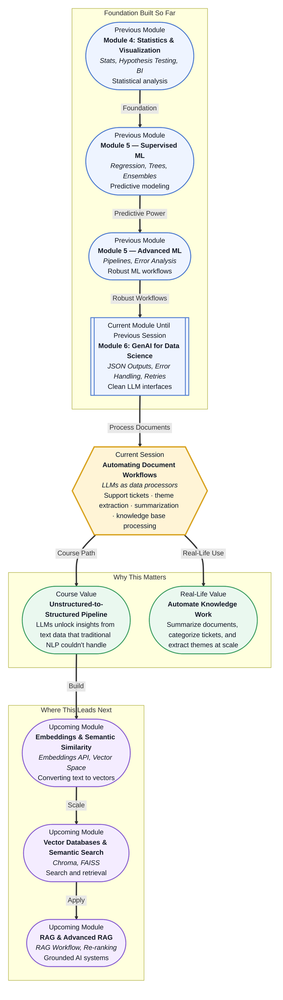

# Pre-read: Automating Document Workflows

## Context of This Session in the Course

Your team receives over 500 support tickets every day. Each one is written differently — some are short ("Order #4829 hasn't arrived"), others are long complaints with multiple issues buried inside. A human team reads them, categorizes each by type — refund, technical issue, delivery complaint — assigns a priority, and summarizes the key points. By Friday afternoon, your team has processed maybe half of them, and the backlog keeps growing.

The intuitive solution is keyword matching. Count how many tickets contain the word "refund" and call that the refund category. But language is rarely that clean. A customer might write "I want my money back" or "Please reverse the charge" without ever saying "refund." A keyword system misses the meaning, a rule-based classifier needs constant updates, and regex patterns break the moment someone writes in a slightly different format. Traditional NLP approaches required extensive labeled data for every new category, making them slow to adapt and expensive to maintain.

That is where **Automating Document Workflows with LLMs** becomes essential — turning unstructured text into structured, actionable data without hand-crafted rules.

---

**What if** you could point an LLM at a folder of 500 support tickets and get back a structured table — with each ticket categorized, summarized, and tagged with its key themes — in under a minute? What if that same pipeline could process your company's entire internal knowledge base and identify which documents are outdated, which policies contradict each other, and which topics are missing entirely? This is not a distant vision. You already know how to send structured prompts to an LLM and parse its responses. This session shows you how to turn that skill into a document processing engine that works at scale.

---

The core idea is deceptively simple: **unstructured data** — text without a predefined schema, like emails, tickets, PDFs, and meeting notes — contains valuable information that is difficult to query or analyze programmatically. LLMs change this because they can read natural language as fluently as a human, but at machine speed and without fatigue. Think of an LLM as a flexible reader that can adapt to any document format, unlike rigid parsers that break when the template changes. You do not need regex patterns, keyword dictionaries, or custom classifiers. You define the output schema once, and the model fills it in.

This session explores four specific techniques: **processing support tickets** to extract intent, category, and urgency; **theme extraction** to identify recurring patterns across hundreds of documents; **summary generation** to condense long documents into concise briefs; and **processing internal knowledge bases** to keep organizational information organized and searchable. Each technique builds on the same foundation: telling the LLM what structure you want back, and letting it read the text for you.

---

In the **previous session**, you learned how to design input-output contracts — managing JSON outputs, implementing error handling, building retry logic, and parsing LLM responses into clean DataFrames. Those patterns gave you a reliable bridge between Python code and AI models. That structured interface is exactly what you need now. Once you can reliably send instructions to an LLM and receive predictable responses, the next logical step is to connect that pipeline to real-world unstructured data. The contracts you designed are the pipes; this session connects them to the messy, valuable text that organizations deal with every day.

---

In this pre-read, you will discover:

- How to **apply** structured extraction to support tickets and free-text documents using LLMs.
- How to **recognise** the limitations of keyword-based and rule-based approaches for text classification.
- How to **build** a pipeline that generates summaries and extracts themes from large document collections.
- How to **connect** document workflows to knowledge base processing for real-world business applications.

---

## How LLMs Turn Messy Text into Clean Data

When a customer writes "I ordered a blue sweater on March 3rd but received a red one, and the return portal is not working" — that is a single support ticket containing three distinct problems: wrong item, fulfillment error, and a technical issue. A keyword-based system would miss everything unless each problem was mentioned using exact trigger words. An LLM, by contrast, understands the semantics of the message, recognizes multiple intents in a single sentence, and can output each as a separate structured record.

This ability — to parse natural language without rigid templates — is the foundation of document workflow automation. You instruct the model to output a JSON object with fields like `primary_issue`, `secondary_issues`, `urgency`, and `customer_sentiment`. The model reads the entire text in context, not as a bag of keywords. One ticket becomes one row in a DataFrame. Five hundred tickets become a dataset you can analyze, visualize, and act on. The key technique is **structured extraction**: defining the schema in advance and letting the LLM fill it in. This is not classification — which assigns a single label — but extraction, which pulls multiple structured fields from free text in a single pass.

## Theme Extraction and Summarization at Scale

Once your data is structured at the document level, the next challenge is seeing the bigger picture. What are customers complaining about most this week? Which product categories generate the most returns? Which internal policies are cited most frequently? **Theme extraction** is the process of analyzing a large collection of text documents and identifying recurring topics, patterns, or sentiments automatically. An LLM can read every ticket in a batch and produce a summary report: "This week, 42% of tickets relate to shipping delays, 28% to product defects, and 18% to account issues. Urgency has increased by 15% compared to last week."

**Summary generation** takes a different shape. A single document — a meeting transcript, a research paper, or a legal contract — might be tens of pages long. An LLM can condense it into a structured brief with key decisions, action items, open questions, and stakeholders mentioned. The model is not simply shortening text; it is identifying what matters based on the instructions you give it. "Summarize this for a busy executive" produces a very different output than "Summarize this for a legal compliance audit." Both techniques rely on the same underlying capability: the LLM's ability to read large amounts of text in context and produce a distilled, relevant output. The challenge is managing context windows and token limits — skills you will practice directly.

## Where Automated Document Workflows Appear in Real Life

Customer support teams at companies like Zendesk and Intercom use LLMs to categorize and prioritize incoming tickets automatically. A ticket mentioning "broken checkout page" is flagged as high-priority and routed to the engineering team, while a question about resetting a password is answered directly with a link to the help center. The same pipeline generates daily trend reports showing which issues are spiking. Enterprise knowledge management is another major application — consulting firms, law offices, and healthcare providers maintain thousands of internal documents, and LLMs help keep these repositories organized by flagging outdated policies, identifying duplicates, and generating concise onboarding summaries for new employees. In compliance and audit workflows, LLMs process regulatory filings and contract amendments to extract key changes and flag potential risks, saving hours of manual cross-referencing. Market research teams use LLMs to analyze customer reviews, survey responses, and social media mentions at scale, producing structured reports on top pain points, sentiment by demographic, and emerging trends. The common thread across these use cases is the shift from reading to structuring — the LLM does the heavy lifting of turning messy text into organized data so the human can focus on interpretation and action.

---

## What's Next

After this session, you will be able to:

- Process a batch of support tickets using an LLM and extract structured fields like issue type, priority, and sentiment.
- Generate concise summaries of long documents using LLM prompts with configurable levels of detail.
- Identify recurring themes across a document collection using LLM-powered multi-document analysis.
- Build a pipeline that converts unstructured knowledge base documents into structured, queryable records.
- Handle edge cases like multi-intent tickets, contradictory statements, and ambiguous language in extraction workflows.
- Apply token management strategies to process documents that exceed a single LLM context window.

You do not need to architect a full production system right now. The goal is to see unstructured text not as a problem but as raw material: **LLMs turn messy language into structured data with the right instructions.**

---

## Interesting Questions for the Live Session

- When an LLM extracts multiple issues from a single ticket, how do you decide which is the primary one — and does that decision change depending on which business function uses the data?
- If an LLM summarizes a 50-page policy document, how can you verify that the summary did not omit a critical clause that only matters in rare edge cases?
- Theme extraction across 1,000 tickets may identify "shipping delays" as the top theme — but what if the most expensive, high-impact issue appears in only 3 tickets? Should your pipeline flag rare but critical themes differently?
- How would you design a feedback loop where human reviewers correct an LLM's categorization, and those corrections improve future extractions without retraining the model?

By the end of this session, document processing should feel less like a manual chore and more like a programmable data pipeline: **unstructured text is not noise — it is structured data waiting for the right instructions.**
