# Pre-read: Building Interactive Dashboards

## Context of This Session in the Course

```mermaid
%%{init: {"flowchart": {"nodeSpacing": 45, "rankSpacing": 65, "diagramPadding": 20}} }%%
flowchart TB
    subgraph Foundation["Foundation Built So Far"]
        P1(["Previous Module<br/><b>Module 1: Programming &amp; Data Foundations</b><br/><i>Python, APIs, JSON</i><br/>Python fundamentals"])
        P2(["Previous Module<br/><b>Module 2: Data Analysis with NumPy &amp; Pandas</b><br/><i>NumPy, Pandas, Seaborn</i><br/>Data manipulation, plotting"])
        P3(["Previous Module<br/><b>Module 3: SQL for Data Science</b><br/><i>SQL, CTEs, Window Functions</i><br/>Database queries"])
        C1[["Current Module Until Previous Session<br/><b>Module 4: Statistics &amp; Data Visualization</b><br/><i>Tableau/PowerBI, data connections, tool interface</i><br/>Business intelligence fundamentals"]]
    end

    CS{{"Current Session<br/><b>Building Interactive Dashboards</b><br/><i>From static reports to interactive, explorable data environments</i><br/>calculated fields · filters · dashboards · worksheets · geographic mapping · interactivity · stakeholder exploration"}}

    subgraph Value["Why This Matters"]
        CV(["Course Value<br/><b>Stakeholder-Centric Analytics</b><br/>Dashboards are the bridge between data analysis and business decision-making"])
        RV(["Real-Life Value<br/><b>Self-Service Analytics</b><br/>Build dashboards where non-technical users answer their own questions"])
    end

    subgraph Future["Where This Leads Next"]
        F1(["Upcoming Session<br/><b>Case Study: Executive Reporting</b><br/><i>Insight extraction, dashboard presentation</i><br/>Synthesize and present findings"])
        F2(["Upcoming Module<br/><b>Applied ML — Intro to ML &amp; Regression</b><br/><i>Supervised learning, linear/logistic regression</i><br/>Enter predictive modeling"])
        F3(["Upcoming Module<br/><b>GenAI for Data Science</b><br/><i>LLMs, embeddings, RAG</i><br/>Generative AI applications"])
    end

    P1 ==>|&nbsp;Foundation&nbsp;| P2
    P2 ==>|&nbsp;Data Analysis&nbsp;| P3
    P3 ==>|&nbsp;Statistical Rigor&nbsp;| C1
    C1 ==>|&nbsp;Interactive Dashboards&nbsp;| CS
    CS ==>|&nbsp;Course Path&nbsp;| CV
    CS ==>|&nbsp;Real-Life Use&nbsp;| RV
    CV ==>|&nbsp;Build&nbsp;| F1
    F1 ==>|&nbsp;Scale&nbsp;| F2
    F2 ==>|&nbsp;Apply&nbsp;| F3

    classDef previous fill:#eef4ff,stroke:#4f7ccf,color:#111827,stroke-width:2px;
    classDef current fill:#fff4d6,stroke:#d9a321,color:#111827,stroke-width:3px;
    classDef value fill:#eaf8ef,stroke:#3f9f63,color:#111827,stroke-width:2px;
    classDef future fill:#f4ecff,stroke:#8a61d1,color:#111827,stroke-width:2px;

    class P1,P2,P3,C1 previous;
    class CS current;
    class CV,RV value;
    class F1,F2,F3 future;
    linkStyle default stroke-width:3px;
```

Your manager emails you on a Thursday afternoon: "Can you share the quarterly performance breakdown by region? I need it for Monday's stakeholder meeting." You open your notebook, write a fresh query, generate static charts, export them, and email back. Two hours later, a reply arrives: "Could you also slice this by product category and add last year's comparison?" The back-and-forth begins.

This cycle is painfully familiar in data-driven organisations. Every new question from a stakeholder requires a new round of analysis, a new chart, and a new email. The person with the technical skills becomes a bottleneck — not because the work is hard, but because static reports do not let the consumer explore on their own. The real value of data is not in a single PDF. It is in giving decision-makers the freedom to ask and answer their own follow-up questions without waiting for an analyst.

That is where **Building Interactive Dashboards** becomes essential.

---

**What if** you could build a single interactive dashboard that lets your CEO filter by quarter, drill into individual product lines, hover over a map to see regional performance, and watch KPIs update in real time — all without asking you for a single new chart?

Imagine handing over a link instead of a PDF. The stakeholder opens it, clicks a few filters, and finds their own answers. You are no longer the gatekeeper of insights. You become the architect of a self-service analytics environment. This session gives you the skills to design and build exactly that kind of experience using industry-standard BI tools.

---

A **dashboard** is a visual display of the most important information needed to achieve one or more objectives, consolidated and arranged on a single screen so the information can be monitored at a glance. Unlike a static worksheet, a dashboard is interactive — it invites exploration. The core building blocks you will work with are **calculated fields** (new data you derive from existing fields using formulas), **filters** (conditions that narrow what data is displayed), and **worksheets** (individual chart views that become the tiles in your dashboard).

Think of a dashboard as a control panel for data. A worksheet is like a single gauge showing engine temperature. A dashboard combines multiple gauges — temperature, speed, fuel, oil pressure — onto one unified display. Now imagine you can click any gauge and the others respond. That is interactivity. And when you introduce **mapping geographic data**, you add a map that turns rows of coordinates into a visual story of regional performance, customer density, or supply chain routes.

---

In the **previous session**, you were introduced to the BI tool landscape — Tableau and PowerBI — and learned how to connect to data sources and navigate the interface. That session gave you the lay of the land: where to find data connections, how the workspace is organised, and what the core building blocks look like.

Now you move from orientation to construction. Session 16.1 taught you to open the toolbox and understand each tool's purpose. This session teaches you to pick up those tools and build something real. The interface you learned to navigate is now your workshop. The data connections you established are the raw materials. Your task is to assemble them into interactive environments that stakeholders can explore on their own terms.

---

In this pre-read, you will discover:

- How to **build** calculated fields that derive new insights from existing data without leaving your BI tool
- How to **apply** filters that let stakeholders slice and explore data dynamically
- How to **recognise** when a dashboard is the right medium versus when a worksheet or report serves better
- How to **connect** geographic data to visual maps for location-based analysis

---

## What Makes a Dashboard Different from a Worksheet

A **worksheet** in a BI tool is a single view — one chart, one table, one map. It answers one question. A dashboard, by contrast, is a curated collection of worksheets that work together. The difference is not just aesthetic; it is functional. A dashboard lets you apply a filter once and see every worksheet on the canvas update instantly, revealing cross-perspectives that no single chart could show.

Consider a sales dataset. A worksheet showing monthly revenue answers "How much did we earn?" A worksheet showing regional breakdown answers "Where did we earn it?" Alone, each is useful. Combined on a dashboard with a shared filter for time period, you can see that revenue in the North region spiked in Q3 and dropped in Q4 — a pattern invisible when the charts are viewed in isolation. This is the power of **interactivity**: not just more charts, but connected charts that compound each other's meaning.

---

## How Calculated Fields and Filters Unlock Exploration

A **calculated field** is a new column you create by writing a formula using existing fields. If your dataset has `List Price` and `Discount`, you can create a calculated field called `Net Revenue` using a simple formula. The result behaves like any other field — you can drag it onto shelves, use it in filters, and include it in worksheets. Calculated fields let you answer questions your raw data was not originally designed to address.

**Filters** are the mechanism through which stakeholders personalise their view of the data. A filter for `Region = West` instantly narrows every worksheet on the dashboard to show only Western data. A date-range filter lets them zoom into a specific quarter or compare year-over-year trends. The combination of well-designed calculated fields and thoughtful filters transforms a dashboard from a static poster into a conversation tool — one where the stakeholder drives the inquiry and the dashboard responds in real time.

---

## Where Interactive Dashboards Appear in Real Life

Interactive dashboards are not a classroom exercise. They power decision-making across industries every day. In **retail and e-commerce**, dashboards track sales by SKU, inventory turnover, and customer acquisition cost across regions — letting category managers spot underperforming products before they become losses. In **healthcare**, hospital administrators monitor bed occupancy rates, emergency wait times, and readmission metrics on a single screen, filtering by department or shift. **Logistics and supply chain** teams use map-based dashboards to visualise shipment routes, delivery delays, and warehouse capacity across geographies, enabling real-time rerouting decisions. **Financial services** firms build executive dashboards that combine portfolio performance, risk exposure, and regulatory compliance metrics, with drill-downs into individual asset classes. And in **education technology**, program directors track learner engagement, completion rates, and assessment scores across cohorts, filtering by course or week to identify where students need support. In every case, the dashboard replaces a static report cycle with a live, explorable environment where stakeholders find answers at the speed of thought.

---

## What's Next

After this session, you will be able to:

- Build calculated fields that derive new dimensions and measures from raw data
- Apply filters at the worksheet, dashboard, and context level to control data visibility
- Distinguish between dashboards and worksheets and choose the right format for the task
- Map geographic data using latitude and longitude fields or built-in geographic roles
- Design a multi-worksheet dashboard that responds to a shared filter
- Add interactive elements like tooltips, actions, and parameter controls

You do not need to memorise every icon and menu option right now. The goal is to think in terms of connected views: **a dashboard is not a gallery of charts — it is a single conversation between the data and the stakeholder.**

---

## Interesting Questions for the Live Session

- If every stakeholder can filter data themselves, how do you ensure they do not misinterpret what they see?
- When would you choose a dashboard action over a simple global filter, and what tradeoffs does each introduce?
- A map can reveal geographic patterns, but it can also mislead if data is unevenly distributed across regions — how would you guard against that?
- If a calculated field works correctly but produces unexpected results when a filter is applied, where would you start debugging?

By the end of this session, interactive dashboards should feel less like a feature of a BI tool and more like a design philosophy: **build environments where questions can change and answers still find you.**
