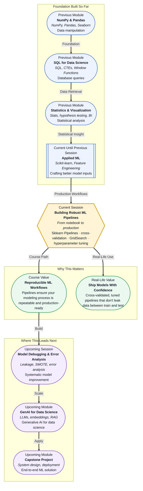

# Pre-read: Building Robust ML Pipelines

## Context of This Session in the Course

You have just finished feature engineering on a loan prediction dataset. You one-hot encoded the categorical columns, scaled the numeric features, and created new date-based features. You split the data, trained a Random Forest, and achieved 83% accuracy on your test set. Satisfied, you push your notebook to the team repository. The next day, your colleague runs it on their machine and gets 67%. They dig deeper and discover that you scaled the entire dataset before splitting — so your scaler learned statistics from the test data, silently leaking information into your training process. Your 83% was never real.

The naive approach — manually chaining `fit()`, `transform()`, and `predict()` calls across scattered notebook cells — is fragile at every step. Each transformation lives in its own code block. There is no guaranteed order, no automatic application to new data, and no safeguard against common mistakes like fitting a scaler on the full dataset or encoding a category that appears only in the test set. These bugs are invisible during development because the notebook runs end-to-end without errors. They only surface in production, when your model quietly underperforms and nobody knows why.

That is where **Scikit-learn Pipelines** become essential.

---

**What if** you could package your entire preprocessing workflow — encoding, scaling, feature selection — and your model into a single object that can be trained, evaluated, and deployed with three method calls? Imagine working on a fraud detection system where new transaction data arrives every hour. Your pipeline needs to encode merchant categories (some of which are new), scale transaction amounts to a consistent range, and retrain a classifier — all without manual intervention on each batch. A single misaligned column or a missing category in production today means false positives flood the operations team tomorrow. This session gives you the tools to build preprocessing pipelines that are reusable, testable, and impossible to accidentally misuse.

---

**Scikit-learn Pipelines** are a mechanism for chaining sequential data transformations and a final estimator into a single composable object. Instead of writing separate lines for `imputer.fit_transform()`, `scaler.fit_transform()`, and `model.fit()`, you define a pipeline object once: `Pipeline([('imputer', SimpleImputer()), ('scaler', StandardScaler()), ('clf', RandomForestClassifier())])`. A single call to `pipeline.fit(X_train, y_train)` runs every step in order on the training data; a single call to `pipeline.predict(X_test)` applies the identical transformations to the test set without any risk of leakage.

Think of a pipeline as an assembly line in a factory. Raw materials (raw data) enter at one end. Each station performs one operation — cleaning, measuring, assembling — and passes the result to the next station. The finished product (predictions) exits at the other end. Critically, the assembly line ensures the same operations happen in the same order every time, whether you are running a trial batch or full production. **Cross-validation** then evaluates how well your assembly line performs across different slices of your data, and **GridSearchCV** automatically tests combinations of parameters (e.g., "what if I use 100 trees instead of 50, or a different scaler?") to find the best configuration without manual trial and error.

---

In the **previous session**, you learned how to engineer features from raw data — one-hot encoding categorical variables, scaling numeric columns with Min-Max or StandardScaler, and creating new features from dates and text. You saw firsthand that better inputs lead to better models. That work now becomes the first stage of your pipeline. The encoding and scaling steps you previously applied as separate notebook cells become the initial transformation steps in a Pipeline object. The key shift is this: instead of manually remembering to apply each transformation to the test set, the pipeline guarantees it. Every `fit()` on the pipeline automatically calls `fit_transform()` on transformers and `fit()` on the final model; every `predict()` automatically calls `transform()` on all preprocessing steps before reaching the model. This discipline — enforced by the library, not by your memory — is what separates experimental notebooks from production-grade workflows.

In this pre-read, you will discover:

- How to **build** an end-to-end Scikit-learn Pipeline that chains preprocessing and modeling into a single object.
- How to **apply** cross-validation to evaluate model performance reliably across multiple data splits.
- How to **discover** optimal hyperparameters using GridSearchCV without manual trial-and-error looping.
- How to **connect** pipelines with cross-validation and grid search to create workflows that are reproducible, leakage-proof, and production-ready.

---

## Why Your Notebook Preprocessing Code Is a Liability

Every time you manually call `scaler.fit_transform(X_train)` in one cell and `scaler.transform(X_test)` in another, you introduce a maintenance risk. If you later add a new preprocessing step — say, a `SimpleImputer` to handle missing values — you must remember to update both the training and test code paths. If you change the order of operations, you must ensure every downstream reference stays consistent. In a notebook with 30 cells, these dependencies become invisible, and errors slip through code review because the notebook runs without crashing.

A **Pipeline** eliminates this risk by treating the entire preprocessing-to-modeling sequence as a single estimator. The pipeline object exposes the familiar `.fit()`, `.predict()`, and `.score()` methods, so it integrates seamlessly with Scikit-learn's cross-validation and tuning utilities. Behind the scenes, it ensures that `fit_transform()` is used during training and `transform()` is used during evaluation — the correct pattern that prevents data leakage. This is not an optional convenience. It is the standard practice in every production ML system, and it is the foundation upon which cross-validation and hyperparameter tuning are built.

## How Cross-Validation Reveals Your Model's True Performance

A single train-test split gives you one number. If that split happens to be easy — the test set looks very similar to the training set — your accuracy will be optimistically high. If the split is unlucky, your accuracy will be pessimistically low. Either way, you have no way of knowing whether your reported number is representative of how the model will perform on unseen data.

**K-fold cross-validation** addresses this by splitting the data into K equal folds, training the model K times, and using a different fold as the validation set each time. The result is K performance scores whose mean and standard deviation give you a realistic picture of model quality. A model that scores 85% on one split but 72% on another reveals high variance — a sign that the model may be overfitting or the data is not homogeneous. Scikit-learn's `cross_val_score` function works directly with Pipeline objects, meaning every fold automatically receives the same preprocessing transformations without any duplicated code. Combined, pipelines and cross-validation form a feedback loop: pipelines keep your preprocessing honest, and cross-validation keeps your performance estimates honest.

## Where Robust ML Pipelines Appear in Real Life

The pipeline pattern — chain transformations, cross-validate, tune — is not an academic exercise. It is the architectural backbone of real-world ML systems across industries. In **banking and finance**, credit risk models process raw application data through pipelines that handle missing income values, encode employment types, scale loan amounts, and feed a gradient boosting classifier. Cross-validation ensures the model performs consistently across different demographic segments, and GridSearch tunes thresholds to balance approval rates against default risk. A single misapplied transformation could mean approving loans that should be rejected, or vice versa — pipelines prevent this at the architectural level.

In **healthcare**, clinical outcome prediction pipelines ingest patient records with disparate data types: lab results in different units, categorical diagnosis codes with hundreds of levels, and free-text clinical notes. A pipeline chains a `ColumnTransformer` — which applies different transformations to different columns — with a classifier, and cross-validation across patient cohorts ensures the model generalises beyond the hospital where the training data was collected. Without pipelines, maintaining separate preprocessing logic for numeric, categorical, and text features across train-test splits becomes an operational nightmare.

For **e-commerce personalisation**, recommendation pipelines process user behaviour data — click timestamps, product categories, session durations — through feature engineering steps before a ranking model scores items. Hyperparameter tuning via GridSearchCV systematically tests different learning rates, tree depths, and regularisation strengths to maximise engagement metrics. In **fraud detection**, pipelines must handle extreme class imbalance by wrapping SMOTE as a pipeline step, ensuring that oversampling happens inside each cross-validation fold (not before the split), which prevents the model from seeing synthetic samples of the test set during training. Every industry that deploys models at scale relies on the same core pattern: encapsulate preprocessing, cross-validate honestly, and tune systematically.

---

## What's Next

After this session, you will be able to:

- Build a Scikit-learn Pipeline that chains multiple preprocessing steps with a final estimator into a single reusable object.
- Apply K-fold cross-validation using `cross_val_score` to obtain reliable performance estimates across multiple data splits.
- Use `GridSearchCV` to automatically search over hyperparameter combinations and select the best configuration.
- Connect pipelines, cross-validation, and grid search into an end-to-end workflow that prevents data leakage and supports reproducibility.

You do not need to memorise every Scikit-learn Pipeline API detail right now. The goal is to adopt a structural mindset: **encapsulate every transformation, cross-validate every estimate, and tune every parameter systematically.**

---

## Interesting Questions for the Live Session

- If a Pipeline encapsulates all preprocessing, how do you inspect intermediate outputs — like the scaled feature matrix after the second step — for debugging?
- What happens when you use `cross_val_score` with a pipeline that includes feature selection — does the feature selection happen independently inside each fold?
- Can GridSearchCV over-tune by trying too many combinations on the same cross-validation splits, and if so, how do you guard against it?
- How would you build a pipeline where different columns need different transformations — numeric columns scaled, categorical columns one-hot encoded, text columns converted to bag-of-words — in a single workflow?

By the end of this session, ML pipelines should feel less like an extra layer of complexity and more like the disciplined structure that turns messy notebook experiments into deployable systems: **preprocess once, cross-validate honestly, and tune with confidence.**
