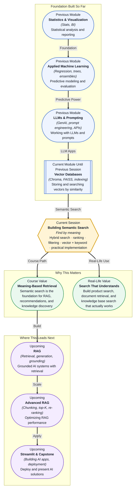

# Pre-read: Building Semantic Search

## Context of This Session in the Course

A product manager asks you to build a search feature for your company's internal knowledge base, which contains thousands of documents — policy PDFs, engineering runbooks, onboarding guides, and past project reports. You type "budget approval process" into your first prototype, and it returns three documents that contain those exact words. But when a colleague searches for "how do I get signoff for spending," the same search returns nothing — because the words "signoff" and "spending" never appear in the documents, even though the meaning is identical. The prototype is technically working. It is also practically useless.

This is the fundamental limitation of **keyword search**. It matches character sequences against character sequences. It does not understand that "budget approval process" and "getting signoff for spending" refer to the same concept. It does not know that "laptop for travel" and "portable computer for business trips" describe the same need. And as your knowledge base grows from a hundred documents to ten thousand, the problem compounds — because the right document exists somewhere in the collection, but the gap between what the user types and what the document says grows wider with every new synonym, abbreviation, and alternative phrasing.

A different approach to search solves this entirely. Instead of matching literal words, you can match by **meaning** — converting both the user's query and every document into numeric representations that capture semantic relationships, then finding the documents whose numerical signature is closest to the query's signature. This is **semantic search**, and it transforms search from a brittle string-matching exercise into a system that understands intent. That is where **Building Semantic Search** becomes essential.

---

**What if** you could search an organisation's entire knowledge base — policies, technical documentation, customer support transcripts, product specs, and internal wikis — and find the right document not by guessing the exact words the author used, but by describing what you need in your own words? Not just one document, but a ranked list of the most relevant results, ordered by how closely each one matches the meaning of your question, with the ability to filter by date, department, or document type, all in real time.

Now imagine the same system powering a customer-facing support experience. A user types "my order hasn't arrived yet" into a help centre, and the system surfaces the refund policy, the tracking FAQ, the escalation form, and a troubleshooting guide — in that order — because it understands that the meaning of "hasn't arrived" is semantically closer to "refund" and "tracking" than to "shipping policy." Every result is meaningful, every ranking is intentional, and no relevant document is left behind because of a vocabulary mismatch. This is the capability that **semantic search** unlocks, and by the end of this session, you will understand how to build it.

---

Semantic search works on a simple premise: convert text into numbers that capture meaning, then compare those numbers. The numbers are called **embeddings** — vectors (arrays of floating-point values) produced by a neural network that has been trained to place similar texts close together in a high-dimensional space. The sentence "I need budget approval" and the sentence "I need signoff on spending" produce embeddings that are numerically close, even though they share almost no common words, because the model that generated the embeddings learned that these phrases occur in similar contexts.

Think of it like a map of a city where every document is a building, and the map is arranged by *function* rather than by name. All restaurants cluster on one block, all government offices on another, all hospitals on a third. When you search, you are not looking for a building by its exact street address — you are saying "I need a restaurant" and the system points you to the nearest cluster of buildings that serve food. The name on the door does not matter. What matters is what the building *is*. That is the mental model for semantic search.

In this session, you will build exactly this kind of system. You will explore **hybrid search** — combining vector-based semantic matching with traditional keyword matching to get the reliability of both approaches. You will learn how to **rank results** by relevance score and tune that ranking for your specific use case. You will practice **filtering in vector databases** to narrow results by metadata like date, author, or category. And you will implement all of this in a practical pipeline that connects embeddings, a vector database, and a query interface into a working semantic search system.

---

In the **previous session**, you worked with vector databases — Chroma and FAISS — and learned how to store embeddings and query them by similarity. You indexed text segments, ran similarity searches, and saw how a vector database returns the nearest neighbours to any query vector. That infrastructure is the foundation you will build on today.

You now know how to create embeddings and store them. What you have not yet done is build a *search system* around them — one that balances semantic and keyword signals, produces ranked results that users can trust, and supports real-world constraints like filtering and performance. The vector database gives you the engine. This session gives you the steering wheel, the dashboard, and the road rules.

---

In this pre-read, you will discover:

- How to **understand** the limitations of keyword-only search and why semantic matching alone is also insufficient for production systems.
- How to **learn** the hybrid search pattern — combining vector similarity with keyword signals for more robust results.
- How to **apply** ranking, scoring, and filtering techniques to deliver relevant, production-quality search results.
- How to **connect** semantic search to downstream applications like RAG, document retrieval, and knowledge discovery.

---

## Why Keyword Search Alone Is Not Enough

Keyword search is fast, predictable, and easy to implement. A user types a phrase, and the system returns every document that contains those exact words, optionally ranked by term frequency or document popularity. This works well when the user knows exactly what terminology the document uses — for example, searching a programming documentation site for "Python list comprehension" reliably returns the relevant page because the query matches the document's language exactly.

But keyword search breaks down in three common scenarios. First, **synonym mismatch**: the user searches for "cheap flights" but the document says "budget airfare". Zero results. Second, **paraphrase mismatch**: the user asks "how do I reset my password" but the document is titled "account recovery steps". Zero results. Third, **concept mismatch**: the user searches for "machine learning model interpretability" but the document discusses "feature importance in random forests" without ever using the word "interpretability". A keyword system cannot connect these dots because it has no concept of meaning — only character overlap.

This is not a failure of the search algorithm. It is a structural limitation of treating text as a bag of words. When you search by meaning instead of by exact match, you stop asking "does the document contain these letters?" and start asking "is this document relevant to what I mean?" That shift is what semantic search provides, and it is why every major search engine, recommendation system, and knowledge base has moved beyond pure keyword matching.

## How Hybrid Search Brings the Best of Both Worlds

If semantic search is so powerful, why not use it exclusively? Because semantic search has its own failure modes. An embedding model might misinterpret a rare word, conflate two distinct concepts that happen to appear in similar contexts, or produce low-quality vectors for very short queries like "PDF" or "2024". A user searching for "COVID-19 policy 2024" might get results about pandemic trends instead of the specific PDF document they need, because the vector similarity captures the general semantic neighbourhood rather than the exact document identifier.

**Hybrid search** solves this by running two searches simultaneously — a semantic (vector) search and a keyword (sparse) search — and combining the results into a single ranked list using a technique called **reciprocal rank fusion** or a weighted score. The keyword component catches exact matches and handles short, specific queries well. The semantic component catches conceptual matches and handles paraphrased or synonym-rich queries well. Together, they cover each other's blind spots.

Concretely, a hybrid search system might compute a final score for each document as `0.5 * vector_similarity + 0.5 * keyword_score`, where the weights are tuned for the specific domain. A legal document search might weight keyword matching higher (because exact terminology matters), while a customer support search might weight semantic matching higher (because users describe problems in their own words). This weighting is itself a design parameter you will learn to set and evaluate, and it gives you fine-grained control over how your search system behaves across different query types.

---

## Where Semantic Search Appears in Real Life

Semantic search is already the backbone of some of the most widely used systems in industry, and its applications extend far beyond the obvious search bar.

In **e-commerce**, product search is no longer a simple keyword match. Companies like Amazon and eBay use semantic search to connect user queries with product listings even when the user's words do not match the product title. A customer searching for "waterproof hiking shoes for women" sees results even if the product listing says "women's trail running boots — weather resistant". The embedding model bridges the vocabulary gap, and hybrid ranking ensures that exact brand names and model numbers are still prioritised when the user types them explicitly.

In **enterprise knowledge management**, tools like Glean, Coveo, and Microsoft Viva use semantic search to index internal documents, Slack messages, emails, and wikis. An employee searching for "health insurance coverage for physiotherapy" can find the relevant HR policy PDF, a discussion thread where a colleague asked the same question, and a recent email from HR about policy changes — all in a single ranked list. The search system does not care which application the content lives in. It only cares about meaning.

In **customer support**, platforms like Zendesk and Intercom use semantic search to power their answer suggestion features. When a customer types "how do I cancel my subscription," the system retrieves the most relevant help centre articles, knowledge base entries, and previous ticket resolutions before a human agent even reads the query. This reduces response times and ensures consistent answers across the support team.

In **healthcare**, clinical decision support systems use semantic search to match patient symptoms and diagnoses against medical literature, treatment guidelines, and historical case records. A physician describing "persistent lower back pain with radiating numbness" can retrieve relevant journal articles and clinical trial summaries, even when the search query uses different terminology than the medical abstract. This is not a convenience feature — it directly affects the quality of patient care.

In **legal and compliance**, law firms and regulatory teams use semantic search to navigate vast document repositories during discovery, due diligence, and regulatory review. A lawyer searching for "prior art related to autonomous vehicle sensor calibration" needs results that capture the concept even when different patents use entirely different vocabularies. Semantic search turns months of document review into hours of targeted retrieval.

These applications share a common architectural pattern: an embedding model converts queries and documents into vectors, a vector database stores and retrieves them by similarity, a hybrid search layer combines semantic and keyword signals, and a ranking and filtering layer surfaces the most relevant results. Every component is tunable, and every use case requires a different configuration. That is what makes semantic search a craft rather than a plug-and-play solution.

---

## What's Next

After this session, you will be able to:

- Build a semantic search pipeline that converts user queries and documents into embeddings and retrieves relevant results by vector similarity.
- Implement hybrid search by combining vector-based retrieval with keyword matching using reciprocal rank fusion or weighted scoring.
- Apply pre-filtering and post-filtering strategies in Chroma and FAISS to narrow search results by metadata attributes.
- Tune ranking parameters — similarity thresholds, hybrid weights, and additional signals — to improve result quality for a specific domain.
- Connect a semantic search system to downstream workflows like document retrieval, knowledge base search, and RAG pipelines.

You do not need to deploy a production-grade search infrastructure at scale right now. The goal is to understand the core components — embeddings, vector search, hybrid fusion, ranking, filtering — and how they fit together: **search is not about matching words. It is about finding meaning.**

---

## Interesting Questions for the Live Session

- If a semantic search system returns the wrong document because the embedding model misinterpreted the query's meaning, how would you diagnose whether the fault lies in the embedding model, the vector database index, or the ranking logic?
- A user searches for "2024 budget" and the hybrid system returns both the 2024 budget PDF (via keyword match) and a 2023 budget discussion document (via semantic similarity). What ranking strategy would you use to ensure the exact match ranks higher without losing the related result entirely?
- Pre-filtering reduces the search space before similarity computation, but it can miss relevant documents if the metadata filter is too restrictive. Post-filtering is safer but slower for large datasets. How would you choose between these strategies for a knowledge base that grows by 10,000 documents per month?
- Semantic search is the retrieval foundation for RAG. If your RAG application produces poor answers, how would you isolate whether the problem is in the retrieval step (bad documents retrieved), the ranking step (wrong document prioritised), or the generation step (LLM misusing good context)?

By the end of this session, semantic search should feel less like a buzzword and more like a practical system you can design, tune, and ship: **find not by the words they used, but by the meaning they intended.**
