# Pre-read: Case Study: Executive Reporting

## Context of This Session in the Course

```mermaid
%%{init: {"flowchart": {"nodeSpacing": 45, "rankSpacing": 65, "diagramPadding": 20}} }%%
flowchart TB
    subgraph Foundation["Foundation Built So Far"]
        P1(["Previous Module<br/><b>Programming &amp; Data Foundations</b><br/><i>Python, APIs, JSON</i><br/>Python fundamentals"])
        P2(["Previous Module<br/><b>Data Analysis with NumPy &amp; Pandas</b><br/><i>NumPy, Pandas, Seaborn</i><br/>Data manipulation, EDA"])
        P3(["Previous Module<br/><b>SQL for Data Science</b><br/><i>SQL, CTEs, Window Functions</i><br/>Database queries"])
        C1[["Current Module Until Previous Session<br/><b>Statistics &amp; Data Visualization</b><br/><i>Calculated fields, filters, geographic mapping, worksheets</i><br/>Building interactive BI dashboards"]]
    end

    CS{{"Current Session<br/><b>Case Study: Executive Reporting</b><br/><i>From learning individual tools to delivering a complete insight package</i><br/>insight identification · KPI selection · narrative structure · executive summary · dashboard storytelling · data-driven recommendations"}}

    subgraph Value["Why This Matters"]
        CV(["Course Value<br/><b>Complete Data Professional</b><br/>The ability to synthesize and present findings is what separates analysts from data professionals"])
        RV(["Real-Life Value<br/><b>Boardroom-Ready Reporting</b><br/>Deliver insights executives can act on with confidence"])
    end

    subgraph Future["Where This Leads Next"]
        F1(["Upcoming Module<br/><b>Applied ML — Intro &amp; Regression</b><br/><i>Supervised learning, linear/logistic regression</i><br/>Enter predictive modeling"])
        F2(["Upcoming Module<br/><b>Applied ML — Trees, Ensembles, Pipelines</b><br/><i>Decision trees, random forests, feature engineering</i><br/>Advanced ML techniques"])
        F3(["Upcoming Module<br/><b>GenAI for Data Science</b><br/><i>LLMs, embeddings, vector DBs, RAG</i><br/>Generative AI applications"])
    end

    P1 ==>|&nbsp;Foundation&nbsp;| P2
    P2 ==>|&nbsp;Data Analysis&nbsp;| P3
    P3 ==>|&nbsp;Statistical Rigor&nbsp;| C1
    C1 ==>|&nbsp;Synthesize Insights&nbsp;| CS
    CS ==>|&nbsp;Course Path&nbsp;| CV
    CS ==>|&nbsp;Real-Life Use&nbsp;| RV
    CV ==>|&nbsp;Build&nbsp;| F1
    F1 ==>|&nbsp;Scale&nbsp;| F2
    F2 ==>|&nbsp;Apply&nbsp;| F3

    classDef previous fill:#eef4ff,stroke:#4f7ccf,color:#111827,stroke-width:2px;
    classDef current fill:#fff4d6,stroke:#d9a321,color:#111827,stroke-width:3px;
    classDef value fill:#eaf8ef,stroke:#3f9f63,color:#111827,stroke-width:2px;
    classDef future fill:#f4ecff,stroke:#8a61d1,color:#111827,stroke-width:2px;

    class P1,P2,P3,C1 previous;
    class CS current;
    class CV,RV value;
    class F1,F2,F3 future;
    linkStyle default stroke-width:3px;
```

You have just finished building a polished, interactive dashboard. The calculated fields return accurate numbers, the filters let your audience explore the data themselves, and the geographic map tiles load without a hitch. Then your manager walks over and asks a simple question: "Based on all this, what should we do next?" That question changes everything — because a well-built dashboard does not automatically deliver a well-reasoned recommendation.

The instinctive response is to describe what each chart shows. But executives do not have time to tour every visualization. They need the opposite: a distilled version of the data that answers a single strategic question. The challenge is not building the chart — it is deciding which chart matters, why it matters right now, and what action it suggests. Without a clear narrative, even the most technically impressive dashboard remains just a collection of graphs waiting for someone to connect the dots.

That is where **Case Study: Executive Reporting** becomes essential. This session asks you to step back from the tool and step into the role of a data professional who must analyze a real dataset, identify the three insights that matter most, and present them through a dashboard designed for decision-making rather than exploration.

---

**What if** you were asked to present at the next quarterly business review — and your entire presentation would be a single dashboard screen visible for five minutes?

You would need to know which KPIs the leadership team actually tracks, how to distinguish a signal from statistical noise, and what sequence of charts builds a convincing argument. You would also need to anticipate objections: why this trend matters, whether the sample size is sufficient, and what the confidence interval around your recommendation looks like. These are not design problems. They are **analytical reasoning problems** that happen to be expressed through a dashboard.

This session is built around exactly that scenario. By the end, the question "what should we do next?" will be one you can answer with specific data, clear reasoning, and a visual story that leaves no room for confusion.

---

**Executive reporting** is the practice of synthesizing raw data, statistical analysis, and visualizations into a concise deliverable that supports strategic decision-making. Unlike exploratory dashboards, which invite open-ended discovery, an executive report is tightly focused. Every chart, every KPI, and every annotation serves a specific argument. The goal is not to show everything — it is to show the right things in the right order.

Think of this as the difference between a library and a book review. A library contains all the information you might need, but you have to wander the aisles to find it. A book review tells you what matters, why it matters, and whether you should read the book at all. Your job in this session is to become the reviewer, not the librarian. The dataset is the library; your dashboard is the review.

You will explore three core techniques: **insight identification** (finding the findings worth reporting), **KPI selection** (choosing metrics that align with business strategy), and **narrative structure** (arranging your insights so they build toward a recommendation). These techniques apply whether you are using Tableau, Power BI, or any other visualization platform — the tool is secondary to the thinking.

---

In the **previous session**, you built interactive dashboards with calculated fields, filters, worksheet organization, and geographic mapping. You learned how to give stakeholders control over what they see. That skill is the foundation for this session, but it is only half the picture. The ability to let someone explore data is not the same as the ability to tell them what the data means.

This session completes the loop. Where 16.2 taught you to build the dashboard, 16.3 teaches you to use the dashboard to drive a decision. The calculated fields and filters you mastered become the raw material for insight identification. The sheets you arranged become the building blocks of a narrative. The geographic maps become evidence for a location-specific recommendation. You are not abandoning your dashboard-building skills — you are deploying them in service of a higher goal.

---

In this pre-read, you will discover:

- How to **analyze** a raw dataset and identify the three insights that carry the most strategic weight.
- How to **select** KPIs that connect your findings to business objectives, not just data availability.
- How to **build** a narrative arc that guides an executive from the problem to the recommendation.
- How to **present** data-driven recommendations through a dashboard optimized for clarity, not density.

---

## How to Identify Insights That Drive Decisions

Every dataset contains dozens of possible findings. The art of executive reporting is knowing which three to surface. Start by asking: what decisions does the audience need to make? If the dataset is sales data, the executive may need to decide where to allocate marketing budget, which regions need attention, or which product lines are underperforming. Each of those decisions maps to a specific measurable question — and only the questions that map to a decision are worth answering.

Once you frame the decision, examine the data for patterns that challenge assumptions or reveal opportunities. A steady month-over-month growth rate is not an insight — it is a description. An insight is something like "the West region grew 12% but profitability dropped because shipping costs outpaced revenue." That statement contains a trend, a caveat, and an implied action. It tells the executive where to look next.

Use your statistical foundation from earlier sessions to validate each insight. Check whether a difference is statistically significant, whether the sample size supports the claim, and whether a correlation might be explained by a third variable. The confidence you bring to your recommendation depends directly on the rigor you applied before presenting it.

## Structuring an Executive Narrative

An executive dashboard tells a story in three acts. The first act establishes the current state: what is happening, where, and how it compares to expectations. This is where you place your summary KPIs — revenue, cost, conversion rate — benchmarked against targets or historical periods. The second act reveals the tension: which metric is diverging, which segment is underperforming, or which trend is accelerating. This section isolates the specific finding that demands attention. The third act delivers the recommendation: based on the evidence, what should the organization do differently?

Each act maps to a distinct visual layout. The first act uses scorecard-style KPIs with sparklines. The second act uses a filtered chart that zooms in on the anomaly, annotated with a brief callout explaining the cause. The third act uses a scenario chart or a before-and-after comparison that makes the recommendation concrete. By structuring the dashboard this way, you eliminate guesswork. The executive never has to ask "so what?" because the answer is built into the layout.

## Where Executive Reporting Appears in Real Life

Executive reporting is not a classroom exercise — it is the primary way data influences decisions in organizations worldwide. In **retail and e-commerce**, reporting dashboards track inventory turnover, customer acquisition cost, and basket size across regions; a single insight about a declining repeat-purchase rate can redirect millions in marketing spend. In **healthcare**, administrative dashboards monitor patient wait times, readmission rates, and resource utilization — enabling hospital leadership to allocate staff where wait times spike. In **financial services**, risk dashboards surface changes in portfolio volatility, credit default rates, and liquidity ratios, giving investment committees the evidence they need to rebalance exposure. In **SaaS companies**, executive dashboards track monthly recurring revenue, churn by cohort, and feature adoption, turning product usage data into roadmap priorities. In **logistics and supply chain**, dashboards visualize on-time delivery rates, warehouse throughput, and route efficiency, helping operations teams identify bottlenecks before they cascade. Each of these contexts demands the same skill: look at the data, find three things that matter, and present them so clearly that the next decision becomes obvious.

---

## What's Next

After this session, you will be able to:

- Analyze a raw dataset and extract the three insights most relevant to a strategic question.
- Select KPIs that align with business objectives rather than data availability.
- Structure a dashboard narrative that guides viewers from context to recommendation.
- Present data-driven recommendations with supporting evidence in a single screen.
- Validate each insight for statistical significance before including it in a report.
- Frame ambiguous findings honestly — knowing when to say "the data is inconclusive" is itself a valuable insight.

You do not need to memorize every dashboard feature or statistical test right now. The goal is to shift your mindset from building charts to delivering decisions: **a dashboard is not a report — it is a conversation with data.**

---

## Interesting Questions for the Live Session

- When you analyze a dataset and find ten interesting patterns, what criteria do you use to narrow them down to the three worth reporting?
- If your strongest insight is based on a correlation, how do you decide whether it is strong enough to include in an executive recommendation?
- How do you handle a situation where the data supports a conclusion that contradicts the executive team's existing assumption?
- What is the difference between designing a dashboard for exploration (what you learned in 16.2) and designing one for a decision (this session), and how do the layouts differ?

By the end of this session, executive reporting should feel less like a presentation task and more like a strategic skill: **insights without narrative are just numbers — narrative turns them into decisions.**
