# Pre-read: Choosing the Right Chart

## Context of This Session in the Course

```mermaid
%%{init: {"flowchart": {"nodeSpacing": 45, "rankSpacing": 65, "diagramPadding": 20}} }%%
flowchart TB
    subgraph Foundation["Foundation Built So Far"]
        P1(["Previous Module<br/><b>Module 1: Programming &amp; Data Foundations</b><br/><i>Python, APIs, JSON</i><br/>Python fundamentals, data collection"])
        P2(["Previous Module<br/><b>Module 2: Data Analysis with NumPy &amp; Pandas</b><br/><i>NumPy, Pandas, Seaborn</i><br/>Data manipulation, EDA"])
        P3(["Previous Module<br/><b>Module 3: SQL for Data Science</b><br/><i>SQL, CTEs, Window Functions</i><br/>Database queries, data retrieval"])
        C1[["Current Module Until Previous Session<br/><b>Module 4: Statistics &amp; Data Visualization</b><br/><i>Visual hierarchy, color theory, clutter removal</i><br/>Designing charts that communicate effectively"]]
    end

    CS{{"Current Session<br/><b>Choosing the Right Chart</b><br/><i>From generic plots to purpose-driven chart selection</i><br/>histograms · bar charts · line charts · scatter plots · data-type mapping · visual marks · distribution · comparison · trend · relationship"}}

    subgraph Value["Why This Matters"]
        CV(["Course Value<br/><b>Analytical Precision in Visualization</b><br/>Choosing the wrong chart type can mislead; the right one makes insights obvious"])
        RV(["Real-Life Value<br/><b>Decision-Ready Dashboards</b><br/>Business stakeholders get clear answers when chart types match the question"])
    end

    subgraph Future["Where This Leads Next"]
        F1(["Upcoming Module<br/><b>Advanced Seaborn &amp; Interactive Plots</b><br/><i>Facet grids, pair plots, interactivity</i><br/>Move beyond basic chart types"])
        F2(["Upcoming Module<br/><b>BI Tools &amp; Dashboards</b><br/><i>Tableau/PowerBI, calculated fields</i><br/>Build interactive dashboards"])
        F3(["Upcoming Module<br/><b>Applied ML &amp; GenAI</b><br/><i>Regression, trees, LLMs, RAG</i><br/>Predictive modeling and generative AI"])
    end

    P1 ==>|&nbsp;Foundation&nbsp;| P2
    P2 ==>|&nbsp;Data Analysis&nbsp;| P3
    P3 ==>|&nbsp;Statistical Rigor&nbsp;| C1
    C1 ==>|&nbsp;Right Chart&nbsp;| CS
    CS ==>|&nbsp;Course Path&nbsp;| CV
    CS ==>|&nbsp;Real-Life Use&nbsp;| RV
    CV ==>|&nbsp;Build&nbsp;| F1
    F1 ==>|&nbsp;Scale&nbsp;| F2
    F2 ==>|&nbsp;Apply&nbsp;| F3

    classDef previous fill:#eef4ff,stroke:#4f7ccf,color:#111827,stroke-width:2px;
    classDef current fill:#fff4d6,stroke:#d9a321,color:#111827,stroke-width:3px;
    classDef value fill:#eaf8ef,stroke:#3f9f63,color:#111827,stroke-width:2px;
    classDef future fill:#f4ecff,stroke:#8a61d1,color:#111827,stroke-width:2px;

    class P1,P2,P3,C1 previous;
    class CS current;
    class CV,RV value;
    class F1,F2,F3 future;
    linkStyle default stroke-width:3px;
```

You have just run a customer satisfaction survey for your company. You open your notebook, load the data, and generate a few charts to share with your team. One shows average scores by region using bars. Another shows the same numbers as a pie chart. Your manager glances at both and asks: "Which one should I trust?"

Both charts use the same data, but they tell different stories. The bar chart makes regional differences easy to spot; the pie chart renders small segments nearly invisible. This is not a question of aesthetics. It is a question of mapping **data types** to **visual marks** — choosing the chart that makes the insight obvious instead of hiding it. Whether you are reporting sales trends, comparing group performance, or exploring how two variables relate, the right chart does the hard work for you. The wrong one can mislead, confuse, or bury the message entirely. That is where **Choosing the Right Chart** becomes essential.

---

**What if** your executive team asked you to build a weekly dashboard that answers five different business questions — revenue trends, regional comparisons, the distribution of customer ages, the correlation between ad spend and conversions, and product category rankings — all on a single screen? A dashboard with mismatched chart types would overwhelm the viewer with visual noise. A well-designed one would let the executive spot the answer in seconds. The difference is not in the data. It is in knowing which **visual mark** to use for each type of question. This session gives you the framework to make that call with confidence.

---

At its heart, data visualization is about **mapping data to visual marks**. Every chart you create uses marks — bars, points, lines, slices — to represent data. The critical insight is that each type of mark is suited to a specific type of question. Think of chart types like tools in a toolbox. A hammer is excellent for nails but terrible for screws. A **histogram** reveals the **distribution** of a single variable — where values cluster, how spread out they are, and whether the shape is symmetric or skewed. A **bar chart** makes **comparisons** easy by showing discrete categories side by side. A **line chart** reveals **trends** over time by connecting data points in sequence. A **scatter plot** uncovers **relationships** between two continuous variables — showing whether they move together, in opposite directions, or not at all. In this session, you will build a mental framework for choosing among these four chart types based on the data type and the question you need to answer. You will explore how **data-type mapping** — matching categorical, numerical, and temporal data to the right visual representation — turns a confusing set of plots into a purposeful narrative.

---

In the **previous session**, you explored the **Principles of Visual Storytelling** — how visual hierarchy, color theory, and clutter removal transform a confusing chart into a clear message. You learned that every element on a chart should serve a purpose: bold colors for key insights, muted tones for context, and white space to guide the eye. That foundation now becomes the design layer on top of this session's technical core. The principles of visual storytelling tell you *how* to make a chart readable. This session tells you *which chart to make in the first place*. Choosing the right chart type is the structural decision; applying visual storytelling principles makes that structure sing.

---

In this pre-read, you will discover:

- How to **recognise** which chart type matches a given data type and analytical question.
- How to **apply** histograms, bar charts, line charts, and scatter plots to distributions, comparisons, trends, and relationships.
- How to **interpret** the story a chart tells by reading its visual marks and encoding choices.
- How to **connect** chart selection to the principles of visual storytelling learned in the previous session.

---

## Why Histograms and Bar Charts Are Not the Same Thing

A common mistake among beginners is treating histograms and bar charts as interchangeable. Both use rectangular bars, both encode values through bar height, but they answer profoundly different questions. A **histogram** groups continuous numerical data into bins and shows how often values fall into each bin. It answers: *What does the distribution of this variable look like?* Are customer ages concentrated around 30, or spread from 18 to 70? Is the data symmetric, skewed, or bimodal? A histogram reveals shape, spread, and central tendency in a single view. A **bar chart** works with categorical data. Each bar represents a distinct category — product names, regions, departments — and the height shows a summary value like count, average, or total. Bar charts answer: *How do these categories compare?* The gap between bars signals that these are separate groups, not a continuous range. The distinction comes down to your data type. Continuous numerical data calls for a histogram. Categorical data calls for a bar chart. Mixing them up — using a bar chart on continuous data or a histogram on categories — creates a chart that is technically incorrect and potentially misleading.

## How Line Charts and Scatter Plots Answer Different Questions

Two variables give you more to explore, but they also demand sharper chart choices. A **line chart** connects data points in sequence along a time axis. It answers: *What is the trend over time?* Are sales rising, falling, or staying flat? Is there a seasonal pattern? The line connects the dots because the order matters — time creates a natural narrative. A **scatter plot** places individual points on two axes without connecting them. It answers: *What is the relationship between these two variables?* Do higher ad spends lead to more conversions? Is there a correlation between years of experience and salary? The scatter plot reveals patterns — positive correlation, negative correlation, clusters, or outliers — that no single-number summary can capture. The key insight: if your x-axis is time, use a line chart. If your x-axis is another numeric variable and you want to see how they co-vary, use a scatter plot. Choosing the wrong one — plotting time as unconnected points or forcing a line through unrelated variables — obscures the pattern you are trying to show.

## Where Chart Selection Appears in Real Life

Choosing the right chart is not an academic exercise. It appears in every professional setting where data needs to communicate a decision. In **marketing analytics**, teams use bar charts to compare campaign performance across channels, line charts to track weekly engagement trends, and scatter plots to explore the relationship between ad spend and conversion rate. A mis-chosen chart can lead a team to invest in the wrong channel. In **healthcare reporting**, histograms reveal the distribution of patient wait times or blood pressure readings, helping hospitals identify bottlenecks or risk groups. A bar chart where a histogram belongs would hide the shape of the distribution and miss the story entirely. In **financial analysis**, line charts are indispensable for tracking stock prices, portfolio returns, and economic indicators over time, while scatter plots help analysts spot correlations between asset classes. In **product management**, scatter plots help prioritise features by plotting customer impact against development effort, bar charts compare feature adoption rates across user segments, and line charts show retention trends after each product release. In **operations and logistics**, histograms show the distribution of delivery times to reveal whether most shipments arrive within the promised window, bar charts compare performance across warehouses, and line charts track daily throughput. Across every domain, the chart you choose shapes the decision your audience makes.

---

## What's Next

After this session, you will be able to:

- Map any dataset's columns to the correct chart type based on data types and analytical question.
- Build a histogram to reveal the distribution of a continuous variable and interpret its shape.
- Construct a bar chart for comparing summary statistics across categorical groups.
- Plot a line chart to visualise trends over time and identify seasonal patterns.
- Create a scatter plot to explore relationships between two continuous variables.

You do not need to memorise every chart variation right now. The goal is to build an instinct for matching data types to visual marks: **the right chart makes the insight obvious; the wrong chart buries it.**

---

## Interesting Questions for the Live Session

- If a bar chart shows similar heights across all categories, does that mean the data is uninteresting, or could it reveal something important about fairness or equality?
- When you have a time-based variable, should you ever choose a scatter plot over a line chart, and what would you gain or lose by doing so?
- A histogram's appearance changes dramatically depending on bin width. How do you decide the right bin size without manipulating the viewer's perception?
- If your audience includes both technical and non-technical stakeholders, which chart type trade-offs do you make, and who should the final visual prioritise?

By the end of this session, choosing the right chart should feel less like a subjective design choice and more like a systematic decision: **map the data type to the visual mark, and let the question drive the chart.**
