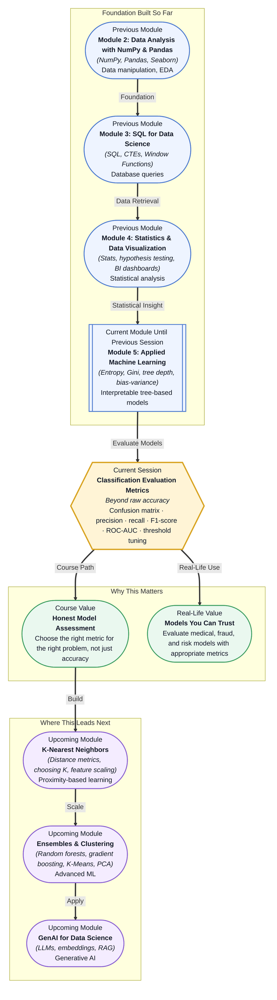

# Pre-read: Classification Evaluation Metrics

## Context of This Session in the Course

You submit a fraud detection model to your team with a proud 99% accuracy. It gets deployed. Two weeks later, the fraud team is furious — the model caught almost nothing. How is that possible when the number looked so good?

The problem is that accuracy is a seductive but shallow metric. In most real-world datasets, the thing you care about — fraud, disease, equipment failure — is rare. A model that always predicts "no" scores sky-high accuracy while being completely useless. It hides the real question: *what kind of mistakes is your model making?*

That is where **Classification Evaluation Metrics** becomes essential. Instead of trusting a single number, you learn to dissect performance with the confusion matrix, precision, recall, F1-score, and ROC-AUC curves. These tools reveal what accuracy hides and put you in control of how your model behaves.

---

**What if** you were the data scientist responsible for approving or denying thousands of small-business loan applications? Your model's prediction shapes someone's livelihood. Approve a bad loan and the bank loses money. Deny a good applicant and you harm a legitimate business owner. Accuracy alone cannot guide you — you need to decide which kind of mistake is more costly for your specific context. The metrics in this session give you that power: the ability to tune a model to favour precision or recall depending on the stakes involved, and to explain those tradeoffs to stakeholders with clarity.

---

Every evaluation metric flows from a single source: the **confusion matrix**, a 2&times;2 table that records every prediction a model makes. It answers four questions — how many times did the model correctly predict the positive class (**true positives**), correctly predict the negative class (**true negatives**), incorrectly flag a negative as positive (**false positives**), and miss a positive entirely (**false negatives**)?

Think of it like a medical test. A pregnancy test can be right or wrong in two ways. **Precision** asks: of all positive predictions the model made, how many were correct? **Recall** asks: of all actual positives in the data, how many did the model catch? **F1-score** is the harmonic mean of the two — a single number that balances them when you want neither precision nor recall to dominate.

**ROC-AUC curves** go a step deeper. Most classifiers output a probability, and you choose a threshold to convert that probability into a class prediction. By sliding that threshold, you trade precision for recall (or vice versa). The ROC curve plots this tradeoff across every possible threshold, and the AUC summarises the model's ability to distinguish between classes — independent of any single threshold. You will explore the confusion matrix, precision and recall, F1-score, and ROC-AUC as a complete diagnostic toolkit.

---

In the **previous session**, you built decision trees and encountered the bias-variance tradeoff. You learned that a tree can be too shallow (underfit) or too deep (overfit), and that the art of modelling is finding the sweet spot. But how do you *measure* whether a tree is overfitting? You used training versus test accuracy — a comparison that, as you now know, can mislead when classes are imbalanced or when different errors carry vastly different costs.

This session gives you a far more precise diagnostic kit. The confusion matrix, precision, recall, F1-score, and ROC-AUC will become the standard lens through which you evaluate every model you build — logistic regression, KNN, random forests, gradient boosting, and beyond. You will no longer ask "what is the accuracy?" but "what kind of mistakes does my model make, and do I accept them?"

---

In this pre-read, you will discover:

- How to **interpret** a confusion matrix and derive precision, recall, and F1-score from it
- How to **recognise** when accuracy is misleading and why the precision-recall tradeoff matters
- How to **apply** ROC-AUC curves to compare classification models fairly across all thresholds
- How to **connect** evaluation metrics to real-world consequences in healthcare, finance, and fraud detection

---

## Why Accuracy Is Not Enough

Accuracy counts correct predictions divided by total predictions. For a perfectly balanced dataset this is a reasonable starting point, but real data is almost never balanced. Consider a spam filter: out of 1,000 emails, 20 are spam. A classifier that marks every email as "not spam" achieves 98% accuracy — it correctly classified 980 emails — but it caught zero spam.

In security, fraud detection, medical screening, and quality control, the rare class is often the one that matters most. Once you move beyond accuracy, you gain the ability to answer specific questions: Is your model overcautious, generating too many false positives? Is it reckless, missing too many true positives? The answer changes how you deploy it. A confusion matrix gives you those answers at a glance.

## The Precision-Recall Tradeoff

Precision and recall pull in opposite directions. A model that only predicts "positive" when it is extremely confident will have high precision but miss many actual positives (low recall). A model that labels everything "positive" liberally will catch almost every positive (high recall) but will also flag many negatives (low precision).

This is not a bug — it is a design choice informed by business context. In medical diagnosis, you favour high recall — missing a tumour is far worse than a false alarm for further testing. In legal document review during discovery, you favour high precision — flagging every document as relevant would waste your team's time reviewing irrelevant material. The F1-score gives you one number to optimise when you want a balanced approach, but the real power is in understanding the tradeoff and choosing deliberately.

ROC-AUC curves visualise this tradeoff across every possible threshold, giving you a global view of your model's discriminative power. A high AUC means the model ranks positives higher than negatives on average, regardless of where you set the cutoff.

## Where Evaluation Metrics Appear in Real Life

These metrics are the language of every production classification system. In **fraud detection**, banks optimise for high recall because a missed fraudulent transaction costs real money; they accept more false alarms that trigger manual review. In **healthcare**, cancer detection models are tuned for near-perfect recall — a false negative could mean a missed diagnosis and lost treatment window. In **credit scoring**, lenders balance precision and recall to approve creditworthy applicants while minimising defaults and charge-offs.

E-commerce recommendation systems use precision to ensure suggested products are genuinely relevant to the user. **Search engines** evaluate ranking quality with variants of precision and recall at different cutoff depths (precision@k, recall@k). **Manufacturing quality control** systems flag defective products using recall-focused thresholds, because shipping a defective product damages brand reputation far more than rejecting a few good units for extra inspection. In every case, someone is using these metrics to decide whether a model is ready for the real world — and how it should behave once it gets there.

---

## What's Next

After this session, you will be able to:

- Interpret a confusion matrix and compute precision, recall, and F1-score from raw prediction counts
- Diagnose when accuracy masks poor performance on minority classes
- Tune a classifier's decision threshold to prioritise precision or recall for a given business need
- Compare multiple models using ROC-AUC curves and explain what the AUC value means
- Select the appropriate evaluation metric for fraud detection, medical diagnosis, customer churn, and other common applications

You do not need to memorise every formula right now. The goal is to develop a diagnostic mindset: **never trust a single metric — always ask what kind of mistakes your model is making.**

---

## Interesting Questions for the Live Session

- If a model has 99% accuracy but 0% recall on the positive class, how would you explain to a stakeholder why the model should not be deployed?
- Can two models with identical F1-scores behave completely differently, and what would that tell you about the limitations of a single-number summary?
- When would you choose a precision-recall curve over an ROC curve, and when might one of them paint a misleadingly optimistic picture?
- How does severe class imbalance affect each metric differently — which ones become unreliable and which remain robust?

By the end of this session, evaluation metrics should feel less like abstract formulas and more like a diagnostic toolkit: **the confusion matrix is the X-ray, precision-recall is the vital signs monitor, and ROC-AUC is the full health report.**
