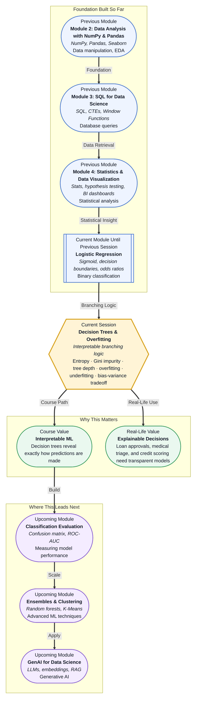

# Pre-read: Decision Trees & Overfitting

## Context of This Session in the Course

Imagine you are part of an emergency triage team in a busy hospital. A patient arrives with chest pain, shortness of breath, and a history of smoking. Your protocol is a flowchart: is the pain radiating to the left arm? Yes — escalate. Is the patient under 40 with no cardiac history? No — move to the next question. Each answer narrows the possibilities. This branching logic is natural to human decision-making — and it is exactly how decision trees work under the hood.

But here is the hidden danger. If your triage checklist grows to hundreds of highly specific rules — "does the patient have chest pain AND arrived on a Tuesday AND is wearing a blue shirt?" — you start encoding coincidence, not causality. Your system fits the past cases perfectly but fails on the next real patient. That is **overfitting**: memorising the noise instead of learning the signal. Conversely, a checklist with only two questions may miss critical cases — that is **underfitting**.

The tension between being too specific and too general is the central battle in all of machine learning. It is called the **bias-variance tradeoff**, and mastering it is what separates models that work in theory from models that work in production. That is where **Decision Trees & Overfitting** becomes essential.

---

**What if** you had to build a loan approval system for a bank — one that regulators, auditors, and loan applicants can all inspect and understand? A black-box model would violate transparency requirements. Your model must not only predict accurately but also explain *why*: "Your application was declined because your debt-to-income ratio exceeds 40% and your credit history is shorter than three years." Decision trees deliver exactly this: a visible flowchart of if-then rules that anyone can read. The real challenge is keeping the tree complex enough to capture genuine patterns but simple enough to avoid memorising random fluctuations. This session gives you the framework to strike that balance.

---

At the heart of every decision tree is one question: which feature should I split on first, and where should I draw the boundary? The tree uses measures of purity to decide. **Entropy** and **Gini impurity** are two mathematical tools that quantify how mixed a group of labels is. A pure group — all one class — has low entropy; a mixed group has high entropy. The tree picks the split that reduces impurity the most.

Think of organising a messy wardrobe. You start with a giant pile of mixed clothes. Your first split might be "is it a top or bottom?" Then you ask "is it formal or casual?" Each question divides the pile into purer categories. You keep splitting until every pile is neatly labelled — or you stop early to avoid creating categories so specific they hold only one shirt.

The **depth** of the tree — how many questions you ask in sequence — controls this behaviour. A deep tree captures very specific patterns but risks **overfitting**: learning noise that does not generalise to new data. A shallow tree may be too simplistic, leading to **underfitting**. This balancing act is the **bias-variance tradeoff**: high bias means a simple model with systematic errors; high variance means a complex model that is overly sensitive to training data fluctuations.

---

In the **previous session**, you learned **Logistic Regression** — a model that draws a straight decision boundary between classes using the sigmoid function. Logistic regression works well when the relationship between features and the target is roughly linear, but it struggles when the decision surface has complex shapes — like a tree with many branches. Decision trees solve this by partitioning the feature space into rectangles instead of drawing a single line. Where logistic regression gives you odds ratios and a smooth probability curve, decision trees give you human-readable if-then rules. The branching logic you will explore today is a natural evolution from the linear boundaries you mastered last session.

---

In this pre-read, you will discover:

- How to **understand** the way decision trees split data using entropy and Gini impurity.
- How to **recognise** the symptoms of overfitting and underfitting in a trained model.
- How to **interpret** the bias-variance tradeoff and its impact on model performance.
- How to **connect** tree depth to model generalisation and real-world decision-making.

---

## How a Tree Decides Where to Split: Entropy and Gini

Each node in a decision tree asks a yes-or-no question about a feature: "Is age greater than 30?" or "Is the applicant employed?" But how does the tree know which question to ask first? It evaluates every possible split across every feature and picks the one that creates the purest child groups.

**Entropy**, borrowed from information theory, measures the disorder in a set. If you have ten data points — five positive and five negative — entropy is at its maximum (1.0). If all ten are positive, entropy is zero. The tree calculates the reduction in entropy — called **information gain** — for each candidate split. The split with the highest information gain wins.

**Gini impurity** is an alternative to entropy. It asks: if I randomly pick two data points from a group, how likely are they to belong to different classes? A pure node has Gini = 0. In practice, Gini is slightly faster to compute and often produces similar splits to entropy. Most machine learning libraries let you choose which criterion to use, and the difference is usually small.

What matters is the intuition: the tree is a **greedy algorithm**. At each step, it makes the best local decision without looking ahead. This greedy approach makes training fast, but it can sometimes miss a better global split that requires a seemingly worse first split. Understanding this limitation helps you diagnose when a tree might be underperforming.

## The Overfitting Trap: When the Tree Memorises Instead of Learning

Here is a scenario every data scientist has faced: you train a decision tree on a dataset of 1,000 patients and let it grow until every leaf node contains exactly one patient. The tree achieves 100% accuracy on the training set. You celebrate — then you test it on new data, and accuracy drops to 60%.

The tree memorised the training data. It learned not just the real patterns — smoking causes heart disease — but also the noise: patient 347 had chest pain and happened to wear a red shirt. This is **overfitting**, the single most common pitfall in tree-based models.

Preventing overfitting requires deliberate strategies. **Pruning** means cutting back the tree after it grows — removing branches that do not improve performance on a validation set. **Limiting tree depth** sets a maximum number of questions the tree can ask. **Setting a minimum samples per leaf** ensures the tree does not create rules based on a single data point. Each of these techniques introduces a small amount of bias to reduce variance, trading perfect training accuracy for better generalisation.

The bias-variance tradeoff applies to every ML model, but decision trees make it visible and intuitive. You can literally plot a tree's training accuracy versus validation accuracy as depth increases and watch the gap widen. That visual is one of the most powerful diagnostic tools in machine learning.

## Where Decision Trees Appear in Real Life

Decision trees are not just classroom examples. They appear in high-stakes industries where interpretability is non-negotiable. In **healthcare**, doctors use decision trees to triage patients — a simple flowchart for "is this an emergency?" can be validated by medical boards and understood by every nurse on the floor. In **banking and finance**, loan officers deploy decision trees to decide creditworthiness; regulators can audit the rules and verify there is no discrimination based on protected attributes like race or gender. In **insurance**, underwriting teams use trees to price premiums based on risk factors such as age, location, and health history. In **manufacturing**, quality control systems apply decision trees to inspect products on assembly lines — if a sensor reading exceeds a threshold, the item is flagged for review. In **retail and e-commerce**, decision trees power recommendation rules: "if a customer bought a laptop and is a student, show backpack offers." Across all these domains, the core value is identical — a model that can explain itself builds trust, and trust is what puts models into production.

---

## What's Next

After this session, you will be able to:

- Split a dataset using entropy and Gini impurity to build a decision tree from scratch.
- Diagnose overfitting by comparing training and validation accuracy as tree depth increases.
- Apply pruning and depth constraints to control the bias-variance tradeoff.
- Interpret a trained decision tree and explain its predictions to non-technical stakeholders.
- Use scikit-learn's `DecisionTreeClassifier` to train and visualise a tree on a real dataset.
- Compare decision trees with logistic regression to understand when each model is appropriate.

You do not need to master every hyperparameter right now. The goal is to build a strong mental model: **tree-based models are transparent by design, and managing their complexity is the key to making them reliable.**

---

## Interesting Questions for the Live Session

- If a decision tree achieves 98% accuracy on training data but only 65% on test data, which specific strategies would you try first — and why would you choose one over another?
- Entropy and Gini impurity often produce similar splits, but not always. Can you think of a dataset where they would lead to different trees?
- A tree with depth 1 (a stump) is high-bias and low-variance. A tree with depth 100 is low-bias and high-variance. Where is the sweet spot and how would you find it systematically?
- Decision trees are prized for interpretability, but a tree with 50 levels is no longer interpretable to a human. At what point does a tree stop being "explainable"?

By the end of this session, the bias-variance tradeoff should feel less like a theoretical abstraction and more like a practical tuning lever: **the art of machine learning is knowing when to stop growing the tree.**
