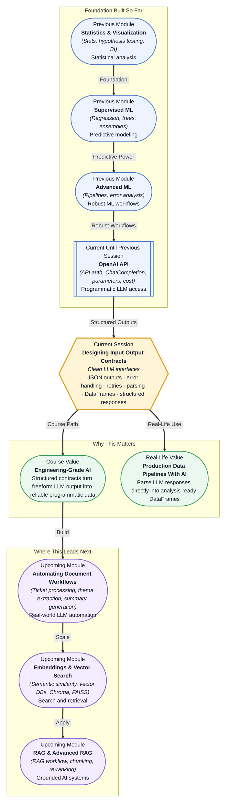

# Pre-read: Designing Input-Output Contracts

## Context of This Session in the Course

You send a prompt to an LLM, and the response comes back beautifully written — fluent, confident, perfectly grammatical. You feed that response into your Python script expecting a structured JSON object with fields like `"sentiment": "positive"` and `"confidence_score": 0.92`. Instead, the model returns: *"The sentiment of this review is positive, and I would say I am quite confident about it, maybe around 92% sure."* Your parser breaks. Your DataFrame column is empty. Your pipeline crashes at 2 AM.

This is the moment where a working prototype becomes a production headache. An LLM's natural output is prose — variable, conversational, and unpredictable in structure. It can format the same information ten different ways across ten invocations. When you need that output to feed directly into a database, an API, or a pandas DataFrame, freeform text is not a feature — it is a liability. The model is not wrong; it answered your question correctly. But it did not answer in a way your code can consume reliably.

That is where **Designing Input-Output Contracts** becomes essential. This session teaches you to define a precise, machine-readable specification for what you send to an LLM and what you expect back — turning a chatty, well-meaning language model into a predictable data source that your Python pipeline can depend on.

---

**What if** you were building a customer feedback analysis system that processes ten thousand reviews every night, extracts sentiment, key themes, and actionable urgency for each one, and loads the results into a structured database table — all without a human reading a single review? Your current pipeline calls the OpenAI API, receives a block of text, and tries to extract structured fields using regex. It works about 60% of the time. On the other 40%, a review written in an unexpected tone or a model that decides to answer in bullet points instead of JSON causes a silent failure that corrupts your nightly report. What if you could define a contract — a formal agreement between your code and the model — that guarantees every response arrives in exactly the shape you specified, with every field present, every type correct, and every edge case handled gracefully? That is what input-output contracts deliver, and it is the difference between a script that mostly works and a pipeline that runs unattended for months.

---

An **input-output contract** is a formal specification that describes exactly what structure your request to an LLM expects and exactly what structure the response must adhere to. Think of it like a form at a government office: the form does not care about your writing style, it cares that you fill in the "Name" field, the "Date of Birth" field, and the "Signature" field in exactly the prescribed format. The clerk does not need to interpret prose; they scan the fields, validate the values, and process the application. An input-output contract does the same for your code — it tells the LLM *"respond in this exact shape, with these exact field names, using this exact format"*, and then your parser can validate and consume the response without guesswork.

The most common contract format in LLM applications is **JSON** — a structured, nested key-value representation that every programming language can parse. You embed a JSON schema inside your prompt, specify the fields and their expected types, and instruct the model to return only valid JSON. Your Python code then calls `json.loads()`, validates the fields, and proceeds with confidence. But contracts go beyond just asking for JSON. They include **graceful failure handling** — what happens when the model returns malformed JSON or omits a required field. They include **retry logic** — how many times to re-request and under what conditions. And they include **parsing strategies** — how to transform the validated JSON response into a pandas DataFrame for downstream analysis. You will explore all four dimensions in this session: defining JSON schemas in prompts, handling parse failures without crashing, implementing exponential backoff retries, and converting structured LLM outputs into analysis-ready DataFrames.

---

In the **previous session**, you learned to make authenticated calls to the OpenAI ChatCompletion endpoint, configure parameters like temperature and top-p to control output variability, and manage token costs. That session gave you the raw ability to send prompts and receive text responses. But a raw text response, however well-written, is not yet a reliable data source. The temperature parameter you tuned to reduce randomness, the top-p sampling you adjusted for coherence — those are quality levers for the prose, not structure levers for the data. This session takes the next step: once you can communicate with an LLM, you must now formalise that communication into a contract that both parties — your Python code and the model — can honour consistently. The API call is the transport layer. The input-output contract is the data layer. Without the second, the first remains a demo.

In this pre-read, you will discover:

- How to **learn** what an input-output contract is and why structured LLM responses matter for production systems.
- How to **build** JSON-based contracts that specify exact output fields, types, and formats for any LLM task.
- How to **apply** retry logic and graceful failure handling to recover from malformed or missing responses.
- How to **connect** validated LLM responses to pandas DataFrames for downstream analysis and reporting.

---

## Why Freeform Text Breaks Production Pipelines

An LLM is trained to be helpful, fluent, and complete. When you ask "What is the sentiment of this review?", it wants to give you a full answer: "The sentiment of this review is positive because the customer mentions satisfaction with the delivery speed and product quality." That is a great answer for a human reader. For a program that expects `{"sentiment": "positive", "confidence": 0.92}`, it is noise.

The fundamental tension is between **expression** (what makes text rich for humans) and **structure** (what makes data reliable for machines). A production pipeline that consumes LLM output at scale cannot tolerate variability in response format. If one invocation wraps field names in double quotes and another uses single quotes, if one returns `"score": 0.92` and another returns `"score": "92 percent"`, your parsing logic multiplies in complexity until it becomes unmaintainable. The solution is not to write better parsers — it is to eliminate the variability at the source by defining an output contract that the model must follow.

This is where **prompt engineering meets software engineering**. You are not just writing a better question; you are embedding a formal data specification into the prompt itself, complete with field names, data types, required vs optional markers, and format examples. The model, when prompted correctly with a clear contract, can produce structured JSON output with high reliability. The key insight is that LLMs are remarkably good at following format instructions when those instructions are explicit and unambiguous — the failure is almost always in the prompt design, not in the model's capability.

---

## Graceful Failure Handling and Retries

Even with a perfectly written contract, LLMs sometimes return malformed JSON. A quotation mark gets dropped. A trailing comma slips into an array. The model adds an explanatory sentence before the JSON block. These are not signs that the model is broken; they are the statistical reality of a system that predicts tokens rather than executing code. Your pipeline must expect and handle these failures without crashing.

**Graceful failure handling** means your code does three things when it encounters a bad response: it detects the failure (using `try-except` around `json.loads()`), it logs the raw response for debugging (so you can improve your prompt), and it decides whether to retry or to return a sensible default. The most robust pattern is a **retry loop with exponential backoff**: if the response is invalid, wait one second and try again, then two seconds, then four, up to a maximum number of attempts. Each retry sends the same prompt — the model's stochastic nature means a different token path may produce valid JSON on the next attempt. If all retries fail, the pipeline falls back to a predefined default response (e.g., `{"error": "parse_failed", "raw_output": "..."}`) so the downstream system can handle the gap explicitly rather than crashing.

This pattern — detect, log, retry with backoff, fallback to default — is the same approach used by every major production LLM application, from customer support bots to automated content classifiers. It acknowledges that LLMs are probabilistic while ensuring your pipeline stays deterministic.

---

## Where Input-Output Contracts Appear in Real Life

Input-output contracts are not a theoretical best practice — they are the standard architecture behind every production system that uses LLMs as a data source rather than a chat interface.

In **financial services**, compliance teams use LLMs to scan thousands of transaction narratives and extract structured fields: party names, amounts, dates, and risk flags. Each extraction prompt contains a JSON contract specifying exact field formats, and the output feeds directly into regulatory filing databases. A single malformed response that goes undetected could mean a missed compliance flag. Retry logic and fallback defaults ensure that no transaction slips through due to a parsing error.

In **healthcare**, clinical summarisation systems take unstructured doctor's notes and produce structured SOAP (Subjective, Objective, Assessment, Plan) records. The contract defines fields like `"chief_complaint"`, `"assessment_diagnosis"`, and `"plan_medications"` with specific subfields. The structured output is loaded directly into electronic health record systems. If the model returns an invalid response, the retry mechanism re-prompts rather than populating a patient record with corrupted data.

In **e-commerce**, product catalog teams use LLMs to extract attributes from manufacturer descriptions — dimensions, materials, colours, warranty periods — and convert them into structured inventory records. An LLM that reads "this chair is made of solid oak wood and measures 45 by 60 by 90 centimetres" must return `{"material": "oak", "dimensions_cm": {"width": 45, "depth": 60, "height": 90}}`. The contract makes this transformation reliable enough to run on millions of products without manual review.

In **customer analytics**, support teams feed entire ticket histories into LLMs with contracts that ask for theme categories, urgency scores, and suggested response templates. The structured output is parsed into DataFrames, enabling the team to run aggregate analytics — "what is the most common complaint this week?" — directly from LLM-processed data. The DataFrame becomes the bridge between AI analysis and business intelligence dashboards.

The common thread across these industries is that the LLM is not the final consumer of its own output. A database, a dashboard, or an API is. And those systems do not read prose — they read fields. Input-output contracts are how you translate between the two worlds.

---

## What's Next

After this session, you will be able to:

- Define a JSON-based output contract inside an LLM prompt that specifies exact field names, types, and formats.
- Implement retry logic with exponential backoff to handle malformed or missing LLM responses.
- Parse validated JSON responses into pandas DataFrames for structured data analysis.
- Handle parse failures gracefully without crashing your pipeline or corrupting your data.
- Distinguish between situations where freeform text is acceptable and where a contract is mandatory.

You do not need to build a full production deployment right now. The goal is to internalise one powerful shift: **from hoping the model cooperates to specifying exactly what your code expects.**

---

## Interesting Questions for the Live Session

- If an LLM can follow a JSON format 95% of the time with a good prompt, what is happening in the 5% of failures — is the model misunderstanding the instructions, running out of token budget, or responding to a conflicting instruction in its training data?
- When you retry a failed response, the model receives the same prompt — yet the output can differ. Does this mean retries genuinely recover valid responses, or do they risk amplifying hallucination by pushing the model into less probable token paths?
- Temperature controls randomness in token selection. If you set temperature to zero for deterministic outputs, does that improve JSON compliance, or does it make the model more rigid and prone to repeating the same malformed pattern?
- A contract that is too strict may cause the model to fail more often, but a contract that is too loose may allow inconsistent fields. How do you find the right balance between specification rigidity and model compliance in a production system?

By the end of this session, input-output contracts should feel less like a formatting constraint and more like a communication protocol: **your code tells the model the shape it needs, and the model delivers data, not just text.**
