# Pre-read: Ensemble Learning: Random Forests

## Context of This Session in the Course

```mermaid
%%{init: {"flowchart": {"nodeSpacing": 45, "rankSpacing": 65, "diagramPadding": 20}} }%%
flowchart TB
    subgraph Foundation["Foundation Built So Far"]
        P1(["Previous Module<br/><b>Module 2: Data Analysis with NumPy &amp; Pandas</b><br/><i>(NumPy, Pandas, Seaborn)</i><br/>Data manipulation and EDA"])
        P2(["Previous Module<br/><b>Module 3: SQL for Data Science</b><br/><i>(SQL, CTEs, Window Functions)</i><br/>Database queries and data retrieval"])
        P3(["Previous Module<br/><b>Module 4: Statistics &amp; Data Visualization</b><br/><i>(Stats, hypothesis testing, BI dashboards)</i><br/>Statistical analysis and visualization"])
        C1[["Current Module Until Previous Session<br/><b>KNN &amp; Distance Metrics</b><br/><i>(Euclidean/Manhattan distance, choosing K, scaling)</i><br/>Learning by proximity and similarity"]]
    end

    CS{{"Current Session<br/><b>Ensemble Learning: Random Forests</b><br/><i>Strength in numbers</i><br/>Bagging · bootstrapping · feature importance · variance reduction · random subspace"}}

    subgraph Value["Why This Matters"]
        CV(["Course Value<br/><b>From Weak to Strong</b><br/>Combining multiple weak learners creates a model stronger than any single tree"])
        RV(["Real-Life Value<br/><b>Battle-Tested Accuracy</b><br/>Random forests dominate tabular data competitions and production systems"])
    end

    subgraph Future["Where This Leads Next"]
        F1(["Upcoming Session<br/><b>Gradient Boosting</b><br/><i>(Boosting, learning rate, residuals)</i><br/>Sequential ensemble learning"])
        F2(["Upcoming Module<br/><b>Clustering &amp; Feature Engineering</b><br/><i>(K-Means, PCA, pipelines)</i><br/>Unsupervised learning and data prep"])
        F3(["Upcoming Module<br/><b>GenAI for Data Science</b><br/><i>(LLMs, embeddings, RAG)</i><br/>Generative AI for data science"])
    end

    P1 ==>|&nbsp;Foundation&nbsp;| P2
    P2 ==>|&nbsp;Data Retrieval&nbsp;| P3
    P3 ==>|&nbsp;Statistical Insight&nbsp;| C1
    C1 ==>|&nbsp;Ensemble Power&nbsp;| CS
    CS ==>|&nbsp;Course Path&nbsp;| CV
    CS ==>|&nbsp;Real-Life Use&nbsp;| RV
    CV ==>|&nbsp;Build&nbsp;| F1
    F1 ==>|&nbsp;Scale&nbsp;| F2
    F2 ==>|&nbsp;Apply&nbsp;| F3

    classDef previous fill:#eef4ff,stroke:#4f7ccf,color:#111827,stroke-width:2px;
    classDef current fill:#fff4d6,stroke:#d9a321,color:#111827,stroke-width:3px;
    classDef value fill:#eaf8ef,stroke:#3f9f63,color:#111827,stroke-width:2px;
    classDef future fill:#f4ecff,stroke:#8a61d1,color:#111827,stroke-width:2px;

    class P1,P2,P3,C1 previous;
    class CS current;
    class CV,RV value;
    class F1,F2,F3 future;
    linkStyle default stroke-width:3px;
```

Picture this: you are a data scientist at a bank, and your manager asks you to build a model that detects credit card fraud in real time. You start with a single decision tree — it is easy to explain, and your team can trace every decision back to a rule. But when you evaluate it on new transactions, performance is erratic. One week it catches 90% of fraud cases; the next week it misses obvious ones. The tree has learned the noise in the training data, not the underlying pattern.

This is the classic problem of **high variance**. A single tree is too sensitive to the data it was trained on. Change a few rows in the training set, and the tree can look completely different. In a production environment where consistency matters, this instability is unacceptable. You need a model that is both accurate and reliable.

Now imagine asking not one expert for their opinion, but a hundred. Each expert studies a slightly different slice of the data. You collect their votes and take the majority. The result is far more dependable than any single expert's guess. That is where **Ensemble Learning: Random Forests** becomes essential.

---

What if you could build a model that automatically handles missing values, resists overfitting, and ranks every feature by how much it contributes to predictions — all with a single algorithm? Imagine deploying a fraud detection system that delivers consistent accuracy month after month, or a medical diagnosis tool that doctors trust because it tells them which symptoms drove each decision. Random forests make this possible by combining the interpretability of trees with the statistical power of aggregation.

---

At its core, **ensemble learning** is the idea that multiple models working together outperform any single model. The intuition is simple: a group of reasonably good predictors, each with different blind spots, will make fewer mistakes together than any one of them alone.

Think of a **random forest** as a committee of decision trees. Each tree is trained on a slightly different version of the data through **bootstrapping** — sampling the training data with replacement. Each tree also considers only a random subset of features at every split, a technique called **random subspace**. These two sources of randomness ensure the trees are **decorrelated**: they make different kinds of errors, so their collective vote cancels out individual mistakes.

When it is time to make a prediction, every tree votes. For classification, the majority wins. For regression, the average is taken. The result is a model with significantly lower **variance** than a single tree, without a large increase in bias. This session will explore **bagging** (bootstrap aggregating), how **feature importance** is computed by measuring how much each feature reduces impurity across the forest, and why variance reduction is the superpower that makes random forests so effective in practice.

---

In the **previous session**, you explored K-Nearest Neighbors and Distance Metrics, learning how models can predict based on proximity in feature space and why scaling and choosing K matter. Before that, you built decision trees and saw how they split data recursively using entropy and Gini impurity. Both models revealed a critical tradeoff: KNN is intuitive but slows down with large datasets, while decision trees are fast but prone to overfitting. Random forests combine the best of both worlds — the logic of tree-based decisions with the stability that comes from aggregating many diverse trees.

---

In this pre-read, you will discover:

- How to **understand** why a single decision tree overfits and how bagging reduces this instability
- How to **learn** the mechanics of bootstrapping and random subspace for building diverse trees
- How to **interpret** feature importance scores to explain what drives your model's predictions
- How to **recognise** where random forests are used in finance, healthcare, and e-commerce

---

## Why One Tree Is Not Enough

A single decision tree can achieve perfect accuracy on training data while failing on new data. This is overfitting caused by high variance — the tree has essentially memorized the training set, including its noise and outliers. Small changes in the training data can produce completely different trees, which makes the model unreliable in production. A random forest solves this by building hundreds of trees on bootstrapped samples and averaging their predictions. The aggregation dramatically reduces variance without adding much bias, giving you a model that generalizes far better than any single tree.

## How Bagging and Random Subspace Create a Strong Forest

**Bagging**, short for bootstrap aggregating, creates unique training sets for each tree by sampling the original data with replacement. Each tree sees about 63% of the data on average, with the remaining 37% left out for out-of-bag evaluation. But if all trees use the same features, their splits end up looking similar and the ensemble gains little. The **random subspace** method forces each tree to consider only a random subset of features at every split. This decorrelation is what makes the ensemble powerful — the trees disagree on different things, so their collective vote is robust. Together, these two mechanisms ensure diversity across the forest while maintaining strong individual predictors.

## Where Random Forests Appear in Real Life

Random forests are one of the most deployed algorithms in production machine learning. In **finance**, they power credit risk scoring and real-time fraud detection systems where both accuracy and interpretability are critical. In **healthcare**, they help diagnose diseases from lab results and imaging features, with built-in feature importance telling clinicians which factors drove each prediction. In **e-commerce**, they drive customer churn prediction, product recommendation engines, and dynamic pricing models. In **bioinformatics**, researchers use them to identify gene markers associated with diseases from high-dimensional genomic data. In **insurance**, they estimate claim amounts and detect fraudulent claims by learning complex patterns from thousands of policy variables. The algorithm's ability to handle mixed data types, resist overfitting, and provide native feature importance makes it a go-to tool for any tabular data problem.

---

## What's Next

After this session, you will be able to:

- Train a random forest model using scikit-learn and evaluate its out-of-bag score
- Explain how bootstrapping and random subspace decorrelate individual trees in the forest
- Extract and rank feature importance from a trained random forest to identify the most influential variables
- Compare the variance of a single decision tree versus a random forest on the same dataset

You do not need to memorize the math behind every tree split right now. The goal is to understand the core insight: **random forests turn weak learners into a strong predictor by making them disagree productively.**

---

## Interesting Questions for the Live Session

- If bagging reduces variance, why does it not always improve accuracy compared to a single carefully tuned tree?
- How does increasing the number of trees affect training time versus the diminishing returns in predictive performance?
- When would you choose a single decision tree over a random forest, despite the variance problem?
- What happens to feature importance scores when two features are highly correlated — do they split the credit or inflate each other?

By the end of this session, ensemble learning should feel less like an abstract concept and more like a practical strategy: **many imperfect models, wisely combined, beat one perfect model every time.**
