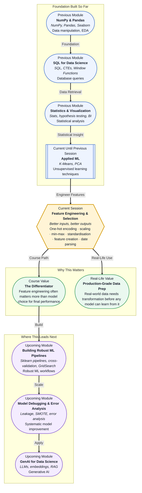

# Pre-read: Feature Engineering & Selection

## Context of This Session in the Course

You have spent weeks building models. You trained a Random Forest to predict customer churn, tuned a logistic regression for loan approval, and even clustered customers using K-Means. Each time, you loaded a clean dataset, split it into features and labels, and fed it to an algorithm. The model trained, you checked the accuracy, and things looked reasonable. But something gnaws at you: the model's performance hits a plateau, and you cannot figure out why.

Then you look more closely at the raw data. Your "category" column has values like "Electronics", "Clothing", and "Food" — strings the model cannot interpret. Your "purchase_amount" column runs from 5 to 50,000 while "num_items" ranges from 1 to 10 — the model quietly treats the larger numbers as more important simply because they are bigger. Your "signup_date" column is a date string like "2024-03-15", and the model has no idea that March is different from December. The model is not stupid — your data is just not speaking a language it understands.

The naive approach is to ignore these problems and let the algorithm figure everything out. But algorithms do not magically understand categorical strings, scale disparities, or temporal patterns. They see numbers. If you feed them "Red", "Blue", "Green", the model sees nothing useful — or worse, it converts them to 1, 2, 3 and mistakenly assumes Green (3) is greater than Red (1). That is where **Feature Engineering & Selection** becomes essential: the deliberate craft of transforming raw data into inputs that your model can actually learn from.

---

**What if** you could take a messy CSV with dates, text labels, and wildly different scales and transform it into a clean feature matrix that makes your model's performance jump by 15–20% — without changing the algorithm at all? Imagine working on a property price prediction task where raw data includes neighbourhood names, listing dates, and square footage ranging from 300 to 50,000. A model trained on raw data struggles. A model trained on engineered features — one-hot encoded neighbourhoods, day-of-week from listing dates, and log-transformed square footage — suddenly uncovers patterns that were invisible before. This session gives you the tools to make that transformation happen on any dataset.

---

**Feature engineering** is the process of creating new input variables from existing data to improve a model's ability to learn patterns. It sits between raw data collection and model training, and experienced practitioners often say it matters more than which algorithm you choose. The core techniques you will explore fall into three categories: encoding **categorical variables** into numbers, **scaling numeric features** to comparable ranges, and **creating new features** from underutilised sources like dates and text.

A useful analogy is preparing ingredients before cooking. You can be the best chef in the world, but if you throw in a whole unpeeled onion, unwashed vegetables, and meat still in its packaging, the dish will fail. A modest chef who carefully chops, seasons, and prepares each ingredient will produce a far better meal. The algorithm is the chef — give it well-prepared ingredients, and it does not need to be world-class to deliver excellent results. The tools you will learn are **one-hot encoding** (converting categories like colours or cities into binary columns), **Min-Max scaling** and **standardisation** (rescaling features to comparable ranges), and **feature creation** (extracting day-of-week, month, or text length from raw date and text columns).

---

In the **previous session**, you explored Unsupervised Learning and Clustering, where you used K-Means to group data without labels and applied PCA for dimensionality reduction. You learned how algorithms can discover hidden structure in data — customer segments, natural groupings, or compressed representations. That skill is directly relevant here because clustering often reveals which features carry the most signal. If a customer segment separates cleanly along a "spending_score" dimension you engineered from transaction frequency and average amount, you have direct evidence that your feature creation worked. Moreover, PCA gave you a glimpse of how feature transformations can make data more useful — reducing 50 correlated columns into 10 principal components. Feature engineering extends that same logic upstream: instead of transforming features after the fact, you craft them well from the start.

In this pre-read, you will discover:

- How to **understand** why raw categorical data must be encoded and why naive numeric mapping introduces false ordinal relationships.
- How to **apply** Min-Max scaling and standardisation to ensure no feature dominates a model purely by its magnitude.
- How to **build** new features from date and text columns that capture temporal patterns and textual signals.
- How to **connect** feature engineering directly to the model performance gains you will see in every subsequent session.

---

## Why Raw Categorical Data Breaks Your Model

Most real-world datasets contain columns like "City", "Product Category", "Education Level", or "Color". These values are text labels, and machine learning models — whether linear regression, random forest, or neural networks — can only process numbers. The naive solution is to map each category to an integer: Delhi → 1, Mumbai → 2, Bangalore → 3. But this introduces a false relationship. The model will treat Bangalore (3) as numerically greater than Delhi (1), implying some ordinal meaning that does not exist. If you encode "Red" as 1 and "Blue" as 2, the model might conclude that "Blue" is twice as large as "Red", which makes no sense.

**One-hot encoding** solves this by creating a separate binary column for each category. Delhi becomes a column with 1 if the row is Delhi and 0 otherwise; Mumbai gets its own column; Bangalore gets its own. The model now sees three independent boolean signals instead of one corrupted numeric value. This is the standard approach for nominal categories (where no natural order exists). For ordinal categories — like "Small", "Medium", "Large" — a single integer column with meaningful order (1, 2, 3) is actually appropriate, which highlights an important distinction: you must decide whether your data has inherent order or not. One-hot encoding increases the dimensionality of your dataset, so a column with 50 unique cities adds 49 new columns. You will learn to manage this trade-off, including techniques like dropping the first category to avoid multicollinearity and grouping rare categories into an "Other" bin to keep dimensionality under control.

## When Your Features Live on Different Planets

Consider a house price dataset with two features: "square_footage" ranges from 500 to 10,000, and "num_bedrooms" ranges from 1 to 6. A model like K-Nearest Neighbours or gradient descent-based regression calculates distances or updates weights based on the absolute magnitude of each feature. The square footage column, with values in the thousands, will dominate the distance calculation entirely. The model effectively ignores bedrooms because they are dwarfed by the scale of square footage. Your model is not making a smart trade-off — it is being fooled by units.

**Min-Max scaling** rescales every feature to a fixed range, typically 0 to 1, using the formula `(value - min) / (max - min)`. This preserves the shape of the distribution but squeezes everything into a consistent band. **Standardisation** (also called Z-score normalisation) rescales features to have a mean of 0 and a standard deviation of 1, using `(value - mean) / std`. This is more robust to outliers because it does not depend on the min and max values. The choice matters: Min-Max scaling is appropriate when you know your feature bounds and want to preserve zero values meaningfully (e.g., "number_of_purchases" where 0 means no purchases). Standardisation is preferred for algorithms that assume normally distributed data, like linear regression or PCA, and for models sensitive to outliers, like neural networks. Both techniques ensure that each feature contributes proportionally to the model's learning process, letting the algorithm focus on genuine patterns rather than artificial scale differences.

## Where Feature Engineering Appears in Real Life

Feature engineering is not an academic exercise — it is the daily work of data scientists and ML engineers across industries, and it often determines whether a project succeeds or stalls.

In **e-commerce and retail**, product recommendation systems rely heavily on engineered features from user behaviour. Raw clickstream data is messy — timestamps, product IDs, session durations. Data scientists engineer features like "average time spent per product category", "purchase frequency in the last 30 days", "hour-of-day browsing patterns", and "weekend vs weekday engagement". A one-hot encoded product category column lets the model learn that users who browse Electronics also tend to buy Accessories. Without these handcrafted features, a collaborative filtering model would miss critical behavioural signals.

In **finance**, credit scoring models use engineered features from transaction histories. A raw dataset might have transaction amounts, dates, and merchant codes. Feature engineering transforms this into "average monthly spending", "variance in spending", "number of late-night transactions", "days since last large withdrawal", and "ratio of debit to credit transactions". Standardisation is critical here because spending amounts vary hugely between customers — a millionaire's routine transaction might look like fraud for a student. Min-Max scaling or standardisation ensures the model evaluates behaviour relative to each customer's own baseline.

**Healthcare** organisations build predictive models for patient readmission risk from electronic health records. Raw data includes admission dates, diagnosis codes (categorical with hundreds of values), lab test results (different units: mg/dL, mmol/L, etc.), and free-text clinical notes. Feature engineering produces one-hot encoded diagnosis groups, scaled lab values on comparable scales, length-of-stay features, and text-derived signals like "number of mentioned symptoms" or "presence of specific keywords". Standardisation is particularly important here because a white blood cell count of 11,000 and a temperature of 101.3°F operate on entirely different scales — the model needs to understand both without one eclipsing the other.

In **fraud detection**, timestamps are often the richest source of signal. Raw transaction dates become engineered features like "hour of day", "day of week", "number of transactions in the last hour", "average transaction amount in the last 24 hours", and "deviation from typical spending time". One-hot encoding the merchant category ensures the model can learn that transactions at 3 AM at electronics stores are riskier than morning grocery purchases. Scaling ensures that a ₹50,000 transaction and a ₹50 transaction both contribute meaningfully to the fraud score relative to user baselines.

---

## What's Next

After this session, you will be able to:

- One-hot encode categorical variables so that models can process text labels without introducing false ordinal relationships.
- Apply Min-Max scaling and standardisation to numeric features to eliminate scale-driven bias in model training.
- Create new features from date columns by extracting day-of-week, month, day-of-year, and time-based aggregates.
- Engineer simple text features such as character count, word count, and keyword presence flags.
- Decide when to use one-hot encoding versus ordinal encoding based on the nature of your categorical data.
- Recognise when unscaled or poorly encoded features are silently degrading your model's performance.

You do not need to memorise every feature engineering trick right now. The goal is to adopt a critical mindset: **before blaming the model, examine the features.**

---

## Interesting Questions for the Live Session

- If one-hot encoding creates a separate column for every category, how do you handle a column like "City" with 500 unique values without exploding your feature space?
- What happens to a Min-Max scaled feature when a new data point arrives with a value outside the original min-max range — does the transformation break?
- Can standardisation ever make your model worse, and if so, under what conditions should you skip scaling entirely?
- When creating features from dates, how do you decide whether to use day-of-week, month, quarter, or something else — and what if the useful signal is a combination like "weekend evening"?

By the end of this session, feature engineering should feel less like optional data fiddling and more like the single highest-leverage activity in your ML workflow: **better inputs, better outputs.**
