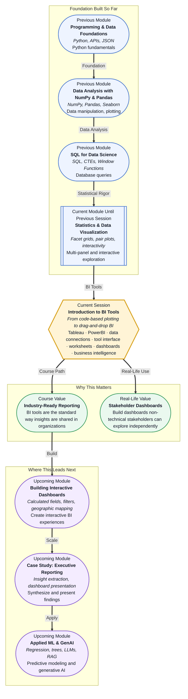

# Pre-read: Introduction to BI Tools

## Context of This Session in the Course

You spend a full week building a thorough analysis of quarterly sales data in a Jupyter notebook — cleaned datasets, statistical summaries, and a dozen carefully crafted Seaborn charts. You export the notebook to PDF and share it with your regional manager. The response is positive, but the follow-up question stops you: "Can I filter this by product category? And show me how the Northeast region compares in Q4?" Your notebook is static. The charts cannot respond. The analysis is complete, but it cannot have a conversation with the person who needs it most.

The frustration here is not about your ability to analyze data. It is about the gap between what you can discover and what your stakeholders can explore. Decision-makers do not want to read through Python cells or request a new chart every time a question arises. They want a live, interactive view of the data that answers their next question without you in the room. This is where the limitations of a code-only workflow become visible — not in the quality of the analysis, but in its accessibility.

That is where **Business Intelligence (BI) tools** become essential.

---

**What if** your organization's leadership team asked you to build a live dashboard that refreshes every Monday morning with the latest sales data, complete with regional filters, time-range sliders, and drill-down capability — and they want to explore it themselves without writing a single line of code? This is not a hypothetical scenario. It is the daily reality for data professionals in almost every industry. By the end of this session, you will understand how BI tools turn this request from a daunting challenge into a straightforward, repeatable workflow.

---

**Business Intelligence (BI) tools** are software platforms designed to help users visualize, analyze, and share data without writing code. Unlike Python plotting libraries that require scripts and notebooks, BI tools offer a visual interface where you connect to your data and build charts by dragging fields onto a canvas. Think of it this way: if coding visualizations is like handwriting a report from scratch, a BI tool is like using a professional presentation platform with templates, live data connections, and interactive controls. The underlying analytical thinking carries over; the delivery mechanism transforms entirely.

In this session, you will explore an **overview of Tableau and PowerBI** — the two most widely adopted BI platforms in the industry. You will learn the process of **connecting to data sources** such as CSV files, Excel spreadsheets, and relational databases. And you will navigate **the tool interface**, understanding the workspace layout where worksheets, dashboards, and data connections are organized into a cohesive workflow.

---

In the **previous session**, 15.3 — Advanced Seaborn & Interactive Plots, you worked with facet grids, pair plots, and interactive visualization concepts. You learned how to customize aesthetics and create multi-panel explorations that reveal patterns across different dimensions of your data. That session sharpened your ability to think visually and choose the right chart for the right question.

That visual thinking is the foundation that BI tools amplify. The same dataset you would explore with a pair plot in Seaborn can become an interactive dashboard in Tableau or PowerBI — but now the person asking the questions does not need to know Python. They click a filter, adjust a slider, or select a region, and the chart updates in real time. Your job shifts from writing every visualization to designing an experience that others can navigate independently.

---

In this pre-read, you will discover:

- How to **understand** why BI tools are the industry standard for business dashboarding and organizational reporting.
- How to **learn** the core interface and drag-and-drop workflow of Tableau and PowerBI.
- How to **connect** data sources to a BI tool and prepare them for visualization.
- How to **recognise** the shift from code-based plotting to interactive business intelligence and when each approach is appropriate.

---

## Why the Shift from Code to Drag-and-Drop Changes Everything

When you build a chart in Seaborn or Matplotlib, you control every pixel. You specify the color palette, the axis limits, the tick marks, the legend position. This level of control is powerful when you are exploring data for yourself, but it creates a bottleneck when others need to explore the same data. Every new question requires a new code cell, a new render, and a new export.

BI tools flip this model. Instead of encoding every possible view ahead of time, you define the data connection and the available fields, and you let the end user build the view they need. The drag-and-drop interface means a regional manager can compare Q3 vs Q4 by dragging the quarter field onto the filter shelf, without knowing what a DataFrame or a groupby operation is.

This shift changes your role from "person who writes the code" to "person who designs the exploration environment." The charts are no longer the final output — they are the starting point for a conversation between the stakeholder and the data. Your skill in selecting the right chart (from session 15.2) and designing clear visual hierarchy (from session 15.1) becomes even more valuable because you are now building for someone else's curiosity, not just your own.

---

## How BI Tools Connect to Your Data

A BI tool is only as useful as its connection to real, current data. Unlike a notebook where you load a CSV once and work with a static snapshot, BI tools are designed to maintain live connections to data sources. This means when the underlying database updates, the dashboard can refresh to reflect the latest numbers.

The connection process typically starts with selecting a data source type. Most BI tools support CSV files, Excel workbooks, cloud databases (like Snowflake, BigQuery, or Amazon Redshift), and SQL databases (like PostgreSQL or MySQL). Once connected, you see a preview of the data and can define relationships between tables — similar to the joins you practiced in SQL during Module 3. You can rename fields, change data types, and create calculated columns using formula expressions.

This layer of data preparation inside the BI tool is often called the **data model**. It sits between your raw source and your visualizations. Getting the data model right — ensuring the right tables are joined, the right fields are available, and the right aggregations are defined — is the most important step before you build a single chart. A clean data model makes dashboard building fast and intuitive. A messy one creates confusion at every step.

---

## Where BI Tools Appear in Real Life

BI tools are not niche products used only by data teams. They are embedded in how organizations monitor performance, track goals, and communicate insights across departments. In **retail and e-commerce**, BI dashboards track daily sales by region, inventory turnover rates, and customer acquisition costs. Merchandising teams use filters to compare product categories, store formats, and promotional periods without waiting for a report from the analytics team. In **financial services**, risk and compliance teams monitor transaction volumes, flag anomalies, and track portfolio performance through dashboards that update every morning with the previous day's data. The same tools that surface high-level KPIs for the board also let analysts drill into individual transactions.

In **healthcare operations**, hospital administrators use BI dashboards to visualize patient admission rates, bed occupancy, average wait times, and readmission patterns across departments. These dashboards inform staffing decisions and resource allocation in real time. **Marketing teams** across industries use BI to track campaign performance — click-through rates, conversion funnels, cost per acquisition — segmented by channel, geography, and audience demographic. The marketing lead can change a date range or swap a metric without filing a ticket to the data team. In **supply chain and logistics**, dashboards monitor shipment delays, warehouse capacity, delivery route efficiency, and vendor performance, giving operations managers a single pane of glass over a complex network.

Across every one of these scenarios, the common thread is the same: the person who needs the answer is not always the person who built the analysis. BI tools bridge that gap.

---

## What's Next

After this session, you will be able to:

- Navigate the core interface of a BI tool — worksheets, dashboards, and the data source pane.
- Connect to a CSV or Excel file and prepare the data for visualization.
- Build basic worksheets by dragging fields onto rows, columns, and marks shelves.
- Understand the difference between a worksheet and a dashboard and how they relate.
- Recognise when a BI tool is the right choice versus when a code-based approach serves better.
- Describe how BI dashboards fit into a professional reporting workflow.

You do not need to master every feature of Tableau or PowerBI right now. The goal is to make a mental shift from thinking of visualizations as code output to thinking of them as explorable environments: **from charts you build to experiences you design.**

---

## Interesting Questions for the Live Session

- When would a BI tool be the wrong choice for a data visualization task, and when would Python or R be a better fit?
- If your dashboard connects to a live database and the underlying query runs slowly, where does the bottleneck live — the database, the BI tool, or the network?
- How does designing a dashboard for an executive differ from building a chart for your own exploratory analysis in a notebook?
- If two people look at the same dashboard and draw opposite conclusions, is the problem in the data, the visualization, or the viewer's assumptions?

By the end of this session, BI tools should feel less like unfamiliar software and more like a natural extension of your visualization skills: **from code that only you can run to dashboards that anyone can explore.**
