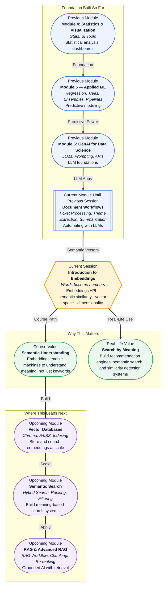

# Pre-read: Introduction to Embeddings

## Context of This Session in the Course

You paste a job description into a search box: "Looking for a data scientist with NLP experience." The system returns 300 resumes, but half of them mention "natural language processing" and the other half mention "text analytics" or "sentiment analysis." None of them used the exact phrase "NLP." The search engine matched exactly what you typed, missing the candidates who described the same skill in different words.

Traditional keyword search works when people use identical vocabulary. But in the real world, no two people describe the same concept the same way. A policy document says "refund policy" while a customer writes "get my money back." A research paper says "semantic similarity" while a student searches for "meaning-based comparison." The gap between different words that carry the same meaning is one of the oldest problems in information retrieval. Exact-match search cannot bridge it.

That is where **embeddings** become essential — converting words and sentences into numeric vectors so that meaning, not spelling, determines what gets found.

---

**What if** you could search a thousand documents and find the ones that are *semantically* closest to your question, even if they share zero exact words? What if a customer support chatbot could find the right policy document for "Can I exchange this item?" even when the policy only says "Return eligibility is determined within 30 days of purchase"? What if you could take a paragraph you wrote and instantly find the three most similar research papers from a database of 50,000 — not by matching citations or keywords, but by the actual ideas expressed? This session gives you the fundamental technique that makes all of this possible: turning language into numbers that computers can compare by meaning.

---

An **embedding** is a numerical representation of a piece of text — a word, a sentence, a paragraph, or an entire document — as a list of floating-point numbers in a high-dimensional space. Think of it as assigning each piece of text a coordinate in a vast map where nearby points have similar meanings. The word "king" and "queen" end up close together on this map; "king" and "toaster" end up far apart. The model that produces these coordinates is trained on billions of sentences, learning that words appearing in similar contexts should have similar vectors. The **Embeddings API** from providers like OpenAI gives you access to these pre-trained models — you send text and receive a vector, without needing to train anything yourself.

**Semantic similarity** is the measure of how close two embedding vectors are. Typically measured using **cosine similarity** — the cosine of the angle between two vectors in the multi-dimensional space — it tells you how related two pieces of text are, regardless of whether they share any words. The **dimensionality** of embeddings (typically 256 to 3072 numbers per vector) determines how much nuance the model can capture. Higher dimensions capture more subtle distinctions but require more storage and compute. In this session, you will work directly with the OpenAI Embeddings API, compute similarity scores, explore the geometry of the **vector space**, and see firsthand how meaning becomes measurable.

---

In the **previous session**, you built document workflow pipelines that used LLMs to process support tickets, extract themes, and generate summaries from internal knowledge bases. You took unstructured text and turned it into structured, actionable data. That pipeline solved the extraction problem — getting clean information out of messy documents. But it left one question unanswered: once you have a collection of processed documents, how do you find the right one when someone asks a question? You could try matching keywords against the extracted fields, but that fails when the question uses different language than the document. Embeddings close that gap. The structured documents you built become even more powerful when paired with semantic search — and embeddings are the key that makes semantic search possible.

---

In this pre-read, you will discover:

- How to **understand** the concept of converting text into numeric vectors using the Embeddings API.
- How to **measure** semantic similarity between pieces of text using cosine similarity.
- How to **recognise** the role of dimensionality and vector space in capturing meaning.
- How to **connect** embeddings to real-world applications like search, recommendations, and retrieval.

---

## From Words to Numbers: The Embedding Transformation

Take the words "dog," "puppy," and "bicycle." A human instantly knows that dog and puppy are related while dog and bicycle are not. But a computer sees them as three strings of letters with no inherent notion of similarity. An **embedding model** solves this by mapping each word to a vector — a fixed-length list of numbers — in a way that preserves semantic relationships. The vector for "dog" might be `[0.23, -0.45, 0.67, ...]` and the vector for "puppy" would be very close to it, while "bicycle" would point in a very different direction.

The magic lies in how these vectors are trained. Models like OpenAI's `text-embedding-ada-002` are trained on enormous text corpora using self-supervised learning. The model learns a simple rule: words that appear in similar contexts should have similar vectors. "Dog" and "puppy" both appear near words like "bark," "pet," and "fetch," so their vectors converge. "Bicycle" appears near "pedal," "helmet," and "gear," so it ends up in a different neighborhood. When you call the Embeddings API with a sentence like "The dog chased the ball," the model returns a single vector representing the entire sentence's meaning — not just the individual words but their combination. This sentence-level embedding is what makes the technique powerful: you compare whole queries to whole documents, not isolated keywords.

## Semantic Similarity: Measuring Meaning with Math

Once you have embeddings, you need a consistent way to compare them. **Cosine similarity** is the standard metric. Geometrically, think of each embedding as an arrow pointing from the origin of a high-dimensional space. The angle between two arrows indicates their semantic relationship. Small angle means similar meaning; wide angle means unrelated; opposite directions suggest opposing concepts. Cosine similarity returns a value between -1 and 1, where 1 means identical direction, 0 means orthogonal (unrelated), and -1 means opposite.

This metric is surprisingly robust. Search for "How do I return a product?" and compare it against a document titled "Refund Policy." Even though they share no exact words — "return" vs. "refund," "product" vs. "policy" — their embeddings are close because the model learned that these words appear in similar contexts. The same technique powers recommendation engines: "Customers who bought this item also liked..." systems work by embedding product descriptions and finding the nearest neighbors in vector space. The principle is always the same: convert everything into the same numeric language, then measure distances. **Dimensionality** affects how discriminating these measurements are — 1536-dimensional vectors capture richer semantic relationships than 256-dimensional ones, but they also require more memory and compute to store and compare.

## Where Embeddings Appear in Real Life

E-commerce platforms like Amazon and Shopify use product embeddings to power recommendation engines. When you view a product, the system finds other products whose embedding vectors are closest to it — not by matching categories or tags, but by learned semantic similarity. A "wool winter coat" might surface "fleece-lined jacket" even though neither description contains the other's keywords. In enterprise search, companies like Glean and Google Cloud Search embed all internal documents — policies, wikis, meeting notes — so employees can search by meaning. An engineer searching for "how to deploy our microservice" finds the relevant runbook even when the document title is "Production Release Checklist." In healthcare, embeddings are used to match patient symptoms described in natural language to relevant medical literature, clinical trials, or similar patient cases. A doctor describing "persistent lower back pain with tingling in the left leg" can find research papers on sciatica without needing to know the exact medical terminology. In legal tech, law firms embed thousands of contract clauses to find precedents — a lawyer drafting a "force majeure" clause can find similar clauses from past contracts instantly. In content moderation, social media platforms embed posts and comments, then flag content whose vector is close to known hate speech or misinformation embeddings, catching variants that would bypass keyword filters. Across every domain, the pattern is the same: convert text to vectors, compare by distance, and let meaning — not spelling — drive the results.

---

## What's Next

After this session, you will be able to:

- Convert text into embedding vectors using the OpenAI Embeddings API with a single API call.
- Compute cosine similarity between pairs of embeddings to measure semantic relatedness.
- Visualise how similar texts cluster together in vector space and how dimensionality affects separation.
- Apply embeddings to solve a real search problem: given a query, find the most semantically similar documents from a collection.
- Recognise the tradeoffs between embedding dimension, storage cost, and retrieval accuracy when designing a semantic search system.

You do not need to build a full vector search engine right now. The goal is to internalise the fundamental insight that **meaning can be measured mathematically — words become coordinates in a space where similarity equals distance.**

---

## Interesting Questions for the Live Session

- If two sentences have a cosine similarity of 0.85, does that guarantee they are about the same topic, or could the model be responding to surface-level patterns like shared sentiment or structure?
- When you embed a long paragraph versus a single word, the model produces one fixed-size vector for both — what nuance is necessarily lost when compressing a paragraph into the same number of numbers as a word?
- If you search for "cheap hotels" but your documents only mention "budget-friendly accommodations," the embeddings might still match. What kind of edge cases would cause the embedding similarity to fail — where two texts are semantically related but the model gives them low similarity?
- Given that higher-dimensional embeddings capture more nuance but cost more to store and compare, how would you decide the right dimensionality for a system that must return results in under 200 milliseconds across 10 million documents?

By the end of this session, embeddings should feel less like a black-box magic trick and more like a measurable, programmable translation layer: **language becomes geometry, and finding meaning becomes finding neighbours.**
