# Pre-read: Introduction to GenAI & LLMs

## Context of This Session in the Course

```mermaid
%%{init: {"flowchart": {"nodeSpacing": 45, "rankSpacing": 65, "diagramPadding": 20}} }%%
flowchart TB
    subgraph Foundation["Foundation Built So Far"]
        P1(["Previous Module<br/><b>Statistics &amp; Visualization</b><br/><i>(Stats, hypothesis testing, BI dashboards)</i><br/>Statistical analysis and reporting"])
        P2(["Previous Module<br/><b>Applied ML: Supervised Learning</b><br/><i>(Regression, trees, ensembles, evaluation)</i><br/>Predictive modeling foundations"])
        P3(["Previous Module<br/><b>Applied ML: Advanced ML</b><br/><i>(Feature engineering, pipelines, clustering)</i><br/>Robust ML workflows"])
        C1[["Current Until Previous Session<br/><b>Model Debugging &amp; Error Analysis</b><br/><i>(Data leakage, SMOTE, error analysis)</i><br/>Systematic model improvement"]]
    end

    CS{{"Current Session<br/><b>Introduction to GenAI &amp; LLMs</b><br/><i>From prediction to generation</i><br/>Foundation models · tokens · context windows · text prediction · data science use cases"}}

    subgraph Value["Why This Matters"]
        CV(["Course Value<br/><b>The GenAI Revolution</b><br/>Understanding LLMs is essential for modern data science"])
        RV(["Real-Life Value<br/><b>AI-Powered Data Work</b><br/>Automate analysis, generate insights, and build intelligent assistants"])
    end

    subgraph Future["Where This Leads Next"]
        F1(["Upcoming Module<br/><b>Prompt Engineering</b><br/><i>(Zero-shot, few-shot, chain-of-thought, structured outputs)</i><br/>Mastering LLM interaction"])
        F2(["Upcoming Module<br/><b>Embeddings &amp; Vector Databases</b><br/><i>(Semantic similarity, Chroma, FAISS)</i><br/>Search and retrieval with AI"])
        F3(["Upcoming Module<br/><b>RAG &amp; Advanced RAG</b><br/><i>(Retrieval-augmented generation, chunking, re-ranking)</i><br/>Grounded AI applications"])
    end

    P1 ==>|&nbsp;Foundation&nbsp;| P2
    P2 ==>|&nbsp;Predictive Power&nbsp;| P3
    P3 ==>|&nbsp;Robust Workflows&nbsp;| C1
    C1 ==>|&nbsp;Generative AI&nbsp;| CS
    CS ==>|&nbsp;Course Path&nbsp;| CV
    CS ==>|&nbsp;Real-Life Use&nbsp;| RV
    CV ==>|&nbsp;Build&nbsp;| F1
    F1 ==>|&nbsp;Scale&nbsp;| F2
    F2 ==>|&nbsp;Apply&nbsp;| F3

    classDef previous fill:#eef4ff,stroke:#4f7ccf,color:#111827,stroke-width:2px;
    classDef current fill:#fff4d6,stroke:#d9a321,color:#111827,stroke-width:3px;
    classDef value fill:#eaf8ef,stroke:#3f9f63,color:#111827,stroke-width:2px;
    classDef future fill:#f4ecff,stroke:#8a61d1,color:#111827,stroke-width:2px;

    class P1,P2,P3,C1 previous;
    class CS current;
    class CV,RV value;
    class F1,F2,F3 future;
    linkStyle default stroke-width:3px;
```

You have spent the last several weeks mastering the art of prediction — building models that map features to labels, tuning hyperparameters, and debugging pipelines until your classifiers deliver reliable performance. You run a customer churn model that scores 87% precision, a credit risk model with a clean ROC-AUC, and a clustering pipeline that segments users into meaningful groups. Then your manager asks: "Can you write a personalised one-paragraph churn explanation for each of the 340 at-risk customers — in plain English, tailored to their specific behaviour?" Your model gives a probability. It cannot write a single sentence. It was never designed to.

This is the boundary you have been working within since Module 5: every model you have built so far maps input data to a structured output — a category, a probability, a cluster label. These models are exceptional at classification and regression, but they cannot generate new content, adapt their output for a specific audience, or explain their reasoning in natural language. You could hand-write 340 emails. You could build a template with placeholders. But neither approach captures the nuance of each customer's unique behaviour pattern, and neither scales when the request shifts from "predict" to "explain" to "persuade."

A different class of AI crosses this boundary entirely. Large Language Models do not predict a single category or a numeric value. They predict the next word, again and again, building coherent paragraphs one fragment at a time. That shift — from classification to generation — is what this session introduces. That is where **Introduction to GenAI & LLMs** becomes essential.

---

**What if** you could hand your raw dataset to an AI assistant and say, "Write a five-point executive summary of the key patterns in this data — highlight the segments where churn is rising, and suggest three actions the business team could take tomorrow"? The assistant reads your DataFrame, runs statistical comparisons, and returns a well-structured memo in thirty seconds.

Now imagine scaling that capability across your entire organisation. The marketing team asks for a weekly trend report. The product team wants a natural-language analysis of user feedback from 5,000 support tickets. The compliance team needs a summary of model performance across protected demographic groups. Each request produces a unique, context-aware response — not a template, not a lookup table. This is not science fiction. It is what happens when you combine your existing data science skills with the ability to direct a generative model. And it starts with understanding one surprisingly simple mechanism: how a machine learns to predict text, one token at a time.

---

At its core, **generative AI** refers to models that create new content — text, images, code, or audio — based on patterns learned from training data. A **Large Language Model (LLM)** is a specific type of generative model trained on vast quantities of text. It does not memorise facts like a database. Instead, it learns the statistical structure of language: which words tend to follow which words, how grammar constrains meaning, what a logical argument looks like in prose.

Think of it like a jazz musician who has listened to thousands of hours of music. They do not have every song memorised, but they have internalised chord progressions, rhythmic patterns, and melodic structures so deeply that they can improvise something original that sounds coherent and stylistically appropriate. An LLM works the same way — it has absorbed so much text from books, articles, code, and conversations that it can produce fluent, contextually relevant writing, even when it has never encountered your specific question before.

To understand how this is possible, you need to know three interconnected concepts. **Foundation models** are the massive, general-purpose LLMs — like GPT, Claude, or LLaMA — that serve as the starting point for countless applications. These models process text by breaking it into **tokens**, which are fragments of words, punctuation, or spaces. And they operate within a **context window**, which defines how much text the model can consider at once before generating its next prediction. You will explore how tokens work, what context windows mean for real applications, and why foundation models have become the default building block for modern AI systems.

---

In the **previous session**, you learned to systematically improve models after the first build — detecting data leakage, handling imbalanced datasets with SMOTE and class weights, and performing structured error analysis. That diagnostic mindset now becomes the foundation for a different kind of model evaluation. When you work with LLMs, the questions shift: instead of measuring precision and recall, you evaluate output quality, factual consistency, and sensitivity to prompt phrasing. Instead of worrying about train-test contamination, you worry about context window limits and token budgets. The debugging discipline you developed — isolate the problem, test a hypothesis, measure the fix — transfers directly to the world of generative AI. But the tools and the failure modes are new, and that is what makes this module an exciting expansion of your capabilities.

In this pre-read, you will discover:

- How to **understand** what foundation models are and why they represent a paradigm shift from task-specific ML to general-purpose AI.
- How to **learn** the mechanism of next-token prediction that enables LLMs to generate coherent text.
- How to **recognise** the role of tokens and context windows in shaping what an LLM can and cannot do.
- How to **connect** generative AI to practical data science workflows, from automated analysis to intelligent assistants.

---

## What Makes a Model a "Foundation Model"

You have trained models for specific tasks: a random forest for churn prediction, a logistic regression for credit risk, a K-means clustering for customer segmentation. Each model is narrow — it solves exactly one problem on exactly one dataset. If you wanted to classify emails instead of predict churn, you would build a new model from scratch with different features, different labels, and different evaluation criteria.

A **foundation model** inverts this pattern. It is trained on a massive, diverse corpus of text — think billions of web pages, books, academic papers, and code repositories — and it learns general patterns of language, reasoning, and knowledge. After this initial training (called pre-training), the model is not specialised for any single task. It can answer questions, write code, summarise documents, translate languages, and even hold a conversation, all within the same architecture. The same model that drafts an email can also explain a machine learning concept and generate a Python function to compute RMSE.

This generality is what makes foundation models a breakthrough. Instead of building one model per task, you can take a single foundation model and adapt it for dozens of tasks using techniques like prompt engineering, which you will explore in the next session. The trade-off is that these models are enormous — hundreds of billions of parameters — and require significant computational resources to train and run. But for a data scientist, the ability to access general intelligence through an API or an open-source model transforms what you can deliver: a single integration point replaces dozens of specialised models.

---

## How LLMs Predict Text — One Token at a Time

You ask an LLM: "What is the difference between correlation and causation?" The model produces a paragraph that reads like it was written by a knowledgeable statistician. How? The answer is simpler than you might expect: the model does not understand your question the way a human does. It performs a single operation, repeated hundreds of times — predict the next token.

A **token** is the atomic unit an LLM works with. It is not always a whole word. The word "unbelievable" might be split into tokens like `un`, `believe`, `able`. Punctuation and spaces are tokens too. A typical English word is about 1.3 tokens on average. When you send a prompt to an LLM, the model tokenises your input — converts it from text into a sequence of token IDs — and then begins generating new tokens one at a time.

At each step, the model looks at the sequence of tokens it has produced so far (including your prompt) and calculates a probability distribution over every possible next token in its vocabulary — typically fifty thousand or more possibilities. It then samples from that distribution to pick the next token. That token gets appended to the sequence, and the model repeats the process. The output you see is the result of thousands of individual token predictions, chained together.

This is why the **context window** matters so much. The context window is the maximum number of tokens the model can consider at once. If your prompt plus the generated response exceeds this limit, the model begins to "forget" earlier parts of the conversation. Early models had context windows of 2,000 to 4,000 tokens — roughly a few pages of text. Modern models support 128,000 tokens or more, which allows them to process entire documents, long conversation histories, or large code files in a single pass. For a data scientist, understanding context windows is essential when you design prompts that include reference tables, data samples, or full document passages — you need to fit your input within the available space while leaving room for the model's response.

---

## Where GenAI Appears in Real Life

Generative AI is not confined to chatbots and novelty applications. It is rapidly becoming a practical tool in professional data science workflows, and organisations across industries are finding concrete use cases that deliver measurable value.

In **financial services**, analysts use LLMs to automate earnings call summaries. A team that previously spent four hours per quarter reading transcripts and extracting key metrics now uploads the transcript to an LLM with a structured prompt and receives a formatted summary — revenue changes, risk disclosures, forward guidance — in under a minute. Credit risk teams use LLMs to generate narrative explanations for flagged accounts, translating model scores into plain-English reasons that loan officers and regulators can understand without digging into feature weights.

In **healthcare and life sciences**, researchers apply LLMs to accelerate literature reviews. A clinical team investigating a rare disease might need to read through five hundred recent papers to identify treatment patterns. An LLM powered by retrieval-augmented generation can ingest those papers, answer specific questions about drug interactions, and highlight conflicting findings across studies — reducing a two-week review to a day of verification. Medical coding teams use generative models to convert unstructured clinical notes into structured diagnosis codes, improving billing accuracy and reducing administrative overhead.

In **e-commerce and retail**, product teams use LLMs to analyse customer reviews at scale. Instead of reading thousands of individual feedback entries, a team sends the full review corpus to an LLM with a prompt asking for theme extraction, sentiment trends, and actionable product improvement suggestions. The result is a structured report that surfaces the three most common complaints and their frequency, all generated in minutes. Personalisation teams use LLMs to write product descriptions, email subject lines, and on-site copy tailored to specific customer segments — not through templates, but by providing the model with a short description of the segment and letting it generate unique text for each.

In **technology and SaaS**, engineering teams use LLMs to generate data documentation. A data scientist who has just built a complex feature engineering pipeline can ask an LLM to produce a natural-language description of each feature, its data type, its expected range, and its relationship to the target variable. This documentation, which might otherwise be skipped due to time pressure, becomes a deliverable that helps stakeholders trust and use the model's output. Customer success teams use generative models to draft personalised responses to support tickets, pulling context from the ticket history and knowledge base to produce a first draft that a human agent reviews and sends.

These examples share a common pattern: GenAI does not replace the data scientist. It amplifies the data scientist's ability to produce analysis, documentation, and communication at a scale that would be impossible manually. The model generates a first pass; you verify, refine, and make the judgment calls.

---

## What's Next

After this session, you will be able to:

- Explain what foundation models are and why they differ from traditional task-specific ML models.
- Describe how autoregressive next-token prediction enables LLMs to generate coherent, context-aware text.
- Recognise the role of tokens and context windows in determining an LLM's memory, cost, and output quality.
- Identify practical applications of generative AI within a data science workflow — from report generation to insight extraction.
- Distinguish between situations where a traditional predictive model is appropriate and where a generative model adds value.

You do not need to understand the internal architecture of a transformer or train your own language model right now. The goal is to build a clear mental model: **from prediction to generation — AI that does not only classify but creates.**

---

## Interesting Questions for the Live Session

- If an LLM predicts only the next token, how does it manage to maintain coherence across a five-paragraph response without a central plan or outline?
- A model with a 128,000-token context window can technically process a 200-page document — but does "seeing" all those tokens mean the model actually uses them evenly, or are there practical limits to attention?
- Foundation models are trained on public internet data, which includes bias, misinformation, and copyrighted material. What responsibility does a data scientist have when deploying these models in a regulated application?
- When would you choose a smaller, specialised model (fine-tuned on your domain data) over a large general-purpose foundation model for a data science task, and how would you make that trade-off?

By the end of this session, GenAI should feel less like a mysterious black box and more like a new class of tool in your data science toolkit: **powerful, imperfect, and yours to direct.**
