# Pre-read: Introduction to Machine Learning

## Context of This Session in the Course

```mermaid
%%{init: {"flowchart": {"nodeSpacing": 45, "rankSpacing": 65, "diagramPadding": 20}} }%%
flowchart TB
    subgraph Foundation["Foundation Built So Far"]
        P1(["Previous Module<br/><b>Data Analysis with NumPy &amp; Pandas</b><br/><i>(NumPy, Pandas, Seaborn)</i><br/>Data manipulation, EDA, basic plots"])
        P2(["Previous Module<br/><b>SQL for Data Science</b><br/><i>(SQL, CTEs, Window Functions)</i><br/>Database queries, data retrieval"])
        P3(["Previous Module<br/><b>Statistics &amp; Data Visualization</b><br/><i>(Stats, hypothesis testing, BI tools, dashboards)</i><br/>Statistical analysis, data communication"])
        C1[["Current Module Until Previous Session<br/><b>Executive Reporting</b><br/><i>(Insight identification, KPI selection, dashboard storytelling, executive summary)</i><br/>Synthesizing and presenting data insights"]]
    end

    CS{{"Current Session<br/><b>Introduction to Machine Learning</b><br/><i>From analyzing past data to predicting future outcomes</i><br/>supervised learning · unsupervised learning · ML lifecycle · regression · classification · scikit-learn · features · labels · training · prediction"}}

    subgraph Value["Why This Matters"]
        CV(["Course Value<br/><b>Predictive Power</b><br/>ML enables you to move from descriptive analytics to predictive and prescriptive analytics"])
        RV(["Real-Life Value<br/><b>Build Models That Predict</b><br/>From customer churn prediction to fraud detection, ML powers data-driven products"])
    end

    subgraph Future["Where This Leads Next"]
        F1(["Upcoming Module<br/><b>Linear &amp; Logistic Regression</b><br/><i>(Simple/multiple regression, sigmoid, decision boundaries)</i><br/>Core regression models"])
        F2(["Upcoming Module<br/><b>Trees, Ensembles &amp; Clustering</b><br/><i>(Decision trees, random forests, K-Means)</i><br/>Tree-based and unsupervised learning"])
        F3(["Upcoming Module<br/><b>GenAI for Data Science</b><br/><i>(LLMs, embeddings, vector DBs, RAG)</i><br/>Generative AI"])
    end

    P1 ==>|&nbsp;Foundation&nbsp;| P2
    P2 ==>|&nbsp;Data Retrieval&nbsp;| P3
    P3 ==>|&nbsp;Statistical Insight&nbsp;| C1
    C1 ==>|&nbsp;Predictive Modeling&nbsp;| CS
    CS ==>|&nbsp;Course Path&nbsp;| CV
    CS ==>|&nbsp;Real-Life Use&nbsp;| RV
    CV ==>|&nbsp;Build&nbsp;| F1
    F1 ==>|&nbsp;Scale&nbsp;| F2
    F2 ==>|&nbsp;Apply&nbsp;| F3

    classDef previous fill:#eef4ff,stroke:#4f7ccf,color:#111827,stroke-width:2px;
    classDef current fill:#fff4d6,stroke:#d9a321,color:#111827,stroke-width:3px;
    classDef value fill:#eaf8ef,stroke:#3f9f63,color:#111827,stroke-width:2px;
    classDef future fill:#f4ecff,stroke:#8a61d1,color:#111827,stroke-width:2px;

    class P1,P2,P3,C1 previous;
    class CS current;
    class CV,RV value;
    class F1,F2,F3 future;
    linkStyle default stroke-width:3px;
```

You receive a spreadsheet of customer transactions for the last twelve months. Your manager asks a simple question: "Which customers are likely to stop using our service next quarter?" The spreadsheet shows who has already left, who stayed, and what they did before leaving. But it does not tell you the future. You have all the past data at your fingertips, yet the answer you need lives in the patterns hidden inside it.

A natural instinct is to write rules: "If a customer has not logged in for thirty days, flag them." But real customer behaviour is messy. Some loyal customers go quiet for months and return. Some active users leave without warning. Rules based on gut feeling miss too many edge cases, and they certainly do not adapt as new patterns emerge. The intuitive approach — hardcoding thresholds and conditions — breaks down when the data is noisy, the relationships are subtle, or the volume is high.

You need a different approach altogether: one where the computer learns the patterns from the data itself rather than following pre-programmed instructions. That is where **Introduction to Machine Learning** becomes essential.

---

**What if** you could feed your company's historical data — sales records, customer behaviour logs, support tickets — into a system that learns to predict outcomes automatically? You could forecast next quarter's revenue, identify which support tickets are urgent, or detect fraudulent transactions before they happen. Instead of spending hours writing reactive rules, you spend your time training models that improve with more data. Machine learning is what makes this shift possible, and this session gives you the conceptual foundation to build it.

---

At its core, machine learning is the practice of teaching computers to recognise patterns in data and make decisions with minimal human intervention. The two broad branches are **supervised learning**, where you train a model on labelled examples (input-output pairs), and **unsupervised learning**, where the model finds hidden structure in unlabelled data. Think of supervised learning like a student learning with an answer key — you show the model correct examples until it can generalise. Unsupervised learning is more like exploring a new city without a map — you discover neighbourhoods and clusters on your own.

A useful metaphor is teaching someone to recognise fruit. In supervised learning, you show them an apple, say "this is an apple," and repeat until they can identify a new apple on their own. In unsupervised learning, you give them a basket of mixed fruit and ask them to group similar items together — they might create a pile of round red fruits and another of long yellow ones without ever knowing the names. Both approaches have their place, and both are essential tools in your ML toolkit.

During this session, you will explore the **machine learning lifecycle** — the end-to-end process of taking a business question, preparing data, training a model, evaluating it, and deploying it. You will contrast **regression** (predicting continuous values like house prices) with **classification** (predicting categories like spam or not-spam). And you will get your first hands-on look at **scikit-learn**, Python's most widely used machine learning library, to see how these concepts translate into code.

---

In the **previous session**, you completed the Case Study on Executive Reporting, where you analysed a dataset, identified three key insights, and built a dashboard to present your findings to stakeholders. That exercise was the culmination of descriptive analytics — using statistics, visualisation, and BI tools to answer the question "What happened?"

That skill is your launching pad. Before you can predict what will happen next, you must first be able to describe what has already happened with clarity and rigour. The data cleaning, exploratory analysis, and KPI selection you practised in Module 4 are the exact same steps that kick off every machine learning project. The difference is that now, instead of stopping at insight, you will take the next step: turning those insights into a predictive model.

---

In this pre-read, you will discover:

- How to **understand** the difference between supervised and unsupervised learning and when to apply each.
- How to **learn** the stages of the machine learning lifecycle, from data preparation to model deployment.
- How to **recognise** when to use regression versus classification for a given prediction problem.
- How to **connect** your existing data analysis skills to the foundational workflow of scikit-learn.

---

## Supervised vs Unsupervised — The Fundamental Divide

Every machine learning problem begins with a question about data, and the first decision you face is whether your data comes with answers. If your dataset includes labelled examples — rows where the outcome you want to predict is already known — you are in the realm of **supervised learning**. A classic example is email spam detection: you have thousands of emails, each labelled "spam" or "not spam," and you train a model to classify new messages.

If your data has no labels and you want to discover hidden patterns or groupings, you are working with **unsupervised learning**. Customer segmentation is a textbook use case — you have transaction data for thousands of customers but no predefined segments. An unsupervised algorithm like K-Means clusters customers based on purchasing behaviour, and you interpret the clusters after the fact.

Real-world projects often blend both. You might use unsupervised learning to create customer segments, then use supervised learning to predict which segment a new customer belongs to. Understanding where each approach fits is the first conceptual milestone of this session.

## The Machine Learning Lifecycle — From Question to Prediction

Machine learning is not just about algorithms. It is a process that begins with a business problem and ends with a deployed solution. The **ML lifecycle** gives you a roadmap for every project, preventing you from jumping straight to model training without understanding the context.

The lifecycle typically includes these stages: **problem framing** (turning a business need into a ML question), **data collection and preparation** (gathering, cleaning, and transforming data), **model training and evaluation** (selecting an algorithm, training it, and measuring performance), and **deployment and monitoring** (putting the model into production and tracking its performance over time).

Consider what happens when you skip a stage. If you train a model without properly preparing the data, your predictions will be unreliable. If you deploy without monitoring, you may never notice when the model's accuracy degrades because customer behaviour has changed. The lifecycle is not bureaucracy — it is the difference between a model that works in a notebook and one that delivers value in the real world.

## Where Machine Learning Appears in Real Life

Machine learning is not a futuristic concept reserved for research labs. It powers tools and services you interact with daily, and its applications span nearly every industry.

In **finance**, ML models detect credit card fraud by learning normal spending patterns and flagging transactions that deviate. The same transaction that looks routine to a human accountant can be caught in milliseconds by a model trained on millions of past transactions. In **healthcare**, diagnostic models analyse medical images to identify tumours, retinal disease, or bone fractures — often with accuracy matching or exceeding specialist radiologists. These models do not replace doctors, but they act as a second pair of eyes that never gets tired.

**E-commerce and retail** companies use recommendation systems — a blend of supervised and unsupervised learning — to suggest products based on browsing and purchase history. Every time Netflix suggests a show or Amazon recommends a product, a machine learning model is at work. In **marketing**, ML predicts customer churn (which subscribers are about to cancel), enabling companies to intervene with targeted offers before losing the customer. **Logistics and supply chain** companies forecast demand, optimise delivery routes, and predict equipment failures using regression and classification models trained on sensor and transaction data.

These use cases share a common thread: each one starts with historical data and uses it to make a prediction about the future. That is the core promise of machine learning, and it is the skill you begin building in this session.

---

## What's Next

After this session, you will be able to:

- Distinguish between supervised and unsupervised learning problems when presented with a real dataset.
- Identify the key stages of the ML lifecycle and explain why each stage matters.
- Choose between regression and classification based on the nature of the prediction target.
- Load a dataset into scikit-learn and inspect its structure using built-in utilities.
- Frame a business question as a machine learning problem with clear inputs and outputs.
- Recognise when machine learning is the right tool and when a simpler analytical approach suffices.

You do not need to master any algorithm in depth right now. The goal is to build a clear mental model of how machine learning works as a discipline: **from data to prediction, one thoughtful step at a time.**

---

## Interesting Questions for the Live Session

- How do you decide whether a problem requires supervised or unsupervised learning when your data is only partially labelled?
- If a regression model predicts housing prices perfectly on your training data but fails on new listings, which stages of the ML lifecycle should you revisit?
- Can a single business problem — like predicting loan default — benefit from both classification and regression models at different stages?
- When using scikit-learn, how do you know how much data preparation is enough before training a first model, and at what point does more preparation become over-engineering?

By the end of this session, machine learning should feel less like a black box and more like a structured approach to prediction: **ask the right question, prepare your data, choose the right model, and learn from the results.**
