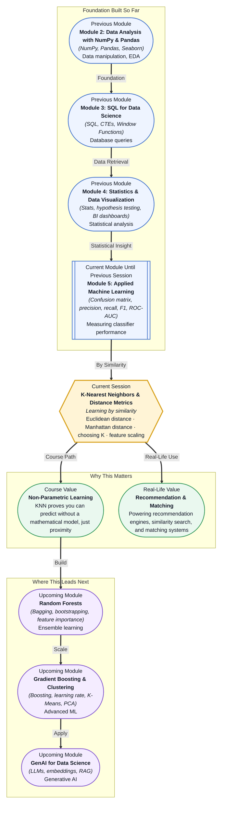

# Pre-read: K-Nearest Neighbors & Distance Metrics

## Context of This Session in the Course

Your phone buzzes with a fraud alert. A transaction was just blocked because it looked "unusual" compared to your spending history — same merchant category, same time of night, same amount range as past fraudulent cases. The bank did not run a deep neural network. It simply compared your transaction against millions of others and found which known cases it most closely resembled. That comparison — measuring how "far" or "close" one data point is to another — is the quiet engine behind an entire family of machine learning models.

The naive approach to prediction is to build a mathematical formula: learn weights, draw a boundary, fit a curve. But what if the relationship between your features and your target is too irregular for any tidy equation? What if the decision boundary looks more like a jagged archipelago than a smooth line? In those moments, a model that memorises the training data and votes by proximity often outperforms every parametric model you try. The hard part is defining what "close" actually means.

That is where **K-Nearest Neighbors (KNN)** and the distance metrics that power it become essential.

---

**What if** you had to build a recommendation engine for a library of one million books with no ratings, reviews, or purchase history — only the books themselves? You have features like genre, page count, publication year, and author style. By measuring distance between books in this feature space, you could recommend "similar" titles to anyone who picks one off the shelf — no training required. KNN turns that intuition into a working algorithm: find the K most similar neighbours and return their labels. The challenge is not the idea — it is the execution. Which distance metric captures similarity best for books? How do you handle page count (hundreds) alongside publication year (thousands)? And how many neighbours is enough to be confident without drowning in noise? These are the questions this session will equip you to answer.

---

**K-Nearest Neighbors** is a supervised learning algorithm that makes predictions based on the majority vote (for classification) or average (for regression) of the K most similar data points in the training set. It is called a **non-parametric** algorithm because it makes no assumptions about the underlying data distribution — no linearity, no normality, no equation to solve. The model *is* the data. Think of KNN as the wise village elder who makes decisions not by applying abstract rules, but by remembering what happened in similar situations before. When a new dispute arises, the elder recalls the ten most similar past cases and decides accordingly. There is no formula — only memory and proximity.

In this session, you will explore three critical decisions that determine whether KNN succeeds or fails: which **distance metric** best captures similarity (Euclidean vs Manhattan), how to choose the right **K value**, and why **feature scaling** is non-negotiable when features are measured on completely different scales.

---

In the **previous session**, you learned how to evaluate classifier performance using confusion matrices, precision, recall, F1-score, and ROC-AUC curves. You saw that accuracy alone can mislead, especially with imbalanced datasets, and that robust evaluation requires multiple lenses. That toolkit is directly applicable here. KNN may be intuitive, but it still demands the same rigorous evaluation — you will use those same metrics to tune K, compare distance metrics, and validate that your proximity-based predictions are genuinely reliable.

---

In this pre-read, you will discover:

- How to **understand** why KNN is called a "lazy learner" and how proximity-based prediction works.
- How to **recognise** when Euclidean distance is appropriate versus when Manhattan distance gives better results.
- How to **apply** feature scaling and explain why unscaled features silently break distance-based models.
- How to **interpret** the bias-variance tradeoff hidden in the choice of K.

---

## Euclidean vs Manhattan — How Your Definition of "Close" Changes Everything

When you hear "distance," your mind probably draws a straight line. That is **Euclidean distance** — the shortest path between two points, calculated as the square root of the sum of squared differences. It works naturally when all features are continuous and their relationships are smooth. If you are clustering houses by square footage and price, Euclidean distance captures the intuitive geometry of the data. Points that look close on a scatter plot stay close in the distance calculation.

But not all data lives in a smooth geometric space. Imagine walking through a city built on a grid — you cannot cut diagonally through buildings. You must move along the blocks. **Manhattan distance** (also called L1 distance) measures the sum of absolute differences along each axis, ignoring diagonals entirely. It is more robust to outliers because it does not square differences, and it tends to perform better in high-dimensional spaces where Euclidean distances inflate and lose meaning. The choice between these two metrics encodes a fundamental assumption about your data: Euclidean assumes the world is smooth and isotropic; Manhattan assumes it is grid-like and axis-aligned. Picking the wrong one silently degrades your model before it makes a single prediction.

## Why Feature Scaling Is Not Optional

KNN looks at every feature when computing distance. If one feature ranges from 0 to 100,000 (annual income) and another from 18 to 80 (age), the income feature will dominate every distance calculation — not because it is more important, but because its numbers are bigger. A difference of \$20,000 in salary completely drowns out a 30-year age gap. Your model becomes effectively blind to every feature except the one with the largest numeric range.

The fix is **feature scaling**: transform all features to a comparable range before any distance computation. Two standard approaches are **Standardisation** (subtract the mean, divide by the standard deviation) and **Min-Max scaling** (compress values into the [0,1] range). Standardisation handles outliers better; Min-Max preserves the exact shape of the distribution. Neither is universally superior — but skipping scaling entirely guarantees poor results. This need for scaling also interacts with your choice of K. Even with an optimal K, if distances themselves are corrupted by unscaled features, the neighbours you retrieve will be the wrong ones. Scaling is not a footnote in the KNN workflow — it is the foundation.

## Where Distance-Based Learning Appears in Real Life

Recommendation engines at streaming services, e-commerce platforms, and social media are the most visible application of distance-based learning. When Netflix suggests a title "because you watched" a particular show, it is comparing feature vectors — genre mix, runtime, release era, viewer demographics — and returning the nearest neighbours in that space. Fraud detection systems work similarly: a new transaction is compared against known fraudulent and legitimate transactions using distance metrics, and transactions that land suspiciously close to past fraud cases are flagged automatically. In healthcare, KNN has been used for pattern-based diagnosis, where a patient's symptom profile is matched against historical cases to suggest likely conditions. Search engines and document retrieval systems also depend on distance metrics: embeddings convert text into numeric vectors, and the closest vectors to a user's query become the ranked search results. Even in biometric systems like facial recognition, the core operation is the same — encode a face as a vector and find the nearest match in the database. Every one of these systems faces the same three questions you will master in this session: which distance metric captures the structure of the data, how many neighbours is the right number, and are the features properly scaled?

---

## What's Next

After this session, you will be able to:

- Compute Euclidean and Manhattan distances between data points and choose the right metric for your dataset.
- Select an optimal K value using validation and explain how it controls the bias-variance tradeoff.
- Apply feature scaling before training a KNN model and diagnose when unscaled features distort predictions.
- Implement a full KNN classification pipeline using Scikit-learn.
- Diagnose when KNN is the right tool versus when a parametric model would perform better.

You do not need to memorise every distance formula right now. The goal is to shift your intuition from "predict by formula" to "predict by proximity": **your neighbours often know more than any equation ever could.**

---

## Interesting Questions for the Live Session

- If K=1 gives perfect accuracy on training data but fails on new data, is the model "learning" anything at all, or is it just memorising?
- When would Manhattan distance systematically outperform Euclidean in a high-dimensional space, and why does the "curse of dimensionality" make every point seem equally far away?
- If your features include categorical variables like "city" or "colour," how would you meaningfully compute distance between them?
- Can a KNN model ever be truly "interpretable" when its prediction relies on K different neighbours with potentially conflicting feature profiles?

By the end of this session, KNN should feel less like an algorithm and more like a natural reasoning process: **look around, ask your neighbours, and decide together.**
