# Pre-read: Linear Regression

## Context of This Session in the Course

```mermaid
%%{init: {"flowchart": {"nodeSpacing": 45, "rankSpacing": 65, "diagramPadding": 20}} }%%
flowchart TB
    subgraph Foundation["Foundation Built So Far"]
        P1(["Previous Module<br/><b>Data Analysis with NumPy &amp; Pandas</b><br/><i>NumPy, Pandas, Seaborn</i><br/>Data manipulation, EDA"])
        P2(["Previous Module<br/><b>SQL for Data Science</b><br/><i>SQL, CTEs, Window Functions</i><br/>Database queries"])
        P3(["Previous Module<br/><b>Statistics &amp; Data Visualization</b><br/><i>Stats, hypothesis testing, BI dashboards</i><br/>Statistical analysis"])
        C1[["Current Module Until Previous Session<br/><b>Applied Machine Learning</b><br/><i>Supervised vs unsupervised, ML lifecycle, scikit-learn</i><br/>Core concepts of predictive modeling"]]
    end

    CS{{"Current Session<br/><b>Linear Regression</b><br/><i>From classification concepts to predicting continuous values</i><br/>simple regression · multiple regression · least squares · coefficients · intercept · MSE · R-squared · line of best fit · residuals"}}

    subgraph Value["Why This Matters"]
        CV(["Course Value<br/><b>Foundation of Predictive Modeling</b><br/>Linear regression is the gateway model that powers understanding of all advanced ML"])
        RV(["Real-Life Value<br/><b>Forecast Anything</b><br/>Predict sales, prices, demand, and trends using the most interpretable ML model"])
    end

    subgraph Future["Where This Leads Next"]
        F1(["Upcoming<br/><b>Logistic Regression</b><br/><i>Sigmoid, decision boundaries, odds ratios</i><br/>Classification via regression"])
        F2(["Upcoming<br/><b>Trees, Ensembles &amp; Evaluation</b><br/><i>Decision trees, random forests, confusion matrix, ROC-AUC</i><br/>Advanced modeling and metrics"])
        F3(["Upcoming<br/><b>GenAI for Data Science</b><br/><i>LLMs, embeddings, vector DBs, RAG</i><br/>Generative AI applications"])
    end

    P1 ==>|&nbsp;Foundation&nbsp;| P2
    P2 ==>|&nbsp;Data Retrieval&nbsp;| P3
    P3 ==>|&nbsp;Statistical Insight&nbsp;| C1
    C1 ==>|&nbsp;Predict Values&nbsp;| CS
    CS ==>|&nbsp;Course Path&nbsp;| CV
    CS ==>|&nbsp;Real-Life Use&nbsp;| RV
    CV ==>|&nbsp;Build&nbsp;| F1
    F1 ==>|&nbsp;Scale&nbsp;| F2
    F2 ==>|&nbsp;Apply&nbsp;| F3

    classDef previous fill:#eef4ff,stroke:#4f7ccf,color:#111827,stroke-width:2px;
    classDef current fill:#fff4d6,stroke:#d9a321,color:#111827,stroke-width:3px;
    classDef value fill:#eaf8ef,stroke:#3f9f63,color:#111827,stroke-width:2px;
    classDef future fill:#f4ecff,stroke:#8a61d1,color:#111827,stroke-width:2px;

    class P1,P2,P3,C1 previous;
    class CS current;
    class CV,RV value;
    class F1,F2,F3 future;
    linkStyle default stroke-width:3px;
```

You are a business analyst at a ride-hailing company. Every Friday at 5 PM, the pricing team asks the same question: what should a 15-minute airport trip cost when demand spikes and traffic builds? You have thousands of past rides — distances, durations, time-of-day tags, surge multipliers — but turning that heap of data into a single confident number feels like guesswork dressed up as analysis.

Averaging similar trips seems sensible but ignores how distance and demand interact. Drawing a trendline by hand works once but falls apart when you need to update it daily or explain your reasoning to a colleague. The naive approaches are either too simple to be accurate or too ad hoc to be trusted. What you need is a repeatable, mathematical way to isolate exactly how each factor — distance, time, traffic — drives the fare, and then combine them into a reliable prediction.

That is where **Linear Regression** becomes essential.

---

**What if** you could predict next quarter's revenue, a house's market price, or a customer's lifetime value using nothing more than historical data and a model that fits on a single slide? Regression models power thousands of everyday business decisions — from loan approvals to inventory planning to dynamic pricing. After this session, you will be able to build and interpret a model that turns raw columns of numbers into a clear, defensible forecast.

---

At its heart, **Linear Regression** is the search for the best-fitting straight line through a cloud of data points. When you have one input variable, that line is defined by two things: an **intercept** (where the line crosses the vertical axis) and a **coefficient** (how steeply the line rises as the input increases). With multiple inputs, the same idea extends to a plane or hyperplane — one coefficient per predictor, all combined linearly. The method used to find these values, **Least Squares**, minimises the vertical distance between every actual data point and the line you draw — ensuring your model fits the data as closely as possible.

Think of it like setting the volume on a speaker. The intercept is the baseline volume when no music is playing. Each coefficient is like a separate control — bass, treble, balance — that adjusts the final output based on what you feed in. Least Squares is the tuning process that turns the knobs until the sound matches the original recording most closely. In this session, you will explore how to apply this logic with **simple vs multiple regression**, compute **coefficients** and **intercepts**, and measure success using **MSE (Mean Squared Error)** and **R-squared**. You will build your first predictive model and learn exactly how to judge whether it is any good.

---

In the **previous session**, you distinguished supervised learning from unsupervised learning, traced the full ML lifecycle from data collection to deployment, and ran your first scikit-learn estimator. You learned that supervised learning requires labelled data and splits naturally into regression (predicting numbers) and classification (predicting categories). That last distinction matters here. Session 17.1 gave you the map; this session hands you the engine. The scikit-learn workflow you started — import, instantiate, fit, predict — will run again, but this time the output will not be a label. It will be a continuous number, and you will learn exactly what is happening mathematically under the hood when you call `.fit()`.

---

In this pre-read, you will discover:

- How to **understand** the mechanics of simple and multiple linear regression as a mathematical model for continuous prediction.
- How to **interpret** regression coefficients, intercepts, and the least squares optimisation that finds them.
- How to **evaluate** model performance using MSE and R-squared, and what each metric reveals about prediction quality.
- How to **connect** regression concepts to the broader ML lifecycle introduced in the previous session.

---

## Why a Straight Line Can Model a Complex World

It seems almost too simple. Real-world relationships — between advertising spend and sales, between years of experience and salary, between temperature and energy demand — are rarely perfectly straight. Yet **Linear Regression** works, often remarkably well, and here is why.

The model does not claim the relationship is perfectly linear. It claims that a linear approximation is useful. In many systems, especially over the range of data you have observed, the underlying trend is close enough to straight that the errors you make are smaller than the noise already present in the data. This is the same reason you can approximate a curved road as a series of short straight segments when driving — close enough to navigate, far simpler to compute. The **coefficients** tell you the direction and strength of each influence, and the **intercept** anchors the prediction at a baseline. Together they produce a model that is not only fast to train and interpret but also surprisingly resilient against overfitting when your data is clean.

---

## How MSE and R-Squared Tell You Whether to Trust Your Model

Building a regression line is only half the work. The real question is: how good is it? Two metrics answer this from different angles. **MSE (Mean Squared Error)** measures the average squared difference between your predictions and the actual values. A lower MSE means your predictions are, on average, closer to reality. The squaring penalises large errors disproportionately — a single bad prediction hurts your score more than several small ones — which pushes the model toward consistent accuracy.

**R-squared** answers a different question: how much of the variation in your data does your model explain? It compares your model's performance to a baseline model that always predicts the mean. An R-squared of 0 means your model is no better than guessing the average. An R-squared of 0.85 means your model accounts for 85 percent of the variability in the outcome. But here is the catch — adding more input variables always inflates R-squared, even if those variables are useless. That is why you will learn to treat it as one signal among several, not as a standalone verdict.

---

## Where Linear Regression Appears in Real Life

Open any business dashboard, and you are likely looking at regression outputs without realising it. In **real estate**, regression models estimate property values by weighing features like square footage, location, number of bedrooms, and age of the building. Zillow's Zestimate, for all its complexity, is fundamentally a regression engine trained on millions of transactions. In **retail and e-commerce**, regression drives demand forecasting — how many units of a product will sell next week based on price discounts, seasonality, and competitor activity. A pricing team might run a multiple regression to isolate the effect of a 10 percent discount from the effect of a holiday weekend.

In **finance**, regression models are used to predict stock volatility, credit risk scores, and customer lifetime value. A lending team builds a model where the outcome is the probability of default expressed as a continuous score, and the inputs are income, debt-to-income ratio, and payment history. In **healthcare**, linear regression estimates patient readmission risk from vitals and lab results, or predicts the progression of a disease based on dosage and time. In **operations**, regression helps forecast energy consumption, server load, and supply chain demand. Everywhere you see a need to explain or predict a number — not just classify something into a bucket — regression is the first, most interpretable tool that professionals reach for.

---

## What's Next

After this session, you will be able to:

- Fit a linear regression model in scikit-learn using both simple and multiple predictors.
- Interpret the coefficients and intercept to explain how each input affects the prediction.
- Evaluate model performance using MSE and R-squared and identify when a model is underfitting or overfitting.
- Diagnose residuals to spot patterns that a linear model might be missing.
- Apply the full fit-predict-evaluate cycle to a real-world dataset like housing prices or sales forecasting.

You do not need to memorise the linear algebra behind least squares yet. The goal is to build an intuitive feel for how lines fit data, what makes a model trustworthy, and why regression is the bedrock of every ML algorithm that follows: **predict the number, then question the prediction.**

---

## Interesting Questions for the Live Session

- If your regression line has a high R-squared but a large MSE, what is really going on with your predictions?
- When would you intentionally choose a simple regression with one variable over a multiple regression with ten, even if the multiple regression scores higher on R-squared?
- What happens to your coefficients if two input variables are highly correlated with each other, and how would you detect that situation?
- If your residual plot shows a clear U-shaped pattern, why is that a sign that linear regression might not be the right model for your data?

By the end of this session, linear regression should feel less like a formula from a textbook and more like a practical reasoning tool: **the simplest model that turns data into a defensible prediction.**
