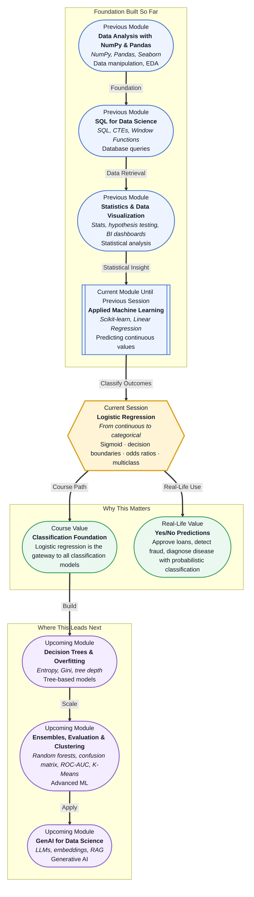

# Pre-read: Logistic Regression

## Context of This Session in the Course

Your phone buzzes with a bank notification: "Transaction of ₹12,500 at Global Electronics — is this you?" You tap "Yes" or "No" in seconds, and the bank instantly knows it is you or blocks the card. Behind that simple tap lies a model making a binary decision — fraud or legitimate — based on your spending patterns, location, and transaction amount.

A linear regression model would try to predict a number, like "fraud probability score of 0.73." But a bank does not need a score in isolation — it needs a clear decision: approve or block. Drawing a straight line through the data does not help when the output must be a crisp yes or no. Worse, extreme transactions can pull the line off course, making the model unreliable at the very edges where fraud lives.

That is where **Logistic Regression** becomes essential.

What if you could build a model that predicts whether a patient has diabetes from just their glucose level, age, and BMI — with a clear yes/no answer and a probability attached? Doctors do not want a vague number; they want a confident recommendation backed by evidence. Logistic regression gives you exactly that: a principled way to draw a line that separates categories, not just predict numbers.

Logistic regression starts where linear regression stops. Instead of fitting a line to continuous values, it fits a **sigmoid curve** that squeezes predictions into the range 0 to 1 — a probability. The **decision boundary** is the threshold (usually 0.5) where the model commits to one class or the other. You will encounter **odds ratios**, which reveal how each feature changes the likelihood of an outcome, and a glimpse at how the same logic extends to **multiclass classification** through techniques like one-vs-rest.

Think of it this way: linear regression is like a volume slider — smooth and continuous. Logistic regression is like a light switch — on or off. The sigmoid function is the mechanism that turns the smooth slider into a crisp toggle while keeping the underlying confidence visible.

In the **previous session**, you built Linear Regression models to predict continuous values like house prices or sales figures using least squares, evaluated them with MSE and R-squared, and saw how coefficients described each feature's contribution. That same intuition now extends into classification: the coefficients in logistic regression tell you how each feature shifts the odds of belonging to one class, and the evaluation shifts from MSE to metrics like accuracy and log-loss.

In this pre-read, you will discover:

- How to **understand** the sigmoid function and why it converts any linear output into a clean probability between 0 and 1.
- How to **interpret** decision boundaries as the dividing line between two classes in feature space.
- How to **connect** odds ratios to model coefficients and explain what a feature change means for classification.
- How to **recognise** that multiclass classification builds on the same binary foundation through one-vs-rest or softmax.

---

## Why Predicting a Probability Is Different from Predicting a Number

Linear regression produces values from negative infinity to positive infinity, but classification needs outputs constrained between 0 and 1. A house price of ₹75 lakhs makes sense, but a "fraud probability" of -0.3 or 1.7 does not. This is the fundamental tension that the **sigmoid function** resolves.

The sigmoid function takes any real number and compresses it into the (0, 1) interval using a simple S-shaped curve. Near zero input, the sigmoid rises sharply — small changes in the predictor can flip the outcome. Far from zero, the curve flattens, and the prediction saturates near 0 or 1. This behaviour mirrors how real decisions work: when evidence is borderline, small changes matter a lot; when evidence is overwhelming, additional data barely shifts the probability.

Consider a loan officer reviewing applications. An applicant with a credit score of 820 is almost certainly approved, and an extra 10 points changes nothing. But an applicant with a score of 650 sits near the decision boundary — a small increase in income or a reduction in debt could tip the balance. The sigmoid captures this asymmetry naturally: steep in the middle, flat at the extremes.

## How Odds Ratios Explain the "Why" Behind a Prediction

A logistic regression model does not just give you a prediction — it tells you how each feature influences the odds of the outcome. The **odds ratio** is the multiplicative change in the odds of belonging to the positive class for a one-unit increase in a feature, holding everything else constant.

If the coefficient for "years of experience" in a job-offer-acceptance model is 0.25, the odds ratio is exp(0.25) ≈ 1.28. This means each additional year of experience increases the odds of accepting the offer by 28%. If a different feature has a negative coefficient, say -0.15, its odds ratio is exp(-0.15) ≈ 0.86 — each unit decreases the odds by 14%.

This interpretability is why logistic regression remains popular in medicine, finance, and law despite the existence of more complex models. A random forest may be more accurate, but it cannot tell a regulator why a loan was denied in terms of specific feature contributions. Logistic regression can: "Your debt-to-income ratio increased the denial odds by 3.2 times."

## Where Logistic Regression Appears in Real Life

Logistic regression is one of the most deployed models in industry because it combines simplicity with clear, explainable outputs. In **healthcare**, it is used to predict whether a tumour is malignant or benign based on cell features like size, shape, and texture — radiologists often use these probabilities alongside their own judgment. In **finance**, every credit card transaction is scored by a logistic regression model in real time; the model weighs transaction amount, location, merchant category, and time since last purchase to flag anomalies.

In **marketing**, logistic regression predicts whether a customer will click an ad, open an email, or churn from a subscription service — these binary outcomes directly drive campaign decisions and budget allocation. **Human resources** teams use it to screen candidates by predicting whether an applicant will stay beyond six months, using features like role fit score, commute distance, and salary band. Even in **insurance**, logistic regression models estimate the probability of a claim being fraudulent, helping adjusters prioritise which cases to investigate.

Behind each of these applications lies the same core machinery: a sigmoid, a decision boundary, and a set of odds ratios that turn raw data into actionable yes/no decisions.

## What's Next

After this session, you will be able to:

- Explain how the sigmoid function transforms linear regression outputs into probabilities between 0 and 1.
- Identify the decision boundary for a binary classifier in one or two dimensions and describe how it separates classes.
- Interpret logistic regression coefficients as log-odds and convert them to odds ratios for feature-level explanations.
- Train a logistic regression model using scikit-learn and evaluate its predictions on a binary classification task.
- Describe how softmax regression extends the same logic to handle three or more categories.

You do not need to derive the sigmoid formula from scratch right now. The goal is to see classification as a natural next step from regression: **linear regression predicts how much, logistic regression predicts which one.**

---

## Interesting Questions for the Live Session

- If the sigmoid function always outputs a probability, why do we still need a decision boundary — why not keep the raw probability as the final answer?
- What happens to logistic regression's decision boundary when the two classes overlap heavily in feature space?
- Odds ratios seem intuitive for a single feature, but how should you interpret them when features interact or are strongly correlated?
- Can logistic regression handle non-linear decision boundaries, or does every boundary have to be a straight line or hyperplane?

By the end of this session, logistic regression should feel less like a new algorithm and more like a natural extension of what you already know: **linear regression predicts how much, logistic regression predicts which one.**
