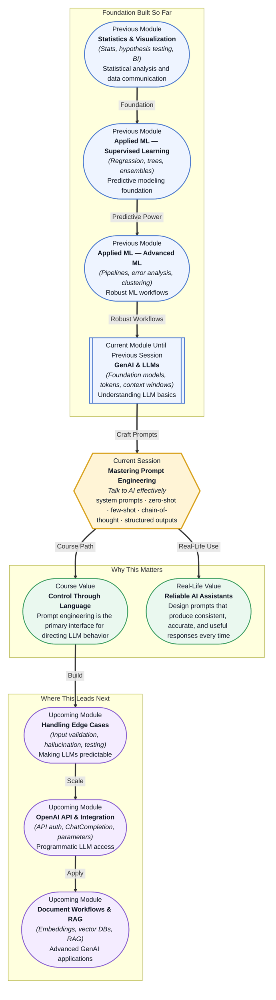

# Pre-read: Mastering Prompt Engineering

## Context of This Session in the Course

You are building a customer support chatbot for an e-commerce platform. The product catalogue is large, the return policy is nuanced, and customers ask the same questions in a hundred different ways. You decide to use a Large Language Model because it can understand natural language and generate helpful answers. But the first time you test it, the bot invents a return policy that does not exist, uses a tone that sounds robotic, and fails to follow your simplest instruction — "always ask for the order ID first."

The intuitive approach is to add more instructions. You write longer and longer prompts, hoping that more words will fix the problem. But the model still ignores some instructions, follows others inconsistently, and occasionally wanders into irrelevant tangents. You realise that speaking to an AI is not like giving commands to a human assistant. More words are not automatically better. The structure, framing, and specificity of your language determine whether the model does exactly what you need.

That is where **Mastering Prompt Engineering** becomes essential.

---

**What if** you could write a single prompt that reliably extracts structured data from messy customer emails, another that generates weekly business reports in exactly the format your manager expects, and another that turns a thousand lines of raw text into a concise executive summary — all without changing your code? Each use case would be handled by a well-designed prompt, tuned not by guessing but by applying repeatable techniques like system prompts, few-shot examples, and chain-of-thought reasoning. This session gives you the toolkit to make that vision a reality.

---

**Prompt engineering** is the practice of designing input text that guides an LLM to produce a desired output. It is not guesswork; it follows identifiable patterns. A **system prompt** sets the model's overall persona and constraints — think of it as the job description you give to the AI before it starts working. A **user prompt** is the specific request or question. Separating these two layers gives you fine-grained control: the system prompt defines the rules, and the user prompt supplies the task.

The difference between **zero-shot** and **few-shot** prompting is analogous to giving instructions to a new intern. Zero-shot means you describe the task once and expect the intern to perform it correctly. Few-shot means you provide a couple of examples first — "here are three emails and their correct summaries" — and the pattern snaps into place. **Chain-of-thought prompting** goes a step further: you ask the model to reason step by step before arriving at an answer, much like showing your work in a math exam. **Structured outputs** (JSON, markdown tables, bullet lists) ensure the response is machine-parseable and predictable. During this session, you will practice each of these techniques and learn when to apply them to real problems.

---

In the **previous session**, you explored how LLMs predict text, how tokens represent language, and how context windows constrain the amount of information a model can process at once. You learned that an LLM is fundamentally a next-token prediction engine — a powerful one, but one that has no built-in understanding of instructions, roles, or output formats. That foundation now becomes the substrate for prompt engineering. Because you understand how tokens flow through a context window, you can now design prompts that place the most critical instructions exactly where the model pays the most attention. Because you know the model has no inherent notion of "persona," you can use system prompts to supply that persona explicitly.

---

In this pre-read, you will discover:

- How to **design** system prompts that set rules and user prompts that deliver tasks.
- How to **apply** zero-shot and few-shot prompting for different levels of task complexity.
- How to **use** chain-of-thought prompting to improve reasoning in multi-step problems.
- How to **structure** outputs for reliable parsing and downstream automation.

---

## System Prompts vs User Prompts — The Hidden Architecture of a Good Prompt

Every interaction with an LLM has two layers of instructions, and confusing them is the most common source of unreliable behaviour. The **system prompt** defines the model's role, tone, constraints, and high-level behaviour — it is the persistent context that frames every subsequent exchange. The **user prompt** delivers the specific task, question, or input that the model should act on right now.

Consider the difference in a real scenario. A customer support system prompt might say: "You are a polite and efficient support agent for an online electronics store. You always ask for the order ID before answering. You never invent prices or policies. If you do not know the answer, say so honestly." The user prompt, on the other hand, says: "A customer just wrote: 'My laptop arrived with a cracked screen. What do I do?'" The system prompt supplies the role and rules; the user prompt supplies the current problem. Together they produce a grounded, context-aware response.

The reason this separation matters is that LLMs treat instructions near the beginning and end of the context window with different weight. By placing permanent constraints in the system prompt (which stays at the start of the conversation) and variable tasks in the user prompt, you avoid repeating yourself and reduce the risk of instruction drift over long interactions. This two-layer architecture is the foundation upon which every other prompting technique is built.

## Zero-Shot, Few-Shot, and Chain-of-Thought — Three Levers for Reliable Responses

Not all tasks require the same amount of guidance. **Zero-shot prompting** works best when the task is well-known to the model — summarising a short article, translating a sentence, or classifying sentiment. You give the instruction and the model produces the output without examples. The lever here is clarity: the more precise and unambiguous your instruction, the better the zero-shot result.

When the task involves a specific format, domain, or unusual pattern, **few-shot prompting** becomes your tool. You provide two to five examples of the desired input-output mapping, and the model infers the pattern. The lever here is example quality: well-chosen examples that cover edge cases dramatically outperform random ones. Research shows that even a single well-crafted example can improve accuracy by 20–30 percentage points on complex formatting tasks.

**Chain-of-thought prompting** addresses a different bottleneck — reasoning depth. When a task requires multiple logical steps (solving a math word problem, debugging a SQL query, comparing two products across several dimensions), asking the model to "think step by step" before producing the final answer significantly improves accuracy. The lever here is transparency: you can inspect each step of the model's reasoning and identify where it goes wrong. Combining these three techniques — zero-shot for simple tasks, few-shot for patterned outputs, and chain-of-thought for multi-step reasoning — gives you a complete toolkit for making LLMs reliable across almost any use case.

## Where Prompt Engineering Appears in Real Life

Prompt engineering is not an academic exercise. It is the primary way that companies control LLM behaviour in production systems, and its applications span every industry that touches language.

In **customer service**, companies use system prompts to enforce brand voice, compliance rules, and escalation paths. A well-prompted chatbot can handle 80% of support tickets without human intervention, but only if the prompt is engineered to prevent hallucination and enforce consistent handoff rules. In **healthcare**, prompts are designed to extract structured data from clinical notes — symptoms, medications, diagnoses — using few-shot examples drawn from anonymised patient records. The prompt must specify exact output formats (like JSON schemas) to feed downstream analytics systems.

In **finance**, analysts use chain-of-thought prompting to generate investment research summaries that compare companies across revenue growth, debt ratios, and market position — each step of the reasoning is visible and can be audited. In **legal tech**, prompts convert dense contract language into plain-English summaries, with structured output fields for parties, obligations, termination clauses, and renewal dates. **E-commerce** companies prompt LLMs to generate product descriptions at scale, using few-shot examples of their brand's tone and keyword strategy.

Every one of these applications depends on the same core skills: separating system instructions from user requests, choosing the right number of examples, asking for step-by-step reasoning when the problem is complex, and demanding structured outputs when the result needs to be parsed by software. These are not hacks or tricks. They are engineering patterns — and this session is where you learn them.

---

## What's Next

After this session, you will be able to:

- Write system prompts that enforce consistent persona, tone, and constraints across every interaction.
- Choose between zero-shot and few-shot prompting based on task complexity and available examples.
- Apply chain-of-thought prompting to break down multi-step reasoning problems.
- Request structured outputs (JSON, tables) that can be parsed directly by downstream code.
- Diagnose why a prompt fails and iteratively improve it using known engineering patterns.
- Evaluate prompt versions systematically to ensure reliability before deployment.

You do not need to memorise every prompting pattern right now. The goal is to understand that prompting is a craft with principles, not guesswork: **clear instructions, structured context, and iterative testing produce reliable AI behaviour.**

---

## Interesting Questions for the Live Session

- If a model ignores a system instruction buried in a long prompt, is the fix to rewrite the instruction or to move it earlier in the prompt?
- How do you decide how many few-shot examples are enough, and at what point do additional examples start to hurt performance?
- When a chain-of-thought prompt produces a correct final answer but an incorrect chain of reasoning, is the output trustworthy?
- Can structured output formats like JSON reduce hallucination risk, or do they only change how the hallucination is presented?

By the end of this session, prompt engineering should feel less like trial-and-error and more like a systematic skill: **design the input, test the output, and iterate with purpose.**
