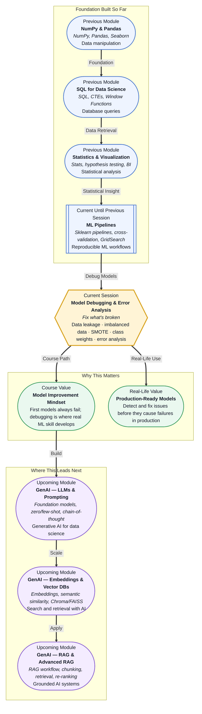

# Pre-read: Model Debugging & Error Analysis

## Context of This Session in the Course

You just trained a credit risk model. Accuracy on the test set? 97%. Your manager is impressed. You deploy it. Within a week, the model is approving loans to applicants who are clearly high-risk — people with no income, multiple existing defaults, and suspicious transaction patterns. The 97% was a mirage. What happened?

Somewhere in your training data, a column like "customer_id" or "transaction_date" or even "default_status_previous_loan" leaked information from the future into your model. The model learned to cheat — it found a shortcut in the data that existed in your historical training set but will never exist in real-world predictions. That 97% accuracy collapses to something closer to 60% the moment the model sees new data. This is not a rare bug. It is one of the most common reasons machine learning projects fail after deployment, and it happens to teams at every level.

The naive response is to assume your model is good because your test metrics look strong. But test metrics only tell you how well the model performed on past data arranged in a specific way. They do not tell you whether the model is learning real patterns or simply memorising accidental correlations. Even worse, if your dataset is imbalanced — say 95% non-default and 5% default — a model that predicts "non-default" for every row will score 95% accuracy while being completely useless. That is where **Model Debugging & Error Analysis** becomes essential: the disciplined process of looking past aggregate metrics to understand what your model actually learned, where it fails, and why.

---

**What if** you could look at any trained model — whether it scores 99% or 55% — and immediately identify the three most important reasons it will fail in production? Imagine your model performs well on most customers but systematically gets it wrong for a specific segment, like young self-employed applicants or users with thin credit histories. Without error analysis, you would chase random improvements and never find the root cause. With it, you can say: "The model fails for this subgroup because the feature distribution in training was different from production, and the minority class is being ignored entirely." This session gives you the diagnostic toolkit to do exactly that.

---

**Model debugging** is the systematic process of identifying, diagnosing, and fixing issues in a trained model before it reaches production. It sits between building a pipeline and deploying a solution, and experienced practitioners often spend more time here than on model selection. Three interconnected problems demand your attention.

First, **data leakage** occurs when information from outside the training set — usually from the future or from the target variable — accidentally flows into the model during training. It is the most dangerous issue because it inflates performance metrics silently. A leaked model looks amazing in your notebook and fails immediately in the real world. Common culprits include using the target to create features, applying scaling before train-test split, and including columns that are correlated with the target in ways that will not exist in production.

Second, **imbalanced data** means one class (usually the one you care about most — fraud, default, disease) appears far less frequently than the other. Standard models optimise for overall accuracy and will happily ignore the rare class entirely. A fraud detector that never flags fraud achieves 99% accuracy but is worthless. Techniques like **SMOTE** (Synthetic Minority Oversampling Technique) generate synthetic examples of the minority class, while **class weights** tell the algorithm to penalise mistakes on the minority class more heavily.

Third, **error analysis** is the structured practice of examining where and why your model makes mistakes. Instead of looking at a single accuracy number, you slice your predictions by segments — customer types, time periods, feature ranges — and look for patterns in the errors. This transforms debugging from guesswork into a repeatable investigation.

Think of it like a doctor diagnosing a patient. Accuracy is just the patient saying "I feel unwell." Leakage detection is like finding that the thermometer was placed near a heater. Handling imbalanced data is recognising that a rare disease needs different diagnostic criteria than a common cold. Error analysis is running specific tests on each organ system to find the exact source of the problem. Without these steps, you are prescribing treatment without a diagnosis.

---

In the **previous session**, you built robust ML pipelines using Scikit-learn's `Pipeline` class, cross-validation, and GridSearch for hyperparameter tuning. You learned how to chain preprocessing steps with model training into a single reproducible workflow and how to search for optimal parameters systematically. That foundation is critical here because pipeline discipline is your first line of defence against data leakage. A well-structured pipeline ensures that preprocessing steps like scaling or encoding are fitted only on the training data and applied consistently to test data — preventing one of the most common leakage sources. Cross-validation gives you honest performance estimates that can reveal instability. And GridSearch taught you the importance of evaluating many configurations systematically, which is exactly the mindset you will apply to debugging: you will learn to isolate variables, test hypotheses about what is broken, and fix issues one at a time.

In this pre-read, you will discover:

- How to **recognise** the three most common forms of data leakage and why they inflate your model's performance silently.
- How to **apply** SMOTE and class weights to handle imbalanced datasets where the minority class carries the real signal.
- How to **build** an error analysis workflow that segments predictions and reveals systematic failure modes.
- How to **connect** model debugging directly to production reliability, turning fragile models into robust solutions.

---

## Why Data Leakage Is a Silent Killer

Imagine studying for an exam where the answer key is printed on the back of every practice question. You will score 100% on every practice test and feel completely prepared. Then you walk into the real exam and fail because the answer key is not there. That is data leakage.

**Data leakage** happens when your model has access to information during training that it will not have access to during prediction. The most common source is leakage from the target variable into the feature set. If you are predicting loan default and your features include "number_of_late_payments" calculated from the same period you are trying to predict, the model has effectively seen the answer. Another classic case is using the entire dataset for scaling or imputation before splitting into train and test. When you call `fit_transform` on the full dataset with `StandardScaler`, the test data's statistics influence the training data's transformation, and the model indirectly sees information from the test set. This is why Scikit-learn pipelines enforce the rule: `fit` only on training, `transform` on test.

A third, subtler form is **temporal leakage** — using future information to predict the past. If you are building a model to predict customer churn next month, your training features should only include information available up to the prediction date. Including "total_spend_next_month" as a feature, even unintentionally, gives the model impossible knowledge. The fix is always the same: treat your data with suspicion. Ask yourself for every feature: "Would I have this information at prediction time?" If the answer is no, that feature is leaking. The most dangerous thing about leakage is that your model will have excellent metrics — and you will have no reason to suspect anything is wrong until deployment.

## When Your Model Sees Only One Class

A fraud detection dataset contains 100,000 transactions. One thousand are fraudulent. That is a 99:1 ratio. A model that predicts "not fraud" for every transaction achieves 99% accuracy. But it is completely useless. This is the **class imbalance** problem, and it is the norm in many real-world applications — fraud, disease detection, equipment failure, churn prediction, and rare event forecasting.

Standard machine learning algorithms are optimised to minimise overall error. When 99% of your data is one class, the easiest way to minimise error is to ignore the minority class entirely. The model never learns what fraud looks like because it never needs to. Two techniques address this directly. **Class weights** assign a higher penalty to mistakes on the minority class during training. In Scikit-learn, you pass `class_weight='balanced'` to models like `LogisticRegression` or `RandomForestClassifier`, and the algorithm automatically adjusts the loss function so that misclassifying a fraud case costs, say, 99 times more than misclassifying a normal case. The model is now forced to pay attention.

**SMOTE** (Synthetic Minority Oversampling Technique) takes a different approach. Instead of changing the loss function, it creates synthetic examples of the minority class by interpolating between existing minority-class samples. If you have two fraudulent transactions with similar features, SMOTE creates a third example that falls somewhere between them in feature space. This balances the dataset synthetically without simply duplicating existing rows (which can cause overfitting). The key insight is that SMOTE does not just duplicate data — it generates plausible new examples that expand the decision boundary of the minority class. Used together with class weights or as a standalone technique, SMOTE can dramatically improve recall on the minority class. But it is not a silver bullet: if the minority class examples are themselves noisy or poorly separated, synthetic samples can introduce more confusion than signal.

## Where Model Debugging Appears in Real Life

Model debugging is not an academic exercise reserved for Kaggle competitions — it is the daily work of machine learning engineers in production environments, and it separates projects that ship from projects that stall.

In **financial services**, credit scoring models undergo rigorous error analysis before regulatory approval. A bank's model might achieve 92% ROC-AUC overall but fail catastrophically for a specific demographic group. Regulators require lenders to demonstrate that models are fair across protected attributes. Error analysis by segment — age bracket, income tier, geographic region — reveals whether the model performs equally well for all groups. If it does not, the team investigates whether the feature distributions differ across segments or whether the training data underrepresented certain groups. Data leakage is a constant concern: including a feature like "number_of_inquiries_last_30_days" can leak information about whether the customer was already shopping for a loan, creating a circular relationship with the default prediction.

In **healthcare**, diagnostic models for rare diseases face extreme class imbalance — one positive case per ten thousand or more. A model trained on raw data will almost certainly predict "no disease" for every patient. Class weighting and SMOTE are essential here, but they introduce a new risk: synthetic oversampling of a rare disease might create unrealistic feature combinations that do not reflect actual pathology. Error analysis involves working with clinicians to review false positives and false negatives case by case, understanding whether the model misses the same type of patient every time — for example, patients with early-stage disease where symptoms are milder and features overlap with the healthy population.

In **e-commerce**, recommendation systems use error analysis to understand why certain user segments receive poor recommendations. A model might perform well for power users with long purchase histories but fail for new users with no history — a problem known as the "cold start" problem. Error analysis by user tenure reveals this pattern. Data leakage in recommendation systems is subtle: including "product_viewed_after_purchase" as a feature during training gives the model information that would not be available during real-time recommendation. The team must carefully audit each feature for look-ahead bias.

In **manufacturing**, predictive maintenance models detect equipment failures before they happen. Failure events are rare — perhaps 0.5% of sensor readings. A model that never predicts failure will appear 99.5% accurate while allowing expensive equipment to break. SMOTE-generated synthetic failure events help the model learn what pre-failure sensor patterns look like. Error analysis by machine type, shift, or operating condition reveals whether the model only detects failures in certain environments. Temporal leakage is a critical concern: if the model uses "average_sensor_reading_next_hour" as a feature during training, it is effectively cheating by looking into the future.

---

## What's Next

After this session, you will be able to:

- Detect the three most common forms of data leakage — target leakage, train-test contamination, and temporal leakage — before they reach production.
- Apply SMOTE to generate synthetic minority-class samples and improve model recall on imbalanced datasets.
- Configure class weights in Scikit-learn models to force the algorithm to penalise minority-class errors more heavily.
- Structure an error analysis workflow by slicing predictions across segments and identifying systematic failure modes.
- Diagnose whether high accuracy is genuine or a symptom of data leakage or class imbalance.
- Debug a model systematically instead of making random tweaks and hoping performance improves.

You do not need to memorise every diagnostic technique right now. The goal is to adopt a disciplined mindset: **a model that scores well on old data is not the same as a model that will work on new data.**

---

## Interesting Questions for the Live Session

- If your test accuracy is 96% but an error analysis reveals that the model fails on 80% of the minority class, where do you draw the line between "good enough" and "needs fixing"?
- SMOTE creates synthetic samples by interpolating between existing minority-class points — could this accidentally generate examples that are impossible in the real world, and how would you catch that?
- When using class weights, how do you decide the penalty ratio — should it match the class distribution exactly, or is there a principled way to tune it as a hyperparameter?
- If you detect data leakage after a model has been in production for three months, how do you decide whether to retrain immediately, roll back, or accept the bias until the next scheduled release?

By the end of this session, model debugging should feel less like a post-mortem when things go wrong and more like a standard quality gate before every deployment: **trust, but verify.**
