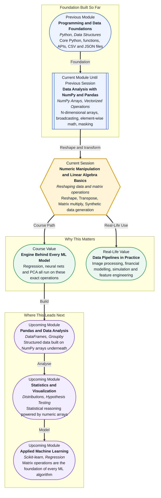

# Pre-read: Numeric Manipulation & Linear Algebra Basics

## Context of This Session in the Course

Imagine you are working with a dataset of 10,000 grayscale images, each 28 pixels wide and 28 pixels tall. The images are stored one after another in a single long row of numbers. Your machine learning model, however, expects each image to arrive as a 28-by-28 grid. You need to rearrange those numbers without changing a single value. You just need to change the shape.

Or imagine you are a financial analyst. You have a matrix where each row is a trading day and each column is a stock. Your portfolio model needs the exact opposite orientation — each row should be a stock and each column should be a trading day. You need to flip the matrix. You need a **transpose**.

Or imagine you are building a scoring system. For each customer, you have a set of five numeric features. You want to apply a set of learned weights to those features and compute a single predicted score for each customer. That operation — combining rows of data with a column of weights to produce outputs — is the heart of **matrix multiplication**, and it runs inside virtually every model you will ever use.

These three operations — reshaping, transposing, and multiplying matrices — are not abstract mathematics. They are the daily vocabulary of data work.

---

**What if** you could handle any shape of data without copying a single value?

When you work with raw sensor readings, pixel grids, time-series windows, or user-feature tables, the data almost never arrives in the shape your code expects. Before you can analyse it, clean it, or train a model on it, you need to rearrange the numbers into the right structure.

Python loops are too slow for this. A professional data scientist does not iterate row by row. Instead, they use NumPy's powerful shape manipulation tools to restructure millions of numbers instantly, treating the entire dataset as a single mathematical object and reshaping it in one clean operation.

This session is where you move from thinking about individual numbers to thinking about the **shape and orientation of data** as a whole — a mental shift that every effective data scientist makes early in their journey.

---

**Numeric manipulation** in NumPy is the ability to rearrange, restructure, and transform arrays without losing their values. Think of it like rearranging furniture in a room. The furniture does not change. The room does not change. But the layout changes, and that changes what you can do with the space.

**Linear algebra basics** is the mathematics of multi-dimensional data. The term sounds intimidating, but the practical concepts are surprisingly concrete:

- A **vector** is a one-dimensional array of numbers — a single row or column.
- A **matrix** is a two-dimensional array — a table of numbers arranged in rows and columns.
- **Matrix multiplication** is a systematic way of combining two matrices to produce a third — and it is the core operation behind weighted scoring, linear regression predictions, and neural network layers.

You do not need to memorise every formula from a linear algebra textbook. The goal of this session is practical: understand what these shapes look like, know how to manipulate them in NumPy, and recognise where they appear in data science problems.

---

In the **previous two sessions**, you built your NumPy foundation. You learned what N-dimensional arrays are, how they differ from Python lists, and why they are dramatically faster. Then you learned vectorized operations — the ability to apply mathematical operations to entire arrays at once without writing a single loop. Broadcasting, element-wise operations, aggregations, and masking all became part of your toolkit.

This session extends that foundation in a new direction. You already know how to compute with arrays. Now you will learn how to **reshape and orient** them for different tasks, and how to **combine** them through multiplication to produce new information.

The high-level ideas are:

- **`reshape()`** — change the dimensions of an array without changing its data. A one-dimensional array of 784 numbers can become a 28-by-28 two-dimensional array in a single call.
- **Transpose (`T`)** — flip rows and columns. What was a row becomes a column. A matrix of shape (100, 5) becomes (5, 100).
- **`matmul()` or `@`** — multiply two matrices together according to the rules of linear algebra. This is how predictions, projections, and weighted combinations are computed at scale.
- **Generating synthetic data** — create arrays of test numbers using `np.random` functions. This lets you build and verify transformations before using real data, which is an essential skill for rapid prototyping.

---

In this pre-read, you will discover:

- How to **understand** why array shapes matter and what it means to have a 1D versus 2D versus 3D array.
- How to **learn** the difference between reshaping and transposing, and when to use each.
- How to **connect** matrix multiplication to real-world operations like scoring, weighting, and prediction.
- How to **use** synthetic data generation as a professional tool for testing and experimentation.

---

## Why Array Shape Is Not Just a Detail

In NumPy, the shape of an array is not just a display preference — it determines what operations are possible and how data flows through your code.

A one-dimensional array of shape `(100,)` and a two-dimensional array of shape `(100, 1)` contain the same hundred numbers. But they behave very differently in mathematical operations. Broadcasting rules, matrix multiplication, and many library functions treat them as completely different objects.

This is why professional data code always pays attention to shape. When a model fails silently, or a calculation produces an unexpected result, the first question an experienced practitioner asks is: **"What shape is my array?"**

Learning to check shapes with `.shape`, understand what dimensions mean, and confidently transform arrays into the right structure is one of the most practical skills you will build in this session.

---

## How Matrix Multiplication Connects to Prediction

Consider a simple scenario: you have a dataset of 50 customers. Each customer is described by 4 numeric features — age, monthly spend, number of purchases, and account age in months. Your data is stored as a matrix of shape `(50, 4)`. Now you have a model that has learned 4 weight values, one for each feature, stored as an array of shape `(4,)`. To generate a predicted score for every customer at once, you multiply the data matrix by the weight vector. The result is a one-dimensional array of shape `(50,)` — one score per customer.

That single operation — multiplying a `(50, 4)` matrix by a `(4,)` vector — computed 200 individual multiplications and 50 additions simultaneously. This is what matrix multiplication does. It is not just mathematics. It is the engine that makes machine learning at scale computationally possible.

When you later study linear regression, logistic regression, or neural networks, you will find that the prediction step in all of them is exactly this operation: a matrix of data multiplied by a matrix of learned weights.

---

## Where These Operations Appear in Real Life

Numeric manipulation and basic linear algebra are not confined to academic settings. They appear across almost every data-intensive industry:

- **Computer vision** systems reshape image arrays from flat vectors into pixel grids, and back again, millions of times per second during model training.
- **Recommendation systems** use matrix multiplication to compute similarity scores between users and items across catalogues of millions of products.
- **Financial modelling** uses matrix operations to compute portfolio returns, covariance matrices, and risk exposures across many assets simultaneously.
- **Natural language processing** represents words and sentences as vectors, and uses matrix operations to compare, classify, and transform meaning.
- **Simulation and synthetic data generation** uses NumPy's random number capabilities to create controlled test environments for validating logic before real data is available.

In each of these cases, the underlying skill is the same: understand the shape of your data, transform it efficiently, and apply mathematical operations at scale.

---

## What's Next

After this session, you will be able to:

- Reshape a NumPy array from one shape to another using `reshape()` and understand when this is safe.
- Transpose a matrix using `.T` and understand how rows and columns swap.
- Perform matrix multiplication using `np.matmul()` or the `@` operator and interpret the result.
- Generate synthetic arrays using `np.random.rand()`, `np.random.randn()`, and `np.arange()` for testing and experimentation.
- Explain how array shapes affect computation and why shape errors are one of the most common bugs in data code.

You do not need to master every corner of linear algebra today. The goal is a practical mental model: **data has shape, shape determines what you can do, and NumPy gives you the tools to reshape the world of numbers into whatever form you need.**

---

## Interesting Questions for the Live Session

- If `reshape()` does not copy the data and just changes the view, what happens when you edit the reshaped array — does the original change too?
- Why does matrix multiplication require the inner dimensions to match? What does that constraint tell you about the relationship between the two datasets being combined?
- Can you multiply a `(3, 4)` matrix with a `(3, 4)` matrix? What is the difference between element-wise multiplication and matrix multiplication in that case?
- If a neural network is just layers of matrix multiplications, why does changing the shape of the weight matrices change what the network can learn?

By the end, reshaping and matrix operations should feel less like abstract mathematics and more like a practical superpower: **the ability to take any block of numbers, put it into exactly the shape you need, and combine it with other blocks to produce new information.**
