# Pre-read: Principles of Visual Storytelling

## Context of This Session in the Course

```mermaid
%%{init: {"flowchart": {"nodeSpacing": 45, "rankSpacing": 65, "diagramPadding": 20}} }%%
flowchart TB
    subgraph Foundation["Foundation Built So Far"]
        P1(["Previous Module<br/><b>Module 1: Programming &amp; Data Foundations</b><br/><i>Python, APIs, JSON</i><br/>Python fundamentals, data collection"])
        P2(["Previous Module<br/><b>Module 2: Data Analysis with NumPy &amp; Pandas</b><br/><i>NumPy, Pandas, Seaborn</i><br/>Data manipulation, EDA, basic plots"])
        P3(["Previous Module<br/><b>Module 3: SQL for Data Science</b><br/><i>SQL, CTEs, Window Functions</i><br/>Database queries, data retrieval"])
        C1[["Current Module Until Previous Session<br/><b>Module 4: Statistics &amp; Data Visualization</b><br/><i>Descriptive stats, probability, A/B testing, correlation</i><br/>Statistical foundations for data-driven decisions"]]
    end

    CS{{"Current Session<br/><b>Principles of Visual Storytelling</b><br/><i>From calculating numbers to communicating insights visually</i><br/>visual hierarchy · color theory · data-ink ratio · chart clutter · narrative · highlighting insights"}}

    subgraph Value["Why This Matters"]
        CV(["Course Value<br/><b>Insight-Driven Visual Communication</b><br/>Statistical analysis is incomplete without the ability to communicate findings"])
        RV(["Real-Life Value<br/><b>Charts That Influence Decisions</b><br/>Design dashboards and reports business leaders actually use"])
    end

    subgraph Future["Where This Leads Next"]
        F1(["Upcoming Module<br/><b>Chart Selection &amp; Advanced Viz</b><br/><i>Chart types, facet grids, interactive plots</i><br/>Master chart selection and advanced visualization"])
        F2(["Upcoming Module<br/><b>BI Tools &amp; Dashboards</b><br/><i>Tableau/PowerBI, calculated fields, filters</i><br/>Build interactive business dashboards"])
        F3(["Upcoming Module<br/><b>Applied ML &amp; GenAI</b><br/><i>Regression, trees, LLMs, RAG</i><br/>Move into predictive modeling and generative AI"])
    end

    P1 ==>|&nbsp;Foundation&nbsp;| P2
    P2 ==>|&nbsp;Data Analysis&nbsp;| P3
    P3 ==>|&nbsp;Statistical Rigor&nbsp;| C1
    C1 ==>|&nbsp;Visual Communication&nbsp;| CS
    CS ==>|&nbsp;Course Path&nbsp;| CV
    CS ==>|&nbsp;Real-Life Use&nbsp;| RV
    CV ==>|&nbsp;Build&nbsp;| F1
    F1 ==>|&nbsp;Scale&nbsp;| F2
    F2 ==>|&nbsp;Apply&nbsp;| F3

    classDef previous fill:#eef4ff,stroke:#4f7ccf,color:#111827,stroke-width:2px;
    classDef current fill:#fff4d6,stroke:#d9a321,color:#111827,stroke-width:3px;
    classDef value fill:#eaf8ef,stroke:#3f9f63,color:#111827,stroke-width:2px;
    classDef future fill:#f4ecff,stroke:#8a61d1,color:#111827,stroke-width:2px;

    class P1,P2,P3,C1 previous;
    class CS current;
    class CV,RV value;
    class F1,F2,F3 future;
    linkStyle default stroke-width:3px;
```

You just finished running a two-week A/B test on a redesigned checkout flow. The t-test returned a p-value of 0.003, the conversion lift is clear, and the confidence interval sits comfortably above zero. You walk into the Monday morning product review, laptop open, ready to share the results. The product manager glances at your screen and asks, "Can you just tell me what this means?"

This moment is more common than most analysts expect. You spent hours computing statistics — means, variances, test statistics, effect sizes — but none of those numbers tell a story on their own. A dense table of p-values and confidence intervals may be technically correct, but it asks your audience to do the hard work of extracting meaning. Most stakeholders will not dig through a cluttered spreadsheet to find the insight. Many will misinterpret a poorly designed chart. Some will simply tune out. The technical quality of your analysis means nothing if the communication fails.

That is where **Principles of Visual Storytelling** becomes essential.

---

**What if** you could place a single chart in front of those stakeholders and have them point at it and say, "The uplift happens right here — I see it" — before you explain a single number?

Imagine presenting the same A/B test results not as a table of p-values but as a clean, intentionally designed visual that draws the eye to the moment the conversion rate diverged. The executive understands the story in seconds. The product manager starts asking strategic questions instead of clarifying ones. You are no longer defending your numbers — you are leading a decision. That shift, from number-cruncher to insight-driver, is what this session prepares you to do.

---

**Visual hierarchy** is the principle that determines what the viewer sees first, second, and last in a chart. The human eye does not process everything on a screen equally — it follows a path based on size, contrast, position, and color. When you design a chart without intentional hierarchy, the viewer's eye wanders. When you build hierarchy deliberately, you control the narrative flow.

Think of a chart like a paragraph. A well-structured paragraph has a topic sentence, supporting details, and a conclusion. A great chart does the same: the main takeaway is immediately obvious (the topic sentence), the supporting data is readable but secondary (the supporting details), and the overall pattern reinforces the message (the conclusion). Remove that structure, and you have a wall of text no one wants to read.

In this session, you will explore techniques that turn raw charts into persuasive visual arguments: **color theory for data**, where palette choices encode meaning rather than decoration; the **data-ink ratio**, which measures how much of your ink conveys actual information versus redundant decoration; and the discipline of **removing clutter** — gridlines, labels, borders, and effects that add visual noise without adding insight. The final and most critical skill is **highlighting the "So What?"** — making certain your audience leaves with exactly one clear takeaway.

---

In the **previous session**, you worked through A/B testing and correlation analysis — conducting t-tests, computing chi-square statistics, and measuring Pearson correlation coefficients. You learned how to determine whether an observed effect is statistically significant and how to quantify the strength of a relationship between variables.

Those skills give you the raw material: numbers that are mathematically sound and conclusions that are statistically valid. But statistical significance is not the same as communicative impact. The p-value tells you whether the effect is real, but it does not tell your manager why it matters. The correlation coefficient quantifies the relationship, but it does not show your client which lever to pull. This session takes the outputs of your statistical toolkit and turns them into visuals that drive action. Without visual storytelling, your analysis stays in a notebook. With it, your analysis influences decisions.

---

In this pre-read, you will discover:

- How to **understand** visual hierarchy and why viewers see certain elements before others in a chart.
- How to **apply** color theory to encode data meaningfully rather than decoratively.
- How to **recognise** chart clutter and reduce it to maximise the data-ink ratio.
- How to **build** charts that highlight a single clear insight rather than dumping all the data.

---

## Why Visual Hierarchy Determines What Gets Seen First

A chart is a visual argument, and like any argument, it needs a clear structure. Without **visual hierarchy**, every element competes for attention equally — the title fights with the axis labels, the gridlines fight with the data points, and the viewer has no idea where to look first. This cognitive load forces your audience to work harder to understand the chart, and most will simply give up.

The most effective charts use three levels of hierarchy. The primary level is the insight itself — the single takeaway you want the viewer to grasp immediately. This might be a contrasting color on the bar that represents the winning variant, or an annotation that says "+12% conversion". The secondary level is the supporting structure — axes, labels, and legends that provide context without shouting. The tertiary level is everything else — gridlines, borders, background fills — visual furniture that should be present but barely noticeable. When you design with this hierarchy in mind, the viewer's eye follows the path you intend, and the message lands without extra explanation.

---

## How Color Theory Turns a Chart Into a Narrative

Color in data visualization is not decoration — it is a code. The human visual system processes color before it processes shape or text, which means your color choices directly influence what viewers perceive as important. **Color theory for data** provides a framework for making those choices systematic rather than aesthetic.

Use hue to distinguish categories (red for one variant, blue for another), saturation to encode intensity (pale for low values, vivid for high values), and luminance to create emphasis (darker for the primary message, lighter for context). Avoid using rainbow palettes for continuous data — they introduce perceptual jumps that mislead. Reserve bright, saturated colors for the single insight you want to highlight; everything else should recede into muted, neutral tones. When you apply color with intention, you are not making the chart prettier — you are telling the viewer where to look and what to compare.

---

## Where Visual Storytelling Appears in Real Life

The principles in this session are not limited to data science teams. **Visual storytelling** is the difference between a dashboard that gets checked once and a dashboard that drives weekly decisions.

In a **product analytics team**, a PM reviews a retention cohort chart every Monday morning. If the chart highlights the dropping Week-2 retention with a bold annotation, the PM immediately investigates the onboarding flow. If the chart dumps twelve cohorts in twelve indistinguishable colors, the insight is buried. In **healthcare analytics**, a hospital operations dashboard must show bed occupancy trends at a glance — a single red line crossing a threshold is worth more than a table of hourly counts. In **financial reporting**, an analyst presenting quarterly revenue to the board uses color to separate product lines and annotations to call out the fastest-growing segment, so the board leaves with a clear strategic picture rather than a stack of printouts. In **marketing**, a campaign performance dashboard uses visual hierarchy to surface the channel with the highest ROAS first, letting the marketing manager reallocate budget within seconds of opening the report. In **executive leadership**, every decision — from hiring to investment to product direction — depends on concise, insight-driven visuals that replace lengthy verbal explanations.

Across industries, the skill of visual storytelling separates analysts who produce numbers from analysts who influence decisions.

---

## What's Next

After this session, you will be able to:

- Design a chart with intentional visual hierarchy that guides the viewer to the key insight.
- Choose color palettes that encode data accurately and avoid common perceptual pitfalls.
- Identify and remove non-data ink, increasing the clarity of every chart you build.
- Highlight the "So What?" using annotations, contrast, and selective emphasis.
- Evaluate whether a chart communicates its message without verbal explanation.
- Apply the data-ink ratio as a diagnostic tool to simplify cluttered visualisations.

You do not need to become a graphic designer overnight. The goal is to develop a critical eye: **every element on a chart should either inform the viewer or get out of their way.**

---

## Interesting Questions for the Live Session

- If you remove too much decoration from a chart, can it become too sparse to hold a viewer's attention — where is the line between clean and empty?
- When your statistical test shows no significant result, how do you design a chart that honestly communicates "no effect" without misleading the viewer into seeing a pattern?
- How do you choose between highlighting one insight on a chart and showing all the data for transparency — and when does transparency become noise?
- If the same chart works in a boardroom but confuses a general audience, is the chart poorly designed, or does effectiveness depend entirely on who is looking at it?

By the end of this session, visual storytelling should feel less like an optional design skill and more like the bridge that connects rigorous analysis to real decisions: **numbers earn trust, but visuals drive action.**
