# Pre-read: RAG: Retrieval-Augmented Generation

## Context of This Session in the Course

```mermaid
%%{init: {"flowchart": {"nodeSpacing": 45, "rankSpacing": 65, "diagramPadding": 20}} }%%
flowchart TB
    subgraph Foundation["Foundation Built So Far"]
        P1(["Previous Module<br/><b>Statistics &amp; Visualization</b><br/><i>(Stats, BI)</i><br/>Statistical analysis and reporting"])
        P2(["Previous Module<br/><b>Applied ML</b><br/><i>(Regression, trees, ensembles, pipelines)</i><br/>Predictive modeling foundations"])
        P3(["Previous Module<br/><b>LLMs, Prompting &amp; APIs</b><br/><i>(GenAI, prompt engineering, OpenAI API, contracts)</i><br/>LLM foundations and automation"])
        C1[["Current Until Previous Session<br/><b>Semantic Search</b><br/><i>(Hybrid search, ranking, filtering, vector + keyword)</i><br/>Building meaning-based retrieval"]]
    end

    CS{{"Current Session<br/><b>RAG: Retrieval-Augmented Generation</b><br/><i>Search + generate</i><br/>RAG workflow · retrieval · generation · grounding · hallucination reduction · context windows"}}

    subgraph Value["Why This Matters"]
        CV(["Course Value<br/><b>Grounded AI Systems</b><br/>RAG is the architecture that makes LLMs trustworthy for enterprise applications"])
        RV(["Real-Life Value<br/><b>Document-Grounded Assistants</b><br/>Build chatbots that answer from your actual documents, not just training data"])
    end

    subgraph Future["Where This Leads Next"]
        F1(["Upcoming Module<br/><b>Advanced RAG</b><br/><i>(Chunking strategies, overlap, top-K, re-ranking)</i><br/>Optimizing RAG for production"])
        F2(["Upcoming Module<br/><b>Building AI Apps with Streamlit</b><br/><i>(Streamlit basics, deploying RAG demo)</i><br/>Deploy AI solutions with UIs"])
        F3(["Upcoming Module<br/><b>Capstone Project</b><br/><i>(Problem definition, pipeline build, final showcase)</i><br/>Apply everything end-to-end"])
    end

    P1 ==>|&nbsp;Foundation&nbsp;| P2
    P2 ==>|&nbsp;Predictive Power&nbsp;| P3
    P3 ==>|&nbsp;LLM Apps&nbsp;| C1
    C1 ==>|&nbsp;Retrieve + Generate&nbsp;| CS
    CS ==>|&nbsp;Course Path&nbsp;| CV
    CS ==>|&nbsp;Real-Life Use&nbsp;| RV
    CV ==>|&nbsp;Build&nbsp;| F1
    F1 ==>|&nbsp;Scale&nbsp;| F2
    F2 ==>|&nbsp;Apply&nbsp;| F3

    classDef previous fill:#eef4ff,stroke:#4f7ccf,color:#111827,stroke-width:2px;
    classDef current fill:#fff4d6,stroke:#d9a321,color:#111827,stroke-width:3px;
    classDef value fill:#eaf8ef,stroke:#3f9f63,color:#111827,stroke-width:2px;
    classDef future fill:#f4ecff,stroke:#8a61d1,color:#111827,stroke-width:2px;

    class P1,P2,P3,C1 previous;
    class CS current;
    class CV,RV value;
    class F1,F2,F3 future;
    linkStyle default stroke-width:3px;
```

You are building a customer-facing chatbot for your company's internal knowledge base. Your team has carefully written hundreds of policy documents — reimbursement rules, compliance guidelines, product specs, onboarding checklists. You feed the entire corpus into a large language model and ask: "What is the travel reimbursement limit for a five-day domestic trip?" The model responds with a clear, confident, well-structured answer. It quotes a number. It sounds authoritative. But the number is wrong. It came from a different policy document from a different year, and the model had no way of knowing the difference.

This is the fundamental problem with asking an LLM to answer questions purely from what it learned during training. A model's parametric memory — the knowledge stored inside its weights — is a snapshot of the internet at the time of training. It does not know your company's updated policy from last quarter. It does not know the specific document you just uploaded this morning. It cannot distinguish between a fact it read on a reliable website and a fact it read from a Reddit comment. It simply predicts the most plausible-sounding sequence of tokens based on patterns in its training data, and when those patterns are strong enough, it will generate a wrong answer with the same confidence as a correct one.

This gap between fluent language and factual reliability is what makes deploying LLMs in enterprise settings genuinely tricky. You can build a chatbot that sounds amazing in a demo and fails on the first real question a customer asks. The solution is not a bigger model or better training. It is a different architectural pattern — one that does not ask the model to remember everything, but instead gives it the right material to read before it answers. That is where **RAG: Retrieval-Augmented Generation** becomes essential.

---

**What if** you could build an assistant that reads your company's actual documents at query time, finds the exact paragraphs relevant to the user's question, and then generates an answer using only that verified material? A customer asks about return policy, and the assistant does not guess — it retrieves the current return policy PDF, extracts the relevant clauses, and writes an answer sourced from those specific paragraphs. You could handle policy updates without retraining or fine-tuning: upload a new document, and the next query uses the latest version. A hospital could deploy a patient FAQ bot that answers coverage questions from its own benefits handbook, and when the handbook changes next quarter, the assistant automatically adapts without any code change. This is not a hypothetical vision. It is the core capability that RAG enables, and by the end of this session, you will understand the architecture that makes it possible.

---

**Retrieval-Augmented Generation (RAG)** is an architectural pattern that connects a retrieval system to a generative model. When a user asks a question, the system first searches an external knowledge base — documents, databases, vector stores — for relevant information. It then passes the retrieved text, alongside the original question, to an LLM as context. The LLM generates its answer using only that provided context, rather than relying on its internal parametric memory.

Think of it like tutoring someone with an open-book exam. Without the book, the student must recall everything from memory, and the risk of guessing or misremembering is high. With the book open, the student still needs to understand the question and construct a coherent answer. But now every claim can be checked against the source material. The book does not write the answer, but it grounds the answer in evidence. That is exactly what RAG does: it keeps the book open at all times.

The RAG workflow follows a clear pipeline. First, your documents are split into manageable chunks and stored in a vector database alongside their embeddings. When a query arrives, the system converts the query into an embedding and performs a similarity search against the document chunks. The top-matching chunks are retrieved and inserted into a prompt template alongside the user's question. Finally, the LLM generates a response grounded in those retrieved chunks. Key to this process is the **context window** — the limited space within which the model can see the retrieved material. If your retrieved chunks do not fit in the context window, or if they contain irrelevant information, the quality of the answer degrades. This is why RAG is not just "search then generate" — it is an interplay between retrieval quality, context management, and generative fidelity.

---

In the **previous session**, you built a semantic search system that could find documents based on meaning rather than exact keyword matches. You learned how embeddings convert text into vectors, how vector databases index those vectors for fast retrieval, and how hybrid search combines vector similarity with keyword ranking for better results. That work now becomes the retrieval engine of RAG. The semantic search system you built is responsible for finding the right document chunks; RAG adds the generation layer on top, turning a ranked list of search results into a coherent, contextual answer. Without retrieval, the LLM has nothing to ground itself on. Without generation, the user gets a list of document excerpts instead of an answer. The combination is what makes RAG so powerful.

In this pre-read, you will discover:

- How to **understand** the limitations of LLM-only answers and why retrieval is necessary for factual reliability in enterprise applications.
- How to **learn** the RAG workflow: question to embedding, embedding to retrieval, retrieval to context, context to generated answer.
- How to **recognise** the role of context windows in determining how much retrieved information the LLM can use effectively.
- How to **connect** RAG with the semantic search and vector database skills you already built in the previous session.

---

## Why LLM-Only Answers Cannot Be Trusted for Enterprise Knowledge

An LLM trained on public internet data has no direct knowledge of your organisation's private documents, internal policies, or proprietary data. It cannot know that your company updated its expense policy on June 1st, or that a specific product SKU was discontinued last week. What it does have is a statistical model of language that allows it to produce coherent sentences on almost any topic. The problem is that coherence looks identical to correctness when you read the output. A beautifully written paragraph about a policy that changed six months ago is indistinguishable, on the surface, from a paragraph grounded in today's updated version.

This creates three failure modes that RAG addresses directly. The first is **stale knowledge** — the model answers based on training data that may be months or years old. The second is **missing context** — the model has no access to private or domain-specific information that is not publicly available on the internet. The third and most dangerous is **hallucination**, where the model generates information that sounds plausible but is factually incorrect, often citing nonexistent studies, inventing statistics, or blending unrelated concepts into a convincing lie. Hallucination is not a bug that will be fixed in the next model release. It is a consequence of how LLMs work — they predict tokens based on probability, not truth. RAG reduces hallucination by constraining the model's output to a provided context, acting as a factual fence that the model cannot easily cross.

## How the RAG Pipeline Connects Retrieval and Generation

The RAG pipeline consists of two phases: indexing and querying. During **indexing**, your documents are split into chunks of a manageable size — typically 256 to 512 tokens each — and each chunk is embedded into a vector. These vectors, along with the original text, are stored in a vector database. Chunk size and overlap strategy matter significantly here: chunks that are too small lose surrounding context, while chunks that are too large dilute the semantic signal and may exceed the LLM's context window after retrieval.

During **querying**, the user's question follows the same embedding process. The query vector is compared against all document vectors in the database using a similarity metric like cosine similarity. The top-K most similar chunks — typically 3 to 10 — are retrieved and assembled into a prompt that instructs the LLM to answer the question based only on the provided material. The prompt might look like: "Answer the question using only the context below. If the context does not contain the answer, say so." This instruction is critical because it tells the model to refuse to answer rather than guess. The LLM then generates a response, and because every claim in that response can be traced back to a specific retrieved chunk, the answer is **grounded** — supported by evidence you can verify.

## Where RAG Appears in Real Life

RAG has become the default architecture for any application that requires LLMs to work with proprietary, dynamic, or sensitive information. In **enterprise knowledge management**, companies deploy internal RAG-powered assistants that answer employee questions about HR policies, IT procedures, project documentation, and compliance requirements. These assistants connect to the company's internal wiki, document management system, or SharePoint, and they update automatically when documents change. A new policy document is simply added to the indexed corpus, and the assistant begins citing it in responses without any code change or retraining.

In **legal and compliance**, law firms use RAG to build document review systems that can answer questions about contract clauses, regulatory filings, and case law. A paralegal can ask, "Which of our current contracts contain a force majeure clause that covers supply chain disruptions?" The RAG system searches through thousands of contract PDFs, retrieves the relevant clauses, and generates a summary with direct quotations. Legal teams also use RAG for due diligence reviews, where the ability to trace every answer back to a source document is not a nice-to-have but a professional requirement.

In **customer support**, organisations build RAG-powered chatbots that answer from their knowledge base, product documentation, and support ticket history. When a customer asks about a specific error code or product feature, the chatbot retrieves the relevant documentation page and generates a step-by-step resolution. Unlike traditional search-based support, RAG allows the chatbot to synthesise information from multiple documents and present a unified answer, rather than forcing the customer to click through several search results. In **healthcare**, RAG systems help clinicians find relevant research papers, drug interaction guidelines, and treatment protocols by querying medical literature and internal hospital policies, with the retrieval step ensuring that the generated response points to specific studies and guidelines that can be verified before any clinical decision.

---

## What's Next

After this session, you will be able to:

- Describe the end-to-end RAG workflow from document ingestion to grounded answer generation.
- Explain how retrieval reduces hallucination by constraining the LLM's output to a provided context.
- Distinguish between the roles of embedding models, vector databases, and LLMs within a RAG system.
- Recognise how context window size affects chunking strategy, retrieval depth, and answer quality.
- Identify when a RAG architecture is the right solution versus when a simpler search or an LLM-only call would suffice.

You do not need to implement a full production RAG pipeline right now. The goal is to build the mental model that connects retrieval to generation: **search first, ground the model in evidence, then generate — not guess.**

---

## Interesting Questions for the Live Session

- If the retriever finds the wrong chunks but the LLM builds a perfectly coherent answer using those chunks, is the answer considered grounded? Where does the responsibility lie — with retrieval or generation?
- A context window can hold 128,000 tokens, but retrieving that many tokens worth of chunks would likely drown the LLM in irrelevant information. How do you decide how many chunks to retrieve, and what trade-offs are you making?
- RAG reduces hallucination but does not eliminate it entirely. What happens when the retrieved chunks contain contradictory information from different documents, and the LLM must choose which one to use?
- If an organisation updates a policy document daily, should they rebuild all embeddings every night, or are there strategies for incremental updates that do not require re-indexing the entire corpus?

By the end of this session, RAG should feel less like a technical buzzword and more like a practical design pattern: **retrieve relevant knowledge, provide it as context, then let the LLM answer with evidence.**
