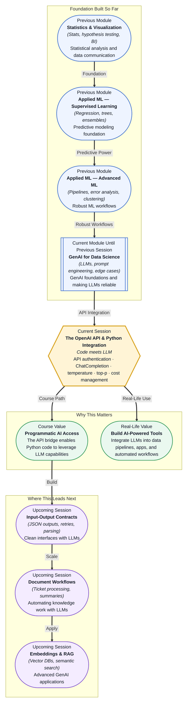

# Pre-read: The OpenAI API & Python Integration

## Context of This Session in the Course

You are building a script that needs to automatically summarise hundreds of customer support tickets every morning before your team stand-up. Copy-pasting each ticket into ChatGPT's web interface and then copying the response back takes minutes per ticket, and you have hundreds. Your colleagues are doing exactly that — switching tabs, pasting text, waiting for output, copying results. It works, but it does not scale, it cannot run unattended, and it certainly does not feel like a repeatable engineering solution.

The obvious next step is to call the model directly from your Python code. But that requires understanding how to connect your script to the LLM's backend — how to authenticate, what data format the model expects, how to tune its responses programmatically, and how to stay within budget when each call costs a fraction of a cent multiplied across thousands of requests. Without this bridge, every automation idea stays trapped inside a browser tab. That is where **The OpenAI API & Python Integration** becomes essential.

---

**What if** you could write a single Python function that takes any text prompt, sends it to GPT, and returns a structured response — all in under fifty lines of code? With that function, you could build a sentiment analyser that processes customer feedback by the thousand, a content generator that drafts reports from raw data files, or a code assistant that reviews your team's pull requests automatically. Every one of these tools shares the same core capability: programmatic access to an LLM. This session gives you the wiring to turn that capability into reality.

---

An **API (Application Programming Interface)** is a defined protocol that allows one piece of software to communicate with another. In the context of LLMs, the OpenAI API acts as a messenger: your Python code sends a request containing your prompt and a few configuration choices, and the API returns the model's generated text. The most commonly used endpoint is **ChatCompletion**, which accepts a list of messages — system, user, assistant — and returns a model reply, much like the conversation you would have in the ChatGPT web interface, but now triggered and processed entirely inside your code.

Think of the API like a coffee shop. Your code walks up to the counter (the endpoint) and places an order (your prompt). The barista (the LLM) prepares your drink based on specific instructions — temperature, milk type, size — which correspond to **model parameters**. Without those parameters, every coffee would taste the same. With them, you can control whether the model answers factually and deterministically or creatively and diversely. You will also work with **API authentication**, which uses a secret key to identify you as a legitimate customer, and **cost management**, since every API call consumes tokens and tokens cost money. During this session, you will explore all four layers — authentication, the ChatCompletion endpoint, parameters like **Temperature** and **Top-P**, and strategies for estimating and controlling costs.

---

In the **previous session**, you learned how to make LLMs behave predictably by validating inputs, designing robust prompts, handling hallucinations, and testing prompt versions systematically. That reliability toolkit now becomes the foundation for programmatic integration. The same prompt you crafted and tested in session 21.3 can now be sent from Python, automated across thousands of inputs, and tuned on the fly using parameters that the web interface does not expose. The edge-case thinking you developed — what happens when the input is empty, when the model returns nonsense, when the API times out — becomes even more critical when your code, not a human, is managing every request.

---

In this pre-read, you will discover:

- How to **understand** the OpenAI API authentication workflow and set up secure access using API keys stored in environment variables.
- How to **apply** the ChatCompletion endpoint to send prompts and receive structured model responses from Python.
- How to **interpret** model parameters like Temperature and Top-P and their effect on output creativity versus determinism.
- How to **recognise** cost management strategies when building applications with paid LLM APIs.

---

## Why API Authentication Is the First Barrier to Entry

Every call to the OpenAI API requires an **API key** — a unique string that identifies your account, tracks your usage, and enforces rate limits. You pass this key in the request header, and the server validates it before processing your prompt. This is fundamentally different from logging into a website, because the key lives in your code, not in a browser session, and any code that has access to the key can spend your API budget.

If your key is accidentally committed to a public GitHub repository, someone can discover it within minutes and run up charges on your account. That is why the professional practice is to store keys in **environment variables** — operating-system-level variables that your code reads at runtime — rather than hardcoding them into source files. You can also set usage limits on your OpenAI dashboard as a safety net, rotate keys periodically, and scope keys to specific projects or permissions. The authentication step may feel like a minor configuration detail, but it is the first place where real-world applications break: missing keys, expired keys, keys committed to the wrong branch. Treating your API key with the same discipline as a database password is the first professional habit you will build in this session.

## How Temperature and Top-P Shape What the Model Says

Two parameters give you fine-grained control over the model's output style: **Temperature** and **Top-P**. Understanding how they work — and when to adjust each — is the difference between getting a useful answer and getting a random one.

**Temperature** scales the probability distribution over the next token before the model samples from it. At a low temperature (near 0), the distribution becomes sharply peaked around the single most likely token, making the model almost deterministic — ideal for factual answers, data extraction, or any task where consistency matters. At a high temperature (near 1 or higher), the distribution flattens, giving less probable tokens a realistic chance of being chosen. This produces more varied and creative outputs, useful for brainstorming, story generation, or exploratory writing. A temperature of 0.7 is a common default that balances coherence with diversity.

**Top-P**, also called nucleus sampling, takes a different approach. Instead of scaling probabilities, it considers the smallest set of tokens whose cumulative probability exceeds the threshold P, then samples only from that set. If P is 0.1, the model considers only the top 10% most probable tokens — a narrow, conservative choice. If P is 0.9, it considers a much larger pool. The practical difference between Temperature and Top-P is subtle: Temperature reshapes the entire probability curve, while Top-P dynamically cuts off the tail of improbable tokens. OpenAI recommends changing one parameter at a time rather than both simultaneously, because they interact in ways that are hard to predict. Starting with Temperature tuning covers most use cases, and adding Top-P gives you an additional lever when you need tighter control over output quality.

## Where LLM API Integration Appears in Real Life

The API integration skills from this session are the foundational wiring behind almost every production AI system you encounter.

In **customer service**, platforms like Zendesk and Intercom use LLM APIs to auto-classify incoming tickets by intent, urgency, and product category. A Python service listens for new tickets, sends each one to the ChatCompletion endpoint with a classification prompt, and routes the response to the correct team — all without a human reading the first word. In **data engineering**, teams building internal tools use the OpenAI API to enrich raw datasets: generating human-readable descriptions for numeric features, flagging anomalies in streaming data, and translating database records into plain-English summaries for non-technical stakeholders.

In **marketing and content operations**, companies batch-generate personalised email campaigns by sending structured customer data — name, purchase history, segment — to the API with a prompt template. The model returns unique copy for each recipient, and the pipeline sends the emails without a marketer touching a keyboard. In **healthcare**, LLM APIs power clinical note summarisation systems that turn doctor-patient conversations into structured EHR entries, reducing documentation time by hours per shift. In **finance**, risk analysts send quarterly report excerpts to LLM endpoints for automated compliance checks against regulatory guidelines.

Across every vertical, the pattern is the same: Python code authenticates with the API, sends a structured prompt with tuned parameters, processes the response, and feeds it into the next stage of the pipeline. None of these systems would be possible without the authentication, endpoint, parameter, and cost-management skills you will practise in this session.

---

## What's Next

After this session, you will be able to:

- Authenticate with the OpenAI API using environment variables for secure key management.
- Send prompts to the ChatCompletion endpoint and extract the model's response in your Python code.
- Adjust Temperature and Top-P parameters to control output randomness for different types of tasks.
- Estimate token usage and manage API costs before scaling to production-level call volumes.
- Handle common API errors — authentication failures, rate limits, timeouts — with structured error handling.

You do not need to memorise every parameter value or pricing detail right now. The goal is to understand the API as a programmable component of your data stack: **an LLM endpoint is a function call that brings language intelligence into any Python pipeline.**

---

## Interesting Questions for the Live Session

- If Temperature is set to 0, is the output truly deterministic across repeated calls, or are there other sources of randomness in the generation pipeline?
- How would you design a fallback strategy when the API returns a 500 error midway through processing 10,000 customer records — retry immediately, back off, or skip?
- What happens when Top-P and Temperature push the output in opposite directions — for example, high temperature with a very low Top-P — and which parameter effectively wins?
- Is it always more cost-effective to use shorter prompts and lower temperature for production workloads, or can a creative response that resolves in fewer total tokens save money despite higher randomness?

By the end of this session, the OpenAI API should feel less like a black-box web service and more like a programmable component of your data stack: **a function call that brings language intelligence into any Python pipeline.**
