# Pre-read: Unsupervised Learning & Clustering

## Context of This Session in the Course

```mermaid
%%{init: {"flowchart": {"nodeSpacing": 45, "rankSpacing": 65, "diagramPadding": 20}} }%%
flowchart TB
    subgraph Foundation["Foundation Built So Far"]
        P1(["Previous Module<br/><b>Module 2: Data Analysis with NumPy &amp; Pandas (Weeks 5-8)</b><br/><i>(NumPy, Pandas, Seaborn)</i><br/>Data manipulation"])
        P2(["Previous Module<br/><b>Module 3: SQL for Data Science (Weeks 9-12)</b><br/><i>(SQL, CTEs, Window Functions)</i><br/>Database queries"])
        P3(["Previous Module<br/><b>Module 4: Statistics &amp; Data Visualization (Weeks 13-16)</b><br/><i>(Stats, hypothesis testing, BI)</i><br/>Statistical analysis"])
        C1[["Current Module Until Previous Session<br/><b>Module 5: Applied Machine Learning (Weeks 17-20)</b><br/><i>(Boosting, learning rate, residuals)</i><br/>Sequential ensemble learning"]]
    end

    CS{{"Current Session<br/><b>Unsupervised Learning &amp; Clustering</b><br/><i>Find hidden groups</i><br/>K-Means · elbow method · silhouette score · PCA · dimensionality reduction"}}

    subgraph Value["Why This Matters"]
        CV(["Course Value<br/><b>Unlabeled Discovery</b><br/>Most real-world data has no labels; clustering unlocks hidden structure"])
        RV(["Real-Life Value<br/><b>Customer Segmentation &amp; Compression</b><br/>Segment markets, compress images, detect anomalies"])
    end

    subgraph Future["Where This Leads Next"]
        F1(["Upcoming Module<br/><b>Feature Engineering &amp; Selection</b><br/><i>(One-hot encoding, scaling, feature creation)</i><br/>Crafting better model inputs"])
        F2(["Upcoming Module<br/><b>ML Pipelines &amp; Error Analysis</b><br/><i>(Sklearn pipelines, GridSearch, cross-validation, error analysis)</i><br/>Robust ML workflow"])
        F3(["Upcoming Module<br/><b>GenAI for Data Science</b><br/><i>(LLMs, embeddings, RAG)</i><br/>Generative AI"])
    end

    P1 ==>|&nbsp;Foundation&nbsp;| P2
    P2 ==>|&nbsp;Data Retrieval&nbsp;| P3
    P3 ==>|&nbsp;Statistical Insight&nbsp;| C1
    C1 ==>|&nbsp;Discover Groups&nbsp;| CS
    CS ==>|&nbsp;Course Path&nbsp;| CV
    CS ==>|&nbsp;Real-Life Use&nbsp;| RV
    CV ==>|&nbsp;Build&nbsp;| F1
    F1 ==>|&nbsp;Scale&nbsp;| F2
    F2 ==>|&nbsp;Apply&nbsp;| F3

    classDef previous fill:#eef4ff,stroke:#4f7ccf,color:#111827,stroke-width:2px;
    classDef current fill:#fff4d6,stroke:#d9a321,color:#111827,stroke-width:3px;
    classDef value fill:#eaf8ef,stroke:#3f9f63,color:#111827,stroke-width:2px;
    classDef future fill:#f4ecff,stroke:#8a61d1,color:#111827,stroke-width:2px;

    class P1,P2,P3,C1 previous;
    class CS current;
    class CV,RV value;
    class F1,F2,F3 future;
    linkStyle default stroke-width:3px;
```

You are handed a dataset of 10,000 customer transactions — purchase amounts, frequency, product categories, and recency. There are no labels. No one has flagged "this customer is a high spender." No one has told you which groups exist. Your task: find meaningful segments the marketing team can act on.

Without predefined labels, you cannot train a classifier. You do not know how many segments exist, what defines them, or whether the boundaries between groups are even meaningful. A scatter plot shows blobs — but blurry ones. Squint and you might spot three groups, or maybe five, or maybe none at all. The intuitive approach — "just pick K that looks right" — can lead to misleading conclusions and poor business decisions.

That is where **unsupervised learning** — specifically **K-Means clustering** and **dimensionality reduction with PCA** — becomes essential.

---

**What if** you could open a retail dataset with millions of transactions and, within minutes, tell your business team: "There are five types of customers, here is what defines each, and here is how much each segment spends"? The marketing team could run five distinct campaigns instead of one generic blast. The product team could tailor features per group. The finance team could forecast revenue by segment. All of this depends on one thing: your ability to find the hidden groups in data that has no labels. That is the capability this session builds.

---

**Unsupervised learning** is the branch of machine learning where you have data but no answers — no labels, no target column, no "correct output" to compare against. Instead of predicting, you explore.

**K-Means clustering** is the workhorse algorithm of this family. Picture a room full of people. You place a handful of flags on the floor, then ask everyone to walk towards the nearest flag. After everyone moves, you shift each flag to the centre of the crowd around it. Repeat until nothing moves. The result: clean groups. K-Means does exactly this — it places K imaginary centroids in the data space, assigns each point to the nearest centroid, then recomputes the centroids until they stabilise.

But K-Means asks you to choose K — the number of clusters. Pick too few, and distinct groups merge. Pick too many, and meaningful groups fragment into noise. The **elbow method** helps: plot cluster count against the sum of squared distances from points to their centroid, and look for the bend. A more rigorous alternative, the **silhouette score**, measures how similar a point is to its own cluster versus neighbouring clusters, giving you a score between -1 and 1 to validate your choice. Most real data lives in high dimensions — hundreds of columns — which makes visualising clusters impossible. That is where **Principal Component Analysis (PCA)** enters: it compresses many features into a few synthetic ones that preserve the most variance, making the hidden structure visible.

---

In the **previous session**, you explored **Gradient Boosting** — a supervised ensemble method that builds one weak tree at a time, each correcting the residual error of the last. You learned how a **learning rate** controls step size and how boosting trades interpretability for predictive power.

That entire session assumed you had labelled data: features X and a target y. But what happens when the target column does not exist? Gradient Boosting simply cannot run. This session pivots from supervised to **unsupervised learning**, where there is no "right answer" to check against. The mindset shifts from "predict this value" to "find the hidden structure." The tools change from regression metrics (MSE, R²) and classification metrics (F1, AUC) to inertia, silhouette scores, and explained variance. Yet the goal remains the same — extract signal from data — but now the signal is shape, not labels.

---

In this pre-read, you will discover:

- How to **understand** the fundamental difference between supervised and unsupervised learning and when each applies.
- How to **apply** K-Means clustering to segment unlabeled data into meaningful groups.
- How to **interpret** the elbow method and silhouette score to choose the right number of clusters.
- How to **recognise** the role of PCA in reducing dimensionality and making high-dimensional patterns visible.

---

## Why Choosing K Is the Hardest Part of Clustering

K-Means is simple to run — three lines of scikit-learn code. The hard part is answering: how many clusters actually exist in this data?

Imagine you are analysing a city's neighbourhoods by income, age, and commute time. Two clusters might split "young downtown renters" from "suburban homeowners." Three clusters might isolate a retiree group. Four might create a student cluster around the university. The algorithm cannot tell you which choice is correct — only you can, based on whether the groups make business sense.

The **elbow method** visualises this tradeoff. Compute inertia — the sum of squared distances from each point to its assigned centroid — for K values from 1 through 10. When the line bends sharply, that K balances fit and simplicity. But real data often has no sharp elbow. A curve that bends gradually suggests the data is not naturally clustered. In that case, the **silhouette score** becomes your backup: it quantifies how well each point fits its assigned cluster versus the next-best cluster, averaging into a single score between -1 and 1. A score above 0.5 indicates reasonable cluster separation while a score near zero suggests overlapping groups and a negative score points to misassignments.

There is no magic K. What matters is the process: try multiple values, evaluate with both metrics, validate with domain knowledge, and iterate.

## How PCA Reveals What Your Eyes Cannot See

Your clustering algorithm runs on all features — age, income, latitude, longitude, purchase frequency, average ticket size, website session duration, and more. But when that list reaches 50 columns, you cannot plot the clusters to check your work. Your brain perceives three dimensions at most. Every dimension beyond the third is invisible.

**Principal Component Analysis** solves this by finding the directions — the principal components — along which your data varies the most. The first principal component captures the maximum spread, the second captures the next largest direction while being orthogonal to the first, and so on. By retaining just the first two or three components, you can project your 50-dimension data into a 2D scatter plot without losing the most important variance.

The catch: those components are linear combinations of your original features. They do not have clean labels like "age" or "income." PC1 might combine income and purchase frequency with opposite signs, making interpretation harder. For clustering, that tradeoff is worth it — PCA lets you see whether your clusters are tight, overlapping, or oddly shaped before you present results to stakeholders. It also serves as a preprocessing step that can speed up K-Means by reducing noise from irrelevant dimensions.

## Where Unsupervised Learning Appears in Real Life

Clustering and dimensionality reduction are not academic exercises. They power systems you interact with daily.

**Customer segmentation** is the classic case: retailers group millions of shoppers into four to eight segments based on purchase behaviour, then target each segment with tailored campaigns, offers, and product recommendations. **Anomaly detection** uses clustering inversely — data points that do not belong to any cluster are flagged as outliers for fraud detection in banking, network intrusion in cybersecurity, or defective unit identification in manufacturing. **Image compression** applies K-Means to pixel colours: reduce 16 million colours to 16 or 32 colour clusters, and the image file shrinks dramatically while remaining visually recognisable — the algorithm behind legacy GIF-style compression. **Exploratory data analysis** in scientific research applies PCA to high-dimensional genomic or sensor data to spot patterns — disease subtypes, environmental trends, or experimental effects — before building any predictive model. Even **recommendation systems** use clustering to group users with similar tastes, then recommend items popular within the same cluster.

Each use case starts with the same question: "What patterns exist in this data?" And each answers it using the clustering and dimensionality reduction tools you will learn in this session.

---

## What's Next

After this session, you will be able to:

- Implement K-Means clustering on a real dataset using scikit-learn and visualise the resulting cluster assignments.
- Determine the optimal number of clusters using both the elbow method and silhouette score, and explain why different metrics may disagree.
- Apply PCA to reduce high-dimensional data to two or three components for visualisation and preprocessing.
- Compare the strengths and limitations of unsupervised methods versus the supervised algorithms covered in previous sessions.
- Choose between clustering approaches based on the shape, scale, and label-availability of the data.
- Integrate clustering into a broader ML workflow — from exploration to feature engineering to model deployment.

You do not need to master the geometry of PCA eigenvectors right now. The goal is to build a clear mental model: **when data has no labels, clustering reveals the hidden groups, and PCA makes those groups visible.**

---

## Interesting Questions for the Live Session

- K-Means assumes clusters are spherical and equally sized — what happens when your data forms crescent moons or nested rings that violate this assumption?
- If your elbow plot shows no clear bend from K = 2 through K = 20, does that mean clustering is useless, or have you chosen the wrong algorithm for the data's shape?
- PCA projects data onto directions of maximum variance — could that destroy the very cluster structure you are trying to find?
- After clustering, how would you validate that your segments are actionable for a business team and not just statistical artefacts?

By the end of this session, clustering should feel less like guessing and more like a structured search: **find groups, validate them, visualise them, and let the data reveal what is real.**
